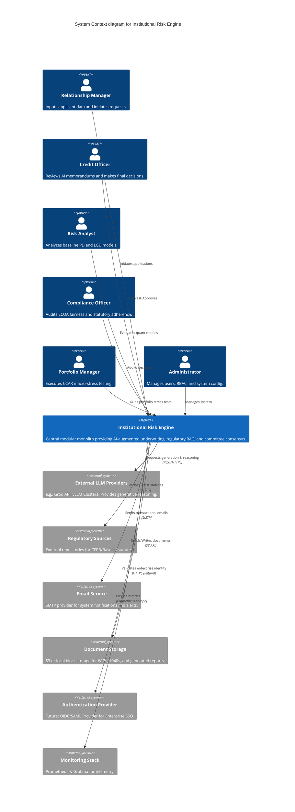
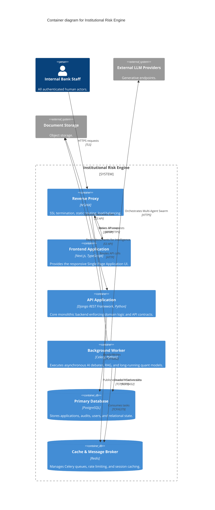
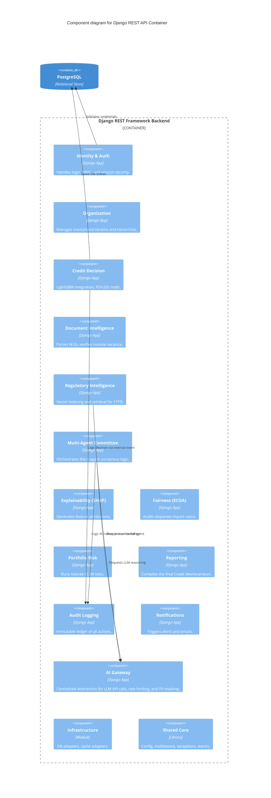
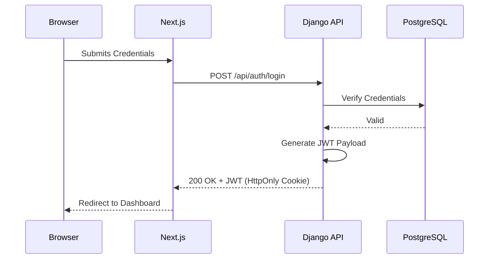
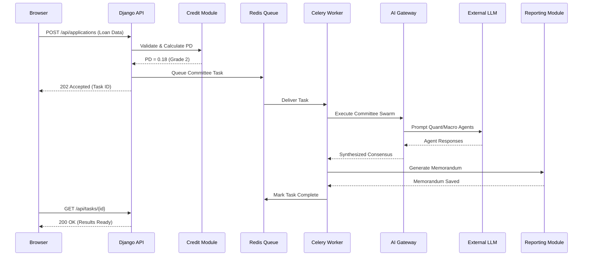
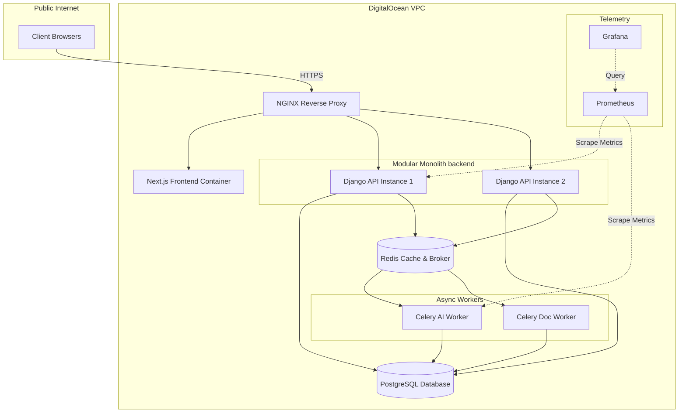

# 1. Executive Overview

The purpose of this architecture specification is to explicitly define the static and dynamic structural boundaries of the Institutional Risk Engine (IRE). To achieve precision, clarity, and standardized communication across all engineering disciplines, we utilize the C4 Model (Context, Containers, Components). 

The IRE is explicitly designed as a **Modular Monolith**. In an era dominated by the premature adoption of microservices, this architectural decision is deliberate and strategically defensive. 
*   **Business Justification:** Financial institutions require absolute auditability and transactional integrity. Distributing risk logic across physical network boundaries introduces latency, eventual consistency challenges, and complex failure modes that jeopardize regulatory compliance.
*   **Engineering Justification:** A Modular Monolith allows teams to enforce strict logical boundaries (via Python modules and Clean Architecture) without the operational tax of managing Kubernetes, service meshes, or distributed tracing. The system can easily scale horizontally behind an NGINX load balancer, while the background AI orchestration scales independently via Celery and Redis.

### Architecture Principles Table
To ensure alignment across all engineering teams, the following principles govern the architecture:

| Principle | Description | Enforcement Mechanism |
| :--- | :--- | :--- |
| **Domain Isolation** | Modules cannot directly query each other's database tables. | Code Reviews, Static Analysis (e.g., Import Linter). |
| **API First** | All business logic must be exposed via REST before UI is built. | OpenAPI Schema validation in CI/CD. |
| **Asynchronous AI** | No LLM call occurs in the synchronous HTTP request cycle. | Architecture reviews; timeouts enforced at NGINX. |
| **Immutable Audit** | Every critical action is permanently recorded. | Database triggers and mandatory audit middleware. |
| **Fail Deterministically** | If AI degrades, fallback to deterministic math securely. | Automated Chaos Testing and Circuit Breakers. |

---

# 2. C4 Level 1 — System Context

The System Context diagram establishes the highest-level view of the IRE, defining the users who interact with the system and the external dependencies it relies upon.



### Actor & System Descriptions
*   **Human Users:** Defined by strict Role-Based Access Control (RBAC). They interact solely with the Next.js frontend over TLS. The trust boundary is absolute at the API gateway; users are untrusted until authenticated via JWT.
*   **External LLM Providers:** These systems execute generative tasks. *Security Consideration:* No Highly Restricted PII is sent to external LLMs; payloads are anonymized by the AI Gateway prior to dispatch.
*   **Regulatory Sources & Document Storage:** External systems providing unstructured context. The system assumes external storage can fail and implements retry logic and local caching.
*   **Monitoring Stack:** Scrapes `/metrics` endpoints. Restricted strictly to internal private networks.

---

# 3. C4 Level 2 — Container Architecture

The Container diagram zooms into the IRE to reveal the executable, deployable units of the architecture.



### Container Specifications
*   **Next.js Frontend:** Purpose: Render the UI. Responsibilities: Client-side routing, state management. Failure Impact: UI inaccessible. Scaling: Multiple instances / CDN.
*   **Django REST API (Modular Monolith):** Purpose: Core business logic. Responsibilities: Auth, validation, synchronous DB reads/writes, queuing async tasks. Failure Impact: Total system outage. Scaling: Horizontally via WSGI application servers.
*   **PostgreSQL:** Purpose: Source of truth. Responsibilities: ACID-compliant persistence. Failure Impact: Catastrophic. Scaling: Vertical scaling, read-replicas.
*   **Redis:** Purpose: State and Task Brokering. Responsibilities: Celery queue, JWT blocklisting. Failure Impact: Async tasks stall. Scaling: Sentinel/Cluster.
*   **Celery Worker:** Purpose: Heavy computation offloading. Responsibilities: LLM API orchestration. Failure Impact: AI features stall, CRUD operations remain functional. Scaling: Horizontal worker addition.

---

# 4. C4 Level 3 — Component Architecture

Zooming into the Django REST API Container exposes the internal Modular Monolith structure defined by Domain-Driven Design (DDD).



### 4.1 Data Ownership & Boundaries
Every component listed above exists as a dedicated Django `App`.
*   **Architectural Rule:** Components **must not** directly import or query database models owned by other components. 
*   **Owned Entities & Public Interfaces Example:**
    *   `Credit Decision` owns `RiskScore`, `LoanApplication`. It exposes `credit_service.get_risk_profile(app_id)`.
    *   `Multi-Agent Committee` owns `AgentSession`, `DebateTranscript`. It cannot `import RiskScore`; it must call `credit_service.get_risk_profile()`.

### 4.2 AI Gateway Expansion
The AI Gateway is a critical infrastructure component protecting the institution. It encompasses the following architectural responsibilities:
*   **Prompt Manager:** Version-controlled storage of institutional prompt templates.
*   **Model Router:** Dynamically routes requests based on capability or cost.
*   **Provider Adapter:** Abstract interface allowing seamless switching between Groq, OpenAI, or local vLLM.
*   **Token Manager:** Tracks spending against internal budgets.
*   **PII Sanitizer:** Intercepts outgoing prompts and masks identified PII (SSN, names).
*   **Retry Engine:** Handles transient API failures.
*   **Fallback Engine:** Falls back to secondary models if primary providers are down.
*   **Cost Monitor:** Aggregates billing metadata across providers.
*   **Rate Limiter:** Throttles outbound requests to external APIs.
*   **Observability:** Exposes LLM latencies and success rates to Prometheus.

### 4.3 Repository Mapping
The C4 components map directly to the future Django repository structure:
```text
institutional-risk-engine/
├── apps/
│   ├── identity/            # Identity component
│   ├── organization/        # Org component
│   ├── credit_decision/     # Credit module
│   ├── document_intel/      # OCR / Document module
│   ├── rag_engine/          # Regulatory RAG
│   ├── multi_agent/         # Swarm orchestration
│   ├── fairness/            # ECOA auditing
│   ├── portfolio_risk/      # Vasicek stress testing
│   ├── reporting/           # Memorandum generation
│   ├── audit/               # Immutable logging
│   └── notifications/       # Alerting
├── core/
│   ├── ai_gateway/          # AI orchestration, routers, sanitizers
│   └── shared/              # Cross-cutting foundational code (see Sec 6)
├── infrastructure/          # Docker, DB migrations, Celery tasks
├── frontend/                # Next.js Application
└── tests/                   # End-to-End and Integration suites
```

---

# 5. Cross-Domain Service Contracts

To enforce the Modular Monolith structure, communication between bounded contexts occurs **exclusively through explicit service contracts**. 

*   **Services are the ONLY public API of a domain.**
*   **Repositories never cross domain boundaries.**
*   **ORM models remain private to their owning domain.**
*   **Cross-domain model imports are strictly forbidden.**

**Examples of Cross-Domain Contracts:**
*   `credit_service.get_risk_profile(application_id: UUID) -> RiskProfileDTO`
*   `reporting_service.generate_memorandum(application_id: UUID, agent_transcript_id: UUID) -> ReportDTO`
*   `document_service.verify_income(application_id: UUID) -> DocumentVerificationResultDTO`

By exchanging plain Data Transfer Objects (DTOs) rather than Active Record ORM models, domains remain entirely decoupled. If the `Credit Decision` table schema changes, the `Multi-Agent Committee` remains unaffected so long as the `RiskProfileDTO` contract is upheld.

---

# 6. Shared Layer & Dependency Rules

To prevent circular dependencies and enforce consistency, a strict `Shared Core` layer is established.

### 6.1 Shared Module Architecture
Located in `core/shared/`, this module contains highly stable, domain-agnostic code:
*   **config:** Global Django settings and environment variable parsing.
*   **common:** Value Objects (e.g., Currency, DTI), standard DTO structures.
*   **middleware:** Request ID injection, CORS, custom rate limiting.
*   **security:** Cryptographic helpers, JWT utilities.
*   **exceptions:** Standardized domain exception classes (e.g., `DomainValidationError`).
*   **validators:** Common payload validators.
*   **base classes:** Abstract classes for domain entities, services, and DTOs.
*   **events:** Base classes and dispatchers for the Internal Domain Event bus.

### 6.2 Dependency Rules
To maintain the integrity of the Modular Monolith:
*   **Allowed Imports:** A domain (e.g., `credit_decision`) may import from `core.shared` and `core.ai_gateway`.
*   **Forbidden Imports:** A domain may **never** import `models.py` from another domain.
*   **Dependency Direction:** Outer layers (API/Web) depend on inner layers (Domain/Service). Infrastructure depends on Interfaces defined by the Domain (Dependency Inversion).
*   **Communication:** Inter-domain communication happens exclusively via **Public Service Interfaces** or **Internal Domain Events**.

---

# 7. Repository Pattern & Dependency Injection

### 7.1 The Clean Architecture Flow
Business logic must remain agnostic of the Django ORM. This allows logic to be unit-tested without database scaffolding and protects the domain from infrastructure shifts.

**Architectural Flow:**
`Application Service`
↓ depends on
`Repository Interface` (Defined in Domain)
↓ implemented by
`Django ORM Repository` (Defined in Infrastructure)
↓ queries
`PostgreSQL`

**Example:** The `CreditService` requires a `LoanApplication`. It calls `self.repository.get_by_id(id)`. The `repository` is an interface (`ILoanRepository`). At runtime, a `DjangoLoanRepository` is injected. The Domain Service knows nothing of `QuerySet` objects.

### 7.2 Dependency Injection Strategy
Dependencies are explicitly provided to services to maximize testability and clarify boundaries.
*   **Constructor Injection:** Domain Services receive their Repositories and external Providers via their `__init__` methods.
*   **Factory Methods / Composition Root:** Django configurations or dedicated factory modules assemble services (e.g., `def get_credit_service() -> CreditService:`).
*   **Avoidance of Global Singletons:** Services are instantiated per-request or per-task rather than relying on global mutable state, preventing thread-safety issues.

---

# 8. Communication & Event Architecture

### 8.1 Synchronous vs Asynchronous Paths
*   **Browser → Django API:** Synchronous REST over HTTPS.
*   **Django API → PostgreSQL:** Synchronous TCP connection pooled via PgBouncer.
*   **Django API → Redis (Celery Broker):** Synchronous TCP.
*   **Celery Worker → AI Gateway → External LLM:** Asynchronous HTTP with exponential backoff and hard timeouts.

### 8.2 Internal Domain Events
To loosely couple modules, the platform utilizes **Internal Domain Events** (implemented via a lightweight in-memory event bus or Django Signals). 
*Note:* These are strictly internal application events running within the monolith process, *not* external event streaming via Kafka.

**Event Examples:**
*   `LoanSubmitted`: Triggers validation and quant modeling.
*   `LoanValidated`: Indicates data is ready for processing.
*   `CreditCalculated`: Triggers `xai` to generate SHAP values.
*   `DocumentVerified`: Confirms income intelligence parsing is complete.
*   `CommitteeStarted` / `CommitteeCompleted`: Tracks the lifecycle of the Multi-Agent Swarm.
*   `CreditDecisionGenerated`: Signals the reporting module to compile the memorandum.
*   `AuditRecorded`: Listened to by the `audit` module to immutably log state changes.

---

# 9. Sequence Diagrams

### 9.1 Login Flow


### 9.2 Credit Assessment Flow


---

# 10. Complete Request Lifecycle & Transaction Boundaries

**Lifecycle Trace:** User Login → Loan Submission → Validation → Credit Prediction → SHAP → Document Intelligence → Regulatory RAG → Multi-Agent Committee → Committee Consensus → Persistence → Audit Logging → Frontend Response.

### 10.1 Transaction Boundaries
Strict transactional integrity is maintained to prevent orphaned data during complex async workflows.

*   **HTTP Request Transaction Lifecycle:** Every mutating HTTP request (POST, PUT, DELETE) is wrapped in a single database transaction (`atomic` block). If an exception occurs, the entire request rolls back before any Celery tasks are dispatched via `transaction.on_commit()`.
*   **Background Worker Transaction Lifecycle:** Celery tasks execute within their own transaction blocks. 
*   **Idempotent Retries:** All background tasks must be idempotent. If a Celery worker dies mid-execution, the task can be safely retried without duplicating records.
*   **Optimistic Locking / Versioning:** Critical entities (like `LoanApplication`) utilize a `version` integer column. Concurrent modifications are blocked by optimistic concurrency controls, ensuring the AI Swarm doesn't overwrite a manual Credit Officer override.

---

# 11. Performance Budgets & Non-Functional Requirements (NFRs)

To guarantee enterprise-grade responsiveness and scale, the following targets form the architectural baseline.

### 11.1 Non-Functional Requirements (NFRs)
*   **Availability:** 99.9% uptime during standard financial business hours.
*   **Reliability:** Zero data loss for committed transactions.
*   **Scalability:** Maximum concurrent active users: 5,000. Maximum queued AI jobs: 10,000 per hour.
*   **RPO (Recovery Point Objective):** < 15 minutes (via continuous WAL archiving).
*   **RTO (Recovery Time Objective):** < 4 hours (full infrastructure rebuild via Terraform/Docker).
*   **Security:** SOC2 Type II and ISO 27001 readiness out-of-the-box.
*   **Backup Frequency:** Daily snapshots; continuous WAL streaming.
*   **Log Retention Policy:** 7 years for Audit logs (compliance); 30 days for telemetry logs.

### 11.2 Target Performance Budgets
*   **Authentication & RBAC Check:** < 50ms
*   **Credit Prediction (LightGBM math):** < 200ms
*   **SHAP Value Generation:** < 500ms
*   **API Synchronous Responses:** < 1,000ms (1 second)
*   **Dashboard Read Queries:** < 300ms
*   **Document Intelligence (OCR processing):** < 15 seconds (Asynchronous)
*   **Multi-Agent Committee Debate (LLM Orchestration):** < 60 seconds (Asynchronous)
*   **Reporting / Memorandum Generation:** < 10 seconds (Asynchronous)

---

# 12. Trust Boundaries

*   **Internet Boundary:** Between external world and NGINX. Defended by TLS 1.3, DDoS protection, WAF.
*   **Application Boundary:** Between NGINX and Django. Defended by JWT and CORS.
*   **Domain Boundary:** Between distinct internal Django modules. Defended by strict Python Service interfaces.
*   **Persistence Boundary:** Between Django and PostgreSQL. Defended by ORM abstraction (prevents SQL injection).
*   **AI Boundary:** Between AI Gateway and External LLMs. Defended by PII Sanitizers.

---

# 13. Security Architecture & Error Classification

*   **Authentication:** Stateless JWT tokens stored in secure, HttpOnly, SameSite cookies.
*   **Authorization (RBAC):** Django middleware enforces role permissions.
*   **Input Validation:** DRF Serializers rigorously type-check inbound payloads.
*   **Secrets Management:** Environment variables injected at runtime; never hardcoded.
*   **Encryption:** AES-256 encryption at rest (DB volume). TLS 1.2+ in transit.
*   **Rate Limiting:** Redis-backed throttling per user/IP.
*   **OWASP Protection:** Standard middleware for XSS, CSRF, Clickjacking prevention.
*   **PII Handling:** High-risk PII is isolated, masked in telemetry, and sanitized before AI evaluation.

### 13.1 Enterprise Error Handling Classification
All exceptions conform to the following enterprise response matrix:

| Error Type | HTTP Status | Retry | Logged | User Visible | Example Resolution |
| :--- | :--- | :--- | :--- | :--- | :--- |
| `ValidationError` | 400 Bad Request | No | Info | Yes | Fix form input |
| `AuthenticationError` | 401 Unauthorized | No | Warn | Yes | Prompt login |
| `AuthorizationError` | 403 Forbidden | No | Warn | Yes | Deny access |
| `NotFound` | 404 Not Found | No | Info | Yes | Check URL/ID |
| `ExternalLLMTimeout` | 503 / 504 | Yes | Error | No | AI Gateway falls back |
| `OCRFailure` | 422 Unprocessable | No | Error | Yes | Prompt manual review |
| `DatabaseFailure` | 500 Internal | Yes | Fatal | No (Generic) | Ops Alert Triggered |
| `InternalServerError` | 500 Internal | No | Fatal | No (Generic) | Ops Alert Triggered |

---

# 14. Scalability Strategy & Deployment View

As a Modular Monolith, scaling relies on process duplication rather than network fragmentation.
*   **Vertical Scaling:** Upgrade DigitalOcean Droplets (CPU/RAM).
*   **Horizontal Scaling (Web):** Deploy multiple instances of the Django API behind NGINX.
*   **Horizontal Scaling (AI Tasks):** Add more Celery worker containers. Isolating computationally expensive AI tasks ensures the core API remains responsive.
*   **Database Scaling:** Vertical scaling of PostgreSQL, followed by Read Replicas for Dashboard queries.
*   **Static Assets:** Served via external CDN or optimized NGINX rules.

### 14.1 Deployment Architecture Diagram



---

# 15. Failure Scenarios & Graceful Degradation

*   **LLM API Outage:** AI Gateway retries. On ultimate failure, system gracefully falls back to the *Deterministic Quant Score (LightGBM)* and issues a standard template memorandum.
*   **Redis Failure:** Async tasks halt. System degrades gracefully, alerting users while allowing read-only historical access.
*   **Database Failure:** NGINX serves `503 Maintenance`. System relies on DO daily backups/WAL for Point-in-Time Recovery.
*   **Document Parsing Failure:** Application flagged as "Manual Audit Required" rather than crashing the workflow.
*   **Slow AI Processing:** Next.js UI updates via polling. If an AI debate takes > 60 seconds, UI notifies the user it is analyzing deeply, preventing abandonment.

---

# 16. Cross-Cutting Concerns & Extension Points

*   **Observability:** Prometheus exposes metrics; standard `logging` outputs structured JSON; tracing correlates request IDs across sync/async boundaries.
*   **Extension Points (Future-Proofing):** The architecture defines explicit Python `Protocols` / Interfaces for external dependencies. This ensures that:
    *   **LLM Providers:** Swap Groq for OpenAI or vLLM seamlessly.
    *   **OCR Providers:** Swap Tesseract for AWS Textract.
    *   **Storage Providers:** Swap local volumes for S3.
    *   **Notification Providers:** Swap local email for Twilio/Sendgrid.
    *   **Authentication Providers:** Support future SAML/OIDC enterprise connectors.
    *   **Risk Models:** Swap LightGBM for XGBoost without refactoring the Core Domain.
    *   **Prompt Templates & Decision Strategies:** Dynamically loaded via configuration tables, not hardcoded.

---

# 17. Testing Architecture

Robust testing ensures the monolithic structure remains pristine. The testing architecture spans multiple layers:

*   **Unit Tests:** Test domain logic and LightGBM inference entirely independently of Django. Tool: `pytest`.
*   **Integration Tests:** Validate database reads/writes and Repository implementations. Tool: `pytest-django`.
*   **API Tests:** Verify REST contracts, serialization, and endpoint authorization. Tool: `DRF APIClient`.
*   **End-to-End Tests:** Verify critical user journeys (e.g., full loan evaluation) via the browser. Tool: `Playwright`.
*   **Contract Tests:** Ensure Next.js and Django agree on API payloads (validated against OpenAPI schema).
*   **Load Tests:** Simulate concurrent institutional usage to validate NFR performance budgets. Tool: `Locust`.
*   **AI Evaluation Tests:** specialized deterministic test suites asserting that the AI Gateway correctly maps outputs, redacts PII, and handles timeouts without crashing.

---

# 18. Architecture Decisions

### Architecture Decision Log

| ID | Status | Decision | Reason | Trade-offs |
| :--- | :--- | :--- | :--- | :--- |
| ADR-01 | **Accepted** | Modular Monolith via Django | Simplifies deployment, enforces consistency. | Requires strict discipline to prevent code tangling. |
| ADR-02 | **Accepted** | Next.js decoupled frontend | Enables modern UX, isolates UI deployments. | Requires managing two distinct codebases. |
| ADR-03 | **Accepted** | Celery + Redis for Async | LLM calls exceed HTTP request-response budgets. | Adds Infrastructure complexity (Worker/Broker). |
| ADR-04 | **Accepted** | Internal Domain Events | Decouples modules logically without Kafka. | Events are volatile if Redis/Worker crashes during processing. |
| ADR-05 | **Rejected** | Microservices Architecture | Unnecessary orchestration overhead for current phase. | Harder to scale distinct teams independently >50 engineers. |

---

# Architecture Contract

### Mandatory Decisions
*   [x] Modular Monolith Architecture
*   [x] Django REST Framework (Backend)
*   [x] PostgreSQL (Primary Persistence)
*   [x] Redis (Cache & Message Broker)
*   [x] Celery (Background Processing)
*   [x] Next.js with TypeScript (Frontend)
*   [x] Clean Architecture, DDD, & Strict Dependency Boundaries.

### Forbidden Decisions
*   [ ] Microservices
*   [ ] Kubernetes
*   [ ] Kafka
*   [ ] Event Sourcing / CQRS
*   [ ] Direct cross-domain database querying.

### Future Decisions (Evolutionary Road map)
*   Multi-Tenancy Architecture (SaaS expansion)
*   Plugin Architecture (Custom bank modules)
*   Centralized Model Registry
*   Cloud Migration from DigitalOcean to AWS/GCP (if compliance dictates).

---

# 19. Architecture Validation Checklist
Before deployment, the system must satisfy the following structural requirements:
- [ ] No cross-domain ORM imports exist in the codebase.
- [ ] All generative AI traffic is routed strictly through the AI Gateway.
- [ ] Every critical state change produces a persistent Audit Event.
- [ ] Every asynchronous background task is designed to be idempotent.
- [ ] Every REST endpoint is thoroughly documented via OpenAPI specifications.
- [ ] Structured JSON logging is enabled across all containers.
- [ ] Prometheus metrics are actively exposed and scraped.
- [ ] The Repository pattern is rigorously followed in the Data Access Layer.
- [ ] Dependency rules (outer depends on inner) are satisfied.
- [ ] Comprehensive unit, integration, and E2E tests are implemented and passing.

---
**Related Documents**
*   Prerequisite: `00-product-requirements-document.md`, `01-executive-summary.md`
*   Dependent Documents: `03-domain-driven-design.md`, `04-repository-architecture.md`, `05-request-lifecycle.md`
*   Key Architectural Decisions Referenced: ADR-01 (Modular Monolith), ADR-03 (Celery Async), ADR-04 (Internal Domain Events).
