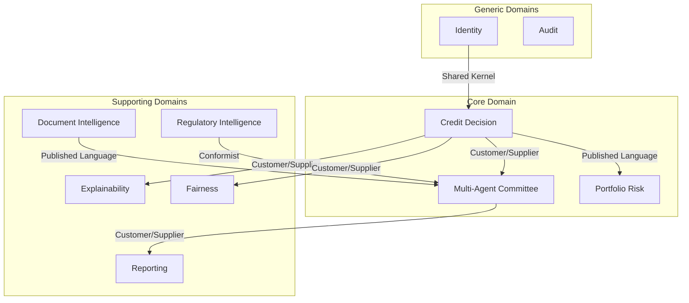
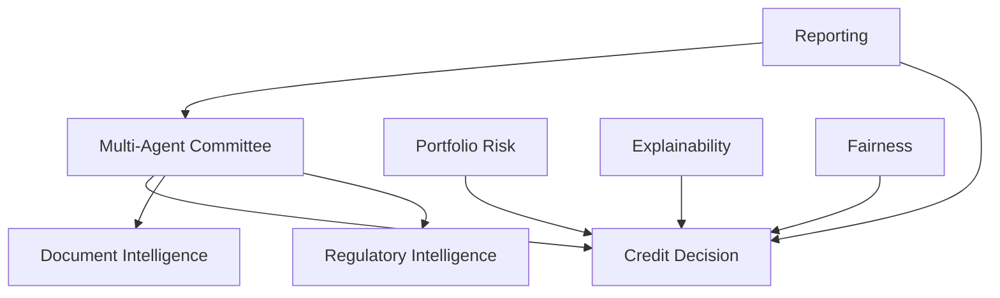
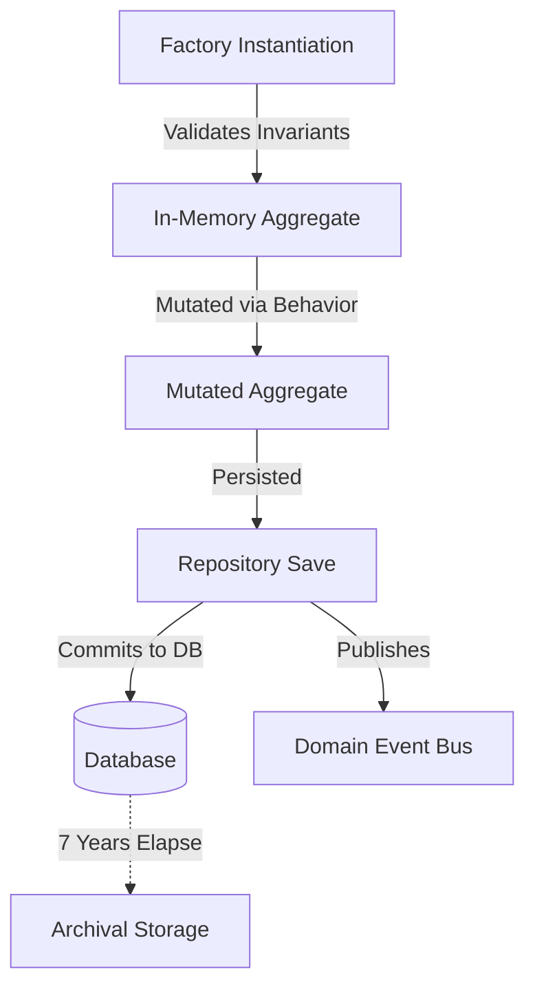
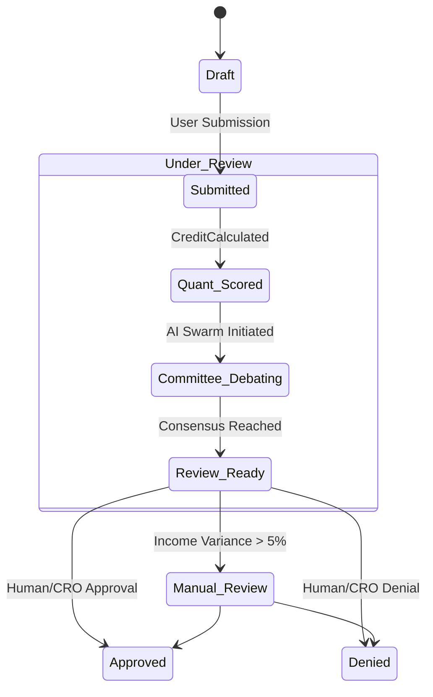
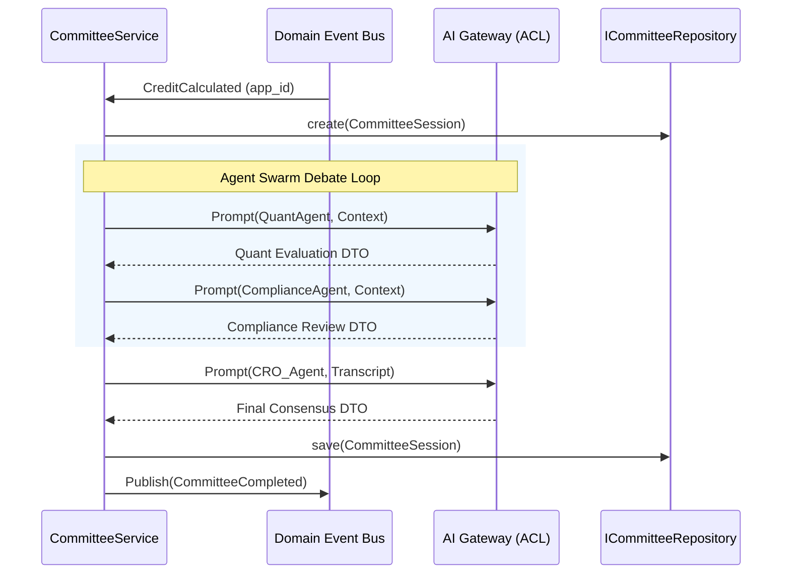
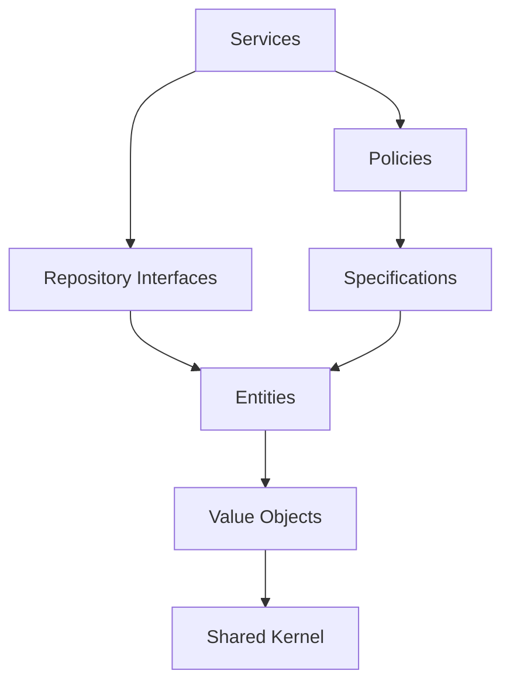

# 1. Executive Overview

This document establishes the definitive Domain-Driven Design (DDD) specification for the Institutional Risk Engine (IRE). It maps the complex realities of tier-1 institutional credit risk, quantitative modeling, and generative AI into a precise, bounded, and ubiquitous software model.

The purpose of this specification is to completely divorce our core business logic from infrastructure constraints (Django, PostgreSQL, Redis, external LLMs). By strictly defining Bounded Contexts, Aggregates, Entities, and Value Objects, we guarantee that the software accurately reflects the enterprise domain and that technical complexity never bleeds into business rules.

### 1.1 Explicit Domain Non-Goals
To prevent scope creep and maintain architectural purity, this DDD specification explicitly **excludes** the following implementations:
*   Database schema design (Tables, constraints, indexes).
*   ORM Models (`django.db.models`).
*   REST API Routing, Serializers, and HTTP Status Codes.
*   Celery / Redis task definitions.
*   Caching strategies and networking topologies.

---

# 2. Strategic Domain Design

Strategic design organizes the massive complexity of the IRE into distinct subdomains, classifying them by their strategic importance.

### 2.1 Core Domain
The ultimate competitive advantage of the IRE. These domains contain proprietary intellectual property.
*   **Credit Decision:** Quantitative deterministic modeling.
*   **Multi-Agent Committee:** Orchestration of AI persona consensus.
*   **Portfolio Risk:** CCAR macro-stress testing.

### 2.2 Supporting Domains
Essential, but not the primary differentiator.
*   **Document Intelligence:** OCR and variance checks.
*   **Regulatory Intelligence (RAG):** Contextual legal retrieval.
*   **Explainability (SHAP):** Providing mathematical transparency.
*   **Fairness (ECOA):** Disparate impact auditing.
*   **Reporting:** Generation of the Credit Memorandum.

### 2.3 Generic Domains
Standardized enterprise capabilities.
*   **Identity & Organization:** RBAC and tenant grouping.
*   **Audit Logging:** Immutable ledgers.
*   **Notifications:** Alerting via email/SMS.

### 2.4 Complete Business Capability Traceability Matrix
This matrix maps capabilities through the entire logical stack.

| Business Capability | Owning Aggregate | Domain Service | Primary Repository | Published Events |
| :--- | :--- | :--- | :--- | :--- |
| Originate Loans | `LoanApplication` | `CreditService` | `ILoanRepository` | `LoanSubmitted` |
| Evaluate Risk | `RiskScore` | `RiskScoringService` | `ILoanRepository` | `CreditCalculated` |
| Audit Compliance | `ComplianceAudit` | `FairnessService` | `IFairnessRepository`| `ComplianceAlert` |
| Debate Merits | `CommitteeSession`| `CommitteeService` | `ICommitteeRepository`| `CommitteeCompleted` |
| Validate Income | `DocumentBundle` | `DocumentVerificationService` | `IDocumentRepository`| `DocumentVerified` |

### 2.5 Operational Health Indicators & Metrics
Measurable indicators owned by each domain, vital for assessing runtime health.

| Context | Operational Health Indicator | Target SLA |
| :--- | :--- | :--- |
| **Credit Decision** | Default Rate Variance, Sync Failure Rate | $< 0.1\%$ Failure |
| **Multi-Agent Committee** | Agent Consensus Latency, Committee Overturn Rate | $< 60s$ Latency |
| **Document Intelligence** | OCR Extraction Confidence Score, Retry Rate | $> 95\%$ Confidence |
| **Fairness** | Disparate Impact Ratio, Adverse Action Frequency | Ratio $\ge 0.80$ |
| **All Repositories** | Optimistic Lock Collision Rate | $< 1.0\%$ Collision |

### 2.6 ADR Traceability
*   `Core Domains` $\rightarrow$ **ADR-01 (Modular Monolith)**
*   `Multi-Agent Committee` $\rightarrow$ **ADR-03 (Celery Async)**
*   `All Contexts` $\rightarrow$ **ADR-04 (Internal Events)**

---

# 3. Ubiquitous Language & Glossary Registry

### 3.1 Domain Glossary Registry
To enforce strict naming, all domain concepts are registered with unique Identifiers for cross-referencing in code and JIRA.

| ID | Term | Definition |
| :--- | :--- | :--- |
| `DDD-TERM-001`| **Loan Application** | Root request for capital. |
| `DDD-TERM-002`| **Probability of Default (PD)** | Statistical likelihood of failure to repay. |
| `DDD-TERM-003`| **Expected Credit Loss (ECL)** | $PD \times LGD \times EAD$. |
| `DDD-TERM-004`| **Committee Swarm** | Collective group of AI agents evaluating a loan. |
| `DDD-TERM-005`| **Debate Transcript** | Immutable, sequential log of AI persona interactions. |
| `DDD-TERM-006`| **Disparate Impact Ratio**| Metric comparing approval rates across cohorts. |

### 3.2 Ubiquitous Language Governance
*   **Ownership:** The Principal Architect and Lead Product Manager co-own the Ubiquitous Language.
*   **Change Management:** Introducing new terminology requires an update to the Glossary Registry via Pull Request. Engineers must not invent synonyms (e.g., using `LoanRequest` when the Glossary mandates `LoanApplication`).
*   **Review Cadence:** The glossary is reviewed quarterly against regulatory standard updates.

### 3.3 Domain Data Classification Matrix

| Data Type | Example | Classification | Handling Rule |
| :--- | :--- | :--- | :--- |
| Applicant Name | John Doe | **Highly Restricted (PII)** | Encrypted at rest, scrubbed prior to LLM APIs. |
| SSN / Tax ID | ***-**-**** | **Highly Restricted (PII)** | Exact match hashing only, never sent externally. |
| Income / DTI | $150k, 32% | **Confidential** | Masked in telemetry; allowed in LLM payloads. |
| AI Transcript | "The applicant's DTI..." | **Internal** | Accessible to authenticated employees via RBAC. |

---

# 4. Bounded Contexts & Ownership

### 4.1 Domain Ownership Matrix
| Context | Owned Aggregates | Owned Repositories | Core Public Services |
| :--- | :--- | :--- | :--- |
| **Credit Decision** | `LoanApplication` | `ILoanRepository` | `CreditService` |
| **Multi-Agent Committee** | `CommitteeSession` | `ICommitteeSessionRepository` | `CommitteeService` |
| **Document Intelligence** | `DocumentBundle` | `IDocumentRepository` | `DocumentVerificationService`|
| **Reporting** | `Report` | `IReportRepository` | `ReportingService` |
| **Audit** | `AuditLog` | `IAuditRepository` | `AuditService` |

---

# 5. Context Map & Dependency Diagram

### 5.1 Context Relationship Map


### 5.2 Domain Dependency Diagram
No circular dependencies are permitted.


---

# 6. Domain Layer Structure & Shared Kernel

### 6.1 Standard Domain Package Structure
Each Bounded Context strictly adheres to the following structural layout:
```text
domain/
├── entities/           # Rich entities and Aggregate Roots
├── value_objects/      # Immutable domain primitives
├── events/             # Domain events (e.g., LoanSubmitted)
├── factories/          # Instantiation of complex aggregates
├── specifications/     # Reusable business logic/validation rules
├── policies/           # Higher-level domain orchestration rules
├── repositories/       # Abstract Repository Interfaces
├── services/           # Domain Services (cross-aggregate logic)
├── exceptions/         # Context-specific exceptions
└── config/             # Immutable configuration objects
```

### 6.2 Shared Kernel Specification
Located in `core/shared/domain/`. It is the *only* cross-domain code sharing permitted.
*   **Base Abstractions:** `AggregateRoot`, `Entity`, `ValueObject`, `DomainEvent`, `Result[T, E]`, `Clock`.
*   **Identity Provider:** Centralized UUID generation logic.

### 6.3 Business Clock Specification
Direct access to `datetime.now()` or `timezone.now()` is **strictly prohibited** in the Domain Layer.
*   **`BusinessClock` Abstraction:** A purely injectable dependency (`IClock`) provided by the Shared Kernel.
*   **Timezone Policy:** All timestamps are strictly UTC.
*   **Testing Behavior:** The clock can be easily mocked to simulate time-travel during unit tests (e.g., evaluating CCAR stress tests at year-end boundaries).

### 6.4 Domain Configuration Objects
Domain entities must never hardcode business constants. Configurations are injected as immutable Value Objects.
*   `CreditPolicyConfig`: Defines strict DTI/LTV thresholds.
*   `CommitteeConfig`: Defines required agent personas.
*   `FairnessConfig`: Defines allowable Disparate Impact Ratios (e.g., 0.80).
*   **Lifecycle:** Loaded once at application startup and passed deeply via Dependency Injection.

### 6.5 Domain Documentation Standards
*   **Entities & Aggregates:** Must docstring the business invariant they protect.
*   **Value Objects:** Must docstring their structural limits.
*   **Domain Events:** Must document exactly what trigger condition fires them.

---

# 7. Aggregate Design, Constraints, & Versioning

### 7.1 Cross-Aggregate Transaction Rules
*   **Atomic Consistency:** Entities within the *same* Aggregate are modified via a single PostgreSQL transaction.
*   **Eventual Consistency:** Modifications spanning *different* Aggregates must rely on Eventual Consistency via Domain Events (Event Choreography).
*   **Forbidden Transactions:** Wrapping calls to `ILoanRepository.save()` and `ICommitteeRepository.save()` in the same synchronous unit of work is strictly prohibited.

### 7.2 Aggregate Versioning & Snapshot Strategy
All Aggregate Roots utilize **Optimistic Locking** to prevent race conditions.
*   **Mechanism:** Every Aggregate Root contains an integer `version` attribute. Modifying the aggregate increments the version.
*   **Conflict Detection:** If the database row version differs from the memory version, an `AggregateConflictException` is raised.
*   **Aggregate Snapshot Strategy:** For large aggregates (e.g., `CommitteeSession`), a JSON snapshot is taken every 5 `DebateTurns` to prevent loading massive conversational histories into memory if full Event Sourcing is adopted in the future.

### 7.3 Aggregate Capacity & Size Constraints
To guarantee predictable latency, Aggregates enforce strict operational bounds:
| Aggregate | Capacity Constraint | Rationale |
| :--- | :--- | :--- |
| `CommitteeSession` | Max 20 `DebateTurns`. | Prevents LLM context window overflow and infinite debate loops. |
| `DocumentBundle` | Max 50 Attachments; 15MB total. | Protects OCR worker memory limits. |
| `LoanApplication` | Max 4 Co-Applicants. | Bounds database joins and serialization times. |

### 7.4 Rich Domain Behaviors
Domain models must **not** be anemic. They must encapsulate behavior.
*   *Anemic (Forbidden):* `app.status = 'APPROVED'; app.approved_by = user.id`
*   *Rich (Mandated):* `app.approve(approver: User, reason: DecisionReason, clock: IClock)`

---

# 8. Entity Catalog & Lifecycle Ownership

### 8.1 Entity Lifecycle Ownership Matrix

| Entity | Created By | Modified By | Deleted By | Retention Policy |
| :--- | :--- | :--- | :--- | :--- |
| `LoanApplication` | `LoanApplicationFactory` | System, Credit Officer | Soft Delete only | 7 Years (Compliance) |
| `RiskScore` | `CreditService` (Automated) | AI Recalculation | Never | 7 Years |
| `CommitteeSession`| `CommitteeSessionFactory` | AI Swarm | Never | 7 Years |
| `AuditLog` | `AuditService` | Nobody (Immutable) | Nobody | 7 Years |

### 8.2 Aggregate Lifecycle Ownership Diagram


---

# 9. Value Objects & Domain Identity

### 9.1 Domain Identity Strategy
*   **Aggregate IDs:** UUIDv7 (Timestamp-sortable).
*   **Event IDs:** UUIDv4. Unique per published event.
*   **Correlation IDs / Causation IDs:** UUIDv4. Used for distributed tracing.
*   **Tenant IDs:** UUIDv4. Mandatory for B2B SaaS isolation.

### 9.2 Expanded Value Object Catalog

| Value Object | Type | Attributes | Validation & Immutability Rules |
| :--- | :--- | :--- | :--- |
| **Money** | Financial | `amount` (Decimal), `currency` | Exact precision. Cannot combine differing currencies. |
| **Percentage** | Financial | `value` (Float) | Bounds: $0.0 \le p \le 100.0$. |
| **CreditGrade**| Risk | `level` (Enum) | PRIME, STANDARD, SUBSTANDARD, HIGH_RISK. |
| **DecisionReason**| AI | `summary`, `citations` (List) | Cannot be empty if application is denied. |

---

# 10. Domain Factories & Specifications

### 10.1 Domain Factory Catalog
Factories encapsulate complex instantiation logic.
*   **LoanApplicationFactory:** Calculates initial DTI, verifies PII presence.
*   **CommitteeSessionFactory:** Dynamically selects the correct `AgentPersonas` based on loan risk.
*   **DocumentBundleFactory:** Binds multi-part uploads to a single conceptual bundle.

### 10.2 Specification Pattern Catalog
Specifications encapsulate complex business rules returning a Boolean (Is Satisfied).
*   `LoanEligibilitySpecification(app)`: Checks age, citizenship, and OFAC status.
*   `IncomeSpecification(income, dti)`: Validates if DTI falls within prime lending criteria.
*   `CommitteeApprovalSpecification(session)`: Verifies CRO agent explicitly outputted "APPROVE".

---

# 11. Domain Services, SLAs, & Performance Budgets

### 11.1 Domain Service SLAs
*   **`CreditService`:** Latency Target: < 200ms. Retry: 0 (Fast Fail). Timeout: 1s.
*   **`CommitteeService`:** Latency Target: < 60s. Retry: 3. Timeout: 120s.
*   **`DocumentVerificationService`:** Latency Target: < 15s. Retry: 2. Timeout: 30s.

### 11.2 Domain Performance Budget Breakdown
End-to-End budget for the synchronous request cycle:
*   Validation / Factory Instantiation: $10ms$
*   `CreditService` Model Inference (LightGBM): $150ms$
*   Repository Persistence: $30ms$
*   Event Publication: $10ms$
*   **Total Sync Budget:** $200ms$ (leaving vast headroom under the 1000ms NGINX threshold).

---

# 12. Repository Interfaces

Implementations belong to the Infrastructure layer, but Interfaces belong to the Domain layer.
*   `ILoanRepository`: `get_by_id(app_id: UUID) -> LoanApplication`, `save(app: LoanApplication)`
*   `IAuditRepository`: `append_log(log: AuditLog)`

---

# 13. Domain Events & Naming Conventions

### 13.1 Domain Event Naming Convention
*   **Rule:** Must be Past Tense Verbs indicating a completed action.
*   **Format:** `[Noun][PastTenseVerb]` (e.g., `LoanSubmitted`).
*   **Prohibited:** `ProcessLoan`, `SubmitLoanEvent`, `LoanUpdated` (Too vague - use `LoanApproved` or `LoanDenied`).

### 13.2 Standard Domain Event Envelope
*   **Event ID:** UUIDv4
*   **Aggregate ID:** UUIDv7
*   **Aggregate Version:** Integer
*   **Occurred At:** UTC Timestamp
*   **Correlation ID:** UUIDv4
*   **Schema Version:** `1.0`
*   **Payload:** Context-specific JSON.

### 13.3 Event Ordering & Delivery Guarantees
*   **Delivery Semantics:** At-Least-Once delivery.
*   **Idempotency:** All subscribers must be entirely idempotent, as duplicate events *will* occur during Redis worker failovers.
*   **Ordering:** Strict ordering is guaranteed *per aggregate* using the `Aggregate Version` field.

---

# 14. Domain Policies & Business Rule Traceability

### 14.1 Domain Policies Matrix
Policies execute orchestration behavior based on rules.
| Policy | Owning Context | Enforcement Mechanism | Execution Timing |
| :--- | :--- | :--- | :--- |
| **AI Fallback** | `Multi-Agent Committee` | AI Gateway circuit breaker. | After 3 failed LLM attempts. |
| **Manual Review Flag**| `Credit Decision` | Application Layer router. | On `ManualReviewSpecification` == True. |

### 14.2 Business Rule Traceability Matrix
| Business Rule | Aggregate | Domain Service | Consumed Event |
| :--- | :--- | :--- | :--- |
| **LTV Limit:** LTV > 80% = High Risk | `LoanApplication` | `CreditService` | `LoanSubmitted` |
| **Voting Rule:** Unanimous agreement | `CommitteeSession`| `CommitteeService` | N/A (Sync Agent Loop) |

---

# 15. State Machines & Lifecycle Diagrams

### 15.1 Loan Application State Machine


---

# 16. Sequence Diagrams

### 16.1 Committee Debate Flow


---

# 17. Internal Dependency & Security Rules

### 17.1 Internal Domain Dependency Diagram


### 17.2 Domain Security Rules
Business-level authorization rules:
*   A `Risk Analyst` may only view `RiskScore` entities but cannot execute `LoanApplication.approve()`.
*   PII fields are protected by a Domain-level `RedactionPolicy`.

---

# 18. Domain Exception Catalog & Error Recovery

### 18.1 Domain Error Recovery Matrix
| Exception | Retry Policy | Recoverability | Escalation Owner | User Experience |
| :--- | :--- | :--- | :--- | :--- |
| `DomainValidationError` | 0 Retries | Non-Recoverable | Client System | HTTP 400. Direct display. |
| `InvariantViolationError` | 0 Retries | Fatal | Platform Architect | Halt workflow. Generic 500. |
| `AggregateConflictException`| 3 Retries (Jitter)| High (Transient) | System Auto-Resolve| Transparent (Backend retry). |
| `SwarmConsensusError` | 1 Retry | Graceful Fallback | AI Operations Lead | "AI Evaluation Degraded" warning. |

---

# 19. Extension Points & Future Compatibility

### 19.1 Future Extension Compatibility Matrix
Evaluates architectural changes against the domain implementation complexity.

| Future Change | Implementation Complexity | Compatibility Risk | Required Domain Changes |
| :--- | :--- | :--- | :--- |
| **New LLM Provider (e.g., vLLM)** | Low | Low | None. Handled in `ILLMAdapter` (Infrastructure). |
| **Migrate to Microservices** | Medium | Medium | Convert Internal Event Bus to Outbox + Kafka. |
| **Event Sourcing** | High | High | Requires migrating Repositories to Event Stores; Domain models must be rebuilt via `apply_event()`. |
| **Multi-Tenant SaaS Expansion**| Medium | Low | Requires injecting `TenantID` into Shared Kernel Identity structure. |

---

# 20. Anti-Patterns

*   **Anemic Domain Models:** Entities that are merely data bags.
*   **Fat Controllers:** Django Views must not contain business logic.
*   **Business Logic in Serializers:** DRF Serializers are strictly for UI payload validation.

---

# 21. Architecture Fitness Rules

Programmatically enforced in CI/CD using `pytest-arch`.
*   `Rule 1`: `apps.*.domain` must not import `django`.
*   `Rule 2`: `apps.*.services` must not return Django ORM `QuerySet` objects.

---

# 22. Testing Strategy

*   **Unit Tests (70%+):** Test Entities, Value Objects, and Specifications in isolation.
*   **Repository Contract Tests:** Test Infrastructure Repositories against the Interface.
*   **Aggregate Tests:** Validate state machine transitions and version bumps.

---

# 23. Evolution Roadmap

1.  **Phase 1:** Strict implementation of existing logic into bounded contexts.
2.  **Phase 2:** Extraction of the AI Gateway into a standalone enterprise module.
3.  **Phase 3:** Transitioning the Internal Event bus into an Outbox Pattern.

---

# 24. Architecture Contract

### Mandatory Rules
*   [x] All business logic resides in Domain/Application layers.
*   [x] Value Objects used for all financial primitives.
*   [x] Aggregate Versioning (Optimistic Locking) utilized to prevent race conditions.

### Forbidden Rules
*   [ ] Direct foreign key relationships between distinct bounded contexts.
*   [ ] Bypassing the Repository pattern.

---

# 25. Domain Validation Checklist

- [ ] Aggregate Boundaries respect transactional atomicity.
- [ ] Rich Domain Behaviors are utilized.
- [ ] All Domain Events use the Standard Envelope.
- [ ] All Value Objects enforce invariants upon instantiation.
- [ ] `domain/` directories are completely free of Django imports.

---

# 26. Domain Decision Log

Documents major modeling decisions and trade-offs.

| ID | Decision | Rejected Alternative | Rationale | Reconsideration Criteria |
| :--- | :--- | :--- | :--- | :--- |
| `DDL-01` | Use Optimistic Locking via `version` | Pessimistic Locking (`SELECT FOR UPDATE`) | Pessimistic locking creates DB contention and deadlocks during long Celery tasks. | If collision rates exceed 5%. |
| `DDL-02` | Emit internal events via Django Signals / Memory Bus | Emit via Kafka | Kafka introduces severe operational overhead unnecessary for a single monolith. | Upon migrating to Microservices. |
| `DDL-03` | Separate `CreditDecision` and `CommitteeSession` aggregates | Single massive `Loan` aggregate | AI state transitions are chaotic and async; coupling them to strict financial math creates invariant conflicts. | N/A - Fundamental boundary. |

---
**Related Documents**
*   Prerequisite: `00-product-requirements-document.md`, `01-executive-summary.md`, `02-c4-architecture.md`
*   Dependent Documents: `04-repository-architecture.md`
