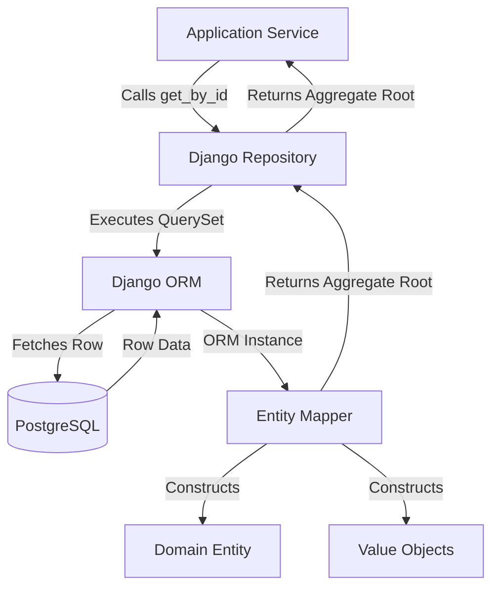
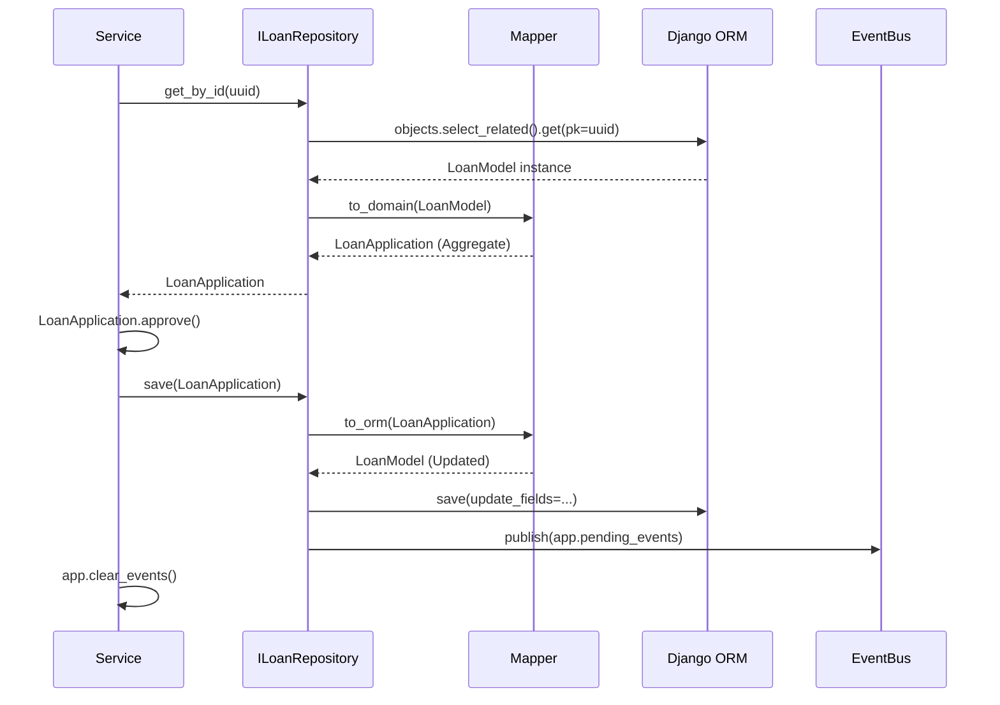
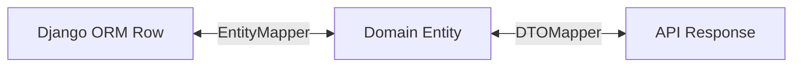
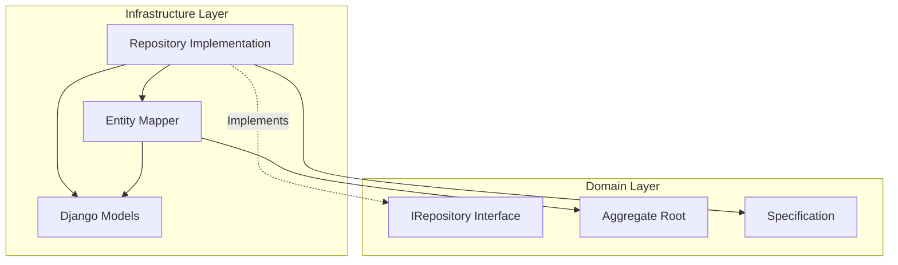

# 1. Executive Overview

### 1.1 Purpose
The purpose of this specification is to define the exact persistence boundaries and implementation strategies for the Institutional Risk Engine (IRE). It explicitly dictates how Domain Aggregates are serialized, stored, and reconstructed using the Repository Pattern.

### 1.2 Scope
This document covers the `Infrastructure Layer` and its interaction with the `Domain Layer` via Dependency Inversion. It applies to all persistence mechanisms, including PostgreSQL (via Django ORM), Redis, Object Storage (S3/local), and Vector Stores.

### 1.3 Repository Philosophy
The Repository Pattern in the IRE acts as a strict Anti-Corruption Layer (ACL) between the purity of the Domain Model and the reality of the Database. **Business logic lives in the Domain; SQL and Object-Relational Mapping (ORM) live in the Repository.** The Domain Layer must remain completely oblivious to the existence of Django or PostgreSQL.

### 1.4 Repository Non-Goals
This document **does not** define:
*   Git branching or source control strategies.
*   Database schema normalization or raw SQL table layouts.
*   Application Service orchestrations (see Request Lifecycle).

---

# 2. Repository Design Principles

To maintain a pristine Modular Monolith, all repositories must adhere to the following non-negotiable principles:

*   **Repository Pattern:** Repositories mediate between the domain and data mapping layers using a collection-like interface for accessing domain objects.
*   **Persistence Ignorance:** Domain Entities and Value Objects must not inherit from `django.db.models.Model`. They must be pure Python dataclasses or objects.
*   **Aggregate Root Only:** Repositories only exist for Aggregate Roots. You cannot have a `RiskScoreRepository`; you must load the `LoanApplication` aggregate, mutate the score, and save the aggregate.
*   **No ORM Leakage:** A repository method must *never* return a Django `QuerySet` or ORM Model. It must only return pure Domain Entities, Value Objects, or standard Python primitives.
*   **No QuerySet Exposure:** `filter()`, `exclude()`, or `annotate()` methods are forbidden in the public interface. Use the Specification Pattern instead.
*   **No Lazy Business Logic:** Repositories must not calculate DTI, validate compliance, or orchestrate events. Their sole job is translating between Domain memory and infrastructure bytes.

---

# 3. Repository Taxonomy

Not all repositories serve the same purpose. The IRE categorizes repositories to manage scaling and complexity.

*   **Aggregate Repositories:** The standard transactional repositories for mutating state (e.g., `ILoanRepository`). They enforce Optimistic Locking.
*   **Read Repositories (Projections):** Highly optimized, read-only repositories returning flattened DTOs for UI Dashboards, bypassing the overhead of full aggregate reconstruction.
*   **Write Repositories:** Strict append-only stores, such as the `IAuditRepository`.
*   **Snapshot Repositories:** Stores periodic JSON snapshots of large aggregates (e.g., `ICommitteeSnapshotRepository`) to accelerate loading.
*   **Cache Repositories:** Ephemeral Redis-backed repositories used for rate limiting and Celery task states.
*   **Document Storage Interfaces:** Abstractions for S3 or block storage (e.g., `IDocumentBlobRepository`) handling raw PDF/W2 byte streams.
*   **Event Store Interfaces:** Persistent queues for Domain Events preparing for Outbox dispatch.
*   **AI Transcript Storage:** Specialized write-heavy repositories handling the sequential append of `DebateTurns` from the Swarm.

---

# 4. Repository Package Structure

To enforce isolation, each Django App implements the following structure, cleanly separating Domain Interfaces from Infrastructure Implementations.

```text
apps/credit_decision/
├── domain/
│   ├── entities.py             # Pure Python (LoanApplication)
│   └── repositories.py         # Interfaces (ILoanRepository)
├── application/
│   └── services.py             # Uses ILoanRepository
└── infrastructure/
    ├── django_models/
    │   └── models.py           # Django ORM classes (LoanModel)
    ├── mappers/
    │   └── loan_mapper.py      # Translates Entity <-> ORM
    └── repositories/
        └── loan_repository.py  # Implements ILoanRepository
```

---

# 5. Repository Interface Catalog

Repository interfaces belong to the **Domain Layer**.

### 5.1 `ILoanRepository` (Credit Decision)
*   **Responsibilities:** Load and save the `LoanApplication` aggregate.
*   **Public Methods:**
    *   `get_by_id(app_id: UUID) -> LoanApplication`
    *   `save(app: LoanApplication) -> None`
    *   `find_by_spec(spec: Specification) -> List[LoanApplication]`
*   **Errors:** `AggregateNotFoundException`, `AggregateConflictException` (Version mismatch).
*   **Transaction Expectations:** `save()` must be atomic.
*   **Ownership:** Owned by `Credit Decision` context.

### 5.2 `ICommitteeRepository` (Multi-Agent Committee)
*   **Responsibilities:** Manage the AI Swarm session lifecycle.
*   **Public Methods:** `get_active_session(app_id: UUID) -> CommitteeSession`, `save(session: CommitteeSession)`
*   **Performance:** Must handle rapid sequential saves during debate loops.

### 5.3 `IAuditRepository` (Audit)
*   **Responsibilities:** Append-only ledger of actions.
*   **Public Methods:** `append(log: AuditLog) -> None`
*   **Transaction Expectations:** Fire-and-forget; must not roll back if the parent transaction rolls back (requires separate DB connection or Outbox).

### 5.4 `IDocumentRepository` & `IReportRepository`
*   Manage metadata in PostgreSQL and raw bytes via `IDocumentBlobRepository` (S3).

---

# 6. Repository Implementation Rules

The `Infrastructure Layer` implementations of the above interfaces must obey strict rules.

*   **Forbidden Dependencies:** A repository implementation cannot import Domain Services (`services.py`) or external context ORM models.
*   **Allowed Dependencies:** May import `django.db.models`, `django.db.transaction`, `core.infrastructure`, and its own `domain` definitions.
*   **Mapping Rules:** An implementation must never pass an ORM model directly to a Domain Service. It must use a dedicated `Mapper` class.
*   **DTO Conversion:** Read Repositories convert ORM directly to DTOs for performance.
*   **Aggregate Reconstruction:** The repository queries all necessary SQL tables (with `select_related`/`prefetch_related`) to fully build the Aggregate Root in memory before returning.
*   **Identity Restoration:** The repository maps the ORM UUID Primary Key to the Domain Aggregate ID.
*   **Version Restoration:** The `version` integer is strictly mapped to enforce Optimistic Locking.

---

# 7. Aggregate Mapping Strategy

Mapping is the most critical function of the Infrastructure layer.

*   **Entity ⇄ ORM:** `LoanApplication` (Domain) maps to `LoanModel` (Django).
*   **Value Object ⇄ Columns:** `Money(amount, currency)` maps to `amount` (DecimalField) and `currency` (CharField) on the same table.
*   **Nested Entity Mapping:** `RiskScore` (Domain) maps to a separate `RiskScoreModel` with a `OneToOneField` to `LoanModel`. The Mapper combines them into one Aggregate.
*   **Collection Mapping:** `DebateTurn` list maps to a `ForeignKey` relationship. Repositories must use `prefetch_related` to avoid N+1 queries during reconstruction.
*   **Enum Mapping:** Python `Enum` values map to `CharField(choices=...)`.
*   **UUID / Timestamp:** UUIDv7 maps to PostgreSQL `UUID`. Time maps to `DateTimeField(timezone=utc)`.
*   **Tenant Mapping:** Every ORM model includes a `tenant_id` field. The repository implicitly filters by `ContextVar(tenant_id)` to prevent cross-tenant data leakage.

### 7.1 Aggregate Reconstruction Diagram


---

# 8. Repository Lifecycle

The standard lifecycle for mutating an Aggregate via a Repository.

1.  **Load:** Service calls `repo.get_by_id(id)`.
2.  **Rehydrate:** Repository fetches ORM, Mapper builds Domain Aggregate.
3.  **Mutate:** Service invokes rich domain behavior (e.g., `app.approve()`), mutating memory state. Aggregate increments its `version` and stages a Domain Event (`LoanApproved`) internally.
4.  **Save:** Service calls `repo.save(app)`.
5.  **Version Check:** Repository attempts `UPDATE ... WHERE id=X AND version=OldVersion`. If rows updated == 0, throws `AggregateConflictException`.
6.  **Persist:** ORM saves changes.
7.  **Publish Domain Events:** Repository extracts pending events from the Aggregate and dispatches them to the Event Bus (or Outbox).
8.  **Clear Events:** Aggregate's internal pending events list is cleared.

### 8.1 Repository Lifecycle Sequence


---

# 9. Transaction Strategy

### 9.1 Unit of Work
*   A single HTTP Request or Celery Task constitutes one Unit of Work.
*   Handled via Django's `@transaction.atomic` decorator applied at the Application Service or View level.
*   Repositories do *not* manage transactions themselves; they participate in the ambient transaction.

### 9.2 Optimistic Locking
Enforced strictly at the Repository layer during `save()`.

### 9.3 Rollback & Nested Transactions
*   If a Domain Exception or unhandled error occurs, the ambient transaction rolls back.
*   Nested transactions (savepoints) are highly discouraged due to performance overhead unless explicitly wrapping a known flaky external call.

### 9.4 Event Publishing & Outbox Ready
*   Events are published inside `transaction.on_commit()`. If the DB transaction rolls back, events are discarded.
*   *Future Outbox Compatibility:* The repository will eventually insert events into an `OutboxEventModel` inside the same transaction, ensuring 100% atomicity between state and events.

---

# 10. Query Strategy

### 10.1 Specification Pattern
To prevent ORM leakage, complex queries utilize the Specification Pattern.
*   *Domain Definition:* `class HighRiskSpec(Specification): ...`
*   *Repository Use:* `repo.find_by_spec(HighRiskSpec())`
*   The Infrastructure Repository evaluates the Specification and translates it into Django `Q` objects.

### 10.2 CQRS Readiness & Projections
*   **Command (Write):** Standard Aggregate Repositories. Heavy, strict, ensures all invariants.
*   **Query (Read):** Dashboards require vast joins (e.g., Application + RiskScore + Transcript Summary).
*   **Read Models:** The Repository provides specific `IApplicationReadModel` methods that bypass the Mapper entirely, running `values()` or raw SQL to return lightweight `dataclass` DTOs, preventing the overhead of instantiating 10,000 deep Aggregate objects.

---

# 11. Repository Performance

### 11.1 Expected Performance Budgets
*   **Load Aggregate (Single):** $< 15ms$
*   **Save Aggregate (Update):** $< 20ms$
*   **List Read Model (Pagination, 50 items):** $< 50ms$

### 11.2 N+1 Prevention
All Aggregate reconstructions *must* use Django's `select_related()` (for foreign keys) and `prefetch_related()` (for many-to-many/reverse relations) within the `get_by_id()` method.

### 11.3 Connection Pooling Assumptions
PostgreSQL connections are pooled via PgBouncer. Django `CONN_MAX_AGE` is utilized. Repositories must not hold connections idle during long LLM calls.

---

# 12. Repository Error Handling

### 12.1 Exceptions Matrix
| Exception | Trigger | Handling Strategy | Retry Policy |
| :--- | :--- | :--- | :--- |
| `AggregateNotFound` | UUID missing in DB. | HTTP 404. | None. |
| `AggregateConflict` | Optimistic lock failure. | HTTP 409 / Background Retry. | 3 Retries (Celery). |
| `DatabaseTimeoutError`| Statement timeout (>5s).| HTTP 503 / Alerting. | Jittered Retry. |
| `DataCorruptionError` | Mapper fails to parse DB row. | Fatal Alert to Ops. | None. |

---

# 13. Domain Event Integration

Repositories bridge the gap between Aggregate state and Event dispatch.
*   **Pending Events:** Stored on the `AggregateRoot` base class.
*   **Publishing:** During `repo.save()`, the repository extracts `aggregate.domain_events` and routes them to the configured `IEventBus`.
*   **Idempotency:** The repository ensures the Aggregate Version is attached to the event, allowing downstream consumers to discard duplicates.

---

# 14. Mapping Layer

The Mapper is the unsung hero of the architecture, living purely in the `infrastructure` package.

### 14.1 Mapper Responsibilities
*   Translates primitive Django DB fields (Strings, Decimals) into rich Value Objects (`Money`, `Address`).
*   Ensures Domain leakage does not occur (No ORM instances passed to Services).



---

# 15. Repository Dependency Rules

### 15.1 Dependency Diagram

*   **Allowed Imports in Repo:** `domain.*`, `django.db.models`.
*   **Forbidden Imports in Repo:** `api.*`, `services.*`, external domains.

---

# 16. Repository Security

*   **Tenant Isolation:** Implicitly enforced. Every query automatically appends `.filter(tenant_id=current_tenant)`.
*   **PII Handling:** The Repository encrypts highly restricted fields via PostgreSQL `pgcrypto` or Django application-level encryption middleware *before* they hit the WAL.
*   **Soft Delete:** `delete()` methods set `is_active=False`. Hard deletes are forbidden for Audit compliance.

---

# 17. Repository Testing Strategy

*   **Contract Tests:** Run against an SQLite/PostgreSQL test DB to ensure the `DjangoLoanRepository` correctly implements `ILoanRepository`.
*   **Integration Tests:** Verify that saving an Aggregate with nested entities correctly persists all foreign key relationships via the Mapper.
*   **Concurrency Tests:** Simulate concurrent saves to verify `AggregateConflictException` is raised correctly.
*   **Performance Tests:** `pytest-django` queries are profiled using `assertNumQueries` to permanently prevent N+1 regressions.

---

# 18. Repository Metrics

Prometheus metrics exposed by the Repository Layer:
*   `repo_load_latency_ms`: Histogram of `get_by_id` durations.
*   `repo_save_latency_ms`: Histogram of `save` durations.
*   `repo_conflict_rate_total`: Counter of optimistic lock failures.
*   `repo_cache_hit_ratio`: Gauge for cached Read Models.

---

# 19. Repository Evolution

*   **Migration Strategy:** Schema changes are handled via `python manage.py makemigrations`. Because the Domain is isolated, renaming a DB column only requires updating the `Mapper`, leaving the entire Domain unaffected.
*   **Future Event Sourcing:** By routing all mutative changes through Repositories, the system is primed to swap the ORM backend for an Event Store (e.g., EventStoreDB) in the future without changing a single line of business logic.

---

# 20. Repository Anti-Patterns

The following are strict violations of the Repository Contract:
*   **Fat Repositories:** Containing business logic (e.g., `if app.dti > 40: app.deny()`).
*   **Returning ORM Models:** Passing `LoanModel` back to the Service.
*   **Hidden Transactions:** Repositories calling `transaction.commit()` themselves.
*   **Cross Aggregate Updates:** Updating a `RiskScore` via SQL without loading its parent `LoanApplication`.

---

# 21. Architecture Fitness Rules

Automated via `import-linter` in CI/CD:
```ini
[importlinter:contract:repo-isolation]
name = Repositories must not leak infrastructure
type = independence
modules =
    apps.*.domain
    apps.*.infrastructure
```
Automated via `pytest-arch`:
```python
def test_domain_does_not_import_orm():
    assert_that("apps.*.domain").does_not_import("django.db.models")
```

---

# 22. Validation Checklist

Before a new Repository is merged to main:
- [ ] Interface defined in `domain/repositories.py`.
- [ ] Implementation defined in `infrastructure/repositories/`.
- [ ] Never returns `QuerySet` or `Model`.
- [ ] `save()` respects Optimistic Locking (`version` check).
- [ ] `get_by_id()` uses `select_related` to prevent N+1.
- [ ] Pending Domain Events are published on `save()`.
- [ ] Mappers handle all Type conversions (Decimal -> Money).

---

# 23. Repository Decision Log

| ID | Decision | Rejected Alternative | Rationale | Reconsideration |
| :--- | :--- | :--- | :--- | :--- |
| `RDL-01` | Mappers external to ORM | Django `@property` methods on Models | Keeps models pure DB schema; strictly separates domain concepts. | If mapping overhead > 20ms. |
| `RDL-02` | Django ORM | SQLAlchemy | Django ecosystem cohesion (Admin, Migrations, DRF) outweighs SA's pattern purity. | If transitioning away from Django completely. |

---

# 24. Repository Contract

### Mandatory Rules
*   [x] All data access goes through Interfaces.
*   [x] Repositories return complete Aggregate Roots.
*   [x] Optimistic concurrency control is strictly enforced.

### Forbidden Rules
*   [ ] Direct `INSERT` / `UPDATE` SQL outside the repository.
*   [ ] Business logic inside the mapping layer.

---

# 25. Repository Readiness Checklist

- [ ] **Deployment:** Migrations tested against staging DB clone.
- [ ] **Performance:** `assertNumQueries` implemented for all aggregates.
- [ ] **Security:** Tenant isolation filters applied implicitly.
- [ ] **Scalability:** Connection pooling limits aligned with Celery worker counts.

---
**Related Documents**
*   Prerequisite: `02-c4-architecture.md`, `03-domain-driven-design.md`
*   Dependent Documents: `05-request-lifecycle.md`, `06-infrastructure-architecture.md`
