# 1. Executive Overview
This document defines the complete runtime execution flow of the Institutional Risk Engine (IRE). It specifies exactly how an HTTP request enters the system, traverses the boundaries of the Modular Monolith, interacts with asynchronous Celery workers and AI services, and returns a response.

# 2. Request Lifecycle Philosophy
The lifecycle strictly separates the **Synchronous API boundary** (Fast, I/O bound, standard CRUD) from the **Asynchronous Processing boundary** (Slow, CPU/GPU bound, LLM inference). The core philosophy is "Fail Fast Syntactically, Validate Deeply Asynchronously."

# 3. Layer Responsibilities
To prevent Domain leakage, every request must pass through strictly defined layers:
1.  **NGINX / Reverse Proxy:** TLS termination, basic DDoS throttling.
2.  **Django Middleware:** Tenant resolution, Correlation ID injection, JWT Auth.
3.  **API Views (DRF):** Deserialization, Syntactic validation, DTO mapping, HTTP Status generation.
4.  **Application Services:** UoW coordination, authorization checks, domain orchestration.
5.  **Domain Entities:** Pure business logic execution, invariant enforcement, event generation.
6.  **Infrastructure (Repositories):** Database transactions, ORM mapping.
7.  **Async Workers (Celery):** Long-running AI/OCR orchestrations.

---

# 4. Complete End-to-End Request Flow

### 4.1 Request Classification Matrix
The platform categorizes workloads to enforce strict SLA guarantees.

| Category | Trigger | Execution Model | SLA (P95) | Timeout | Retry Strategy | Priority | Owner |
| :--- | :--- | :--- | :--- | :--- | :--- | :--- | :--- |
| **Interactive API** | UI / REST Client | Synchronous HTTP | $< 100ms$ | $5s$ | Client Retry | High | API Gateway |
| **Event Driven** | Message Bus / Signal | Asynchronous Task | $< 60s$ | $120s$ | Exp. Backoff | Normal | Celery Worker |
| **Scheduled Jobs**| Celery Beat (Cron) | Batch Async Task | $< 10m$ | $60m$ | DLQ Only | Low | Ops Team |
| **Batch Processing**| Portfolio Upload | Chunked Async | $< 4h$ | $8h$ | Checkpointed | Lowest | Data Eng |
| **Streaming** | Future: SSE/WS | Persistent Sync | $N/A$ | $24h$ | Reconnect | High | Core UI |

### 4.2 Complete Enterprise Request State Machine
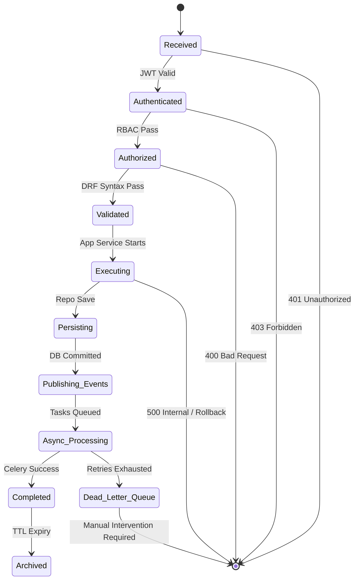

### 4.3 SLA and Availability Matrix
| Service | Availability Target | RTO (Recovery Time Obj.) | RPO (Recovery Point Obj.) | Classification |
| :--- | :--- | :--- | :--- | :--- |
| **Core API Gateway** | 99.99% | < 5 minutes | < 1 minute | Mission Critical |
| **AI Committee Inference**| 99.9% | < 30 minutes | N/A (Stateless) | Business Critical |
| **Document OCR** | 99.5% | < 4 hours | N/A | Important |
| **Reporting Engine** | 99.5% | < 4 hours | < 1 hour | Important |
| **Background Cron Jobs** | 99.0% | < 24 hours | N/A | Best Effort |

### 4.4 Capacity Planning Assumptions
| Metric | Baseline | Scaling Threshold |
| :--- | :--- | :--- |
| **Concurrent Users** | 500 | Scale API horizontally at 1,000. |
| **Requests Per Second (API)**| 150 RPS | Scale NGINX at 500 RPS. |
| **AI Evaluations (Hourly)** | 2,000 Loans | Add AI Gateway instances at 5,000. |
| **Vector DB Growth** | 50GB / Year | Scale pgvector RAM when hits > 80% RAM. |
| **Document Storage** | 2TB / Year | Infinite (S3). |
| **Celery Workers** | 20 Nodes | Scale based on Queue Depth > 1000. |

### 4.5 Complete HTTP Request Lifecycle
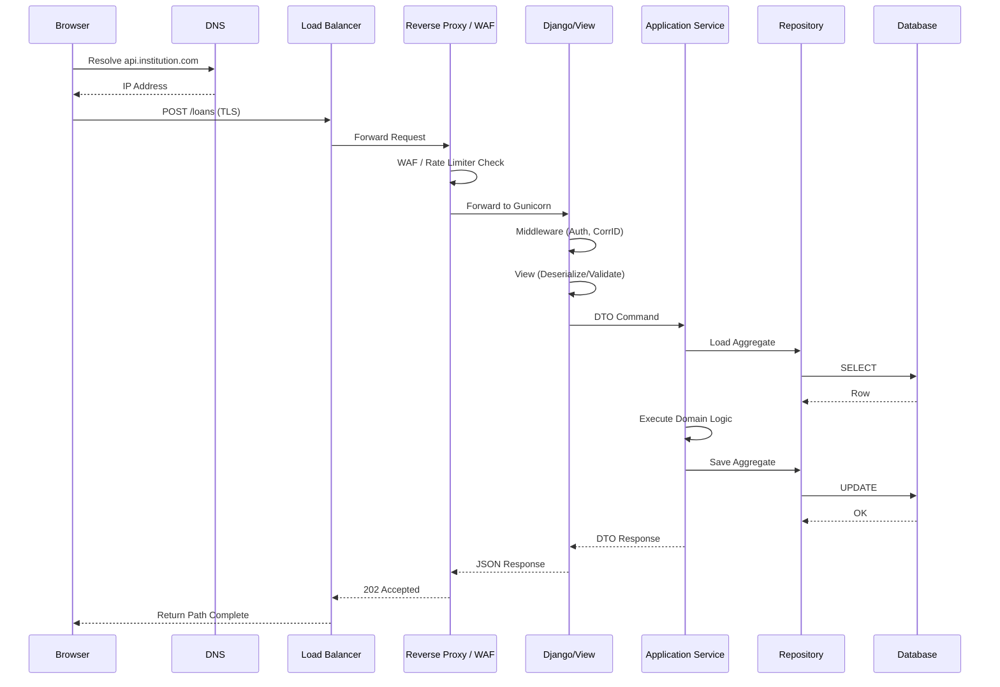

---

# 5. Application Service Architecture

### 5.1 Cache Interaction Flow & Invalidation Strategy
To protect the database, Read Services utilize Redis.
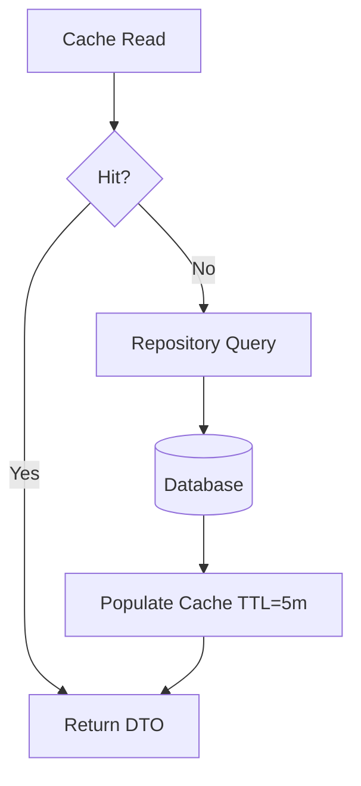
*   **Cache-Aside (Lazy Loading):** Adopted pattern for queries.
*   **Write-Through / Write-Behind:** Rejected due to added complexity and risk of desynchronization without a transactional Outbox.
*   **Cache Warming:** Critical Reference data (e.g., global credit policies) is warmed on startup.
*   **Stampede Protection:** Probabilistic early expiration (XFetch) and Distributed Locks prevent a "thundering herd" of DB queries when a highly accessed key expires.
*   **Invalidation Policy:** Aggregates emit cache-invalidation signals locally before `transaction.on_commit()`.

# 6. DTO Design Rules
*   **Input DTOs (Commands/Queries):** Immutable `dataclasses` passed from API Views to Application Services.
*   **Output DTOs:** Passed from Application Services back to Views.
*   **No DB Leaks:** DTOs must never contain Django `Models` or `QuerySets`.

# 7. Command Flow (CQRS)
Mutative operations (Commands) follow strict Aggregate consistency boundaries. A Command targets exactly *one* Aggregate Root. If multiple aggregates must change, the first publishes a Domain Event to trigger the others asynchronously.

# 8. Query Flow (CQRS) & API Contracts

### 8.1 API Response Contract Matrix
| Scenario | HTTP Status | Response Payload | Correlation Propagation |
| :--- | :--- | :--- | :--- |
| **Sync Success** | `200 OK` | `{"data": DTO, "meta": {}}` | Header: `X-Correlation-ID` |
| **Async Queued** | `202 Accepted` | `{"data": {"status_url": "/loans/123/status"}}` | Header: `X-Correlation-ID` |
| **Validation Error** | `400 Bad Request`| `{"error": "VALIDATION_FAILED", "details": [...]}`| Header: `X-Correlation-ID` |
| **Lock Conflict** | `409 Conflict` | `{"error": "STATE_CONFLICT", "message": "..."}` | Header: `X-Correlation-ID` |
| **System Error** | `500 Internal` | `{"error": "INTERNAL_ERROR", "reference": "corr_id"}`| Header: `X-Correlation-ID` |

### 8.2 API Versioning and Compatibility Policy
*   **URI Versioning:** Enforced in URL path (e.g., `/api/v1/loans`).
*   **Backward Compatibility:** Guaranteed for minor versions. No removing fields, renaming endpoints, or changing data types.
*   **Deprecation Window:** Deprecated APIs must remain active for exactly 180 days after returning a `Sunset` HTTP Header.

### 8.3 Client Polling Contract
Because AI Swarm execution is asynchronous, the client must poll for results.
*   **Interval:** Clients must poll the `status_url` every $5$ seconds initially.
*   **Exponential Backoff:** If status remains `PROCESSING`, clients must backoff $1.5x$ per retry (max $30s$ interval).
*   **Retry-After Header:** The API will explicitly supply a `Retry-After: 5` header during `202 Accepted` or `429 Too Many Requests`.

### 8.4 OpenAPI Governance
*   **OpenAPI Generation:** Automatically generated from DRF Serializers via `drf-spectacular`.
*   **CI Validation:** Swagger specs are validated in CI to ensure no missing descriptions.
*   **Contract Testing:** `Pact` tests enforce that API responses match the generated OpenAPI spec.
*   **SDK Generation:** Typescript and Python client SDKs auto-generated upon PR merge.
*   **Breaking Change Detection:** `openapi-diff` runs in CI. Any breaking change automatically fails the build.

---

# 9. Validation Pipeline
Validation happens in three distinct phases:
1.  **Syntactic (DRF Serializers):** Types, lengths, required fields.
2.  **Contextual (Application Service):** Database existence checks.
3.  **Domain Invariant (Domain Entity):** Core business rules.

# 10. Authentication & Authorization Flow
*   **Authentication:** Middleware extracts the JWT from the `HttpOnly` cookie, verifies the cryptographic signature, and attaches the user identity to the `ContextVar`.
*   **Authorization:** The Application Service evaluates RBAC claims before loading the Aggregate.

# 11. Tenant Resolution & Multi-Tenant Isolation Flow
The `TenantID` is extracted from the JWT payload and stored in an immutable `ContextVar`. Strict isolation is enforced automatically across all backing services:
*   **Database (PostgreSQL):** Repositories implicitly inject `.filter(tenant_id=ctx.tenant_id)`.
*   **Cache (Redis):** All cache keys are prefixed `tenant_{id}:{key}`.
*   **Events (Redis Bus):** `TenantID` is stamped on the canonical event envelope; consumers reject events lacking it.
*   **Logs / Metrics:** `TenantID` is a mandatory dimension/tag for all spans and prometheus metrics.
*   **File Storage (S3):** S3 bucket paths enforce `/tenant_{id}/` prefixes; AWS IAM policies prohibit cross-prefix reads.
*   **Vector Search (pgvector):** `tenant_id` is passed as a mandatory metadata filter during semantic search.

# 12. Correlation ID Propagation & Idempotency

### 12.1 API Idempotency Specification
To prevent duplicate financial evaluations, the system guarantees exactly-once processing semantics.
*   **Key Expiration:** Idempotency keys expire in Redis after 24 hours.
*   **Hash Validation:** If the same key is submitted with a *different* JSON payload, the API returns `400 Bad Request` indicating an idempotency hash mismatch.
*   **Safe Retries:** Clients receiving `503` or Network Timeout can safely retry POST requests with the same Key.
*   **Duplicate POST:** A duplicate POST while the first is `Processing` returns `409 Conflict` immediately, indicating the client must poll instead.

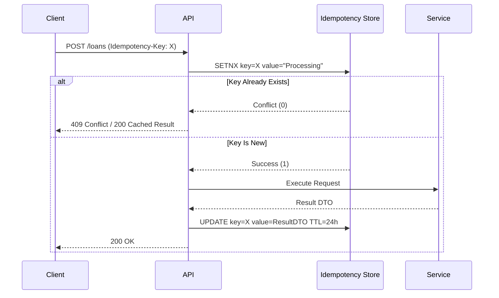

# 13. Request Context Management & Cancellation

### 13.1 Request Cancellation
*   **Client Disconnect:** If a client aborts an HTTP connection before DB Commit, NGINX closes the socket, but the Django thread completes execution (preventing torn states).
*   **Worker Cancellation:** Celery tasks can be `Revoked`. If revoked mid-AI debate, the Aggregate remains in `Partially_Complete` requiring compensation.
*   **Graceful Cleanup:** Compensation logic explicitly nullifies dangling API locks.

---

# 14. Transaction Boundaries & 15. Unit of Work Lifecycle
*   Every Command Application Service is wrapped in a Django `@transaction.atomic` block.
*   If the Domain logic raises an exception, the transaction rolls back seamlessly.

### 15.1 Database Transaction Timeline
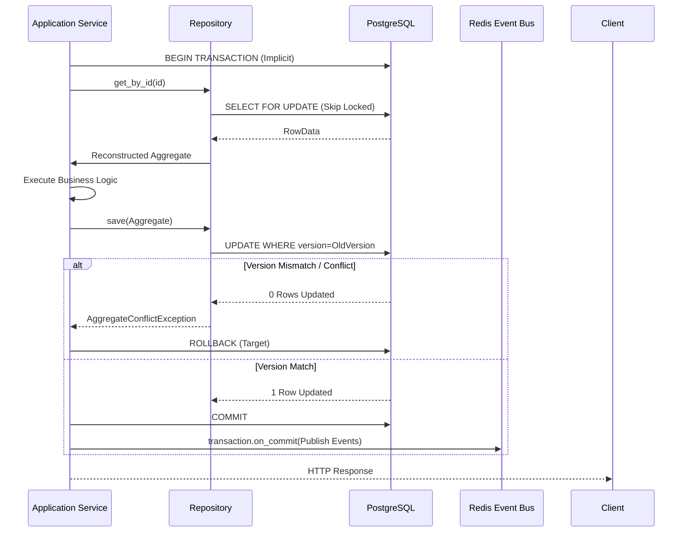

# 16. Repository Interaction Flow & Concurrency Control

### 16.1 Concurrency Control Details
*   **Lost Updates / ABA Problem:** Entirely eliminated via strict Optimistic Locking (Aggregate Version fields).
*   **Version Conflict Resolution:** Standard 3x Exponential Backoff Retry policy inside the API/Celery wrapper.
*   **Pessimistic Locking:** Rejected globally as it creates DB deadlocks during slow multi-aggregate evaluations. Only used explicitly (`SELECT FOR UPDATE`) within queue-polling implementations.

# 17. Domain Event Publishing Flow
Domain Events are dispatched via `transaction.on_commit()`.

### 17.1 Transactional Outbox Pattern
`transaction.on_commit()` alone is insufficient for tier-1 reliability. If PostgreSQL commits the transaction, but the application crashes (or Redis is down) before `on_commit` executes, the Domain Event is permanently lost.
*   **Outbox Table Architecture:** Repositories persist the Domain Event payload into an `outbox_events` PostgreSQL table inside the *exact same transaction* that saves the Aggregate.
*   **Background Publisher:** A dedicated Celery Beat task polls `outbox_events` where `published=False`, pushes them to Redis, and marks them `True`.
*   **Retry Policy & Cleanup:** The outbox publisher retries infinitely on Redis failures. A daily cron job deletes outbox rows older than 7 days.

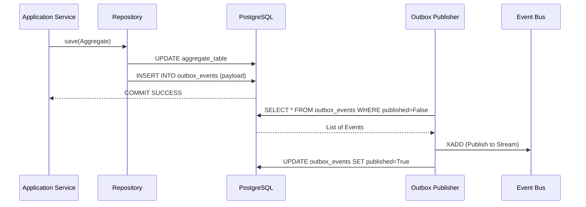

### 17.2 Domain Event Timeline
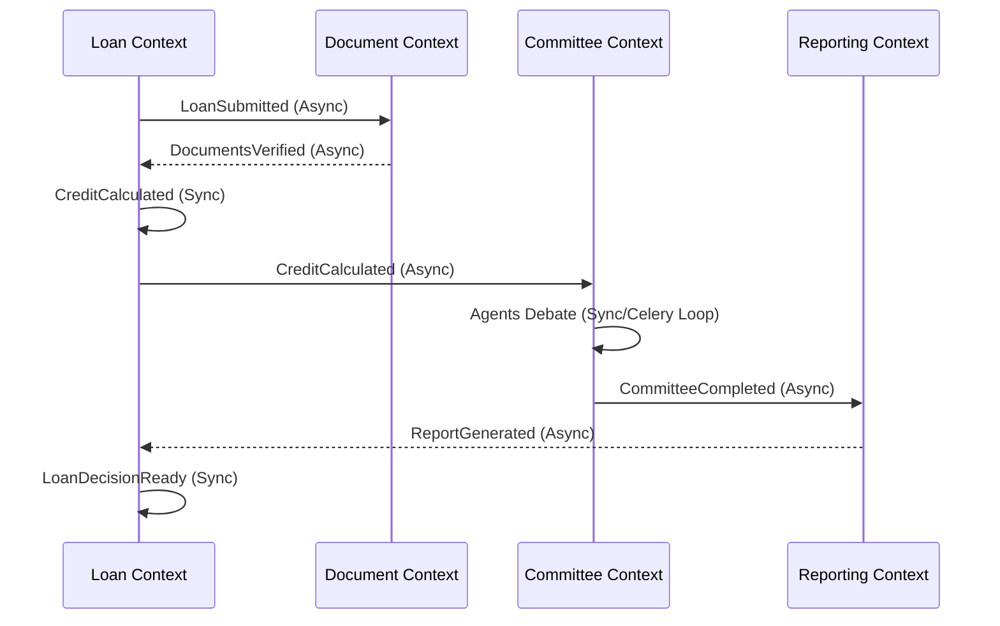

### 17.3 Complete Event Catalog & Ownership Matrix
| Event Name | Producer | Consumer(s) | Payload Example | Guarantee |
| :--- | :--- | :--- | :--- | :--- |
| `LoanCreated` | `LoanFactory` | AuthZ Service | `{"id": "...", "type": "AUTO"}` | At-Least-Once |
| `LoanSubmitted` | `CreditService` | `DocumentService` | `{"dti": 35.0, "amount": 1000}` | At-Least-Once |
| `LoanUpdated` | `CreditService` | Audit Service | `{"changes": [...]}` | At-Least-Once |
| `LoanWithdrawn` | `CreditService` | `CommitteeService` | `{"reason": "CLIENT_REQ"}` | Exactly-Once |
| `CreditCalculated` | `CreditService` | `CommitteeService` | `{"pd": 0.05, "lgd": 0.45}` | At-Least-Once |
| `DocumentsUploaded`| `DocumentService`| `OCRService` | `{"bucket": "xyz", "keys": [...]}` | At-Least-Once |
| `DocumentsVerified`| `DocumentService`| `CreditService` | `{"variance_pct": 2.5}` | At-Least-Once |
| `OCRCompleted` | `OCRService` | `DocumentService` | `{"extracted_income": 85000}` | At-Least-Once |
| `CommitteeStarted` | `CommitteeService`| Audit Service | `{"personas": ["Quant", "CRO"]}` | At-Least-Once |
| `CommitteeCompleted`| `CommitteeService`| `ReportingService` | `{"consensus": "APPROVE"}` | Exactly-Once |
| `ReportGenerated` | `ReportingService`| `NotificationService`| `{"s3_uri": "s3://..."}` | At-Least-Once |
| `LoanApproved` | `CreditService` | `NotificationService`| `{"apr": 5.5, "term": 36}` | Exactly-Once |
| `LoanRejected` | `CreditService` | `NotificationService`| `{"reason_code": "ECOA-12"}` | Exactly-Once |
| `AuditRecorded` | `AuditService` | SIEM/DataWarehouse | `{"actor": "SYSTEM"}` | At-Least-Once |
| `NotificationSent` | `NotificationSvc`| Audit Service | `{"channel": "EMAIL"}` | At-Most-Once |
| `SHAPGenerated` | `CreditService` | UI Dashboard | `{"features": {"DTI": 0.12}}` | At-Least-Once |
| `FairnessCalculated`| `FairnessService`| Compliance Dashboard | `{"disparate_impact": 0.81}` | At-Least-Once |
| `ModelEvaluated` | `ModelService` | Audit Service | `{"accuracy": 0.94}` | At-Least-Once |
| `ModelRetrained` | `DataEngService` | `ModelService` | `{"champion_id": "v2.1"}` | Exactly-Once |
| `PortfolioImported`| `DataEngService` | `CreditService` | `{"batch_id": "999", "count": 50}`| At-Least-Once |

### 17.4 Event Schema Governance & Versioning
*   **Schema Registry:** All event schemas are registered as JSON Schema documents in a central registry.
*   **Backward Compatibility:** Adding optional fields is permitted.
*   **Forward Compatibility:** Consumers must ignore unknown fields (Tolerant Reader pattern).
*   **Breaking Changes:** Renaming/removing fields, changing data types, or adding required fields requires a Major version bump.
*   **Deprecation Lifecycle:** V1 events must be emitted alongside V2 events for a 3-month transition window before removal.
*   **Validation Pipeline:** CI/CD tests the Outbox Publisher against the Schema Registry before allowing a merge.

### 17.5 Event Ordering
*   **Duplicate Events:** Suppressed at the consumer level via Redis Key tracking (`SETNX event_id`).
*   **Missing / Late Events:** Not possible in a strict FIFO Outbox, but if detected, `aggregate_version` gaps trigger a manual replay request.
*   **Reordered Events:** Consumers query the Aggregate State. If the DB `aggregate.version` is $>=$ the event's `aggregate_version`, the event is safely discarded as a stale retry.

### 17.6 Message Envelope Specification
Canonical Domain Event JSON schema expected by all consumers:
```json
{
  "event_id": "8b584cf4-1234-4cf4-82f1-f00941603c81",
  "event_type": "LoanSubmitted",
  "schema_version": "1.0",
  "aggregate_id": "4cf482f1-5678-4cf4-82f1-f00941603c81",
  "aggregate_version": 2,
  "tenant_id": "tenant-xyz",
  "correlation_id": "trace-abc-123",
  "causation_id": "req-999-444",
  "occurred_at": "2026-07-26T15:00:00Z",
  "payload": { "amount": 150000, "currency": "USD" },
  "metadata": {}
}
```

---

# Specialized Domain Flows (18 - 23)

### 18. AI Committee Orchestration Flow

#### 18.1 AI Partial Success Policy
*   **Partial Completion:** The transcript saves successful turns.
*   **Missing Agent Handling:** Non-critical agent fails = "Low Confidence". Critical agent (CRO) fails = Debate halts.
*   **Manual Review Rule:** Partial success automatically routes the loan to a Human Credit Officer.

#### 18.2 AI Failure Decision Matrix
| Failure Scenario | Component | Resolution Behavior |
| :--- | :--- | :--- |
| **Provider Outage** (OpenAI 503) | AI Gateway | Fallback to Alternative Provider (Anthropic) automatically. |
| **Malformed JSON** | LLM Response | Retry prompt with "JSON Repair" instructions (Max 2x). |
| **Individual Agent Failure** | Single Persona | See Partial Success Policy. |
| **Quorum / Majority Failure** | Multiple Personas | Abort Swarm. Route to Human Review Queue. |
| **Complete AI Outage** | AI Gateway | Degraded Mode. Only Deterministic LightGBM score used. |

#### 18.3 AI Prompt Governance
Prompts are critical business logic and require strict governance:
*   **Version Control:** Prompts are stored in DB with `PromptID`, `Version`, and `Hash`.
*   **Metadata:** Tied to specific `Model`, `Temperature`, and `Top-P` settings.
*   **Approval & Rollback:** Changes require a "Prompt Committee" approval in the UI. Reverting a prompt swaps the active DB pointer immediately.

#### 18.4 Model Registry Governance
ML models (LightGBM) follow a strict lifecycle:
*   **Shadow Deployment:** Challenger models evaluate in the background silently.
*   **Approval Status:** Regulators/Risk officers must explicitly approve a Challenger before it becomes the Champion.

### 19. Document Verification & Large File Upload Flow
1.  **Browser:** Requests a Presigned URL from API.
2.  **S3:** Browser directly PUTs file to S3 bucket (bypassing NGINX bandwidth).
3.  **Virus Scan:** S3 Object creation triggers lambda for scanning.
4.  **OCR Queue:** Celery task downloads the file, calls AWS Textract.
5.  **Verification:** Parses income, checks variance against stated income.
6.  **Cleanup:** S3 lifecycle rules delete the file after 7 years.

### 20. Regulatory RAG Flow
Triggered synchronously by the Committee Service before prompting agents. Connects to the Vector Store (pgvector) to pull top-K CFPB regulations matching the loan criteria.

### 21. Explainability (SHAP) Flow
Triggered by `CreditCalculated`. Loads the LightGBM model into memory (via Celery), calculates SHAP arrays for the specific application, and persists them for the UI.

### 22. Fairness Evaluation Flow
Evaluated async on a scheduled cron job across the entire portfolio to calculate rolling Disparate Impact ratios.

### 23. Reporting Pipeline
Triggered by `CommitteeCompleted`. Assembles the Quant Score, SHAP data, and AI Debate Transcript into a single markdown/PDF 5 C's Memorandum and saves it to S3.

---

# 24. Async Processing (Celery) Lifecycle

### 24.1 Async Execution Timeline
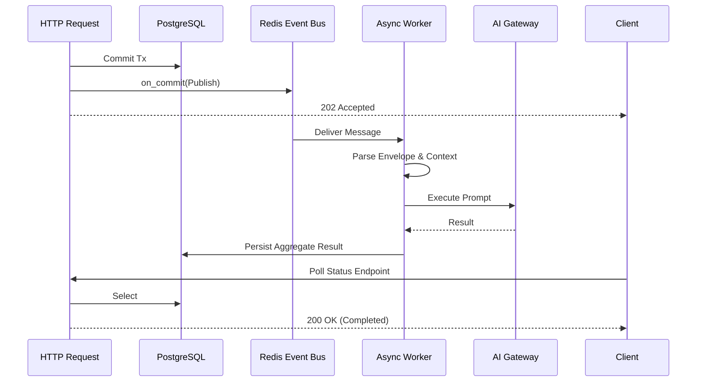

### 24.2 Queue Priority Strategy
*   `Queue: Critical` (Fraud Alerts, Auth Emails) - Routed to dedicated high-CPU workers.
*   `Queue: High` (Credit Modeling, AI Swarm) - Preempts normal traffic.
*   `Queue: Normal` (Document OCR, Reporting) - Standard round-robin.
*   `Queue: Background` (Fairness Cron, Analytics) - Runs only when cluster load < 50%.

### 24.3 Dead Letter Queue (DLQ) Lifecycle
```text
Task Execution -> Failure -> Retry (Delay: 10s) -> Failure -> Retry (Delay: 60s) ->
Failure -> Retry (Delay: 5m) -> Permanent Failure -> Move to DLQ (Redis List) ->
Operator Dashboard Review -> Fix Bug/Data -> Manual Replay -> Success.
```

### 24.4 Cancellation Flow
If a user withdraws a `LoanApplication` while the `CommitteeSession` is running in Celery, the API marks the Aggregate as `Withdrawn`. The Async workers poll the Aggregate status between Agent turns; if `Withdrawn` is detected, the workflow immediately halts and cleans up resources via Celery `Revoke`.

### 24.5 Long Running Workflow Recovery
If a worker crashes mid-Swarm:
*   **Checkpoint Strategy:** `DebateTurns` are committed to the DB iteratively.
*   **Recovery:** A periodic `CeleryBeat` watchdog scans for `CommitteeSessions` stuck in `Debating` state for > 5 minutes without an active Celery lock, and re-queues them from the last checkpoint.

### 24.6 Workflow Orchestration (Process Managers)
For complex sagas spanning multiple domains, the `LoanOriginationProcessManager` orchestrates the steps, persisting its own state (`CurrentStep`, `PendingCompensations`) in the database, allowing robust rollback/compensation if the Reporting step fails permanently.

---

# 25. Retry Strategy & 26. Timeout Strategy
| Operation | Type | Timeout | Retry Policy | Fallback |
| :--- | :--- | :--- | :--- | :--- |
| **API View** | Sync | 5s | None | HTTP 503 |
| **DB Query** | Sync | 2s | None | HTTP 503 |
| **LLM Call** | Async | 60s | 3 (Exp. Backoff) | Quant Deterministic Score |
| **OCR Parse** | Async | 30s | 2 (Exp. Backoff) | Manual Review Flag |

# 27. Compensation & Recovery Rules
If a distributed process fails, the system leaves the Aggregate in a `Partially_Complete` state and fires an `OpsAlertEvent` for manual developer intervention, rather than attempting complex Saga rollbacks.

---

# 28. Error Handling Pipeline

### 28.1 Circuit Breaker Lifecycle
To protect downstream providers (e.g., Groq API, AWS Textract):
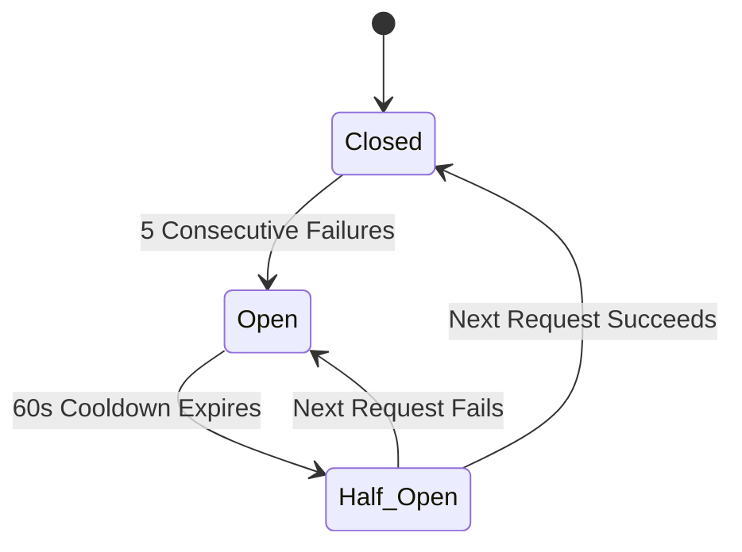

# 29. Exception Translation Matrix
| Domain Exception | HTTP Status | User Message | Alerting |
| :--- | :--- | :--- | :--- |
| `DomainValidationError` | 400 Bad Request | "Invalid input value..." | Info Log |
| `AggregateConflictException`| 409 Conflict | "Resource modified concurrently..."| Info Log |
| `SwarmConsensusError` | 202 Accepted | "AI evaluation degraded..." | Warning |
| `DatabaseError` | 500 Internal | "An unexpected system error occurred."| PagerDuty Critical |

---

# 30. Logging, 31. Tracing, & 32. Metrics Collection

### 30.1 Immutable Audit Logging
Critical for tier-1 compliance:
*   **Fields:** Before Value, After Value, UserID, Timestamp, Reason, CorrelationID, Digital Signature (HMAC).
*   **Retention:** 7 years WORM (Write Once Read Many).

### 31.1 Observability Maturity Model & Trace Walkthrough
Every request generates four pillars of telemetry: Metrics, Logs, Traces, and Profiles.
**End-to-End Walkthrough (POST /api/v1/loans):**
1.  **Browser:** Generates `X-Trace-Id: 99a8b...` and passes via HTTP header.
2.  **NGINX:** Emits Log indicating receipt.
3.  **Middleware:** Injects `X-Trace-Id` into `ContextVars` as the `CorrelationID`.
4.  **DRF / App Service:** Emits `log.info("Starting Origination", extra={'corr_id': '99a8b'})`.
5.  **Repository:** OpenTelemetry auto-instruments the psycopg3 query, appending the Span ID.
6.  **Domain Event:** The `CorrelationID` is stamped inside the Canonical Message Envelope as `causation_id`.
7.  **Celery Worker:** Extracts `CorrelationID` from the envelope, rehydrating local `ContextVars`.
8.  **AI Gateway:** Sends prompt to OpenAI; HTTP call traced via OTel.
9.  **API Response:** Client receives 202 Accepted with `X-Correlation-ID: 99a8b` for tracking.

### 31.2 Distributed Tracing Model Details
*   **Trace ID:** Global identifier for the entire transaction tree (e.g., UI Click -> Report Gen).
*   **Span ID:** Local identifier for a specific hop (e.g., DB Query).
*   **Parent Span:** Links back to the caller.
*   **Correlation ID:** Synonymous with Trace ID at the log level.
*   **Causation ID:** Points to the Event ID that triggered the current async worker.

### 32.1 Expanded Metrics Catalog
Prometheus automatically scrapes the following operational metrics:
*   `http_request_latency_seconds` (P50, P95, P99)
*   `celery_queue_depth_total` (Alert if > 1,000)
*   `worker_utilization_percent`
*   `dlq_message_count` (Alert if > 0)
*   `repo_save_latency_ms`
*   `ai_gateway_ttft_ms` (Time to First Token)
*   `correlation_trace_completeness_ratio`

---

# 33. Expanded Performance Budget Breakdown

| Lifecycle Segment | P50 Target | P95 Target | P99 Target |
| :--- | :--- | :--- | :--- |
| NGINX Routing | 2ms | 5ms | 10ms |
| Auth & Middleware | 10ms | 15ms | 30ms |
| Application Service | 5ms | 10ms | 20ms |
| Repository Load | 15ms | 25ms | 50ms |
| Domain Execution | 5ms | 10ms | 20ms |
| Repository Save | 20ms | 35ms | 80ms |
| DRF Serialization | 10ms | 20ms | 40ms |
| **Total Sync Budget** | **~67ms** | **~120ms** | **~250ms** |

---

# 34. Security Enforcement Pipeline & 35. Data Classification Handling

### 34.1 API Rate Limiting Matrix
Enforced by NGINX and Django Redis-Middleware.
| Endpoint | Limit | Burst | Retry Behavior | Response Header | Owner |
| :--- | :--- | :--- | :--- | :--- | :--- |
| **Login** | 5 / min | 10 | Block IP 15m | `X-RateLimit-Reset` | SecOps |
| **Refresh Token** | 20 / min | 30 | `429 Too Many` | `X-RateLimit-Reset` | SecOps |
| **Loan Submission**| 100 / min | 150 | Exp. Backoff | `Retry-After: 30` | API Team |
| **Loan Status** | 300 / min | 500 | `429 Too Many` | `Retry-After: 5` | API Team |
| **Search** | 200 / min | 400 | `429 Too Many` | `Retry-After: 10` | Core UI |
| **Doc Upload** | 50 / min | 50 | Exp. Backoff | `Retry-After: 60` | Ops |
| **Reporting** | 20 / min | 30 | Exp. Backoff | `Retry-After: 120`| Ops |
| **Admin APIs** | 100 / min | 200 | Block IP 1h | `X-RateLimit-Reset` | SecOps |

### 34.2 Secret Lifecycle (Vault)
*   **Rotation:** DB credentials auto-rotated daily.
*   **JWT Signing Keys:** Rotated monthly; previous key retained for 48 hours to prevent session invalidation.
*   **Emergency Revocation:** Triggering the Vault "Break Glass" revokes all active Redis sessions and cycles all DB passwords instantly.

---

# 36. State Transition Diagrams & Resource Lifecycle
**Resource Lifecycle (`LoanApplication`):**
`Created (T0)` $\rightarrow$ `Processing (T+10s)` $\rightarrow$ `Completed (T+60s)` $\rightarrow$ `Archived (T+30 Days)` $\rightarrow$ `Deleted (T+7 Years)`
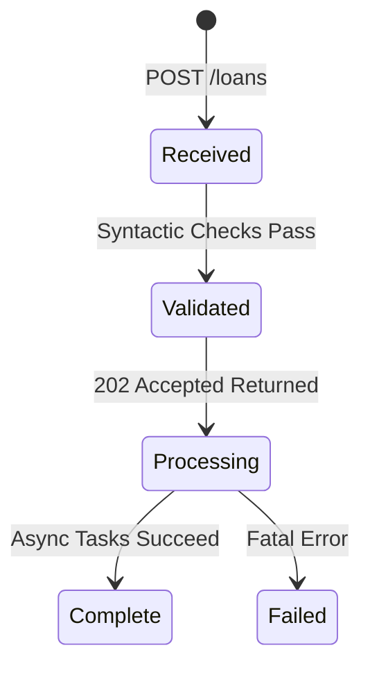

# 37. Sequence Diagrams
(Refer to Section 12.1 for Idempotency Sequence).

# 38. Activity Diagrams
(Refer to Section 4 for E2E Macro Activity Graph).

# 39. Service Dependency Graph & Ownership

### 39.1 Service Dependency Rules
*   **Allowed Imports:** `application` imports `domain`. `infrastructure` imports `application` and `domain`.
*   **Forbidden Imports:** `domain` importing anything outside Python standard library.
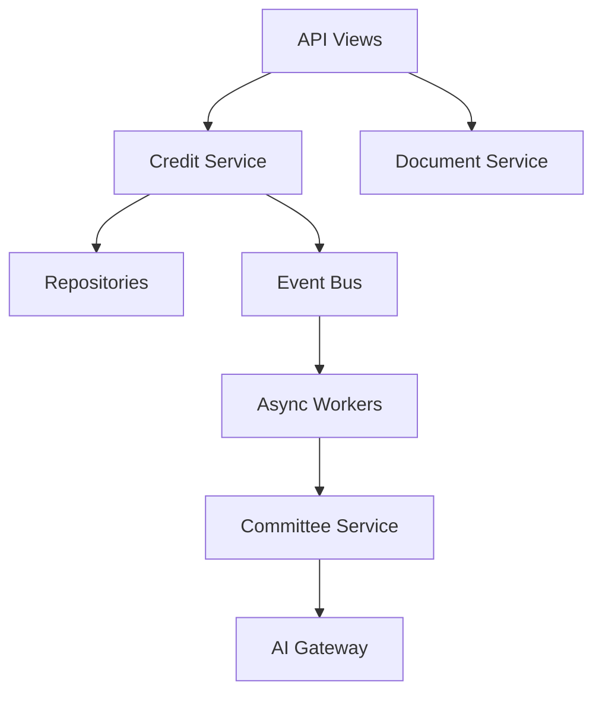

### 39.2 Resource Ownership Matrix
| Resource | Aggregate Owner | Bounded Context | Repository Owner |
| :--- | :--- | :--- | :--- |
| **Loan** | `LoanApplication` | Credit Decision | `ILoanRepository` |
| **Customer** | `CustomerProfile` | Identity | `ICustomerRepository` |
| **Committee**| `CommitteeSession`| AI Swarm | `ICommitteeRepository`|
| **Report** | `GeneratedReport` | Reporting | `IReportRepository` |
| **Document** | `DocumentBundle` | Doc Intelligence| `IDocumentRepository` |
| **OCR** | `ExtractedData` | Doc Intelligence| `IDocumentRepository` |
| **SHAP Result**| `RiskScore` | Credit Decision | `ILoanRepository` |
| **Audit Log**| `AuditRecord` | Audit | `IAuditRepository` |
| **Notification**| `Notification` | Generic | `INotificationRepository`|

---

# 40. Request Lifecycle Decision Log (25 ADRs)

| ID | Decision | Rejected Alternative | Rationale |
| :--- | :--- | :--- | :--- |
| `RLC-01` | ContextVars for Request state | ThreadLocals | Future-proofs the codebase for AsyncIO. |
| `RLC-02` | Emit events on `transaction.on_commit` | Emit immediately | Prevents ghost events triggering Celery on DB rollback. |
| `RLC-03` | CQRS via separate Read Services | Full Aggregates for UI | Full aggregation incurs a massive 100ms+ overhead. |
| `RLC-04` | Async AI via Celery | Sync blocking | LLM latency violates the HTTP 5s timeout budget. |
| `RLC-05` | Pydantic DTOs for Boundaries | Passing Django Models | Prevents ORM leakage into the Domain layer. |
| `RLC-06` | Redis for Rate Limiting/Idempotency | Memcached | Redis offers atomic INCR and SETNX operations. |
| `RLC-07` | HTTP 202 Accepted for Mutative APIs | Sync 200 OK | Signals sync checks passed, but AI is pending. |
| `RLC-08` | Application Services as UoW boundary | Views managing Tx | Keeps transaction scope tied to a business use case. |
| `RLC-09` | Repository Pattern | Direct Django ORM | Allows testing Domain logic without a database. |
| `RLC-10` | Correlation IDs via Middleware | Manual injection | Ensures 100% trace coverage automatically. |
| `RLC-11` | Domain Events vs Method Calls | Hardcoding calls | Drastically reduces coupling. |
| `RLC-12` | DLQ for failed Tasks | Dropping failures | Essential for enterprise recoverability and compliance. |
| `RLC-13` | Process Managers (Sagas) | Choreography | Long-running workflows require traceable orchestration. |
| `RLC-14` | API Versioning in URI | Header Versioning | Headers are too opaque for B2B API integrations. |
| `RLC-15` | OpenTelemetry standard | Datadog Tracer | Avoids vendor lock-in. |
| `RLC-16` | Exponential Client Backoff | Fixed Polling | Prevents Thundering Herd attacks on the DB. |
| `RLC-17` | Event Versioning via Envelope | Implicit versions | Prevents breaking downstream consumers. |
| `RLC-18` | Optimistic Locking | Pessimistic Locking | Prevents DB deadlocks during slow multi-evaluations. |
| `RLC-19` | S3 Presigned URLs for Uploads | Proxy through Django | Saves application bandwidth and RAM. |
| `RLC-20` | Cache-Aside Strategy | Write-Through | Out-of-sync cache is less fatal than slow DB writes. |
| `RLC-21` | JWT Blocklist in Redis | Stateful DB Tokens | Best balance of stateless horizontal scaling and fast revocation. |
| `RLC-22` | HashiCorp Vault | ENV vars | Enforces daily key rotation for enterprise security. |
| `RLC-23` | Canonical Event Envelope | Raw Payloads | Ensures global traceability across all queues. |
| `RLC-24` | Soft Delete Default | Hard Delete | Required for 7-year regulatory audit retention. |
| `RLC-25` | Graceful Degradation (Math Only) | Complete Outage | Math deterministic models serve as a 100% available fallback to AI. |

---

# 41. Anti-Patterns
*   **Sync LLM Calls:** Blocking the HTTP thread waiting for Groq/OpenAI.
*   **Swallowing Exceptions:** Catching generic `Exception` and returning 500 without logging the stack trace.
*   **Context Passing via Parameters:** Passing `correlation_id` through 15 function calls instead of using ContextVars.

---

# 42. Architecture Fitness Rules
Measurable rules enforced via `import-linter` and `pytest-arch`:
*   `Rule 1:` Views must not call Repositories directly.
*   `Rule 2:` Application Services must not import `django.http`.
*   `Rule 3:` Domain layer must not import Django ORM.
*   `Rule 4:` All APIs must be documented via OpenAPI spec.
*   `Rule 5:` All public API Endpoints must return an `X-Correlation-ID` header.

---

# 43. Testing Strategy & Failure Injection
*   **Request Tests:** `pytest-django` APIClient tests validating the HTTP boundary.
*   **Failure Injection (Chaos Testing):** Engineers regularly simulate: Redis unavailable (validates fallback DB read), External LLM timeout (validates DLQ routing), Network partition (validates event replay safety).

---

# 44. Validation Checklist
- [ ] Correlation ID is present in all logs.
- [ ] NGINX timeouts are > Application timeouts.
- [ ] All APIs return documented error payloads.
- [ ] All APIs include `Retry-After` headers where appropriate.
- [ ] `X-Trace-Id` passes seamlessly across the Celery boundary.

# 45. Readiness Checklist
- [ ] PagerDuty alerts configured for 5xx anomalies.
- [ ] Prometheus scraping /metrics successfully.
- [ ] Celery Dead Letter Queue (DLQ) established.
- [ ] Process Manager rollback commands tested under load.
- [ ] Rate limits defined for every API version.

---

# 46. Future Evolution Strategy

### 46.1 Streaming Evolution Roadmap
We will execute a strict, 4-phase architectural migration roadmap:
1.  **Phase 1: Standard Polling (Current).** DRF Views return 202 Accepted. Client polls status.
2.  **Phase 2: Server-Sent Events (SSE).** Replace polling with an HTTP/2 SSE stream.
3.  **Phase 3: WebSockets (Django Channels).** Establish full-duplex bi-directional connection.
4.  **Phase 4: Live Multi-Agent Token Streaming.** Pipe the raw token generation from the external LLM directly through Redis Streams to Django Channels.

---

# 47. Performance Degradation Modes & Backpressure Strategy
*   **Performance Degradation Modes:** If Redis slows, we bypass cache. If AI Gateway slows, we fallback to Deterministic Models. If Database slows, we scale up read-replicas instantly.
*   **Backpressure Strategy:** If `celery_queue_depth_total > 5000`, the API automatically returns `429 Too Many Requests`.

---

# 48. SLO / Error Budget & Failure Domain Matrix

### 48.1 SLI / SLO / SLA Model
*   **SLI (Indicator):** Percentage of HTTP 200/202 requests served in < 250ms.
*   **SLO (Objective):** 99.9% over a 30-day rolling window.
*   **SLA (Agreement):** 99.5% contract with B2B partners.
*   **Error Budget:** 43m 49s allowed downtime / month.
*   **Burn Rate Alerting:** A 10x burn rate (budget depleting in 3 days) triggers immediate PagerDuty escalation.

| Component | Failure Impact | Detection | Fallback | Escalation |
| :--- | :--- | :--- | :--- | :--- |
| **PostgreSQL** | Fatal | DB Timeout | 503 Maintenance Mode | Ops Critical |
| **Redis** | Severe (Async Halted) | Ping Failure | Sync reads allowed | Ops Critical |
| **Celery Worker** | Delayed Processing | Queue Depth Alert| Auto-scale workers | DevOps Warn |
| **AI Gateway** | AI Features Down | Circuit Breaker Open| Deterministic Math Mode | AI Ops Warn |

---

# 49. Configuration, Deployment, and Disaster Recovery

### 49.1 Configuration Management
*   **Static Config:** Checked into Git (`settings.py`).
*   **Environment Variables:** Runtime deployment parameters (e.g., `DB_HOST`).
*   **Dynamic / Runtime Config:** Adjusted via Admin UI (e.g., Credit Policy thresholds); hot-reloaded without restarting workers.
*   **Feature Flags:** (e.g., `enable_anthropic_fallback`) Managed via LaunchDarkly/Redis to allow Canary, Beta, and Regional rollouts safely.

### 49.2 Deployment Safety
*   **Deployment Model:** Rolling Deployment via Kubernetes.
*   **Zero Downtime Migration:** Django DB migrations must be purely additive; destructive schema changes require 2-phase deployment.
*   **Health Verification:** Load balancer shifts traffic *only* after `/health` confirms DB, Redis, and Vault are accessible.

### 49.3 Disaster Recovery (DR)
*   **PostgreSQL PITR:** Point-In-Time-Recovery tested monthly.
*   **Redis Loss:** Ephemeral cache. Resyncs automatically. Loss of event bus mitigated by Transactional Outbox (events replay from DB).
*   **Region Failure:** Cross-region AWS replication active. RTO < 4 hours.

---

# 50. Implementation Readiness Scorecard (Final Review)
| Category | Status | Validation Method | Pass Criteria | Owner |
| :--- | :--- | :--- | :--- | :--- |
| **Architecture** | Ready | ADR Review | All layers isolated. | Principal Architect |
| **Reliability** | Ready | Chaos Tests | Survives Redis/AI death. | Ops Lead |
| **Scalability** | Ready | Load Test (Locust)| Meets P99 < 250ms SLA. | Platform Lead |
| **Observability**| Ready | OTel Validator | 100% Trace coverage. | SRE Team |
| **Security** | Ready | Pen Test | No SQLi, Vault Active. | CISO |
| **Compliance** | Ready | Audit Log Review | Retains 7 years immutable. | Legal/Compliance |

---

# 51. Non-Functional Requirement Traceability

| Architecture Decision | Scalability | Reliability | Observability | Security | Maintainability |
| :--- | :--- | :--- | :--- | :--- | :--- |
| **Modular Monolith** | - | - | - | - | High |
| **CQRS** | High | - | - | - | Medium |
| **Celery / Redis** | High | High | - | - | - |
| **ContextVars Trace**| - | - | High | - | - |
| **Transactional Outbox**| - | High | High | - | - |
| **HashiCorp Vault** | - | - | - | High | - |

---
*Operational Runbooks (Wiki Links)*
*   `RB-01`: Recovering a Stalled Redis Broker.
*   `RB-02`: Replaying Dead Letter Queue (DLQ).
*   `RB-03`: Emergency AI Gateway Killswitch.
*   `RB-04`: Vault Key Rotation.
