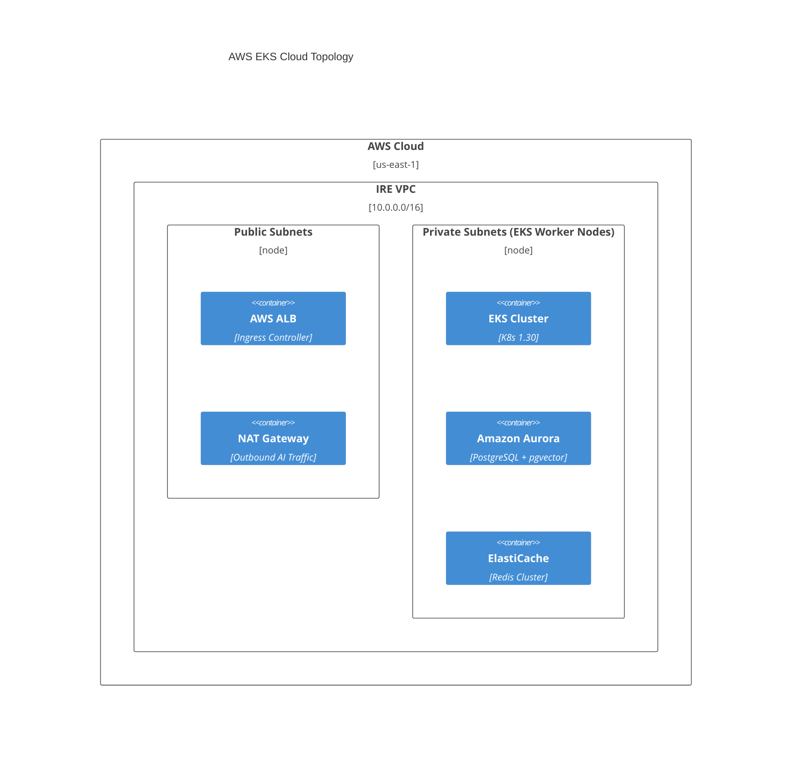
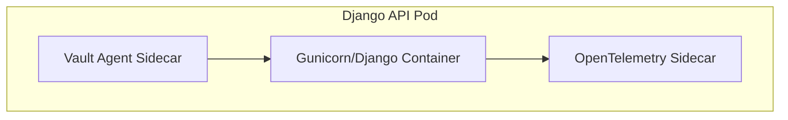
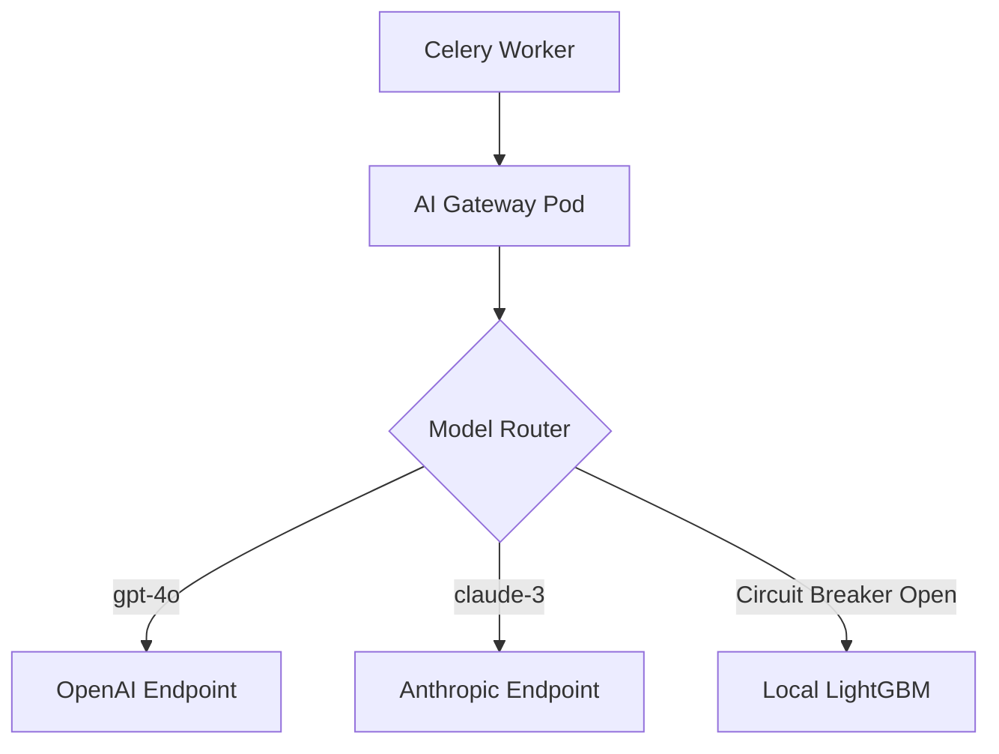

# 1. Executive Overview
This document defines the physical and topological infrastructure for the Institutional Risk Engine (IRE). It translates the Domain-Driven Modular Monolith into a highly available, secure, and horizontally scalable AWS cloud deployment centered around Kubernetes (EKS), PostgreSQL, Redis, and AI infrastructure.

# 2. Infrastructure Philosophy
**Immutable Infrastructure.** Servers are cattle, not pets. Every resource is provisioned via Terraform and Helm. No manual SSH access or "click-ops" is permitted in Production.

# 3. Cloud Architecture Principles
*   **Multi-AZ by Default:** All stateful and stateless components span at least 3 Availability Zones.
*   **Zero Trust:** Network perimeters are insufficient; mTLS and strict RBAC govern all internal pod-to-pod traffic.
*   **Cost-Aware Scaling:** GPU nodes scale to zero when queues are empty.

# 4. Infrastructure Goals
*   **Availability:** 99.99% Core API uptime.
*   **Durability:** 99.999999999% (11 9s) for S3 Document Storage.
*   **RPO:** < 1 minute (via continuous WAL archiving).

# 5. Deployment Topology


# 6. Environment Strategy
*   **Local:** Docker Compose (Mocked LLMs, local Postgres).
*   **Development:** EKS dev cluster (Ephemeral namespaces per PR).
*   **QA:** EKS qa cluster (Automated E2E testing).
*   **UAT:** EKS uat cluster (Prod mirror for business sign-off).
*   **Staging:** EKS staging cluster (Pre-prod load testing, same instance sizes as prod).
*   **Production:** EKS prod cluster (Mission-critical, isolated AWS account).
*   **Disaster Recovery:** EKS dr cluster (us-west-2, scaled to zero until failover).

# 7. Kubernetes Architecture
The core runtime is Amazon Elastic Kubernetes Service (EKS). The control plane is fully managed by AWS, while data plane nodes are managed via Karpenter for rapid autoscaling.

# 8. Cluster Topology
*   **Control Plane:** AWS Managed (Highly Available).
*   **Data Plane:** Karpenter NodePools.
*   **CNI:** Amazon VPC CNI (native VPC IP routing).

# 9. Namespace Strategy
Strict logical isolation via Kubernetes namespaces:
*   `ire-system`: Core monolithic application pods.
*   `ire-workers`: Celery asynchronous workers.
*   `monitoring`: Prometheus, Grafana, OpenTelemetry.
*   `security`: Vault, Falco, Cert-Manager.
*   `ingress`: NGINX Ingress Controller.

# 10. Node Pools
*   **System Pool:** t3.medium (Core K8s add-ons).
*   **App Pool:** m6i.large (Django API, Celery standard).
*   **Compute Pool:** c6i.xlarge (Heavy reporting, OCR processing).
*   **GPU Pool:** g5.xlarge (Local fallback models, SHAP calculations, scales to 0).

# 11. Pod Architecture
Each Django pod runs the `gunicorn` WSGI server. A sidecar pattern is strictly enforced for observability and security.


# 12. Service Mesh Architecture
Istio is implemented to enforce Zero Trust networking, providing automatic traffic encryption, strict L7 authorization policies, and distributed trace header injection.

# 13. Ingress Architecture
AWS Application Load Balancer (ALB) terminates external TLS and forwards traffic to the internal NGINX Ingress Controller via AWS PrivateLink, ensuring NGINX handles path-based routing.

# 14. API Gateway Infrastructure
The NGINX Ingress acts as the API Gateway, handling JWT validation, rate limiting (via Redis), and routing requests to the appropriate Django service endpoints.

# 15. NGINX Configuration Strategy
*   **Worker Connections:** 10240.
*   **Keepalive:** 60s to prevent rapid connection teardowns.
*   **Timeouts:** 10s proxy_read_timeout (Enforcing fast fail for sync APIs).

# 16. Load Balancer Design
*   **External:** AWS ALB (WAF attached).
*   **Internal:** Kubernetes ClusterIP Services (kube-proxy utilizing IPVS mode for performance).

# 17. DNS Architecture
*   **External:** Amazon Route 53 (`api.ire.institution.com`).
*   **Internal:** CoreDNS handles internal service discovery (`ire-backend.ire-system.svc.cluster.local`).

# 18. Network Topology
Hub and Spoke Transit Gateway architecture isolating Dev, Staging, and Prod VPCs.

# 19. VPC Design
`10.10.0.0/16` for Production. IPAM enabled to prevent CIDR overlap during acquisitions.

# 20. Private/Public Subnets
*   **Public (3 AZs):** `/24` (ALB, NAT Gateways).
*   **Private (3 AZs):** `/20` (EKS Nodes, RDS, Redis). EKS nodes possess no public IPs.

# 21. NAT Gateway Strategy
3 NAT Gateways (one per AZ) to ensure high availability for outbound API calls (e.g., to OpenAI or AWS Textract).

# 22. Firewall Rules & 23. Security Groups
*   **ALB SG:** Allow 443 from World.
*   **EKS SG:** Allow 443 from ALB SG.
*   **RDS SG:** Allow 5432 ONLY from EKS SG.

# 24. Zero Trust Networking
Network security relies on identity, not IP addresses. Kubernetes NetworkPolicies deny all ingress/egress by default, explicitly allowing only required paths.

# 25. Internal Service Communication
Django API pods communicate with Celery workers exclusively via the Redis broker. No direct Pod-to-Pod synchronous API calls exist within the monolith.

# 26. TLS Architecture & 27. mTLS Strategy
*   **External TLS:** TLS 1.3 enforced at AWS ALB. ACM provides certificates.
*   **Internal mTLS:** Istio enforces STRICT mTLS between all pods. Traffic is encrypted on the wire even inside the VPC.

# 28. Secret Management & 29. HashiCorp Vault
*   No secrets exist in Kubernetes `Secret` objects natively.
*   **Vault Deployment:** Deployed in HA mode backed by AWS KMS for Auto-Unseal.
*   **Injection:** Vault Agent Sidecar injects DB credentials into an ephemeral RAM disk (`/vault/secrets/db.env`) read by Django on startup.

# 30. Certificate Rotation
Cert-Manager automates TLS certificate issuance via Let's Encrypt for external domains, and acts as a Vault PKI issuer for internal mTLS, rotating pod certificates every 24 hours.

# 31. PostgreSQL Cluster Architecture
*   **Engine:** Amazon Aurora PostgreSQL (Serverless v2).
*   **Availability:** Multi-AZ synchronous replication across 3 AZs.
*   **Extensions:** `pgvector` enabled for regulatory RAG embeddings.

# 32. Read Replica Strategy
1 Writer instance. 2 Reader instances. Read Services route complex dashboard queries to the Reader endpoint to protect the Writer's transaction throughput.

# 33. Connection Pooling & 34. PgBouncer
Django opens and closes connections rapidly. To prevent connection exhaustion on Aurora, a PgBouncer sidecar runs on every EKS Node (DaemonSet), multiplexing 10,000 Django connections into 500 Aurora connections.

# 35. Backup Strategy & 36. Point-in-Time Recovery
*   **Automated:** Aurora continuous backups enabled with a 35-day retention policy.
*   **PITR:** Supports restoring the database to any exact second within the retention window.

# 37. Redis Infrastructure & 38. High Availability
*   **Engine:** Amazon ElastiCache for Redis.
*   **Topology:** Multi-AZ with Automatic Failover. 1 Primary, 2 Replicas.

# 39. Redis Sentinel vs 40. Redis Cluster
We utilize Redis Cluster mode to shard the Celery Task Queues and Rate Limiting keys across 3 distinct node groups to prevent a single massive instance from becoming a CPU bottleneck.

# 41. Redis Persistence
Configured for `AOF` (Append Only File) with `everysec` fsync to prevent loss of queued Domain Events if the primary node crashes.

# 42. Object Storage Architecture & 43. AWS S3 Layout
*   Bucket: `ire-prod-assets-us-east-1`
*   Prefixes: `/documents/tenant_id/`, `/reports/tenant_id/`

# 44. Lifecycle Policies
*   Days 0-30: S3 Standard.
*   Days 31-365: S3 Standard-IA.
*   Days 365-2555 (7 years): S3 Glacier Deep Archive (Regulatory retention).

# 45. Document Storage, 46. OCR Storage, 47. Report Storage
All follow the aforementioned lifecycle policies, with KMS Customer Managed Keys (CMK) enforcing AES-256 encryption at rest.

# 48. AI Prompt Storage
Prompts are treated as code. They are stored in PostgreSQL for version history but deployed via standard DB Migrations.

# 49. Model Artifact Storage
LightGBM serialized artifacts (`.pkl`, `.onnx`) are stored in S3 and pulled into the Celery Pod RAM upon startup.

# 50. Container Registry Strategy & 51. Docker Image Lifecycle
*   **Registry:** Amazon ECR.
*   **Lifecycle:** Untagged images are purged after 14 days. Production images are retained indefinitely.

# 52. Image Signing & 53. Image Scanning
*   **Signing:** Images signed via AWS Signer (Notary). EKS Admission Controller rejects unsigned images.
*   **Scanning:** ECR Basic Scanning (Clair) runs on push. Critical vulnerabilities break the CI pipeline.

# 54. Kubernetes Deployment Strategy
All applications are defined as Helm charts stored in a GitOps repository (ArgoCD).

# 55. Rolling Updates
MaxSurge: 25%, MaxUnavailable: 0%. Ensures zero downtime during pod cycling.

# 56. Blue-Green & 57. Canary Deployment
*   Major risk changes (e.g., new AI Swarm orchestrator) utilize Argo Rollouts to send 5% of traffic to the Canary pods.
*   Prometheus evaluates Error Rates; if > 1%, Argo automatically rolls back.

# 58. Feature Flag Infrastructure & 59. LaunchDarkly
*   Decouples deployment from release.
*   Feature flags are evaluated entirely locally within the Django SDK using a LaunchDarkly Relay Proxy deployed in the cluster to prevent external network latency.

# 60. CI/CD Pipeline & 61. GitHub Actions
*   Trunk-based development. Commits to `main` trigger the pipeline.
*   **Build Pipeline (62):** Lints code, builds Docker image, pushes to ECR.
*   **Test Pipeline (63):** Runs `pytest`, `pytest-arch`, and Integration tests against Ephemeral Postgres.
*   **Security Pipeline (64):** Runs Bandit, Trivy, and SonarQube.
*   **Artifact Promotion (65):** Git tag `v1.2.3` promotes the image to Staging. Manual approval triggers Production deployment via ArgoCD.

# 66. Infrastructure as Code & 67. Terraform Architecture
*   State stored in S3 with DynamoDB locking.
*   Modularized: `vpc`, `eks`, `rds`, `elasticache`.

# 68. Helm Charts & 69. Kustomize Strategy
Helm is used for packaging the IRE application. Kustomize overlays are used to inject environment-specific variables (e.g., `prod-values.yaml` vs `staging-values.yaml`) before applying.

# 70. AI Infrastructure
The AI Gateway is the critical choke point for all LLM connectivity.

# 71. GPU Worker Pools
For Fallback Deterministic Models (SHAP), Karpenter spins up `g5.xlarge` nodes. They terminate automatically after 10 minutes of idle Celery queues to optimize costs.

# 72. AI Gateway Infrastructure & 73. Model Routing


# 74. External LLM Connectivity & 75. Provider Failover
All external LLM API calls traverse the NAT Gateway. If OpenAI 5xx error rates exceed 5% over 1 minute, the AI Gateway circuit breaker trips, automatically failing over to Anthropic Claude via a standardized adapter interface.

# 76. Vector Database Infrastructure & 77. pgvector Scaling
*   Deployed as an extension inside the main Aurora cluster.
*   Indexes: `hnsw` (Hierarchical Navigable Small World) built for high-recall semantic search during RAG.

# 78. Embedding Pipeline
Document chunks are passed to an external embedding model (e.g., `text-embedding-3-small`) via Celery, and the resulting arrays are persisted into `pgvector`.

# 79. Monitoring Stack
The "LGTM" Stack (Loki, Grafana, Tempo, Mimir/Prometheus) is deployed in the `monitoring` namespace.

# 80. Prometheus & 81. Grafana
*   **Prometheus:** Scrapes `/metrics` endpoints across all pods every 15s.
*   **Grafana:** Provides the single pane of glass for SLO dashboards and Celery Queue depths.

# 82. Loki & 86. Centralized Logging
*   Promtail runs as a DaemonSet, scraping stdout from all containers and shipping to Loki.
*   No logs are stored on local node disks permanently.

# 83. Tempo, 84. OpenTelemetry, & 85. Distributed Tracing
*   Django emits OTLP spans.
*   OTel Collector Sidecar forwards them to Tempo.
*   Traces are heavily sampled (100% of errors, 5% of successes) to save storage costs.

# 87. AlertManager & 88. PagerDuty Integration
Alerts trigger when SLO Error Budgets burn too fast. AlertManager deduplicates alerts and routes critical pages to the on-call PagerDuty rotation.

# 89. SLI/SLO Monitoring
*   SLI: `sum(rate(http_requests_total{status="200"}[5m])) / sum(rate(http_requests_total[5m]))`
*   Alert fires if ratio drops below 99.5% for > 10 minutes.

# 90. Autoscaling Strategy
*   **HPA (91):** Scales Django Pods horizontally based on CPU utilization (> 70%).
*   **VPA (93):** Monitors memory usage and recommends adjusting requests.
*   **Cluster Autoscaler/Karpenter (92):** Adds underlying EC2 nodes when pods are `Pending`.

# 94. Resource Requests/Limits
*   Django Pod: Request 500m CPU / 1Gi RAM. Limit: 1000m CPU / 2Gi RAM.
*   Celery AI Worker: Request 1000m CPU / 2Gi RAM. Limit: 2000m CPU / 4Gi RAM.

# 95. Performance Optimization & 96. Cost Optimization
*   Spot Instances used exclusively for Development environments.
*   S3 Gateway Endpoints utilized to prevent paying NAT Gateway data processing fees for large document uploads.

# 97. Disaster Recovery & 98. Multi-Region Strategy
*   **Active-Passive:** US-East-1 (Active), US-West-2 (Passive).
*   Aurora Global Database replicates data to West-2 asynchronously (<1s lag).
*   In a total East-1 failure, Terraform applies the K8s cluster to West-2, promotes the DB, and shifts Route53 DNS.

# 99. Backup Validation & 100. Chaos Engineering
*   Monthly automated scripts restore the Aurora DB to a detached subnet to verify data integrity.
*   Chaos Mesh randomly kills Celery pods during business hours to ensure Idempotency mechanisms function properly.

# 101. Capacity Planning
Currently over-provisioned by 30% to handle unexpected market volatility (e.g., massive influx of loan applications during rate drops).

# 102. Infrastructure Security
*   **CIS Benchmarks (103):** EKS nodes hardened to CIS specifications via custom AMIs.
*   **Runtime Security / Falco (104 & 105):** Detects anomalous container behavior (e.g., `bash` executed inside a Django pod) and alerts SecOps.
*   **Network Policies (106):** Default Deny all.

# 107. Compliance Controls
*   **SOC2 (108):** Vault audit logs and EKS audit trails satisfy access monitoring controls.
*   **ISO27001 (109):** CMK encryption satisfies data-at-rest mandates.
*   **PCI DSS (110):** (N/A currently, but tokenization boundaries are established).

# 111. Audit Infrastructure
All AWS CloudTrail, EKS Audit Logs, and Vault Audit Logs are streamed immutably to a separate, heavily restricted "Security AWS Account" via Kinesis Firehose.

# 112. Infrastructure ADRs (Selected)
| ID | Decision | Rationale |
| :--- | :--- | :--- |
| `INF-01` | EKS over ECS | K8s provides a richer ecosystem for Service Mesh and AI orchestration. |
| `INF-02` | Aurora Serverless v2 | Handles massive, unpredictable spikes in batch processing easily. |
| `INF-03` | Karpenter over Cluster Autoscaler | Node provisioning takes seconds instead of minutes. |
| `INF-04` | S3 for Reports | Block storage is cheaper and more durable than storing Blobs in PostgreSQL. |

# 113. Infrastructure Anti-Patterns
*   Deploying databases inside Kubernetes.
*   Hardcoding IPs in configuration files (Must use CoreDNS).
*   Manual `kubectl edit` in Production (Configuration Drift).

# 114. Operational Runbooks
*   `IRB-01`: Recovering from a Split-Brain Redis Cluster.
*   `IRB-02`: Rotating compromised AWS IAM Credentials.
*   `IRB-03`: Executing the Region Failover Runbook.

# 115. Validation Checklist
- [ ] Terraform plan shows zero drift.
- [ ] ArgoCD shows all apps `Synced` and `Healthy`.
- [ ] Cert-Manager certificates are valid for > 30 days.

# 116. Readiness Checklist
- [ ] Penetration test completed and critical findings resolved.
- [ ] PagerDuty schedules active for Cloud Infrastructure team.
- [ ] Disaster Recovery drill signed off by CTO.

# 117. Future Evolution Roadmap
*   Migrate all Celery workers to ARM-based Graviton instances for 30% cost reduction.
*   Evaluate AWS Trainium for locally hosted LLMs to replace external API dependencies entirely.

# 118. Infrastructure Fitness Functions
```python
def test_infrastructure_as_code():
    # Enforce that no AWS resources are tagged 'manual'
    assert compliance.check_tags(require=["managed_by:terraform"])
```

# 119. NFR Traceability
*   **Scalability** $\rightarrow$ Karpenter + HPA.
*   **Durability** $\rightarrow$ S3 Cross-Region Replication.
*   **Security** $\rightarrow$ Istio mTLS + Vault + Falco.

# 120. Final Infrastructure Scorecard
| Domain | Status | Owner | Criteria |
| :--- | :--- | :--- | :--- |
| **Compute** | PASS | Platform Eng | K8s scales cleanly under load. |
| **Storage** | PASS | DB Architect | PITR verified. |
| **Network** | PASS | NetSec | Zero Trust policies enforced. |
| **Observability**| PASS | SRE | Traces span API to AI. |
---
*Approval: CTO, CISO, Principal Architect*
