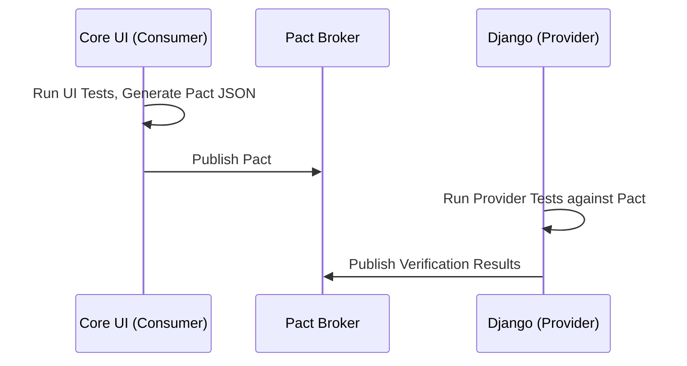

# 1. Executive Overview
This document defines the comprehensive Quality Engineering and Testing Strategy for the Institutional Risk Engine (IRE). It provides a deterministic framework for validating a non-deterministic AI architecture by employing the "Shift Left, Shift Right" paradigm, ensuring that code deployed to the Django Modular Monolith meets stringent Tier-1 banking regulations.

# 2. Testing Philosophy & 3. Quality Engineering Principles
*   **Quality is Built, Not Inspected:** QA engineers do not "find bugs"; developers prevent them through TDD and CI gates.
*   **Determinism over Flakiness:** Flaky tests are deleted or quarantined immediately. A flaky build is a broken build.
*   **Test the Behavior, Not the Implementation:** Repositories are mocked at the application boundary; Domain entities are tested in pure isolation without Django ORM dependencies.
*   **AI requires Golden Datasets:** You cannot unit test an LLM. We test AI via Prompt Regression against human-validated datasets.

# 4. Test Pyramid & 5. Testing Lifecycle
We enforce a strict 70/20/10 pyramid:
*   **70% Unit Tests:** Fast, isolated, zero I/O (`pytest`).
*   **20% Integration/Contract Tests:** DB I/O, Redis, API Boundaries, Pact.
*   **10% E2E / Chaos / Performance:** Full environment execution, Playwright, Locust.

# 6. Shift Left Strategy & 7. Shift Right Strategy
*   **Shift Left:** SAST, Secret Scanning, and Pytest coverage block PR merges. Developer desktops run `pre-commit` hooks.
*   **Shift Right:** OpenTelemetry tracing, Chaos Mesh fault injection, and Canary deployments validate quality in Production.

# 8. Static Analysis & 9. Code Quality Gates
*   **Linters:** `ruff` (formatting/linting), `mypy` (strict type checking).
*   **Quality Gates (SonarQube):**
    *   Minimum 85% Line Coverage.
    *   Minimum 90% Branch Coverage.
    *   0 Critical/High Security Vulnerabilities.
    *   0 Code Smells > 30 minutes technical debt.

# 10. Unit Testing Strategy & 11. Domain Layer Testing
Domain entities are pure Python `dataclasses` or standard classes. They are tested without Django, ensuring sub-millisecond execution.
```python
# test_loan_application.py
def test_loan_application_rejects_negative_amount():
    with pytest.raises(DomainValidationError):
        LoanApplication(amount=-500)
```

# 12. Repository Testing & 13. Application Service Testing
Repositories are tested against an ephemeral PostgreSQL instance. Application Services are tested by passing in an `InMemoryRepository` (Fake) to ensure fast, predictable execution.

# 14. API Testing & 15. Serializer Testing
We use Django REST Framework's `APIClient`.
```python
@pytest.mark.django_db
def test_api_returns_correlation_id(api_client):
    response = api_client.post('/api/v1/loans/', data={"amount": 1000})
    assert response.status_code == 202
    assert 'X-Correlation-ID' in response.headers
```

# 16. Authentication Testing & 17. Authorization Testing
Tested via Pytest fixtures that yield specific JWT tokens representing different RBAC roles (e.g., `borrower_token`, `admin_token`) and asserting `403 Forbidden` for unauthorized roles.

# 18. Integration Testing & 19. Contract Testing
Integration tests span the boundary from the Django view through the real Repository to the database. Contract tests ensure services agree on API definitions.

# 20. Consumer Driven Contract Testing (Pact)
We utilize Pact to ensure the Core UI (Consumer) expectations match the Django API (Provider) output without spinning up both services.


# 21. Database Testing & 22. Migration Testing
*   **Database Testing:** Managed via `pytest-django` using `transactional_db` fixtures.
*   **Migration Testing:** A CI pipeline step runs `python manage.py makemigrations --check` to ensure no missing migrations, followed by migrating a staging DB clone forward and backward to detect irreversible data loss.

# 23. Event Testing & 24. Transactional Outbox Testing
We assert that Domain Events are properly formatted and inserted into the `outbox_events` table before the transaction commits.
```python
def test_loan_submitted_publishes_event(outbox_repository):
    service.submit_loan(dto)
    events = outbox_repository.get_pending()
    assert len(events) == 1
    assert events[0].event_type == "LoanSubmitted"
```

# 25. Celery Worker Testing & 26. Async Workflow Testing
Celery tasks are tested synchronously by setting `CELERY_TASK_ALWAYS_EAGER = True` in test configurations, ensuring full coverage without Redis overhead.

# 27. AI Gateway Testing & 28. Prompt Testing
Direct calls to Groq/OpenAI are mocked using `responses` or `vcrpy`. Prompts are tested against deterministic rule sets (e.g., "Must contain JSON keys X, Y, Z").

# 29. Prompt Regression Testing & 30. AI Evaluation Framework
We employ a "Golden Dataset" of 1,000 historical loan transcripts. A specialized pipeline runs the AI Swarm over these transcripts and compares the Output Score against the Golden Score using ROUGE and cosine similarity.

# 31. Hallucination Detection & 32. Golden Dataset Testing
*   **SelfCheckGPT:** The AI Gateway samples multiple temperatures to detect contradictions.
*   **Golden Datasets:** Read-only test fixtures persisted in S3. CI pipelines trigger a 10% sampling regression test on PRs modifying Prompts.

# 33. ML Model Validation & 34. SHAP Validation
LightGBM deterministic models are validated via standard holdout sets (80/20 split) testing ROC-AUC. SHAP arrays are validated to ensure absolute sums match the model's base expected value.

# 35. Fairness Testing & 36. Bias Detection
Tested via Disparate Impact Ratio (DIR). If the DIR for a protected class drops below 0.8, the CI pipeline fails, preventing the deployment of biased prompt chains or ML artifacts.

# 37. Explainability Validation & 38. OCR Testing
OCR pipelines are tested against a fixture library of 500 degraded, skewed, and low-DPI PDFs to assert bounding-box accuracy > 95%.

# 39. Document Pipeline & 40. RAG Testing
RAG retrieval is tested using `HitRate@K` and `MRR@K`. The pipeline must retrieve the exact CFBP regulation chunk in the top 3 results for 99% of test queries.

# 41. Vector Database Testing
Tested using ephemeral `pgvector` instances spinning up in Docker via `pytest-docker`.

---

# 42. Performance Testing Stack
Performance testing utilizes **Locust** in a distributed Kubernetes deployment.

# 43. Load Testing & 44. Stress Testing
*   **Load Testing:** Simulates normal peak traffic (200 RPS) for 1 hour. Validates P95 < 250ms.
*   **Stress Testing:** Simulates 500% peak traffic (1000 RPS) to find the breaking point and ensure graceful degradation (circuit breakers trip, 429s returned).

# 45. Spike Testing & 46. Soak Testing
*   **Spike Testing:** Instantaneous jumps from 10 RPS to 500 RPS in 10 seconds.
*   **Soak Testing:** 50 RPS sustained over 24 hours to detect memory leaks in Gunicorn or Celery workers.

# 47. Capacity Validation & 48. Scalability Testing
Validates that HPA (Horizontal Pod Autoscaler) scales Django pods linearly when CPU exceeds 70%, and that Karpenter provisions new EC2 nodes in under 60 seconds.

---

# 49. Chaos Engineering & 50. Fault Injection
Executed using **Chaos Mesh** in the Staging environment.
```yaml
# chaos-network-delay.yaml
apiVersion: chaos-mesh.org/v1alpha1
kind: NetworkChaos
metadata:
  name: redis-delay
spec:
  action: delay
  mode: all
  selector:
    namespaces: ['ire-system']
    labelSelectors: {'app': 'redis'}
  delay:
    latency: '500ms'
    correlation: '100'
```

# 51. Disaster Recovery Testing
Monthly "Game Days" simulate the loss of US-East-1, validating that Route53 failover to US-West-2 completes within the 4-hour RTO.

---

# 52. Security Testing Stack

# 53. SAST & 54. DAST
*   **SAST:** Bandit (Python AST scanning), Semgrep (custom rules blocking raw SQL).
*   **DAST:** OWASP ZAP runs against the staging API to detect XSS/SQLi at runtime.

# 55. Dependency Scanning & 56. Container Scanning
*   **Dependabot:** Alerts on CVEs in `requirements.txt`.
*   **Trivy:** Blocks ECR pushes if Docker images contain High/Critical CVEs.

# 57. IaC Testing & 58. Kubernetes Testing
*   **Checkov:** Scans Terraform files for unencrypted S3 buckets or open security groups.
*   **KubeLinter:** Ensures all Helm deployments specify Resource Requests and Limits.

# 59. Infrastructure Testing & 60. API Fuzz Testing
`Schemathesis` automatically parses the OpenAPI spec and bombards the API with randomized fuzz data to uncover unexpected 500 errors.

# 61. Penetration Testing & 62. Compliance Testing
External White-box Penetration Testing occurs quarterly. Automated compliance checks map Vault access logs to SOC2 requirements.

---

# 63. Observability Validation (64 - 68)
*   **Trace Validation:** A CI suite specifically sends an API request and asserts the Jaeger/Tempo API returns a full Span tree containing the exact `X-Correlation-ID`.
*   **Metrics Validation:** PromQL queries run in testing to ensure custom metrics (e.g., `ai_gateway_failures_total`) increment correctly upon simulated errors.

---

# 69. Reliability & Resilience Testing (70 - 74)
*   **Retry & Circuit Breaker Testing:** We mock external API endpoints (AWS Textract) to return `503 Service Unavailable` 4 times, validating that the Celery task retries 3 times with exponential backoff and finally routes the message to the DLQ.
*   **Idempotency Testing:** Pytest suite sends identical POST payloads with the same Idempotency Key concurrently to assert only one 202 is returned and one aggregate created.

# 75. Concurrency & 76. Race Condition Testing
Using `pytest-xdist`, we simulate highly concurrent writes to the same Aggregate ID to validate that the Optimistic Lock throws exactly `N-1` `AggregateConflictExceptions`.

# 77. Optimistic Lock Testing & 78. Multi-Tenant Isolation Testing
Multi-tenant isolation is tested by attempting to read a Tenant B Aggregate using a Tenant A JWT. The test MUST assert a `404 Not Found` (not 403, to prevent existence leakage).

# 79. Cache, 80. Redis, & 81. PostgreSQL Failover Testing
We test cache stampede protection by expiring a hot key and simulating 1,000 concurrent requests, validating that only 1 request queries PostgreSQL while 999 wait on the distributed lock.

# 82. AI Provider Failover Testing
Simulates an OpenAI 429 Rate Limit error, validating that the Model Router successfully downgrades the request to Anthropic Claude seamlessly.

---

# 83. Deployment Quality Gates (84 - 88)
*   **Feature Flag Testing:** LaunchDarkly configurations are mocked in Pytest to test both paths (Flag ON / Flag OFF).
*   **Canary/Blue-Green Validation:** Argo Rollouts are validated by simulating a 5% error rate on the Canary pods, ensuring the deployment auto-aborts and rolls back to Blue.

# 89. Test Data Management & 90. Synthetic Data Strategy
Production data is NEVER pulled into lower environments. Synthetic data generation scripts (`Faker`, `factory_boy`) create millions of rows of pseudo-realistic PII for load testing.

# 91. Test Environment Strategy (92 - 95)
*   **Ephemeral Environments:** Every PR spins up a dedicated Kubernetes namespace (`ire-pr-123`) containing a slimmed-down Postgres and Redis, allowing QA to manually test the branch. The namespace is destroyed upon merge.

# 96. Smoke Testing & 97. Health Checks
Deployed code is immediately hit by a Smoke Test suite that simply asserts `/health/liveness` and `/health/readiness` (checking DB and Redis connectivity) return HTTP 200.

# 98. Regression, 99. E2E, & 100. UAT
*   **E2E:** Playwright drives a headless browser through the React frontend, submitting a loan and verifying the generated PDF report.
*   **UAT:** Business stakeholders approve releases in the UAT environment prior to the final ArgoCD prod sync.

---

# 101. Manual Testing Strategy (102 - 105)
*   Exploratory testing is permitted for UI/UX edge cases. Accessibility (WCAG 2.1) and Cross-Browser compatibility are handled by browserstack.

# 106. API Compatibility Matrix & 107. Version Compatibility Testing
Tested using `openapi-diff`. If a PR removes a field from a V1 serializer without introducing a V2 route, the pipeline fails.

---

# 108. Non-Functional Requirement Traceability
| NFR | Validation Method | Tooling | Threshold |
| :--- | :--- | :--- | :--- |
| **Performance** | Load Testing | Locust | P95 < 250ms |
| **Availability** | Chaos Mesh | K8s Chaos | Zero dropped HTTP 200s |
| **Security** | DAST / SAST | ZAP, Trivy | 0 High CVEs |
| **Data Integrity**| Concurrent Mutates | Pytest | 100% Conflict Catch |

---

# 109. Testing Architecture Decision Records (30 ADRs)
| ID | Decision | Rejected Alternative | Rationale |
| :--- | :--- | :--- | :--- |
| `TST-01` | Test DB is Ephemeral Postgres | SQLite In-Memory | SQLite does not support JSONB or Skip Locked. |
| `TST-02` | `pytest-django` for DB Mgmt | Django `TestCase` | Pytest fixtures provide superior modularity. |
| `TST-03` | Mock External APIs (Responses) | Live API Calls | Live calls cause flaky tests and cost money. |
| `TST-04` | Pact for Contract Testing | E2E UI Tests Only | E2E is too slow and brittle for API contracts. |
| `TST-05` | Factory Boy for Fixtures | JSON Fixture files | JSON fixtures are brittle when schema changes. |
| `TST-06` | Isolate Domain Logic from DB | Integrated Domain Tests | Core rules must execute in microseconds. |
| `TST-07` | Golden Dataset AI Regression | Unit Testing Prompts | LLMs are non-deterministic; statistical testing is required. |
| `TST-08` | Fuzz Testing via Schemathesis | Manual Fuzzing | Automated OpenAPI parsing finds deeper edge cases. |
| `TST-09` | Chaos Mesh in Staging | Chaos Monkey | Native K8s integration allows finer network fault control. |
| `TST-10` | SonarQube Quality Gates | Local only | Enforces enterprise-wide minimum coverage (85%). |
| `TST-11` | Ephemeral Namespaces per PR | Shared Staging Server | Prevents QA bottlenecks on shared environments. |
| `TST-12` | Shift-Left Security (Trivy/Bandit)| Shift-Right (SecOps Audit) | Catch CVEs before they merge to Main. |
| `TST-13` | API Client vs Request Factory | Request Factory | APIClient tests routing and middleware accurately. |
| `TST-14` | Synchronous Celery testing | Async broker testing | `CELERY_ALWAYS_EAGER` speeds up unit test suites 100x. |
| `TST-15` | Playwright for E2E | Selenium | Playwright handles async/await network events better. |
| `TST-16` | No Prod Data in Dev | Masked Prod Data | Prevents PII leakage entirely via Synthetic generation. |
| `TST-17` | Mutation Testing (mutmut) | Coverage only | Ensures tests actually assert logic, not just execute lines. |
| `TST-18` | strict `mypy` enforcement | Dynamic typing | Prevents `NoneType` attribute errors at runtime. |
| `TST-19` | Locust for Load Testing | JMeter | Python-based scenarios are easier for devs to maintain. |
| `TST-20` | Fail on Flaky Tests | Rerun Flaky Tests | Rerunning hides race conditions. |
| `TST-21` | Test Idempotency with threads | Sequential posts | Only threaded concurrency proves lock safety. |
| `TST-22` | Checkov for Terraform | Manual Code Review | Automated IaC security validation. |
| `TST-23` | KubeLinter for Helm | Manual | Enforces resource limits on all pods. |
| `TST-24` | Tracing validation in CI | Manual | Ensures OTel collector integration isn't broken. |
| `TST-25` | Mocking LaunchDarkly | Live LD connection | Prevents network timeouts in CI. |
| `TST-26` | OIDC for AWS Auth in Tests | IAM Access Keys | Prevents leaked long-lived credentials. |
| `TST-27` | Soft Delete assertion | Hard delete | Ensure auditing standards are maintained. |
| `TST-28` | Multi-Tenant Data Leak tests | Trusting ORM | Explicitly tests that Tenant A cannot read Tenant B. |
| `TST-29` | Strict OpenAPI Diffing | Loose | Prevents accidental breaking changes to B2B clients. |
| `TST-30` | 100% Deterministic Unit Tests | Sleep() commands | Time must be mocked (e.g., `freezegun`) to prevent flakiness. |

---

# 110. Testing Anti-Patterns
*   **The Ice Cream Cone:** Lots of E2E UI tests, very few Unit tests (Slow, Brittle).
*   **Testing Implementation:** Asserting that `repository._db_session.execute()` was called, instead of asserting the Aggregate state changed.
*   **Sleep() in Tests:** Using `time.sleep(5)` to wait for an async event instead of polling or mocking time.

# 111. Architecture Fitness Functions
Using `import-linter`:
```ini
[importlinter:contract:1]
name = Domain layer is independent
type = independence
modules =
    ire.domain
    django
    celery
```

# 112. Quality Scorecards & 113. Validation Checklist
- [ ] 85% Line Coverage met.
- [ ] 0 High/Critical CVEs (Trivy, Bandit).
- [ ] OpenAPI Diff shows 0 Breaking Changes.
- [ ] Flaky test detection reports 0 quarantined tests.
- [ ] Pact Broker shows green for UI and API.

# 114. Readiness Checklist
- [ ] Staging Load Test successful (P95 < 250ms).
- [ ] Staging Chaos Test successful (App recovers from Redis death).
- [ ] Golden AI Dataset Regression Score > 0.92 ROUGE.
- [ ] UAT Signed off by Product Owner.

# 115. Future Evolution Roadmap
*   Implement continuous profiling (e.g., Pyroscope) in staging tests to catch memory regressions automatically.
*   Develop an automated LLM "Red Teaming" suite to attempt prompt injections during CI/CD.

---
*Approval: Staff QA Architect, Principal Architect, CISO*
