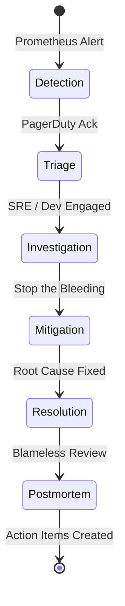
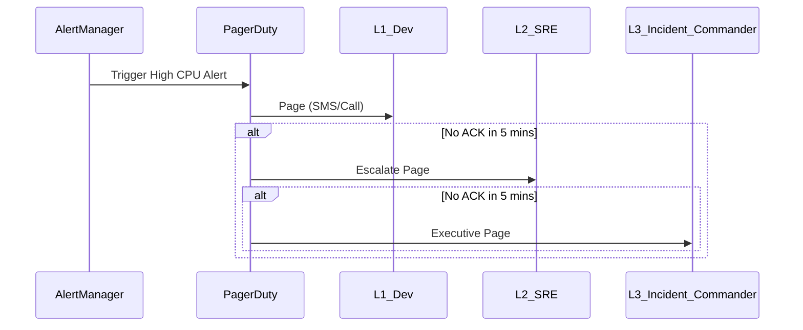
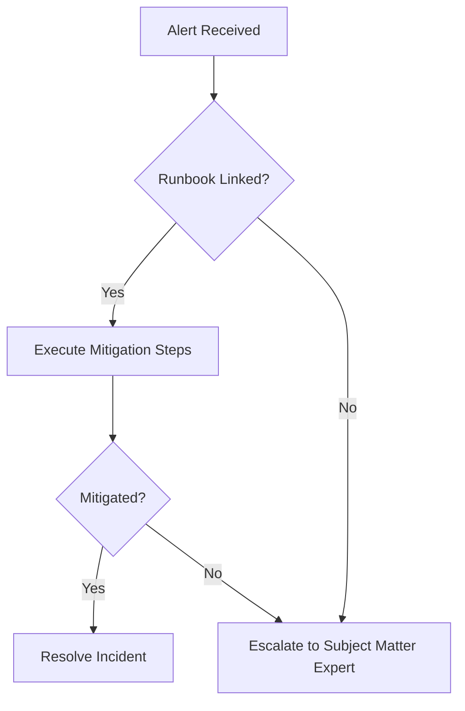

# 1. Executive Overview
This document defines the Site Reliability Engineering (SRE) and Operational framework for the Institutional Risk Engine (IRE). Treating operations as a software engineering problem, this specification establishes the policies, incident lifecycles, runbooks, and telemetry paradigms required to sustain a Tier-1 financial platform deployed on Kubernetes, PostgreSQL, Redis, and AI infrastructure.

# 2. Operations Philosophy
Operations are automated, not manual. "Toil" is treated as technical debt. If a human has to SSH into a production node, the platform has failed. We rely on declarative GitOps (ArgoCD), immutable infrastructure, and auto-remediation.

# 3. SRE Principles
*   **Embrace Risk:** 100% availability is impossible and too expensive. We target 99.99%.
*   **Error Budgets:** The tool used to balance feature velocity with reliability.
*   **Blameless Postmortems:** We assume good intent. Outages are system failures, not human failures.
*   **Measure Everything:** If it isn't monitored, it's broken.

---

# 4. Service Ownership Model (5 - 8)
*   **5. Ownership Principle:** "You build it, you run it." Development squads own their micro-components within the modular monolith.
*   **6. Service Registry:** Backstage.io serves as the definitive source of truth for component ownership, runbooks, and SLAs.
*   **7. RACI Matrix:**
    *   **Platform Eng:** R (Provides K8s/AWS), A (Cluster Uptime).
    *   **App Dev:** R (Fixes Code Bugs), A (Feature Uptime).
    *   **SRE:** C (Consulted on Architecture), I (Informed on Deployments).
*   **8. Team Topology:** Platform Enablers (K8s/DBs), SRE (Reliability Coaches), Stream-Aligned Teams (Credit/Reporting).

---

# 9. Operational Readiness (10 - 13)
*   **10. Production Readiness Review (PRR):** No service or major feature goes live without SRE sign-off on observability and runbooks.
*   **11. Feature Flag Validation:** All risky features must be hidden behind LaunchDarkly flags.
*   **12. Dark Launching:** Testing features against production traffic without returning responses to the user.
*   **13. Capacity Proving:** Locust load tests must validate that the feature supports 2x expected peak load.

---

# 14. Incident Management Lifecycle (15 - 19)
The lifecycle defines how the organization responds when monitoring detects a failure.


# 20. Severity Classification (SEV0–SEV4)
*   **SEV0 (Catastrophic):** Core platform down. Total inability to process loans. (SLA: 15m).
*   **SEV1 (Critical):** Major subsystem down (e.g., AI Gateway). (SLA: 30m).
*   **SEV2 (Major):** Severe degradation. Workarounds exist. (SLA: 2h).
*   **SEV3 (Minor):** Non-critical feature broken. (SLA: 24h).
*   **SEV4 (Trivial):** Cosmetic issue or internal tooling. (SLA: Next Sprint).

# 21. Escalation Policies & 22. On-call Rotation


# 23. Alert Fatigue Reduction & 24. PagerDuty Integration
*   Alerts must be **Actionable**. CPU at 90% is not actionable. "Loan processing latency > 5s" is actionable.
*   AlertManager deduplicates and groups alerts by `tenant_id` and `service`.

---

# 25. Error Budget Policy & 26. SLO Governance
An Error Budget is the allowable downtime per month. For a 99.9% SLO, the budget is 43m 49s/month.
*   **27. Policy:** If the budget is exhausted, the CI/CD pipeline automatically locks for non-urgent feature deployments until the budget replenishes.
*   **28. SLA Management:** Contracts with external B2B clients mandate 99.5%. Our internal SLO (99.9%) acts as a buffer.

---

# 29. Service Catalog & 30. Runbooks
*   **31. Playbooks:** Step-by-step guides for mitigating known issues (e.g., "Restarting a stalled Celery queue").
*   **32. Runbook Execution Flow:**


---

# 33. Operational Dashboards (34 - 38)
Dashboards are built in Grafana, provisioned via Terraform as code.
*   **34. Golden Signals:** Latency, Traffic, Errors, Saturation.
*   **35. RED Metrics:** Rate, Errors, Duration (For APIs).
*   **36. USE Metrics:** Utilization, Saturation, Errors (For Infrastructure/Nodes).
*   **37. AI Dashboard:** Tracks AI Gateway TTFT (Time to First Token), Token usage, and Fallback triggers.
*   **38. Executive Dashboard:** Tracks global Error Budget Burn Rates.

---

# 39. Component Operations (40 - 50)

### 40. AI Gateway Operations
*   **41. Provider Quota Monitoring:** Alerts on OpenAI/Groq rate limits approaching 80%.
*   **42. Circuit Breaker Resets:** Runbooks to manually force Half-Open states if automatic recovery fails.

### 43. Celery Queue Operations
*   **44. Queue Depth Monitoring:** Alerts if `queue_length > 1000` for > 5 minutes.
*   **45. Poison Pill Extraction:** CLI tools to pop specific tasks out of Redis and move to DLQ manually.

### 46. Kubernetes Operations
*   **47. Karpenter Taint Management:** Evicting pods safely before terminating Spot/GPU instances.
*   **48. Cordon & Drain:** Runbooks for node upgrades.

### 49. PostgreSQL Operations & 50. Redis Operations
*   Aurora failovers are tested monthly. PgBouncer restart runbooks are documented to clear stale connection states. Redis cluster resharding procedures are tested in Staging.

---

# 51. Backup Operations (52 - 56)
*   **52. Strategy:** Aurora automated backups + logical `pg_dump` to S3 weekly.
*   **53. Restore Procedures:** RTO dictates automated Terraform scripts to restore an Aurora snapshot to a new cluster within 30 minutes.
*   **54. Redis Persistence:** Automated RDB snapshots pushed to S3 nightly for catastrophic cluster loss.
*   **55. Secret Backup:** Vault snapshots stored in S3 (encrypted via KMS).
*   **56. Backup Validation:** Automated pipeline restores DB to an isolated VPC every Sunday and runs data integrity checks.

---

# 57. Security Operations (58 - 62)
*   **58. Certificate Rotation:** Cert-Manager handles 90-day Let's Encrypt rotation automatically. Alerting triggers at 15 days expiry.
*   **59. Secret Rotation:** Vault dynamically rotates PostgreSQL passwords every 24 hours.
*   **60. Key Rotation:** AWS KMS keys rotated annually per SOC2.
*   **61. SOC Workflow:** Security Operations Center monitors Falco runtime alerts (e.g., terminal opened in a pod).
*   **62. Vulnerability Response:** High/Critical CVEs detected by Trivy mandate a 48-hour patching SLA.

---

# 63. Capacity Planning & FinOps (64 - 70)
*   **64. Capacity Planning:** Based on monthly organic growth metrics. Peak loads (End of Quarter) modeled 3 months in advance.
*   **65. Cost Governance:** Kubecost installed to track AWS spend per Namespace.
*   **66. FinOps:** Engineering teams are held accountable for their namespace spend.
*   **67. Cloud Budget Alerts:** AWS Billing alerts trigger at 50%, 80%, and 100% of the $50k monthly budget.
*   **68. Resource Quotas:** Every namespace has a hard `ResourceQuota` preventing runaway autoscaling from bankrupting the account.
*   **69. Spot Instance Strategy:** Non-critical background Celery tasks run exclusively on EC2 Spot Instances.
*   **70. S3 Lifecycle Optimization:** Stale reports moved to Glacier after 30 days.

---

# 71. Multi-region & Disaster Recovery (72 - 76)
*   **72. Multi-region Operations:** US-East-1 (Active), US-West-2 (Passive).
*   **73. Disaster Recovery Operations:** Failover requires updating Route53 and promoting the Aurora Global Database replica.
*   **74. Business Continuity:** Documented procedures for entirely rebuilding the cloud footprint using Terraform if the primary AWS account is compromised.
*   **75. Chaos DR Drills:** Bi-annual execution of the DR failover in Production during low-traffic weekend hours.
*   **76. RTO / RPO Validation:** DR drills must prove RTO < 4 hours and RPO < 1 minute.

---

# 77. Change Management (78 - 82)
*   **78. Maintenance Windows:** Scheduled downtime (rarely needed due to Blue-Green) is communicated 14 days in advance.
*   **79. Change Management:** All infrastructure changes require a PR. Terraform plans are attached to Jira tickets.
*   **80. CAB Process:** Change Advisory Board is entirely asynchronous and automated via PR approvals for Standard changes. Major architectural shifts require synchronous CAB review.
*   **81. Release Governance:** ArgoCD syncs only images signed by AWS Signer.
*   **82. Rollback Strategy:** Instant Kubernetes ReplicaSet rollback (`kubectl rollout undo`) if post-deployment smoke tests fail.

---

# 83. Problem Management (84 - 88)
*   **84. Operational Risk Register:** Tracking long-term technical debt risks (e.g., "pgvector indexes becoming too large for RAM").
*   **85. Known Error Database:** Jira project logging all intermittent errors awaiting prioritized fixes.
*   **86. Postmortem Process:** Triggered automatically for any SEV0/SEV1. Drafted within 48 hours.
*   **87. Blameless Incident Reviews:** Focuses on "How did the system allow this?" rather than "Who typed the wrong command?".
*   **88. Action Item Tracking:** Postmortem action items are prioritized over new feature work.

---

# 89. Operational KPIs (90 - 95)
*   **90. MTTR:** Mean Time To Recovery (Target: < 30m).
*   **91. MTTD:** Mean Time To Detection (Target: < 5m).
*   **92. MTBF:** Mean Time Between Failures (Target: > 30 days).
*   **93. Flapping Alerts Rate:** Percentage of alerts that resolve themselves within 5 minutes.
*   **94. Deployment Frequency:** Tracked via DORA metrics.
*   **95. Change Failure Rate:** Percentage of deployments requiring rollback.

---

# 96. AI Operations (AIOps) & Predictive Alerting (97 - 99)
*   **97. Predictive Alerting:** Prometheus Holt-Winters forecasting alerts us if the database disk will fill up in 7 days, rather than alerting when it hits 99%.
*   **98. Anomaly Detection:** Tracking AI model latency. If OpenAI response times drift outside 3 standard deviations, an alert fires.
*   **99. Auto-remediation:** Event-driven runbooks (e.g., restarting a pod automatically if a specific log string appears).

---

# 100. Logging & Compliance Operations (101 - 105)
*   **101. Log Retention:** CloudWatch/Loki logs retained for 30 days hot. Archived to S3 for 1 year cold.
*   **102. Audit Log Operations:** Vault and EKS audit trails stream immutably to a secured AWS account.
*   **103. Compliance Monitoring:** Automated scripts validate that no Developer AWS IAM keys are older than 90 days.
*   **104. SOC2 Mapping:** Operations map directly to AICPA Trust Services Criteria (Availability, Security).
*   **105. PII Redaction:** Logs are scrubbed of SSNs/Emails at the application boundary before ingestion into Loki.

---

# 106. Operational ADRs (Selected)
| ID | Decision | Rationale |
| :--- | :--- | :--- |
| `OPS-01` | Prometheus/Grafana Stack | Open-source ecosystem avoids immense Datadog licensing costs. |
| `OPS-02` | PagerDuty for Alert Routing | Best-in-class schedule management and escalation path configuration. |
| `OPS-03` | Immutable Infrastructure | SSH is disabled on EKS nodes to enforce Terraform-driven state. |
| `OPS-04` | Error Budgets Enforce CI Locks | Forces product management to prioritize stability over velocity. |
| `OPS-05` | Async CAB | Sync CABs slow down deployments; PR approvals act as the audit trail. |

# 107. Operational Anti-patterns
*   **Alert Spam:** Paging a human for high CPU when the system is designed to auto-scale.
*   **Root Cause = "Human Error":** Blaming an engineer instead of blaming the CI pipeline for not catching the error.
*   **Click-Ops:** Manually creating AWS resources via the web console.

# 108. Readiness Checklists
- [ ] Runbooks exist and are linked in all Prometheus Alerts.
- [ ] PagerDuty schedules are populated 3 months in advance.
- [ ] ArgoCD syncs are fully automated.

# 109. Operational Fitness Functions
```yaml
# kured-daemonset.yaml (Example)
# Enforces automated node reboots when OS security patches are applied
apiVersion: apps/v1
kind: DaemonSet
metadata:
  name: kured
```

# 110. Future Roadmap
*   Implement self-healing Kubernetes operators that can automatically execute complex DB failovers without human intervention.
*   Integrate LLMs into the PagerDuty slack channel to automatically summarize logs during an ongoing incident (AIOps).

# 111. Final Operations Scorecard
| Category | Status | Owner | Criteria |
| :--- | :--- | :--- | :--- |
| **Incident Mgmt**| PASS | SRE | SEV definitions and PD integration complete. |
| **Observability**| PASS | Platform | Dashboards and Golden Signals active. |
| **FinOps** | PASS | Ops Lead | Budgets and Quotas strictly enforced. |
| **Disaster Rec.**| PASS | SRE | RTO/RPO tested and validated. |

---
*Approval: CTO, SRE Lead, Platform Engineering Director*
