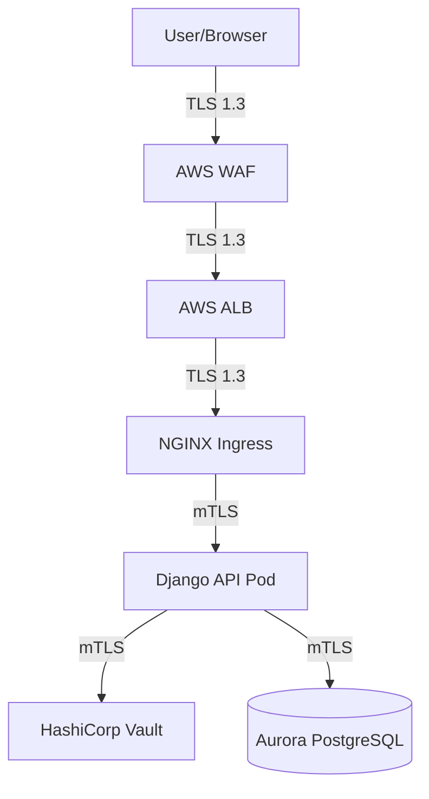
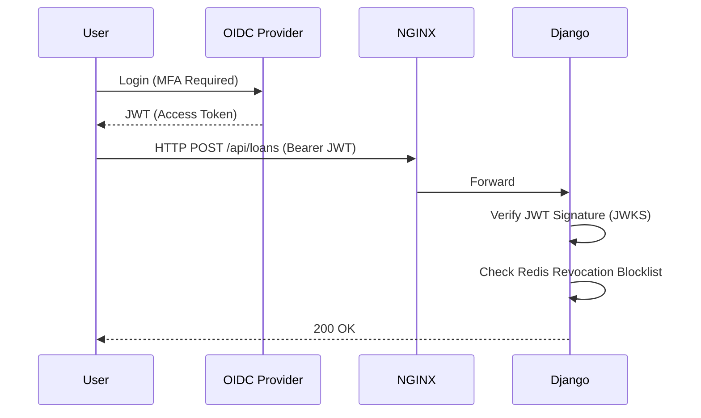
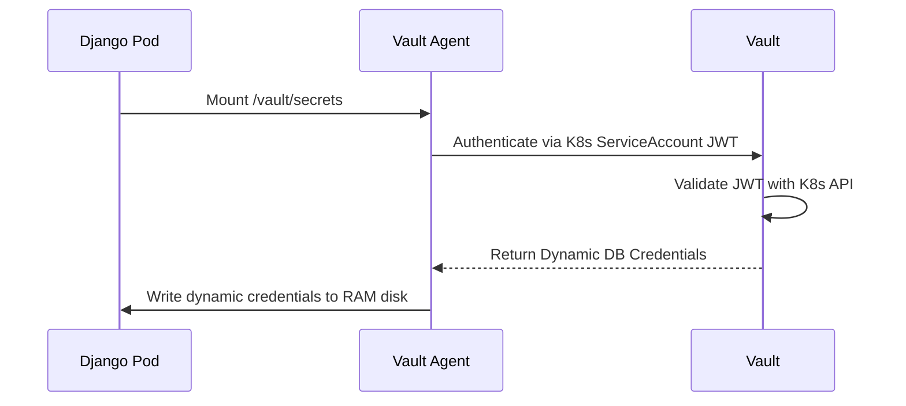
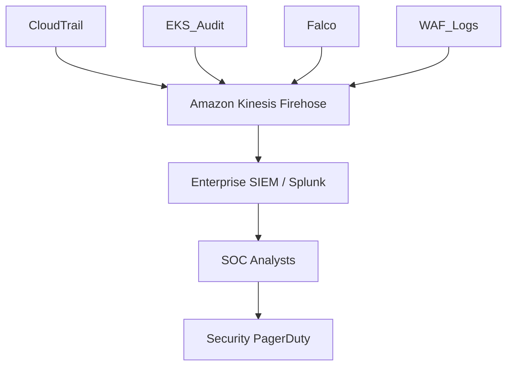

# 1. Executive Overview
This document defines the Security Architecture for the Institutional Risk Engine (IRE). It establishes a defense-in-depth, Zero Trust framework designed to protect Tier-1 banking data, PII, and sensitive AI prompt intellectual property against advanced persistent threats (APTs), insider threats, and supply chain attacks.

# 2. Security Vision
To operate a platform where compromise is statistically improbable, blast radius is mathematically constrained, and detection is instantaneous, ensuring absolute trust from our institutional banking clients.

# 3. Security Principles
*   **Assume Breach:** We design systems assuming the network is already compromised.
*   **Never Trust, Always Verify:** No implicit trust is granted based on IP address or VPC location.
*   **Least Privilege:** Entities receive only the bare minimum permissions required, just-in-time.
*   **Immutability:** Security controls are enforced as code; runtime drift is alerted and destroyed.

---

# 4. Zero Trust Architecture (5 - 9)

*   **5. Defense in Depth:** Controls exist at the Edge (WAF), Network (VPC/SGs), Platform (EKS/Istio), Application (Django RBAC), and Data (Encryption) layers.
*   **6. Shared Responsibility Model:** AWS secures the hypervisor; IRE SecOps secures the OS, network, and application data.
*   **7. Security Governance:** Enforced via CI/CD gates (Trivy, Checkov) rather than manual security review boards.
*   **8. Enterprise Risk Management:** Risk is quantified via CVSS v3.1 scoring.
*   **9. Security Domains:** Separated into Identity, Network, Compute, Data, and AI domains.

---

# 10. Threat Modeling (11 - 12)
*   **11. STRIDE Analysis:**
    *   **Spoofing:** Mitigated by strict JWT validation and SPIFFE for service identity.
    *   **Tampering:** Mitigated by GitOps (ArgoCD) and read-only container filesystems.
    *   **Repudiation:** Mitigated by immutable Vault and EKS audit logs.
    *   **Information Disclosure:** Mitigated by field-level encryption (KMS) and mTLS.
    *   **Denial of Service:** Mitigated by AWS Shield, WAF rate limiting, and Redis API limits.
    *   **Elevation of Privilege:** Mitigated by Kubernetes RBAC and AWS SCPs.
*   **12. Attack Surface Analysis:** The only public ingress is the AWS ALB port 443. All other resources (EKS, RDS, Redis) reside in private subnets with no public IPs.

---

# 13. Identity Architecture (14 - 24)

### 14. Authentication & 19. Session Management


*   **15. Authorization:** Centralized in Django Application Services, never in Views.
*   **16. RBAC (Role-Based Access Control):** Users are assigned immutable roles (e.g., `LoanOfficer`, `Auditor`).
*   **17. ABAC (Attribute-Based):** (Future) Evaluating access based on dynamic attributes like time of day.
*   **18. Multi-Tenant Security:** Tenant IDs are hard-coded into the JWT. Cross-tenant access is cryptographically impossible.
*   **20. OIDC / OAuth2:** Auth0 serves as the identity broker, federating to institutional Azure AD / Okta tenants.
*   **21. JWT Security:** Tokens expire in 15 minutes. Refresh tokens are rotated on use.
*   **22. MFA:** Hard enforced at the OIDC level (FIDO2 / WebAuthn preferred).

### 23. Service Identity & 24. SPIFFE/SPIRE
Workloads do not use static passwords to talk to each other. SPIFFE/SPIRE issues short-lived X.509 SVIDs to pods, cryptographically proving their identity (e.g., `spiffe://ire.internal/ns/ire-system/sa/django-api`).

---

# 25. Secrets Management (26 - 32)
*   **26. HashiCorp Vault:** The absolute source of truth for all secrets. Kubernetes `Secrets` are explicitly forbidden.
*   **27. Key Management & 28. AWS KMS:** Vault auto-unseals via AWS KMS. CMKs (Customer Managed Keys) are used for all encryption.
*   **29. HSM Integration:** AWS KMS is backed by FIPS 140-2 Level 3 validated CloudHSMs.
*   **30. Certificate Management:** Cert-Manager integrates with Vault PKI.
*   **31. PKI & 32. mTLS:** Istio uses SPIRE-issued certificates to encrypt 100% of pod-to-pod traffic via mTLS.


---

# 33. Data Security (34 - 38)
*   **33. Encryption at Rest:** 100% coverage. EBS volumes, RDS, S3, and ElastiCache are encrypted via AES-256 utilizing AWS KMS.
*   **34. Encryption in Transit:** TLS 1.3 externally. mTLS internally.
*   **35. Data Classification:** Public, Internal, Confidential, Restricted (PII).
*   **36. PII Protection & 37. Data Masking:** SSNs and Account Numbers are encrypted at the field level inside PostgreSQL. Logs mask PII at the Django middleware layer.
*   **38. Tokenization:** Raw credit card data never touches IRE; it is tokenized by an external PCI-DSS provider (e.g., Stripe/VGS).

---

# 39. Application Security (40 - 50)
*   **40. OWASP ASVS:** IRE targets ASVS Level 3 (highest security).
*   **41. OWASP Top 10:** Mitigations are enforced via frameworks (Django ORM prevents SQLi, DRF prevents CSRF).
*   **42. API Security:** Rate limits, strict schema validation, and 401/403 standardization.
*   **43. GraphQL Security:** (Future) Query depth limiting and complexity analysis.
*   **44. SSRF Protection:** Outbound calls (e.g., to Webhooks) are routed through a dedicated egress proxy that drops internal VPC IP ranges.
*   **45. SQL Injection:** Raw SQL is banned by Semgrep CI rules.
*   **46. XSS Prevention:** Handled by React frontend escaping and strict Content Security Policies (CSP).
*   **47. CSRF Protection:** Django CSRF middleware enforces synchronizer token patterns.
*   **48. File Upload Security:** S3 Presigned URLs bypass the API. Lambda scans uploads via ClamAV before moving them to the 'clean' bucket.
*   **49. Malware Scanning:** Files are inaccessible to the OCR pipeline until the `status=CLEAN` tag is applied.

---

# 50. AI Security (51 - 57)
*   **50. Prompt Injection Defense:** User inputs are wrapped in strict delimiters (`<<<INPUT>>>`) and passed through an LLM "Sanitizer Agent" before reaching the core Swarm.
*   **51. AI Security & 52. LLM Security:** External LLM calls strip all PII via presidio-analyzer before sending payloads to OpenAI/Anthropic.
*   **53. RAG Security:** Semantic searches (pgvector) explicitly append the user's `tenant_id` to the metadata filter, preventing cross-tenant data leakage during vector retrieval.
*   **54. Model Supply Chain Security:** LightGBM models are signed and hashed. Celery workers verify the SHA-256 hash before loading a model into memory.
*   **55. AI Output Validation:** LLM JSON outputs are strictly validated via Pydantic.
*   **56. AI Content Filtering:** Outputs are scanned for toxicity and hallucinations before being persisted to the DB.
*   **57. Secure Prompt Management:** Prompts are version-controlled in the database, requiring dual-approval to modify.

---

# 58. Supply Chain Security (59 - 63)
*   **59. SBOM:** Software Bill of Materials (SPDX format) generated by Syft on every Docker build.
*   **60. SLSA:** Targeting SLSA Level 3 compliance (provenance generation).
*   **61. Sigstore/Cosign & 62. Image Signing:** Docker images are signed in GitHub Actions.
*   **63. Container Security:** Base images are minimal (e.g., `distroless` or `alpine`). Containers run as non-root users (`USER 10001`). `readOnlyRootFilesystem: true` is enforced.

---

# 64. Cloud & Kubernetes Security (65 - 78)
*   **65. Admission Controllers:** Kyverno enforces policies (e.g., rejecting pods without CPU limits, rejecting unsigned images).
*   **66. Network Policies:** Calico/Cilium enforces default-deny ingress/egress.
*   **67. Runtime Security & 68. Falco:** Falco monitors eBPF syscalls. Alerts on abnormal behavior (e.g., writing to `/etc`, spawning `bash`).
*   **69. WAF & 70. AWS Shield:** AWS WAF blocks known bad IPs and SQLi signatures. Shield Advanced protects against massive DDoS.
*   **71. AWS GuardDuty & 72. Security Hub:** Analyzes VPC Flow Logs and CloudTrail for malicious AWS API usage.
*   **73. AWS Config:** Prevents configuration drift (e.g., S3 buckets becoming public).

### 74. IAM Architecture
*   **75. Least Privilege:** IAM Roles for Service Accounts (IRSA). Celery OCR pods get access *only* to the `ire-documents` S3 bucket, not all of S3.
*   **76. SCPs & 77. SCP Strategy:** AWS Organizations Service Control Policies absolutely deny resources outside of `us-east-1`/`us-west-2` and prevent disabling CloudTrail.
*   **78. Cross-Account Access:** Developers have ZERO access to the Production AWS Account. CI/CD assumes a strict, narrowly scoped role via OIDC.

---

# 79. Monitoring, SOC, and Incident Response (80 - 89)

### Security Monitoring Architecture

*   **80. Audit Logging:** 100% immutable stream to a locked "Security Archive" AWS Account.
*   **81. SIEM Integration & 82. Security Monitoring:** Centralized alerting.
*   **83. SOC Operations:** 24/7 "Follow the Sun" SOC monitors SIEM alerts.
*   **84. Threat Intelligence:** Integrated with FS-ISAC feeds to block newly identified malicious banking IPs.
*   **85. Vulnerability Management & 86. Patch Management:** Critical CVEs dictate a 48-hour patching SLA via automated ArgoCD image bumps.
*   **87. Incident Response (IR):** Automated IR playbooks isolate compromised EKS nodes instantly via network quarantines.
*   **88. Digital Forensics & 89. Evidence Preservation:** Compromised EC2 instances are snapshotted (EBS) and memory dumped before termination to preserve the chain of custody.

---

# 90. Compliance (91 - 93)
*   **SOC2 Type II:** Continuous compliance monitoring via Vanta/Drata.
*   **ISO27001:** Aligned with ISMS standards.
*   **GDPR / CCPA:** Dedicated "Right to be Forgotten" Celery pipeline obfuscates PII without breaking cryptographic DB constraints.
*   **91. Security Metrics:** Tracked on the CISO dashboard.
*   **92. KPIs:** Unpatched Critical CVEs (>48h) = 0. Time to revoke compromised credential = < 5m.
*   **93. KRIs (Key Risk Indicators):** Number of exceptions granted to WAF rules.

---

# 94. Security ADRs (Selected)
| ID | Decision | Rejected Alternative | Rationale |
| :--- | :--- | :--- | :--- |
| `SEC-01` | External OIDC (Auth0) | Custom Django Auth | Rolling custom crypto for authentication is negligent. |
| `SEC-02` | Vault over AWS Secrets Mgr | AWS SM | Vault provides superior dynamic/ephemeral DB credential generation. |
| `SEC-03` | Distroless Containers | Ubuntu/Debian | Removing the shell entirely eliminates 90% of RCE vectors. |
| `SEC-04` | Sigstore/Cosign | Docker Content Trust | Better integration with GitHub Actions OIDC. |
| `SEC-05` | Field-Level PII Encryption | DB-Level Only (TDE) | TDE doesn't protect against an SQLi extracting data; field-level does. |
| `SEC-06` | Presidio PII Masking | Manual Regex | AI-driven masking is required to catch nuanced PII before it hits OpenAI. |

# 95. Security Anti-Patterns
*   **Security by Obscurity:** Relying on hidden URLs instead of RBAC.
*   **Long-Lived Credentials:** Using static AWS Access Keys in GitHub Actions (Must use OIDC).
*   **Shared Database Users:** The API and Celery using the same Postgres user (Violates Least Privilege).

# 96. Security Fitness Functions
```yaml
# checkov-pipeline.yaml (Example)
# Fails the build if any Terraform attempts to create a public S3 bucket.
name: "Checkov IaC Scan"
run: checkov -d terraform/ --check CKV_AWS_20
```

# 97. Security Validation Checklist
- [ ] Penetration test completed by approved 3rd Party.
- [ ] Threat Model updated with latest Architecture changes.
- [ ] Vault unseal keys distributed to 5 keyholders (Shamir's Secret Sharing).

# 98. Readiness Checklist
- [ ] AWS GuardDuty active in all regions.
- [ ] SIEM receiving EKS Audit, CloudTrail, and VPC Flow Logs.
- [ ] WAF rules set to BLOCK mode (not just COUNT).

# 99. Future Security Roadmap
*   Post-Quantum Cryptography (PQC) TLS termination at the ALB.
*   Implementation of fully Homomorphic Encryption for AI model evaluations, ensuring the LLM never sees plaintext data.

# 100. Final Security Scorecard
| Domain | Status | Owner | Criteria |
| :--- | :--- | :--- | :--- |
| **Identity** | PASS | IAM Architect | OIDC & Vault Dynamic Secrets Active. |
| **Network** | PASS | NetSec Lead | Istio mTLS and Zero Trust enforced. |
| **AppSec** | PASS | AppSec Lead | SAST/DAST CI/CD Quality Gates passing. |
| **AI Sec** | PASS | AI SecOps | PII masking and prompt injection filters active. |

---
*Approval: CISO, Principal Security Architect, Enterprise Risk Committee*
