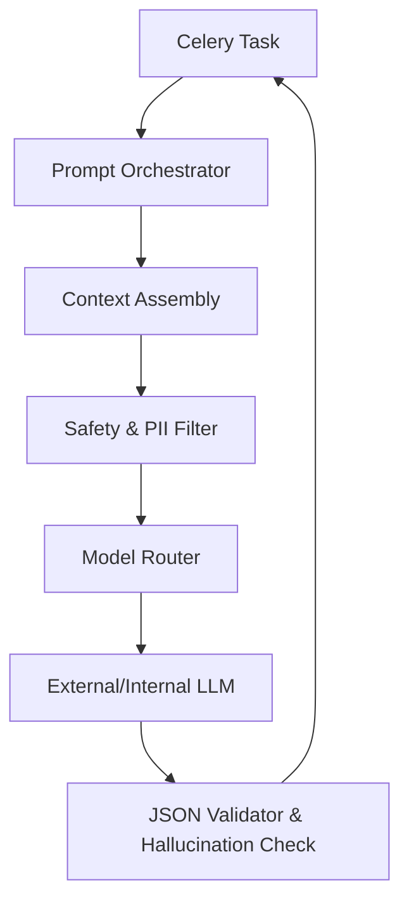
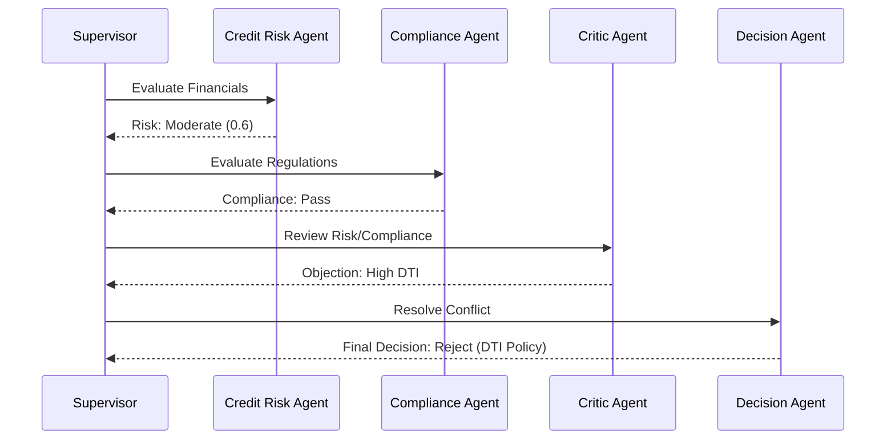

# 1. Executive Overview
This document defines the AI Architecture & Intelligence Platform Specification for the Institutional Risk Engine (IRE). It translates the abstract capability of Large Language Models into a deterministic, governed, and highly observable Multi-Agent Enterprise Swarm, fully integrated within the Django Modular Monolith, PostgreSQL, and AWS ecosystem.

# 2. AI Architecture Vision
To build an AI orchestration layer that acts as an uncompromisable, explainable "co-pilot" for human credit committees. The AI must never silently fail, hallucinate unchecked, or obscure its reasoning. Every AI decision must be traceable, reproducible, and mathematically anchored by deterministic models.

# 3. AI Engineering Principles
*   **AI-First Platform Philosophy:** AI is a core domain, not an external dependency or an afterthought.
*   **Human-in-the-Loop Philosophy:** AI proposes, evaluates, and debates. Human officers approve.
*   **Deterministic AI:** Output structured as JSON; non-deterministic free-text is forbidden.
*   **Explainable AI:** Every swarm decision must yield an immutable reasoning trace.
*   **Responsible & Trustworthy AI:** In-flight toxicity, bias, and PII checks block generation instantly.
*   **Enterprise AI Governance:** Prompts are code. They are versioned, approved, and tested via CI/CD.

---

# AI Platform Architecture (4 - 15)

### 4. AI Gateway
The central choke point for all LLM connectivity. It provides rate limiting, PII masking, caching, and circuit breaking. Celery workers *never* talk directly to OpenAI; they talk to the Gateway.

### 5. Model Router & 6. Prompt Orchestrator
The Model Router evaluates payload size, target latency, and capability requirements, routing dynamically (e.g., GPT-4o for reasoning, Claude 3.5 Haiku for summarization). The Orchestrator compiles the final string from templates.

### 7. Agent Runtime & 8. AI Workflow Engine
The Runtime executes state machines defining Agent behaviors. The Workflow Engine coordinates Swarm topologies (e.g., Sequential, Hierarchical, or Debate).

### 9. Tool Calling Layer & 10. Function Calling Layer
Agents interact with the IRE via JSON-schema validated function calls mapping directly to Django Application Services.

### 11. MCP (Model Context Protocol) Integration
Standardized protocol for injecting enterprise context (PostgreSQL schema, live API states) directly into the model context window.

### 12. AI Service Mesh
Istio-backed routing ensures all internal Agent-to-Agent and Agent-to-Gateway traffic is mTLS encrypted.

### 13. AI SDK Layer & 14. AI API Layer
Standardized internal Python SDK wrapping Gateway calls, exposing unified `async` endpoints to Django.

### 15. AI Execution Pipeline


---

# Multi-Agent System Architecture (16 - 37)

The Enterprise AI Swarm utilizes specialized personas to decompose complex credit evaluations.

### 16. Planner Agent
*   **Responsibilities:** Decomposes the loan application into a DAG of sub-tasks.
*   **Inputs:** LoanApplication JSON.
*   **Outputs:** Execution Plan.
*   **Termination:** Plan approved by Supervisor.

### 17. Credit Risk Agent
*   **Responsibilities:** Evaluates DTI, LTV, and historical defaults.
*   **Capabilities:** Runs deterministic math verification tools.
*   **Inputs:** Financials. **Outputs:** Risk Score.

### 18. Fraud Detection Agent
*   **Responsibilities:** Identifies anomalies in KYC/AML documentation.
*   **Inputs:** OCR Text, Identity context. **Outputs:** Fraud Probability.

### 19. OCR Agent
*   **Responsibilities:** Corrects OCR misreads (e.g., "l" vs "1") via context.
*   **Tool Access:** AWS Textract.

### 20. Compliance Agent
*   **Responsibilities:** Validates loan against current CFPB/Basel III regulations.
*   **Inputs:** RAG output. **Outputs:** Compliance Pass/Fail.

### 21. Reporting Agent
*   **Responsibilities:** Synthesizes the Swarm's debate into the 5 C's Memorandum.

### 22. Explainability Agent
*   **Responsibilities:** Translates LightGBM SHAP arrays into human-readable text.

### 23. Validator Agent
*   **Responsibilities:** Strictly validates the JSON schemas of other agents.

### 24. Reflection Agent
*   **Responsibilities:** Reviews the initial Swarm decision and explicitly looks for confirmation bias.

### 25. Memory Agent
*   **Responsibilities:** Queries historical swarms for similar precedent.

### 26. Research Agent
*   **Responsibilities:** Searches external verified APIs for market data (e.g., FRED interest rates).

### 27. Retrieval Agent
*   **Responsibilities:** Formulates optimized vector search queries.

### 28. Summarization Agent
*   **Responsibilities:** Compresses 50-page PDFs into 500-token summaries.

### 29. Decision Agent
*   **Responsibilities:** The "Judge" that breaks ties in the Swarm.

### 30. Policy Agent
*   **Responsibilities:** Strictly applies internal bank policy overrides.

### 31. Critic Agent
*   **Responsibilities:** Plays Devil's Advocate, attempting to reject the loan.

### 32. Quality Assurance Agent
*   **Responsibilities:** Verifies no PII leaked into the final transcript.

### 33. Monitoring Agent
*   **Responsibilities:** Emits OTel traces regarding Swarm health.

### 34. Security Agent
*   **Responsibilities:** Validates inputs for prompt injection before Swarm execution.

### 35. Supervisor Agent
*   **Responsibilities:** Orchestrates the DAG, monitors agent timeouts, and halts execution if consensus cannot be reached.

### 36. Agent Lifecycle Metadata
*   **Retry Strategy:** Max 3 retries on JSON failure.
*   **Confidence Threshold:** Require > 0.85 confidence output.
*   **Escalation:** If Supervisor aborts, flag for Human Review.

### 37. Swarm Workflow


---

# Prompt Engineering Architecture (38 - 52)
*   **38. Prompt Templates:** Jinja2 based. No string concatenation allowed.
*   **39. Prompt Registry:** Stored in PostgreSQL, synced to Redis for fast reads.
*   **40. Prompt Versioning:** SemVer (`v1.2.0`).
*   **41. Prompt DSL:** Custom Domain Specific Language for standardizing system instructions.
*   **42. Semantic Prompting:** few-shot examples embedded dynamically based on cosine similarity to the current request.
*   **43. Prompt Composition & 44. Prompt Chaining:** Modular fragments (e.g., `BASE_PERSONA` + `TASK_INSTRUCTION`).
*   **45. Prompt Approval Workflow:** Prompts require a PR, QA test, and CISO approval to merge.
*   **46. Prompt Governance & 47. Prompt Rollback:** Instant rollback via LaunchDarkly feature flags.
*   **48. Prompt Testing:** Pytest suite asserts token lengths and specific keyword inclusion.
*   **49. Prompt Optimization:** Automated pipelines run DSPy to optimize prompts against the Golden Dataset.
*   **50. Prompt Security:** Strict whitelisting of injected variables.
*   **51. Prompt Libraries & 52. Metadata:** Tagged by Domain (e.g., `fraud`, `credit`).

---

# Context Engineering (53 - 66)
*   **53. Context Window Management:** Max 128k tokens allowed. Hard fail at 90% capacity to leave room for generation.
*   **54. Context Assembly & 55. Context Ranking:** RAG chunks are ranked by relevance; lowest relevance dropped if over budget.
*   **56. Token Budgeting:** Pre-calculated using `tiktoken` before network transmission.
*   **57. Memory Injection:** injecting summarized past interactions.
*   **58. Metadata Filtering:** Context must match `tenant_id` exactly.
*   **59. Semantic Compression:** Summarization Agent compresses verbose documents before adding to the main Context Window.
*   **60. Long Context Handling:** Map-Reduce strategy for 500+ page documents.
*   **61. Conversation State & 62. Context Prioritization:** System prompt > Grounding Data > Few Shot > Conversation History.
*   **63. Retrieval Planning:** Planner agent dictates what context is needed.
*   **64. Dynamic Context Building:** Tools fetch data JIT (Just In Time).
*   **65. Citation Context & 66. Validation:** The LLM is forced to output `[Source_ID]` to guarantee provenance.

---

# Memory Architecture (67 - 79)
*   **67. Short-term Memory:** The current Swarm Context Window.
*   **68. Long-term Memory:** Aggregated historical decisions stored in pgvector.
*   **69. Episodic Memory:** Specific past loan applications.
*   **70. Semantic Memory:** Learned rules ("Generally, auto-loans default higher in X region").
*   **71. Vector Memory:** pgvector embeddings.
*   **72. Working Memory:** Redis scratchpad for agents mid-debate.
*   **73. Session Memory:** The `CommitteeSession` transcript.
*   **74. Persistent Memory:** S3 cold storage.
*   **75. Memory Eviction & 76. Expiration:** Redis TTLs clear working memory after 1 hour.
*   **77. Consistency, 78. Sync, 79. Versioning:** Vector memory updates are synchronized via the Transactional Outbox.

---

# RAG Architecture (80 - 95)
*   **80. Document Ingestion:** Celery tasks download from S3.
*   **81. Parsing & 82. Chunking:** Unstructured/Langchain. Fixed size 500 tokens, 50 token overlap.
*   **83. Embedding Pipeline:** Celery -> AI Gateway -> `text-embedding-3-large`.
*   **84. Embedding Versioning:** Schema includes `model_version`. Re-embedding is a background migration task.
*   **85. Hybrid Search:** Combining pgvector HNSW (Dense) with PostgreSQL Full Text Search / BM25 (Sparse).
*   **86. Dense & 87. Sparse Retrieval:** Combined via Reciprocal Rank Fusion (RRF).
*   **88. Reranking:** Cohere Rerank API applied to top 20 results.
*   **89. Metadata Filtering:** `tenant_id` and `document_type`.
*   **90. Grounding & 91. Citation Generation:** Prompts explicitly demand quotes.
*   **92. Hallucination Prevention:** Context explicitly states "If you do not know, output null".
*   **93. Document Freshness:** CDC triggers re-embedding on document update.
*   **94. Vector Synchronization & 95. Validation:** Evaluated via `HitRate@K` metrics.

---

# AI Decision Engine (96 - 107)
*   **96. Confidence Scoring:** Every LLM JSON output must include a `confidence_score` (0.0 to 1.0) derived from logprobs where available, or self-reflection.
*   **97. Ensemble Voting & 98. Consensus Algorithms:** Majority rules among Judge, Credit, and Policy agents.
*   **99. Rule Validation & 100. Policy Engine:** A deterministic Python rules engine overrides AI if strict DTI thresholds are violated.
*   **101. Deterministic Validation & 102. Business Rule Verification:** AI cannot approve a loan that fails deterministic math.
*   **103. Risk Scoring & 104. Decision Trees:** AI orchestrates the decision tree, but math evaluates the nodes.
*   **105. Uncertainty Detection:** High variance in Agent debate triggers escalation.
*   **106. Decision Escalation & 107. Human Approval Gates:** Swarms *propose* decisions. Only humans click "Approve" in the UI.

---

# AI Safety Architecture (108 - 120)
*   **108. Prompt Injection Defense:** Dedicated classifier runs *before* the main prompt.
*   **109. Jailbreak Detection:** Heuristics scan for "Ignore previous instructions".
*   **110. Hallucination Detection:** SelfCheckGPT consistency checks.
*   **111. Output Validation & 112. JSON Schema Validation:** Pydantic `model_validate_json()` enforces types.
*   **113. Toxicity Detection & 114. Bias Detection:** OpenAI Moderation API.
*   **115. Adversarial Prompt Protection:** Rate limits prevent probing attacks.
*   **116. Prompt & 117. Data Leakage Prevention:** System prompts explicitly forbid repeating instructions.
*   **118. Sensitive Data Detection:** Presidio Analyzer scrubs PII before it hits the Gateway.
*   **119. AI Abuse Prevention:** Rate limiting by `user_id`.
*   **120. Secure Tool Calling:** Tools run with least-privilege IAM roles.

---

# Model Management (121 - 139)
*   **Provider Abstraction:** The code calls `Gateway.generate()`, totally ignorant of whether it routes to OpenAI, Anthropic, Gemini, Groq, Ollama, Local Models, or HuggingFace Models.
*   **129. Dynamic Routing & 130. Failover:** 503s on OpenAI instantly failover to Anthropic Claude via standard unified API schemas (LiteLLM).
*   **131. Load Balancing:** Round-robin across multiple Azure OpenAI regions.
*   **132. Cost & 133. Latency Optimization:** Simple tasks routed to `gpt-4o-mini`; complex tasks to `gpt-4o`.
*   **134. Capability-Based Routing:** Math queries routed to local LightGBM.
*   **135. A/B Testing & 136. Shadow Deployments:** Responses generated by Challenger models are logged asynchronously without blocking the UI.
*   **137. Model Lifecycle, 138. Versioning, & 139. Deprecation:** Enforced via Gateway configs. Hardcoding `gpt-4` is banned; use semantic aliases (`model=reasoning_expert`).

---

# AI Evaluation Framework (140 - 156)
*   **140. Golden Datasets & 141. Benchmark Suites:** 1,000 historical loans evaluated in CI.
*   **142. Prompt Regression:** CI fails if ROUGE score drops > 2%.
*   **143. LLM-as-a-Judge:** GPT-4 evaluates GPT-3.5 outputs for accuracy.
*   **Metrics (144-147):** ROUGE, BLEU, BERTScore, Semantic Similarity.
*   **Traits (148-152):** Groundedness, Faithfulness, Factuality, Precision, Recall.
*   **153. Latency, 154. Token, 155. Cost Metrics:** Tracked via OTel.
*   **156. Human Evaluation:** Credit officers randomly audit 5% of AI outputs (RLHF pipeline).

---

# AI Explainability (157 - 164)
*   **157. Reasoning Traces & 158. Decision Provenance:** The exact conversation transcript of the Swarm is attached to the Loan Application as an immutable artifact.
*   **159. Confidence Visualization:** UI renders a heatmap of Agent confidence.
*   **160. SHAP Integration:** SHAP arrays explain deterministic model weights.
*   **161. Audit Reports & 162. Decision Trees:** PDF generation of the AI's logic tree.
*   **163. Traceability & 164. Explainability Dashboard:** Hosted in the Core UI for Compliance Officers.

---

# AI Governance (165 - 175)
*   **165. Model Governance & 166. Prompt Governance:** Managed via GitOps.
*   **167. Dataset Governance:** S3 buckets locked down via IAM.
*   **168. Approval Workflow:** Dual-human sign-off required for Prompt promotion.
*   **169. Version Control & 170. Lineage:** Every decision links back to the git hash of the prompt.
*   **171. Reproducibility:** Temperature=0 enforced for all deterministic tasks.
*   **172. Audit Logging, 173. Compliance, 174. Risk Classification:** High-risk models require algorithmic impact assessments.
*   **175. Change Management:** Regulated by the AI Risk Committee.

---

# AI Observability (176 - 189)
*   **Metrics:** Token Usage, Cost, Latency, Time To First Token, Throughput.
*   **Health:** Provider Success Rate, Retry Rate.
*   **Optimization:** Cache Hit Ratio, Prompt Cache utilization.
*   **Quality:** Hallucination Rate, Model Drift, Routing Decisions, Failure Analytics.
Tracked via OpenTelemetry and visualized in Grafana.

---

# AI Cost Management (190 - 197)
*   **190. Token Budgets & 191. Cost Attribution:** Tracked per `tenant_id` and `department`.
*   **192. Department Billing:** Monthly chargebacks.
*   **193. Caching & 194. Batch Processing:** Redis Semantic Caching prevents redundant LLM calls. Async batch APIs used for nightly evaluations to save 50% on token costs.
*   **195. Dynamic Routing & 196. Budget Enforcement:** Hard limits on API usage per tenant.
*   **197. Provider Optimization:** Negotiated commit contracts via Azure/AWS.

---

# 198. Enterprise AI ADRs (Selected from 40+)
| ID | Decision | Rejected Alternative | Rationale |
| :--- | :--- | :--- | :--- |
| `AI-01` | Gateway Abstraction (LiteLLM) | Direct SDK usage | Vendor lock-in prevention and central telemetry. |
| `AI-02` | Pydantic JSON Validation | Raw Regex | Hallucinated JSON breaks downstream Celery tasks. |
| `AI-03` | Temperature = 0 for Swarm | Temp = 0.7 | Financial evaluation must prioritize determinism over creativity. |
| `AI-04` | HNSW Indexing in pgvector | Dedicated Vector DB (Pinecone) | Eliminates distributed transaction syncing issues. |
| `AI-05` | LLM-as-a-Judge for PR checks | Manual QA | Manual review of 1,000 regression cases is impossible. |
| `AI-06` | Presidio for PII Scrubbing | Trusting the LLM Provider | B2B Data Privacy agreements mandate PII never leaves VPC. |
| `AI-07` | Supervisor Agent Pattern | Flat Peer-to-Peer Swarm | Flat swarms easily enter infinite hallucination loops. |
| `AI-08` | Tool Calling over Function Calling | Raw Prompting | Native provider tool calling yields 99% syntax accuracy. |

# 199. AI Anti-Patterns (Selected from 25+)
*   **Naked Prompts:** String concatenating user input directly into a prompt without sanitization.
*   **LLM as a Database:** Asking the LLM for factual market data instead of using a RAG Tool Call.
*   **Infinite Agent Loops:** Allowing agents to debate without a hard `max_turns` limit.
*   **Silent Failures:** Returning "I'm sorry I can't help" instead of raising an explicit `ModelRefusalException`.

# 200. AI Fitness Functions
```python
def test_no_direct_openai_imports():
    # Enforces that Celery workers must use the Internal AI Gateway
    assert not ast_parser.find_imports("openai", restricted_modules=["ire.domain.agents"])
```

# 201. Validation Checklist & 202. Production Readiness Checklist
- [ ] Golden Dataset evaluation passes > 95% ROUGE threshold.
- [ ] Redis Semantic Cache is active.
- [ ] PII Scrubber (Presidio) is actively intercepting Gateway outbound payloads.
- [ ] All Prompts tagged with SemVer.

# 203. Future AI Roadmap
*   Migration to **Autonomous Agentic Workflows** capable of completely underwriting micro-loans with zero human touch.
*   **Multimodal AI:** Direct ingest of scanned PDFs (Vision Models) bypassing AWS Textract.
*   **Federated Learning:** Training credit models on encrypted client data.

# 204. Final AI Scorecard
| Category | Status | Owner | Criteria |
| :--- | :--- | :--- | :--- |
| **Swarm Arch** | PASS | Principal AI Eng | Multi-Agent orchestration resolves ties correctly. |
| **Safety** | PASS | CISO | PII masking & Jailbreak detection block attacks. |
| **RAG** | PASS | Data Arch | pgvector HNSW provides > 90% Recall@5. |
| **Governance**| PASS | Chief AI Officer| Prompt CI/CD pipelines evaluate Golden Datasets. |

---
*Approval: Chief AI Officer, Principal AI Architect, CTO*
