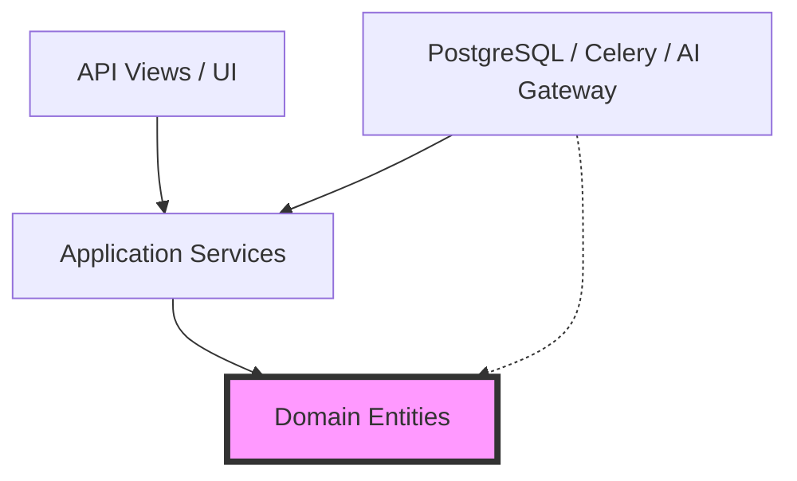

# 1. Executive Engineering Vision
This document forms the absolute engineering standard for the Institutional Risk Engine (IRE). It governs all software construction across Django, React, Celery, and AI pipelines.

# 2. Engineering Philosophy & 3. Software Craftsmanship
Code is read ten times more than it is written. We optimize for readability, maintainability, and deterministic behavior. "Smart" code is rejected in favor of "Clear" code.

# 4. Engineering Principles
*   **SOLID:** Single Responsibility, Open/Closed, Liskov Substitution, Interface Segregation, Dependency Inversion.
*   **5. DRY (Don't Repeat Yourself):** Abstract shared logic into the Shared Kernel.
*   **6. KISS (Keep It Simple, Stupid):** Reject unnecessary abstractions.
*   **7. YAGNI (You Aren't Gonna Need It):** Do not build generic frameworks for future use cases.
*   **8. Composition over Inheritance:** Deep class hierarchies are forbidden. Use mixins and composition.
*   **9. Dependency Inversion:** High-level modules must not depend on low-level modules; both depend on abstractions.
*   **10. Interface Segregation:** Prefer multiple specific interfaces over one general-purpose interface.

---

# Architecture Enforcement (11 - 15)

### 11. Clean Architecture & 12. Hexagonal Architecture Rules

*   **13. DDD Implementation Standards:** The Domain has no dependencies.
*   **14. Architecture Enforcement:** Enforced strictly in CI via `import-linter`.
*   **15. Module Isolation:** Bounded Contexts must not import from each other directly.

---

# Package Organization (16 - 21)

### 16. Python Project Layout (Django Modular Monolith)
```text
ire/
├── config/             # Django settings, WSGI, ASGI
├── shared/             # Shared Kernel (Base Entity, Outbox, Events)
└── contexts/
    ├── credit/         # Bounded Context
    │   ├── domain/     # Entities, Value Objects, Events
    │   ├── application/# Use Cases, DTOs
    │   ├── infrastructure/ # Repositories, ORM Models
    │   └── presentation/   # API Views, Serializers
```
*   **17. Application Layer Standards:** Orchestrates Use Cases. No business logic.
*   **18. Domain Layer Standards:** Pure Python. No Django ORM imports.
*   **19. Infrastructure Layer Standards:** Adapters, ORM models, API clients.
*   **20. Shared Kernel:** Globally shared types (`MonetaryAmount`, `TenantID`).
*   **21. Bounded Context Organization:** Each context is an isolated Django app.

---

# Repository & Code Organization (22 - 27)
*   **22. Monorepo Organization:** Backend (Django) and Frontend (React) reside in `ire-monorepo` managed by Turborepo (for JS) and standard Python modules.
*   **23. Code Ownership:** Enforced via `.github/CODEOWNERS` mapping contexts to Git teams.
*   **24. Naming Standards:** `snake_case` for variables/functions. `PascalCase` for Classes.
*   **25. React Folder Layout:** Feature-sliced design (`features/loan_application/components`).
*   **26. Dependency Rules:** Presentation $\rightarrow$ Application $\rightarrow$ Domain.
*   **27. Shared UI Components:** Maintained in `packages/ui-kit` (Storybook).

---

# Code Formatting & Static Analysis (28 - 36)
*   **28. Ruff:** The only permitted linter/formatter. Replaces Flake8/Isort.
*   **29. Black:** (Replaced by Ruff formatter for speed).
*   **30. isort:** (Replaced by Ruff).
*   **31. mypy:** Strict typing enforced (`disallow_untyped_defs = True`).
*   **32. Pyright:** Used in VSCode for real-time type checking.
*   **33. Pre-commit Hooks:** Blocks commits failing Ruff/Mypy.
*   **34. Static Analysis:** SonarQube integrated into CI.
*   **35. Semgrep:** Enforces security rules (e.g., banning `eval()`, `exec()`).
*   **36. Code Complexity:** Tracked via SonarQube; cognitive complexity > 15 fails the build.

---

# Complexity Limits (37 - 42)
*   **37. Cyclomatic Complexity Limits:** Maximum 10 per function.
*   **38. Code Size Limits:** PRs > 500 lines of code (excluding tests/generated) are rejected.
*   **39. Maximum Function Length:** 50 lines.
*   **40. Maximum File Length:** 500 lines.
*   **41. Maximum Nesting Depth:** 3 levels of indentation.
*   **42. Maximum Parameters:** 4 parameters per function (use DTOs/Dataclasses for more).

---

# Design Pattern Catalog (43 - 52)
*   **43. Factory:** Used for complex Aggregate root creation.
*   **44. Strategy:** Used for dynamic algorithm selection (e.g., scoring rules).
*   **45. Adapter:** Used for all external I/O (e.g., `AnthropicAdapter`, `TextractAdapter`).
*   **46. Facade:** Simplifies complex external subsystems.
*   **47. Repository:** Abstracts Django ORM from the Domain.
*   **48. Specification Pattern:** Encapsulates business rules (e.g., `IsEligibleForLoanSpec`).
*   **49. Unit of Work:** Orchestrated by Django `@transaction.atomic` at the Application Service level.
*   **50. Domain Events:** Decouples bounded contexts.
*   **51. Outbox Pattern:** Guarantees event delivery (Doc 05).
*   **52. Builder & 53. State Machine:** `django-fsm` used for strict aggregate state transitions.

---

# Anti-pattern Catalog (54 - 61)
*   **54. God Objects:** Classes handling > 1 responsibility.
*   **55. Anemic Domain Model:** Entities that are just data bags with all logic in services.
*   **56. Business Logic in Views:** DRF Views performing math or status changes.
*   **57. Circular Dependencies:** Context A imports B; B imports A.
*   **58. Singleton Abuse:** Using Singletons for global state.
*   **59. Magic Strings:** Un-typed strings instead of Enums.
*   **60. Primitive Obsession:** Passing `currency: str` instead of `Currency` Value Object.
*   **61. Long Transactions:** HTTP calls inside DB transactions.

---

# Configuration & Injection (62 - 68)
*   **62. Feature Flags & 63. LaunchDarkly Standards:** All new features must be hidden behind a flag. Flags must be removed 30 days after 100% rollout.
*   **64. Configuration Management & 65. Environment Variables:** Loaded via `django-environ`.
*   **66. Typed Configuration:** Pydantic `BaseSettings` validates env vars on boot.
*   **67. Secrets Handling:** Injected via Vault Agent sidecar to memory disk.
*   **68. Dependency Injection & Plugin Architecture:** Python's `inject` or manual injection at the API view level for Repositories.

---

# API Development Standards (69 - 80)
*   **69. REST Guidelines:** Nouns in URLs (`/loans`), not verbs (`/createLoan`).
*   **70. HTTP Status Standards:** 200 (OK), 201 (Created), 202 (Accepted - Async), 400 (Validation), 404 (Not Found), 409 (Conflict).
*   **71. Versioning Strategy:** URI versioning (`/api/v1/`).
*   **72. Pagination:** Cursor pagination for infinite scroll; Limit/Offset for tables.
*   **73. Filtering & 74. Sorting:** `django-filter` using query params (`?status=APPROVED&ordering=-created_at`).
*   **75. Validation:** DRF Serializers handle syntactic; Domain handles semantic.
*   **76. OpenAPI & 77. Swagger:** Auto-generated via `drf-spectacular`.
*   **78. GraphQL Standards:** (Future) Apollo Server.
*   **79. Error Handling & 80. Exception Taxonomy:** Maps Domain Exceptions to HTTP codes. Use RFC7807 Problem Details for JSON errors.

---

# Resilience & Background Processing (81 - 92)
*   **81. Validation Errors:** Return 400 with a list of field-specific errors.
*   **82. Retry Strategy:** Celery `autoretry_for` with exponential backoff.
*   **83. Idempotency:** Redis `SETNX` prevents duplicate requests.
*   **84. Rate Limiting Standards:** DRF `AnonRateThrottle` and `UserRateThrottle`.
*   **85. Celery Standards & 86. Task Design:** Tasks must be idempotent and accept IDs, not ORM objects.
*   **87. Retries & 88. Backoff:** Max 3 retries, exponential factor 2.
*   **89. Dead Letter Queues:** Failed tasks move to DLQ for manual inspection.
*   **90. Workflow Design & 91. State Machines:** Celery Canvas (Chords/Chains).
*   **92. Batch & Cron Jobs:** Triggered via `CeleryBeat`.

---

# Caching & Database Development (93 - 105)
*   **93. Caching Standards & 94. Redis Usage:** Cache-Aside pattern.
*   **95. Cache Keys:** `{tenant_id}:{context}:{entity_name}:{id}`.
*   **96. TTL Policies:** 15 minutes default.
*   **97. Cache Invalidation:** Handled by Django Signals on aggregate save.
*   **98. Distributed Locks:** Redlock algorithm for cross-pod synchronization.
*   **99. Migration Standards:** Checked in CI.
*   **100. Repository Standards:** `get_by_id`, `save`, `delete`.
*   **101. Query Optimization & 102. N+1 Prevention:** Mandatory use of `select_related` and `prefetch_related`. Enforced via `nplusone` library in tests.
*   **103. Transaction Management:** `@transaction.atomic` wrapping Application Services.
*   **104. Optimistic Locking:** Incremented `version` field.
*   **105. Bulk Operations:** `bulk_create` / `bulk_update` used for batch jobs > 100 rows.

---

# Testing Philosophy & Strategy (106 - 124)
*   **106. Testing Pyramid:** 70% Unit, 20% Integration, 10% E2E.
*   **107. Unit Tests:** Pure Python, zero DB access.
*   **108. Integration Tests:** Uses ephemeral PostgreSQL.
*   **109. Contract Tests & 110. API Tests:** Pact for frontend/backend agreements.
*   **111. Component Tests:** Mounts React components in isolation.
*   **112. E2E Tests:** Playwright driving the UI.
*   **113. Load & 114. Chaos Tests:** Locust and Chaos Mesh.
*   **115. Mutation Testing:** `mutmut` verifies test quality.
*   **116. Golden Dataset Testing & 117. AI Testing:** Validates prompts against historical data (ROUGE scores).
*   **118. Coverage Requirements:** 85% Line, 90% Branch.
*   **119. Pytest Standards:** Highly modular fixtures.
*   **120. FactoryBoy & 121. Fixtures:** Replaces fragile JSON test data.
*   **122. Test Data:** Masked/Synthetic only.
*   **123. Mocking:** `unittest.mock` strictly limited to external I/O boundaries.
*   **124. Snapshot Testing & 125. Consumer Driven Contracts:** Used for React UI and Pact.

---

# CI/CD Engineering (126 - 138)
*   **126. GitHub Actions:** Sole CI provider.
*   **127. Build Pipelines & 128. Quality Gates:** Lint $\rightarrow$ Typecheck $\rightarrow$ Unit Test $\rightarrow$ SonarQube $\rightarrow$ Build Image.
*   **129. Artifact Generation & 130. Versioning:** Docker images tagged with Git SHA.
*   **131. Release Pipelines:** ArgoCD syncs manifests to Kubernetes.
*   **132. Git Strategy & 133. GitFlow vs Trunk Based:** Trunk-Based Development with short-lived feature branches.
*   **134. Branch Naming:** `feat/IRE-123-add-loan-api`.
*   **135. Commit Standards & 136. Conventional Commits:** `feat(credit): add scoring algorithm`.
*   **137. Pull Request Standards:** Require 1 approval, passing CI, and linked Jira ticket.
*   **138. Review Checklists & 139. DoD/DoR:** Definition of Done includes tests, docs, and metrics.

---

# Documentation Standards (140 - 146)
*   **140. Architecture Decision Records (ADRs):** Stored in `/docs/adrs/`.
*   **141. Code Documentation & 142. Docstrings:** Google-style docstrings required for all public Application Services and Domain Entities.
*   **143. Markdown Standards:** Strict linting via `markdownlint`.
*   **144. Backstage Integration:** `catalog-info.yaml` required in all repos.

---

# Developer Experience (145 - 156)
*   **145. Developer Experience:** Zero-friction onboarding.
*   **146. Hot Reload & 147. Debugging:** Webpack HMR and Django `runserver`.
*   **148. Local Development:** Handled via DevContainers.
*   **149. Docker Compose:** Spins up Postgres, Redis, and local Vault.
*   **150. Dev Containers & 151. VS Code Standards:** Shared `.vscode/settings.json` enforces Ruff/Pyright automatically.
*   **152. Developer Tooling:** `make` commands standardise workflows (`make test`, `make build`).
*   **153. Observability in Development:** Local Jaeger for tracing.
*   **154. Structured Logging:** `structlog` generating JSON logs.
*   **155. Tracing, Metrics, & 156. Feature Telemetry:** OTel collector routes spans.

---

# AI Development Standards (157 - 165)
*   **157. Prompt Development Workflow:** Treat prompts as code.
*   **158. Prompt Testing & 159. Versioning:** Prompts must be tested against assertions (e.g., length, schema compliance).
*   **160. Prompt Code Reviews:** Require dual sign-off.
*   **161. Golden Dataset Regression & 162. LLM Evaluation:** Run `promptfoo` or DSPy in CI.
*   **163. Tool Calling Standards:** Use strictly typed Pydantic models for function schemas.
*   **164. Model Gateway Standards:** All calls MUST use the internal LiteLLM proxy.
*   **165. Secure AI Coding:** Never concatenate user input directly into system prompts.

---

# Performance Engineering (166 - 173)
*   **166. Performance Budgets:** API responses < 250ms P95.
*   **167. Memory & 168. CPU Budgets:** Set strictly via K8s `limits`.
*   **169. Database Performance & 170. Latency Targets:** SQL queries < 50ms.
*   **171. Profiling & 172. Benchmarking:** Use `cProfile` and `py-spy`.
*   **173. Server Components (Future):** React Server Components to reduce JS bundle size.

---

# Security During Development (174 - 184)
*   **174. Secure Coding Standards:** Banned functions (`eval`), mandatory CSRF tokens.
*   **175. OWASP ASVS:** Level 3 required.
*   **176. Dependency Scanning & 177. Secret Scanning:** Trivy and TruffleHog block commits with hardcoded secrets or CVEs.
*   **178. Supply Chain Security & 179. SBOM:** Syft generates SBOMs.
*   **180. Image Signing & 181. Code Signing:** Cosign signs all ECR images.
*   **182. Developer Workstations:** MDM enrolled, full-disk encryption.

---

# Frontend Engineering (185 - 195)
*   **183. Accessibility Standards & 184. WCAG 2.2 AA:** Enforced via `eslint-plugin-jsx-a11y` and Playwright tests.
*   **185. Responsive Design:** Mobile-first Tailwind CSS.
*   **186. Internationalization & 187. Localization:** `i18next`.
*   **188. Browser Support:** Chrome, Firefox, Safari (Last 2 versions).
*   **189. Frontend State Management & 190. React Query:** Server state managed by React Query; local state by React Context/Zustand. Redux is explicitly banned as legacy.
*   **192. Code Generation & 193. Scaffolding:** `openapi-typescript` generates API clients.
*   **194. Template Repositories & 195. Developer Portals:** Standardized scaffolding via Backstage Software Templates.

---

# Operational Readiness & KPIs (196 - 206)
*   **196. Production Readiness Reviews:** Architecture review before going to Staging.
*   **197. Release Checklists & 198. Rollback Readiness:** Verified rollback plans required for all PRs.
*   **199. Deployment Verification:** Automated smoke tests post-deploy.
*   **200. Engineering KPIs:** Tracked globally on executive dashboards.
*   **201. DORA Metrics:** Deployment Frequency, Lead Time for Changes, Time to Restore, Change Failure Rate.
*   **202. Code Review Time:** Target < 24 hours.
*   **203. Build Success Rate:** Target > 95%.
*   **204. Deployment Success:** Target > 99%.
*   **205. Technical Debt Index:** Tracked via SonarQube Debt Ratio.

---

# ADRs, Anti-Patterns, and Fitness Functions (207 - 215)
*   **206. Engineering ADRs:** Documenting WHY we use Ruff over Flake8.
*   **207. Engineering Anti-patterns:** E.g. Using Exceptions for Control Flow.
*   **208. Engineering Fitness Functions:**
```python
# test_architecture.py
def test_domain_has_no_dependencies():
    assert import_linter.check("ire.domain", forbidden=["ire.infrastructure", "django"])
```

# 209. Engineering Readiness Checklists
- [ ] PR passes all Ruff/Mypy checks.
- [ ] SonarQube reports 0 new technical debt.
- [ ] Test coverage > 85%.

# 210. Future Engineering Roadmap
*   Migrating to Python 3.13 no-GIL for multi-threaded Celery optimization.
*   Adopting Rust for CPU-heavy data parsing pipelines.

# 211. Final Engineering Scorecard
| Metric | Status | Owner | Criteria |
| :--- | :--- | :--- | :--- |
| **Code Quality** | PASS | Staff Eng | 0 Critical SonarQube issues. |
| **Test Coverage**| PASS | QA Arch | >85% Line Coverage globally. |
| **Architecture** | PASS | Principal Arch| Import-linter validations pass. |
| **DORA Metrics** | PASS | VPE | Deploying > 4 times per day. |

---
*Approval: Distinguished Software Architect, Principal Engineering Manager*
