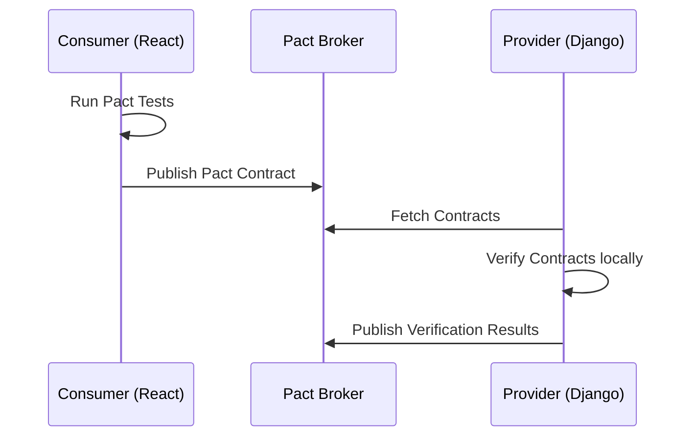

# 1. Executive Quality Vision
Quality is not an afterthought; it is a continuously executed architectural mandate. The Institutional Risk Engine (IRE) relies on absolute determinism to evaluate Tier-1 financial risk. This document defines the exact methodologies, gates, and automated validation required to ensure the system never degrades, regresses, or hallucinates in production.

# 2. Quality Philosophy & 3. Quality Engineering Principles
*   **Quality is Built-In:** We test at the boundaries (Clean Architecture) instead of relying solely on heavy E2E tests.
*   **Fail Fast:** 80% of test execution completes in under 5 minutes.
*   **Zero Flakiness:** A flaky test is a failed test. Flaky tests are instantly quarantined and removed from the main pipeline.

# 4. Shift Left Testing & 5. Shift Right Testing
*   **Shift Left:** SAST, linting, unit tests, and contract testing occur on the developer's laptop and during PR checks.
*   **Shift Right:** Chaos engineering, synthetic monitoring, observability alerts, and feature flag phased rollouts occur in Production.

# 6. Quality Gates & 7. Continuous Verification
No PR can merge without passing 100% of the required CI/CD Quality Gates. Production deployments are gated by automated Synthetic Smoke Tests evaluating core user journeys (e.g., "Submit Loan").

# 8. Risk Based Testing & 9. Test Strategy
Testing effort is proportional to business risk. The Core Credit Calculation domain requires 100% mutation testing coverage; the internal Admin UI requires 75% line coverage.

---

# Test Governance & Lifecycle (10 - 25)

### 10. Test Governance & 11. Testing Lifecycle
Tests are code. They undergo code review, adhere to DRY principles, and are refactored when they become brittle.

### 12. Definition of Ready (DoR) & 13. Definition of Done (DoD)
*   **DoR:** Acceptance criteria defined. Mock JSON for UI available.
*   **DoD:** Unit tests written. Playwright E2E passed. SonarQube reports 0 debt.

### 14. Acceptance Criteria & 15. Requirements Traceability
Criteria are written in Gherkin (`Given, When, Then`). Traceability is maintained from Jira to Pytest via markers (`@pytest.mark.jira('IRE-123')`).

### 16. Requirement Coverage Matrix
Automatically generated via Allure Test Reports linking test execution back to Jira epics.

### 17. Test Planning, 18. Estimation, 19. Documentation
Test planning happens during Sprint Refinement, not after development. Tests are documented via their names (`test_loan_rejected_when_dti_exceeds_threshold`).

### 20. Test Design Standards & 21. Test Case Standards
Arrange-Act-Assert (AAA) pattern strictly enforced. One assertion concept per test.

### 22. Test Data Management, 23. Synthetic Data, 24. Masked Production Data
Production data NEVER enters lower environments. `faker` and `FactoryBoy` generate 100% synthetic realistic datasets.

### 25. Test Environments
*   **Developer Environment:** Local Docker Compose (Postgres, Redis, Vault).
*   **QA Environment:** Ephemeral K8s namespaces spun up per PR.
*   **Integration Environment:** Stable environment for external B2B testing.
*   **Performance Environment:** Production mirror for Load Testing.
*   **Staging:** Exact replica for Pre-flight checks.
*   **Production Validation:** Synthetic monitoring only.

---

# Testing Pyramid & Trophies (26 - 45)

### 26. Testing Pyramid & 27. Testing Trophy
IRE adopts a Testing Trophy: High emphasis on Integration (Database/API) tests, solid foundation of Unit Tests (Domain), and a narrow tip of E2E tests (Playwright).

### 28. Backend Testing & 29. Frontend Testing
Backend logic is validated via Pytest. Frontend logic is validated via Jest and React Testing Library (RTL).

### 30. API Testing
DRF APIs are tested via Pytest `APIClient`.
```python
def test_create_loan_returns_201_and_valid_schema(api_client, auth_headers, valid_loan_payload):
    response = api_client.post("/api/v1/loans/", data=valid_loan_payload, headers=auth_headers)
    assert response.status_code == 201
    assert "loan_id" in response.json()
```

### 31. Database Testing, 32. Repository Testing
Repositories are tested against a real, ephemeral PostgreSQL database. Mocking the database is explicitly forbidden for Repository tests.

### 33. Domain Testing & 34. Application Service Testing
Domain tests have NO dependencies (no DB, no Redis). Application Services are tested with mocked external boundaries (e.g., mocked S3, mocked Gateway).

### 35. Integration Testing & 36. Component Testing
Validating how Django talks to Celery and Redis. Frontend Components tested in isolation without Redux/React-Query context.

### 37. End-to-End Testing & 38. Playwright Standards
Playwright scripts target the QA/Staging environments. They test User Journeys, not isolated features.

### 39. Contract Testing, 40. Consumer Driven Contracts, 41. Pact Standards
Pact ensures the Frontend and Backend agree on API shapes before deployment.


### 42. Schema Validation & 43. OpenAPI Validation
Responses are strictly validated against the OpenAPI 3.0 specification using `schemathesis`.

### 44. Snapshot Testing & 45. Golden Master Testing
Used cautiously for UI components to detect visual drift. Used for AI to detect Prompt drift.

---

# Regression, UI & Accessibility (46 - 57)
*   **46. Regression Testing:** 100% automated via CI. No manual regression allowed.
*   **47. Smoke Testing:** 5-minute suite executed post-deployment.
*   **48. Sanity Testing:** Validating specific bug fixes in Staging.
*   **49. Exploratory Testing:** The only manual testing permitted. Used for finding unknown-unknowns.
*   **50. Accessibility Testing & 51. WCAG Testing:** Automated via `axe-core` and Playwright.
*   **52. Cross Browser, 53. Responsive, 54. Mobile Testing:** Run via Playwright matrix (Chromium, Firefox, WebKit, Mobile Safari).
*   **55. Localization & 56. Internationalization:** Validating translations in UI.
*   **57. Visual Regression Testing:** Using Percy to diff staging UI vs production UI.

---

# Pytest & Backend Standards (58 - 66)
*   **58. Pytest Standards:** No `unittest` classes. Use pure functions.
*   **59. Fixture Standards:** Fixtures scoped aggressively (`function` vs `session`) to manage DB teardown speed.
*   **60. FactoryBoy Standards:** Avoid `create()` (hits DB) in favor of `build()` (memory only) when testing Domain logic.
*   **61. Parameterized Tests:** Use `@pytest.mark.parametrize` to avoid duplicate test logic.
*   **62. Mutation Testing:** `mutmut` randomly alters code (e.g., `>` to `>=`) to verify if tests fail. If a test passes when the code changes, the test is weak.
*   **63. Property Based Testing & 64. Hypothesis:** Generates hundreds of edge-case inputs (negative numbers, extreme strings) for financial calculations.

---

# Resilience & Chaos Testing (67 - 78)
*   **65. Chaos Testing & 66. Resilience Testing:** Chaos Mesh runs in the Staging cluster.
*   **67. Fault Injection & 68. Network Failure Testing:** Injecting 500ms latency between Django and Aurora to test circuit breakers.
*   **69. Database, 70. Redis, 71. Kubernetes Failure Testing:** Randomly killing Celery pods during execution to verify Idempotency and DLQ handling.
```yaml
# chaos-redis.yaml
apiVersion: chaos-mesh.org/v1alpha1
kind: PodChaos
metadata:
  name: redis-kill
spec:
  action: pod-kill
  mode: one
  selector:
    labelSelectors:
      app: redis
```
*   **72. Disaster Recovery, 73. Backup, 74. Restore Validation:** DR automation restored weekly to a sandbox VPC to validate RTO/RPO limits.

---

# Performance Engineering (75 - 87)
*   **75. Performance Testing:** Baseline established per release.
*   **76. Load, 77. Stress, 78. Spike, 79. Soak, 80. Volume Testing:** Run via `K6`. Soak tests run for 24 hours to detect memory leaks.
*   **81. Capacity Validation & 82. Concurrency Testing:** Testing Aurora Serverless auto-scaling boundaries.
*   **83. Latency Validation:** P95 latency must be < 200ms.
*   **84. Scalability Testing:** Verifying Horizontal Pod Autoscaler (HPA) triggers.
*   **85. Benchmarking & 86. Profiling:** Using `py-spy` for CPU.
*   **87. Database Performance & Query Benchmarking:** `EXPLAIN ANALYZE` integrated into tests to ensure indexes hit.

---

# AI Testing & Validation (88 - 110)
*   **88. AI Testing & 89. Prompt Testing:** Prompts are unit tested for syntax.
*   **90. Prompt Regression & 91. Version Validation:** Changing a prompt requires passing the Golden Dataset test.
*   **92. Golden Dataset Testing:** 1,000 historical loans scored against the new prompt.
*   **93. RAG Evaluation:**
    *   **96. Recall@K & 97. Precision@K:** Evaluates if pgvector retrieves the correct chunk.
*   **98. Groundedness, 99. Faithfulness, 100. Hallucination Detection:** LLM-as-a-Judge (GPT-4) evaluates if the answer is strictly based on the context.
*   **101. LLM Evaluation & 102. LLM-as-a-Judge:** Standardized DSPy pipelines.
*   **103. Agent Testing & 104. Swarm Testing:** Mocking agent tools to verify workflow logic without spending tokens.
*   **105. Tool Calling Validation:** Pydantic validation catches hallucinated JSON parameters.
*   **106. Model Routing Validation:** Unit tests confirming large inputs map to Claude, small to Haiku.
*   **107. Provider Failover Testing:** Forcing 503 errors from OpenAI to ensure Anthropic failover works.
*   **108. Token Budget Validation:** Test fails if input exceeds 100k tokens.
*   **109. Prompt Injection & 110. Jailbreak Testing:** `garak` scanner attacks the prompt in CI to ensure it rejects injection.

---

# Security & Compliance Testing (111 - 132)
*   **111. Security Testing:** Embedded entirely into the pipeline.
*   **112. SAST (Semgrep) & 113. DAST (OWASP ZAP).**
*   **115. Dependency & 116. Secret Scanning:** Trivy and TruffleHog.
*   **117. Container & 118. Image Scanning:** Reject images with Critical/High CVEs.
*   **119. IaC & 120. Terraform Validation:** Checkov validates no public S3 buckets exist.
*   **121. Kubernetes Validation:** KubeLinter checks for `runAsRoot: true`.
*   **122. Penetration Testing:** Annual external firm testing.
*   **125. API Security & 126. Authentication Testing:** Fuzzing the JWT endpoints.
*   **128. RBAC & 129. Multi-Tenant Isolation Testing:** Explicit negative tests ensuring Tenant A gets a 404 when requesting Tenant B's loan.
*   **130. PII & 131. Encryption Validation:** Querying the test DB without the Python encryption key to verify ciphertext is stored.
*   **132. Compliance (SOC2, GDPR, Audit) Validation:** Validating the Outbox event archive format.

---

# Async & Data Engineering Testing (133 - 146)
*   **133. Event & 134. Outbox Validation:** Ensuring `transaction.on_commit` hooks publish correctly.
*   **135. CDC Validation:** Debezium format validation.
*   **136. Message Ordering & 137. Idempotency Validation:** Injecting duplicate messages into Celery to ensure DB remains consistent.
*   **139. Celery Testing:** Eager execution in tests (`CELERY_TASK_ALWAYS_EAGER = True`).
*   **140. Workflow & 141. State Machine Testing:** Invalid transitions (`SUBMITTED -> APPROVED` skipping `REVIEW`) must raise `TransitionNotAllowed`.
*   **142. Migration, 143. Rollback Validation:** CI spins up a DB, runs migrations, then rolls them back, then runs them again.
*   **144. Blue-Green & 145. Canary Validation:** Smoke tests targeting the canary before traffic shift.
*   **146. Feature Flag Testing:** UI tests run with flag ON and flag OFF.

---

# CI/CD & Infrastructure Validation (147 - 160)
*   **147. GitHub Actions Testing & 148. CI Quality Gates:** Hard blocks on PR merges.
*   **150. Artifact, 151. SBOM, 152. Image Signing Validation:** Verifying Cosign signatures before deployment.
*   **153. Infrastructure, 154. Terraform Testing:** `terratest` spins up dummy AWS resources.
*   **156. Kubernetes Manifest Validation:** `kubeval`.
*   **157. Observability, 158. Logging, 159. Metrics, 160. Tracing Validation:** Tests asserting `logger.info` is called with the correct `trace_id`.

---

# Production Monitoring & KPIs (161 - 179)
*   **162. Synthetic Monitoring:** Blackbox Datadog synthetics querying the API every minute.
*   **163. SLO & 164. Error Budget Validation:** Prometheus alerting when error budgets burn > 5%.
*   **165. Quality Metrics:** Displayed on Grafana.
*   **166. Test Coverage, 167. Mutation Score, 168. Escaped Defects.**
*   **172. Flaky Test Rate:** Tests failing > 2% of the time are auto-quarantined.
*   **177. DORA Quality Metrics:** Correlating Deployment Frequency with Change Failure Rate.
*   **178. Test Reporting & 179. Executive Dashboards:** Backstage hosts the QA dashboards.

---

# Release Readiness & Continuous Improvement (180 - 188)
*   **180. Release Readiness & 181. Go / No-Go Criteria:** Zero High/Critical bugs. 100% CI pass.
*   **183. Root Cause Analysis & 184. Blameless Defect Reviews:** Postmortems mapped back to identifying *which* test missed the bug.
*   **185. Engineering Feedback Loops:** Testing speed optimized. CI target < 5 minutes.

---

# 189. Testing ADRs (Selected)
| ID | Decision | Rejected Alternative | Rationale |
| :--- | :--- | :--- | :--- |
| `TEST-01` | FactoryBoy for Models | JSON Fixtures | JSON fixtures become brittle when DB schema changes. |
| `TEST-02` | Eager Celery in Tests | Live Redis | Vastly increases test speed; limits I/O. |
| `TEST-03` | Playwright over Cypress | Cypress | Playwright supports true cross-browser and iframe traversal. |
| `TEST-04` | Pact Contract Testing | Relying purely on OpenAPI | Contract testing catches behavior changes, not just schema changes. |
| `TEST-05` | LLM-as-a-Judge | Exact String Matching | LLM outputs vary. ROUGE and Semantic Similarity are required. |

# 190. Testing Anti-Patterns
*   **Testing Implementation Details:** Asserting a specific private method was called instead of asserting the public output.
*   **Sleeps in Tests:** Banned. Use explicit wait conditions (`wait_until`).
*   **Shared Mutable State:** Tests that pass when run individually but fail when run in parallel.
*   **Mocking the Database:** The repository tests MUST hit Postgres.

# 191. Quality Fitness Functions
```python
# test_no_flaky_tests.py
def test_flaky_marker_count():
    # Fails CI if there are more than 5 quarantined flaky tests in the codebase
    count = count_flaky_markers()
    assert count <= 5, "Technical debt limit reached. Fix flaky tests."
```

# 192. Production Readiness Checklists
- [ ] 100% Core Domain Unit Test Coverage.
- [ ] Pact Broker reports all Consumer/Provider contracts verified.
- [ ] Golden Dataset Regression run and approved by Chief AI Officer.

# 193. Future Testing Roadmap
*   Deploying AI-driven fuzzing capable of auto-generating Edge Case test data based on OpenAPI schemas.
*   Expanding Mutation Testing to the React UI layer.

# 194. Final Quality Scorecard
| Metric | Status | Owner | Criteria |
| :--- | :--- | :--- | :--- |
| **CI Speed** | PASS | DevOps | Pipeline completes in < 5 mins. |
| **Coverage** | PASS | QA Arch | Domain: 100%, Global: 85%. |
| **Contracts**| PASS | QA Arch | 0 Pact Verification failures. |
| **AI RAG** | PASS | AI Lead | HitRate@5 > 90%. |

---
*Approval: Distinguished QA Architect, Principal Test Architect, CTO*
