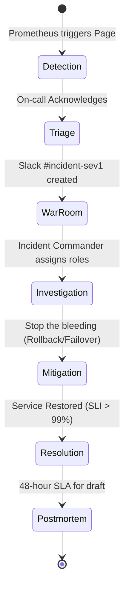
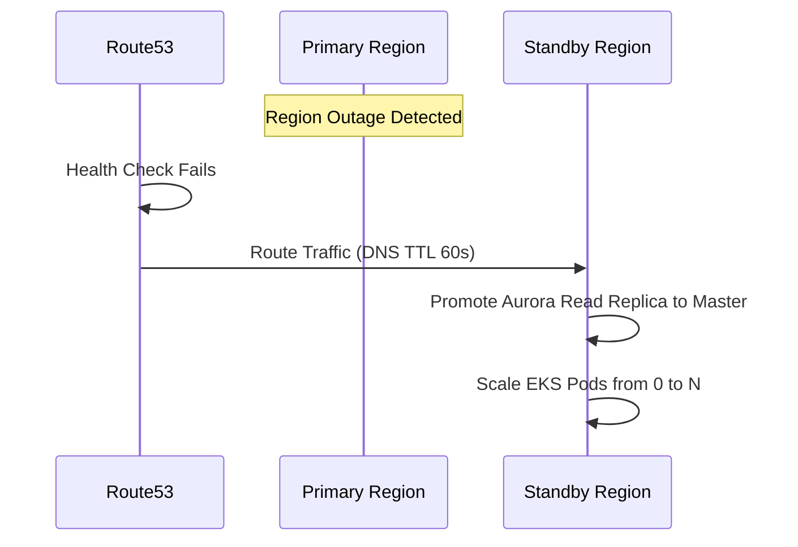
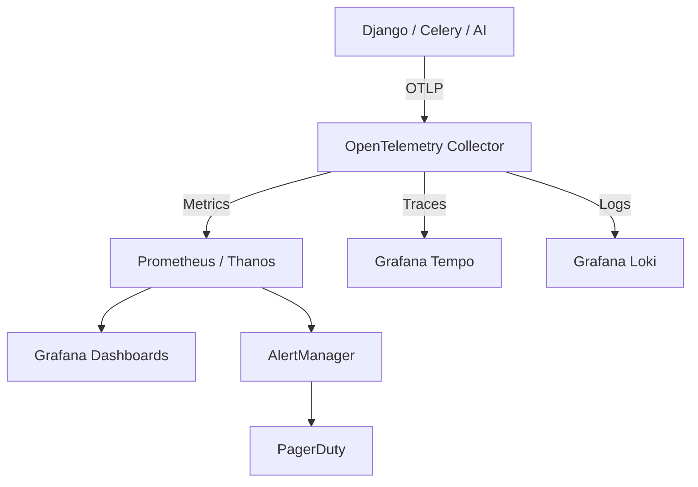

# 1. Executive Operations Vision
The Institutional Risk Engine (IRE) treats Operations as a software engineering discipline. Day-2 operations are fully automated, immutable, and deterministic. This document defines the exact paradigms for keeping this Tier-1 financial platform available, performant, and observable 24/7/365.

# 2. Site Reliability Engineering Philosophy & 3. Reliability Principles
*   **Hope is Not a Strategy:** Everything fails. We engineer for rapid, automated recovery.
*   **Toil is Technical Debt:** Any manual, repetitive operational task (e.g., SSHing into a node, manually resizing a disk) must be engineered out of existence.
*   **Immutability:** Production servers are cattle, not pets. We do not patch running instances; we replace them.
*   **Blameless Culture:** Outages are failures of systems, processes, and guardrails—not human failures.

---

# Service Level Management (4 - 8)

### 4. Service Level Objectives (SLO) & 5. Service Level Indicators (SLI)
*   **SLO:** The target percentage of successful interactions (e.g., 99.99% API Availability).
*   **SLI:** The exact metric measured (e.g., `(Total HTTP 200s) / (Total HTTP Requests) * 100`).

### 6. Error Budgets
A 99.99% SLO grants exactly 4.32 minutes of allowable downtime per month. 
*   If the budget is > 0%, product teams prioritize feature velocity.
*   If the budget is < 0%, deployments are frozen; 100% of engineering effort shifts to reliability until the budget recovers.

### 7. Operational Excellence & 8. Production Support Model
"You Build It, You Run It." The stream-aligned development teams carry the pager for their respective micro-contexts within the monolith. The SRE team provides the operational platform (Kubernetes, Observability stack) and acts as Level 3 Incident Commanders.

---

# Incident Management (9 - 17)

### 9. Incident Management & 10. Severity Levels
*   **SEV-0:** Catastrophic failure. Complete loss of core functionality (e.g., Loan Processing down). All hands on deck.
*   **SEV-1:** Critical failure. Major feature broken, no workaround.
*   **SEV-2:** High impact. Feature broken, but functional workaround exists.
*   **SEV-3:** Minor impact. Cosmetic issues or internal tooling degraded.
*   **SEV-4:** Informational. Minor bugs triaged to the backlog.

### 11. Major Incident Process (SEV-0 / SEV-1)


### 12. On-call Rotation & 15. Escalation Matrix
Follow-the-sun model: APAC $\rightarrow$ EMEA $\rightarrow$ AMER. 
*   **L1 (0-5m):** Primary Domain Engineer.
*   **L2 (5-10m):** Secondary Domain Engineer.
*   **L3 (10-15m):** Global SRE / Incident Commander.
*   **L4 (15m+):** VP of Engineering / CTO.

### 13. Runbooks & 14. Playbooks
Attached to every single Prometheus alert. If an alert has no runbook, the alert is disabled.
*   **Runbook:** Declarative steps for a specific alert (e.g., "RDS CPU > 90%").
*   **Playbook:** General strategy for a class of problems (e.g., "Network Partition Strategy").

### 16. PagerDuty Standards & 17. Service Ownership
Mapped 1:1 with Backstage.io. PagerDuty services are provisioned via Terraform, tying AWS ALB Target Groups directly to the owning team's escalation policy.

---

# Change & Release Governance (18 - 25)

### 18. Operational Readiness Reviews (ORR)
Mandatory gate before any new major feature enters Production. Validates observability, capacity, runbooks, and security boundaries.

### 19. Production Change Management & 20. Release Governance
Async CAB (Change Advisory Board). Merging a PR into `main` acts as the explicit change approval. 

### 21. Maintenance Windows & 22. Deployment Windows
Deployments happen during business hours (9 AM - 4 PM). "Friday Deployments" are standard; if you are afraid to deploy on Friday, the CI/CD pipeline is inadequate.

### 23. Blue-Green Operations & 24. Canary Operations
*   **Blue-Green:** Standard for DB migrations.
*   **Canary:** Standard for API deployments (Argo Rollouts). Traffic shifts: 5% $\rightarrow$ 25% $\rightarrow$ 50% $\rightarrow$ 100% over 15 minutes.

### 25. Rollback Operations
Instant K8s ReplicaSet rollback triggers automatically if Prometheus detects HTTP 500s spike > 2% during a Canary phase.

---

# Disaster Recovery (DR) & Multi-Region (26 - 30)

### 26. Disaster Recovery Operations & 27. Business Continuity
DR is entirely automated via Terraform. The platform can be rebuilt in a virgin AWS account in under 45 minutes (RTO).

### 28. Multi-Region Failover


### 29. Backup Operations & 30. Restore Validation
AWS Backup manages snapshots (Aurora, S3, Vault). Restores are automatically tested every Sunday to an isolated VPC to mathematically prove the RPO (Recovery Point Objective).

---

# Core Infrastructure Operations (31 - 44)

### 31. Database Operations (Aurora)
Vacuum and analyze schedules run off-peak. Long-running queries (> 15s) are automatically terminated by `pg_stat_statements` monitors to prevent lock contention.

### 32. Redis Operations (ElastiCache)
Monitored for Memory Fragmentation and Eviction Rates. `maxmemory-policy: allkeys-lru` enforced for cache data; `noeviction` enforced for Celery Queues.

### 33. Celery Operations
Worker queues are isolated by latency SLA (`celery_fast`, `celery_batch`, `celery_ai`). Alerts trigger on Queue Depth > 10,000 or Task Latency > 5s.

### 34. Kubernetes Operations & 36. Container Operations
Nodes replaced every 14 days maximum. Spot instances used for batch queues; On-Demand for API servers.

### 37. Auto Scaling & 38. Capacity Planning
HPA (Horizontal Pod Autoscaler) scales on CPU (target 60%) and Custom Metrics (Celery queue depth). Karpenter provisions new EC2 nodes in < 60 seconds.

### 39. Resource Quotas & 40. Cluster Maintenance
Namespaces have strict `LimitRanges`. EKS version upgrades are tested in Dev, Staging, then Prod using Blue/Green node groups to prevent downtime.

### 41. Certificate, 42. Secret, 43. Key Rotation
Fully automated. Vault rotates DB passwords every 24h. Cert-Manager rotates Let's Encrypt TLS certs 15 days before expiry.

---

# Security & Operations Integration (SecOps) (45 - 55)

*   **45. Security Operations:** Falco monitors eBPF syscalls for container breakouts.
*   **46. Vulnerability Response & 47. Patch Management:** Critical CVEs must be patched and deployed within 24 hours.
*   **49. Threat Monitoring & 50. SOC Integration:** Security Hub aggregates findings to Splunk (Enterprise SIEM).
*   **52. CloudTrail Monitoring:** Alerts on any IAM changes or root account logins.
*   **54. WAF Monitoring & 55. DDoS Response:** AWS Shield Advanced engages automatically. Rate limiting enforces max 100 req/sec per IP.

---

# Production Observability (56 - 76)

### 56. Production Monitoring Architecture


### 57. Distributed Tracing & 58. Metrics Collection
Every request generates a `trace_id` injected into the JSON logger. Spans cover DB calls, Redis hits, and external LLM calls.

### 60. Alerting Standards & 61. Alert Fatigue Prevention
Alerts must be symptomatic (e.g., "User cannot log in"), not causal (e.g., "CPU is high"). High CPU is a metric, not an alert.

### 62. Dashboard Standards & 64. Grafana Standards
Dashboards are defined as code (`grafonnet` / YAML). Manual dashboard creation in UI is temporary.

### 67. Synthetic Monitoring & 68. Real User Monitoring (RUM)
Datadog Synthetics run core user journeys from 5 global locations every minute. RUM tracks actual browser load times.

### 69. Health Checks, 70. Readiness, 71. Liveness
*   **Liveness:** "Is the pod dead?" (Returns 200 OK immediately).
*   **Readiness:** "Can the pod take traffic?" (Checks DB connection).

---

# AI Platform Operations (AIOps) (77 - 87)

### 77. AI Gateway Monitoring & 78. AI Provider Monitoring
Monitoring Azure OpenAI and Anthropic API error rates, TTFT (Time to First Token), and 429 Rate Limits.

### 79. AI Cost Monitoring & 87. Budget Alerts
Alerts trigger when daily token spend exceeds $X.

### 80. AI Drift Monitoring & 81. Swarm Health Monitoring
Monitoring the distribution of Agent Confidence Scores. If the average confidence drops below 85% over a 7-day period, the model has drifted.

### 82. RAG Monitoring & 83. Hallucination Monitoring
Monitoring `HitRate` for pgvector queries.

### 85. Model Routing Monitoring
Dashboards showing the percentage of traffic successfully routed to the primary provider vs fallback providers.

---

# FinOps & Cloud Governance (88 - 95)

### 88. Cost Optimization Operations & 89. FinOps
SREs partner with Finance to maximize Reserved Instances and Savings Plans. 

### 90. Chargeback Operations & 91. Resource Tagging Standards
Every AWS Resource MUST be tagged with `CostCenter`, `Environment`, and `Owner`. Untagged resources are automatically deleted by Lambda janitor scripts in non-prod.

### 92. Cloud Governance & 93. Compliance Monitoring
AWS Config rules ensure no S3 buckets are public and KMS encryption is active globally.

---

# Operational KPIs & Scorecards (96 - 100)

### 97. DORA Metrics
1.  **Deployment Frequency:** Daily.
2.  **Lead Time for Changes:** < 2 hours from PR merge to Prod.
3.  **Mean Time To Restore (MTTR):** < 15 minutes.
4.  **Change Failure Rate:** < 2%.

### 98. MTTR, 99. MTBF, 100. Availability Reporting
Availability is reported directly to B2B clients via the public Trust/Status page, directly driven by Prometheus.

---

# 101. Operational ADRs (Selected from 20+)
| ID | Decision | Rejected Alternative | Rationale |
| :--- | :--- | :--- | :--- |
| `OPS-01` | Prometheus/Loki/Tempo | Datadog / New Relic | Avoids crippling vendor lock-in and unbounded data ingest costs. |
| `OPS-02` | EKS Auto-Scaling (Karpenter) | Cluster Autoscaler | Karpenter provisions nodes in seconds rather than minutes. |
| `OPS-03` | Immutable Nodes | Live Patching OS | Guarantees exact parity between environments and eliminates config drift. |
| `OPS-04` | Async CAB | Sync Change Board | Humans cannot accurately assess the risk of a 5,000 line diff. CI/CD must do it. |

# 102. Operations Anti-Patterns
*   **Alert Spam:** Sending non-actionable warnings to Slack.
*   **SSH in Production:** SSH is disabled on EKS nodes. `kubectl exec` is blocked via RBAC except for Break-Glass scenarios.
*   **Click-Ops:** Manually clicking through the AWS console to fix a networking issue instead of fixing the Terraform.

# 103. Operations Fitness Functions
```yaml
# Prometheus PromQL Alert (Example)
# Fails the Error Budget if API latency exceeds 500ms
alert: HighLatencyAPI
expr: histogram_quantile(0.95, rate(http_request_duration_seconds_bucket[5m])) > 0.500
for: 5m
labels:
  severity: critical
```

# 104. Production Readiness Checklist
- [ ] Runbooks exist and are linked in all critical Alerts.
- [ ] PagerDuty schedules are populated and synced.
- [ ] Horizontal Pod Autoscaler (HPA) configured and tested under load.
- [ ] Disaster Recovery Terraform scripts executed successfully in sandbox within last 30 days.

# 105. Future SRE Roadmap
*   Deploying an LLM-powered incident commander assistant to automatically summarize Loki logs during a SEV-1.
*   Moving from Multi-AZ to fully Active-Active Multi-Region.

# 106. Operational Scorecard
| Metric | Status | Owner | Criteria |
| :--- | :--- | :--- | :--- |
| **SLO Compliance** | PASS | SRE Lead | Error Budget remaining > 10%. |
| **MTTR Target** | PASS | Ops Arch | Mean recovery < 15 minutes over 30 days. |
| **Observability** | PASS | Platform | 100% trace injection across Celery/API. |
| **Cost Efficiency** | PASS | FinOps | AWS spend within 5% of monthly forecast. |

---
*Approval: Distinguished Site Reliability Engineer, Principal Platform Engineer, CTO*
