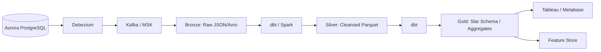

# 1. Executive Data Vision
Data is not merely an exhaust of the Institutional Risk Engine (IRE); it is a first-class product. This specification defines the transition from operational data (OLTP) to analytical data (OLAP), ensuring that every byte of structured, unstructured, and vector data is discoverable, governed, immutable, and optimized for both human Business Intelligence (BI) and Machine Learning (ML) inference.

# 2. Data Architecture Principles
*   **Data as a Product:** Data is owned, versioned, and served with a guaranteed SLA by the domain that produces it.
*   **Decentralized Ownership (Data Mesh):** Centralized data lakes fail. Domains own their data pipelines.
*   **Immutable History:** Once a fact happens, it is recorded forever. Updates are handled via append-only Slowly Changing Dimensions (SCD).
*   **AI-Ready:** Analytics pipelines must output datasets optimized for LLM RAG pipelines and LightGBM model training natively.

---

# Data Mesh & Fabric (3 - 8)

### 3. Data Mesh & 4. Data Fabric
IRE adopts a **Data Mesh** paradigm for ownership (decentralized domains) but leverages a **Data Fabric** for underlying infrastructure (centralized AWS S3 + Snowflake + dbt).

### 5. Data Domains & 6. Data Products
Data is bounded by its source context. The `CreditContext` produces a `Loan Risk Assessment` Data Product.
*   A Data Product must have: Discoverable schema, SLA, Data Steward, and explicit IAM access policies.

### 7. Domain Ownership & 8. Data Contracts
Data Producers guarantee the schema of their Data Products via **Data Contracts** (enforced by JSON Schema). If a developer alters an upstream PostgreSQL table, CI/CD checks the Data Contract. Breaking the contract blocks the PR.

---

# Data Governance & Metadata (9 - 27)

### 9. Data Lifecycle & 10. Data Classification
Data moves from Ingestion $\rightarrow$ Processing $\rightarrow$ Consumption $\rightarrow$ Archival. All data is classified (Public, Internal, Confidential, Restricted/PII) at the moment of ingestion.

### 11. Master Data Management (MDM) & 12. Reference Data
*   **Master Data:** Core entities (`Customer`, `Institution`).
*   **Reference Data:** Static lookups (`ISO_Currency`, `State_Codes`). Stored in Redis for operational speed, synced to the Lakehouse for reporting.

### 13. Metadata Management & 15. Data Catalog
Alation (or AWS DataZone) serves as the unified Enterprise Data Catalog. Every column in the Lakehouse must have a documented description.

### 14. Business Glossary
Managed via Backstage.io. "LTV" has exactly one mathematical definition across the entire organization.

### 16. Data Discovery, 17. Data Lineage, 18. Data Provenance
Lineage is tracked column-by-column from the Django UI $\rightarrow$ PostgreSQL $\rightarrow$ Debezium $\rightarrow$ S3 $\rightarrow$ dbt $\rightarrow$ Snowflake Dashboard.

### 19. Data Governance & 20. Data Stewardship
Governed by the Enterprise Data Council. Data Stewards approve access requests to `Confidential` tier data products.

### 21. Data Quality & 22. Quality Dimensions
Quality is measured by: Accuracy, Completeness, Consistency, Timeliness, Validity, and Uniqueness.

### 23. Data Validation & 24. Data Cleansing
Handled in the `Silver` layer of the Lakehouse. Nulls are imputed, strings stripped, and anomalies flagged.

### 25. Data Profiling
Great Expectations runs automatically against new ingestion pipelines to detect semantic drift (e.g., "The average loan amount jumped 500x today").

### 26. Schema Evolution & 27. Schema Registry
Avro schemas are stored in the Confluent Schema Registry. Only forward-compatible schema changes are allowed.

---

# Data Modeling (28 - 36)

### 28. Data Modeling Strategy
*   **29. Conceptual:** Whiteboard mapping of the business.
*   **30. Logical:** Foreign keys and cardinality (Entity-Relationship Diagrams).
*   **31. Physical:** DDL for PostgreSQL and Snowflake.

### 32. Relational Modeling (OLTP)
Optimized for Writes (3NF). Core to Django and Aurora PostgreSQL.

### 33. Dimensional Modeling (OLAP) & 34. Star Schema
Optimized for Reads. Core to the Data Warehouse. Central `Fact` tables surrounded by `Dimension` tables.
*   **35. Snowflake Schema:** Generally avoided in favor of Star Schemas to reduce JOIN overhead, unless dimensions are excessively large.

### 36. OLTP vs OLAP Boundary
OLTP (Aurora) is strictly isolated from OLAP (Snowflake). Queries taking > 5 seconds belong in OLAP.

---

# Lakehouse Architecture (37 - 44)

### 37. Operational Data Store (ODS) & 38. Data Warehouse
ODS is deprecated. Data flows directly into the **Lakehouse**.

### 39. Data Lake & 40. Lakehouse
AWS S3 serves as the Data Lake (cheap storage). Snowflake/Databricks provides the Lakehouse compute layer. Data is stored in open formats (Apache Parquet / Iceberg).



### 41. Bronze (Raw)
Immutable, unvalidated, exact replicas of source system events. Retained indefinitely for replay.

### 42. Silver (Cleansed)
Validated, typed, deduplicated, and masked (PII removed). Usable by Data Scientists.

### 43. Gold Layers (Curated)
Business-level aggregations. Usable by Business Analysts.

### 44. Data Marts
Subset of Gold layer optimized for specific departments (e.g., `Risk Data Mart`, `Compliance Data Mart`).

---

# Data Engineering & Pipelines (45 - 62)

### 45. ETL vs 46. ELT
IRE strictly uses **ELT** (Extract, Load, Transform). Data is extracted from Postgres, loaded into Snowflake (Bronze), and transformed within Snowflake using `dbt`.

### 47. CDC (Change Data Capture) & 48. Debezium
Aurora PostgreSQL Write-Ahead Logs (WAL) are captured by Debezium. This eliminates nightly batch extract loads on the OLTP database.

### 49. Kafka, 50. Event Streaming, 51. Event Sourcing
Domain Events are streamed via Kafka (AWS MSK). Consumers can rewind the Kafka topic to replay history.

### 52. Streaming Analytics vs 53. Batch Processing
*   **Streaming:** Flink for real-time fraud detection.
*   **Batch:** Airflow for nightly financial reconciliation.

### 54. Airflow & 57. Pipeline Orchestration
Apache Airflow (AWS MWAA) orchestrates the DAG (Directed Acyclic Graph) of data pipelines.

### 55. dbt & 58. Data Transformations
`dbt` manages all SQL transformations. SQL is treated as code (version controlled, tested, deployed via CI/CD).

### 56. Data Pipelines
Pipelines are idempotent. Running a pipeline twice for yesterday's date yields the exact same state, not duplicate data.

### 59. Data Versioning & 60. Time Travel
Apache Iceberg enables `SELECT * FROM loans AS OF '2025-01-01'`.

### 61. Slowly Changing Dimensions (SCD)
*   **SCD Type 1:** Overwrite (Fixing a typo).
*   **SCD Type 2:** Add a new row with `valid_from` and `valid_to` (Tracking address changes). Mandated for Risk dimensions.

### 62. Historical Data
All historical changes to loan attributes are preserved forever in the Lakehouse to ensure reproducibility of AI decisions.

---

# Data Security & Privacy (63 - 75)

### 63. Data Retention, 64. Archival, 65. Purging
S3 Lifecycle rules transition Bronze data to Glacier Deep Archive after 1 year.

### 66. Data Encryption, 67. Tokenization, 68. Masking
Dynamic Data Masking in Snowflake hides SSNs from Data Analysts, revealing them only to Compliance Officers.

### 69. Row-Level Security (RLS) & 70. Column-Level Security
Enforced natively in Snowflake. An analyst for Tenant A executing `SELECT * FROM core_loans` will *only* see Tenant A's rows.

### 71. Multi-Tenant Data Isolation
Lakehouse data uses `tenant_id` clustering keys. Cross-tenant accidental `JOIN`s are blocked by RLS.

### 72. Data Residency & 73. GDPR
Data explicitly tagged with geography. Deletion requests execute a Spark job to scrub PII from all Bronze, Silver, and Gold Parquet files.

### 74. Audit Data & 75. Immutable Data
Lakehouse transaction logs are immutable and forwarded to the Enterprise SIEM.

---

# Analytics & BI Architecture (76 - 86)

### 76. Financial Data Standards & 77. Risk Data
BCBS 239 compliance required. Risk data aggregation capabilities must be mathematically provable.

### 78. Regulatory Reporting
Automated SQL pipelines generate the exact formats required by the Federal Reserve and OCC.

### 79. BI Architecture & 80. Executive Dashboards
Tableau serves as the enterprise BI tool, connecting directly to Snowflake Gold schemas.

### 81. Self-Service Analytics
Analysts have read access to the Silver layer to build their own ad-hoc dashboards in Metabase without bottlenecking Data Engineering.

### 82. Semantic Layer & 83. Metrics Layer
Cube.js or dbt Semantic Layer defines metrics in code. The formula for "Default Rate" is defined once, centrally.

### 84. KPI Definitions & 85. Reporting Standards
Documented in the Data Catalog. Dashboards must render in < 3 seconds.

### 86. Time-Series Analytics
Used heavily for tracking macroeconomic trends (FRED data) against portfolio default rates.

---

# AI & Machine Learning Data Architecture (87 - 100)

### 87. Feature Store & 88. Feature Engineering
Feast manages the Feature Store. Features computed in batch (e.g., `average_account_balance_30d`) are served to both the LightGBM models (offline training) and Redis (online inference).

### 89. ML Dataset Versioning
DVC (Data Version Control) tracks exact datasets used to train models.

### 90. Training, 91. Validation, 92. Inference Data
Training data requires a "Point-in-Time" join to ensure no future data leaked into a historical prediction.

### 93. Model Monitoring Data & 94. AI Data Lineage
Every inference outputs a record to Snowflake containing: `model_version`, `input_features`, `prediction_output`, and `actual_outcome` (when realized) for drift detection.

### 95. Vector Embeddings & 96. pgvector
While pgvector is used for operational RAG, the Data Lake stores the offline embedding cache to train Custom LLM adapters or fine-tune embedding models.

### 97. Embedding Lifecycle & 98. Vector Governance
When an embedding model is updated (e.g., `text-embedding-3-large`), Spark orchestrates the re-embedding of 10 million historical documents into the Lakehouse.

### 99. RAG Data & 100. Knowledge Base Management
Unstructured text (Committee Memorandums, PDFs) is parsed, OCR'd, and stored in Iceberg tables containing the raw text, chunks, and metadata.

---

# 101. Data Engineering ADRs (Selected)
| ID | Decision | Rejected Alternative | Rationale |
| :--- | :--- | :--- | :--- |
| `DATA-01` | Debezium CDC | Nightly Batch Query | Batch queries crush OLTP performance and lack intra-day change history. |
| `DATA-02` | Apache Iceberg | Hive Metastore | Iceberg provides ACID transactions and time-travel on the Data Lake. |
| `DATA-03` | dbt for Transformations | Stored Procedures | dbt provides testing, CI/CD, and dependency graphs for SQL. |
| `DATA-04` | Data Mesh Ownership | Central Data Team | Central data teams become a bottleneck; domain teams understand their data best. |
| `DATA-05` | SCD Type 2 for Risk | SCD Type 1 | We must be able to reproduce a credit decision exactly as the data looked on that date. |

# 102. Data Engineering Anti-Patterns
*   **The Data Swamp:** Dumping raw JSON into S3 without a Data Catalog or schema definition.
*   **Business Logic in BI:** Writing complex `CASE WHEN` logic in a Tableau dashboard instead of the dbt Semantic Layer.
*   **Brittle Pipelines:** ETL jobs that fail if a single upstream row has a NULL value (use Great Expectations to quarantine bad rows instead).
*   **SELECT * in Production:** Banned in dbt models. Explicit column selection is required.

# 103. Data Fitness Functions
```python
# test_data_contracts.py
def test_no_breaking_schema_changes():
    # Fails CI if a developer tries to DROP a column that a Snowflake dbt model depends on
    assert schema_registry.is_backward_compatible(new_schema, old_schema)
```

# 104. Production Readiness Checklist
- [ ] dbt tests (`not_null`, `unique`, `accepted_values`) run in CI for all Gold tables.
- [ ] Role-Based Access Control (RBAC) verified in Snowflake.
- [ ] Great Expectations data quality checks integrated into Airflow DAGs.

# 105. Future Data Platform Roadmap
*   Deploying an internal GenAI "Data Analyst" Agent that can write SQL against the Semantic Layer via natural language.
*   Migrating real-time features from Redis to a dedicated Vector/Feature Store (e.g., Hopsworks or Tecton).

# 106. Final Data Engineering Scorecard
| Domain | Status | Owner | Criteria |
| :--- | :--- | :--- | :--- |
| **Ingestion** | PASS | Data Eng | CDC lag < 5 minutes from OLTP to Bronze. |
| **Quality** | PASS | Data Steward| dbt test pass rate = 100%. |
| **Governance**| PASS | Chief Data | All Silver/Gold columns documented in Catalog. |
| **AI Ready** | PASS | AI Arch | Features served to LightGBM without data leakage. |

---
*Approval: Distinguished Data Architect, Principal Data Engineer, Chief Data Officer*
