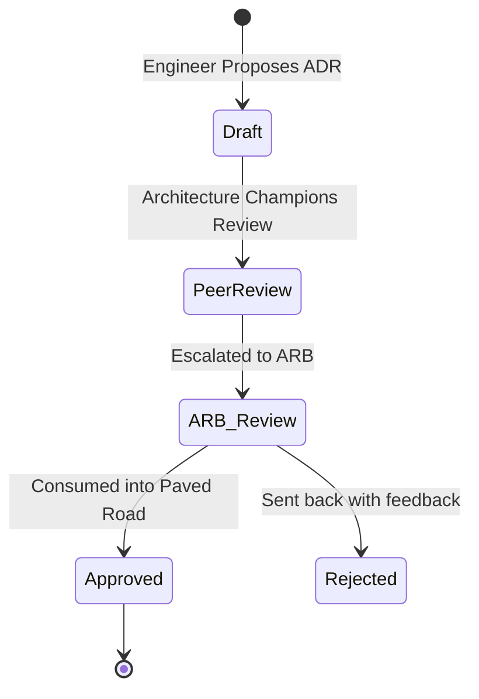

# 1. Executive Architecture Governance
The Institutional Risk Engine (IRE) operates within a Tier-1 financial regulatory environment. This specification defines the absolute governance, guardrails, and compliance mechanisms required to control technical entropy, manage technical debt, and ensure all engineering teams remain strictly aligned with the enterprise architecture vision established in Documents 00-15.

# 2. Executive Architecture Vision & 3. Architecture Philosophy
*   **Decisions as Code:** We govern through automation. Manual review boards are a fallback, not a primary control.
*   **Paved Roads:** The Enterprise Architecture provides highly secure, compliant, and scalable paths for engineers. Straying from the paved road requires explicit CTO exception.
*   **Immutability of Decisions:** Architectural decisions are immutable once deployed, unless officially superseded by a new ADR.

# 4. Enterprise Engineering Principles & 5. Governance Objectives
*   Minimize technology sprawl.
*   Maximize component reuse.
*   Ensure 100% compliance with data privacy, security, and banking regulations (BCBS 239, SOC2).
*   Maintain a predictable and transparent technical debt ledger.

---

# Enterprise Architecture Governance (6 - 15)

### 6. Architecture Review Board (ARB) & 7. Technical Steering Committee (TSC)
The ARB is the ultimate authority on system design. It consists of the Chief Architect, CISO, and Principal Engineers. The TSC governs the roadmap and funding.

### 8. CTO Governance & 9. Chief Architect Responsibilities
The CTO owns the ultimate technology risk. The Chief Architect owns the structural integrity and interoperability of the IRE monolith and its integrations.

### 10. Domain Architect Responsibilities & 11. Architecture Owners
Each Bounded Context (e.g., `Credit`, `Identity`) has a designated Architecture Owner (Principal/Staff Engineer) responsible for maintaining clean boundaries.

### 12. Architecture Champions
Senior engineers embedded within feature teams who act as the first line of architectural governance.

### 13. Architecture Escalation Process & 14. Review Lifecycle


### 15. Architecture Approval Process
All architectural changes that cross Bounded Contexts, introduce new data stores, or alter security perimeters MUST undergo synchronous ARB review. Intra-context decisions are approved asynchronously by the Domain Architect.

---

# Architecture Decision Records (ADRs) (16 - 25)

### 16. ADR Standards & 17. ADR Templates
All architectural decisions MUST be recorded using the standardized ADR format (Title, Context, Decision, Consequences, Compliance).

### 18. ADR Lifecycle, 19. Versioning, 20. Reviews
ADRs are stored as Markdown in `/docs/adrs/`. They are immutable (cannot be edited after approval).

### 21. ADR Superseding & 22. ADR Repository
If a decision changes (e.g., migrating from Redis to Memcached), a new ADR is created, marking the old ADR as `Superseded`.

### 23. Decision Ownership, 24. Trade-off Analysis, 25. Traceability
Every ADR MUST list the specific engineering alternatives considered and the explicit financial/technical reason they were rejected. Decisions MUST map directly back to a Jira Epic.

---

# Enterprise Standards Management (26 - 36)

The following standards are mathematically enforced via CI/CD Policy as Code (OPA/Conftest).

### 26. Approved Programming Languages & 27. Approved Frameworks
*   **Backend:** Python 3.12+ (Strict Mypy). Django 5.x.
*   **Frontend:** TypeScript 5.x. React 18+.
*   *Exceptions require ARB approval.*

### 28. Approved Databases & 29. Messaging Systems
*   **RDBMS:** Amazon Aurora PostgreSQL 16+.
*   **Cache/Queue:** Amazon ElastiCache (Redis 7+).
*   **Streaming:** Apache Kafka (AWS MSK).

### 30. Approved AI Providers & 31. Cloud Services
*   **AI:** Azure OpenAI (GPT-4o), AWS Bedrock (Claude 3.5), Local (LightGBM).
*   **Cloud:** AWS exclusively. Multi-cloud is explicitly banned to prevent lowest-common-denominator architecture.

### 32. Approved Infrastructure & 33. Security Standards
*   **Compute:** EKS (Kubernetes 1.30+), Karpenter.
*   **Security:** HashiCorp Vault, AWS KMS.

### 34. Technology Standard Lifecycle & 35. Deprecation Process
Technologies transition from `Active` $\rightarrow$ `Deprecated` $\rightarrow$ `Banned`. Usage of `Banned` technologies triggers a build failure in GitHub Actions.

---

# Technology Governance & Radar (36 - 46)

### 36. Technology Radar
Inspired by ThoughtWorks, maintained by the ARB.
*   **37. Adopt:** Standardized for enterprise use (e.g., OpenTelemetry).
*   **38. Trial:** Approved for use on non-critical paths (e.g., React Server Components).
*   **39. Assess:** Under investigation by R&D (e.g., Rust for data parsing).
*   **40. Hold:** Explicitly banned for new projects (e.g., MongoDB).
*   **41. Sunset:** Scheduled for removal (e.g., RabbitMQ).

### 42. Emerging Technology Evaluation & 43. Proof of Concept (PoC)
PoCs MUST be built in isolated AWS accounts.

### 44. Pilot Standards & 45. Production Adoption Criteria
A technology moves from Trial to Adopt ONLY after surviving 3 months in Production, passing SOC2 audit, and having automated Runbooks approved by SRE.

---

# Technical Debt Governance (47 - 55)

### 47. Technical Debt Classification & 48. Register
Tech Debt is tracked in Jira as `IssueType=TechDebt`. It is classified by severity (Critical, High, Medium, Low).

### 49. Technical Debt Budget & 50. Technical Debt Interest
Every sprint, 20% of engineering capacity is mandatorily reserved for Tech Debt repayment.

### 51. Technical Debt Prioritization & 52. Ownership
Prioritized based on "Interest Rate" (e.g., how much extra time is this debt costing engineers weekly?).

### 53. Refactoring Governance, 54. Legacy System, 55. Modernization Strategy
Refactoring is not a feature; it is maintenance. Large refactors (> 1 Sprint) require an ADR defining the Strangler Fig pattern migration.

---

# Architecture Compliance & Fitness Functions (56 - 65)

### 56. Compliance Reviews & 57. Automated Compliance
"If it isn't automated, it's merely a suggestion." Compliance is enforced via **Fitness Functions**.

### 58. Manual Architecture Audits & 59. Architecture Scorecards
Conducted quarterly.

### 60. Architecture KPIs & 61. Fitness Functions
*   `import-linter` enforces clean architecture boundaries.
*   `checkov` / `tfsec` enforces Infrastructure as Code (IaC) compliance.

### 62. Policy as Code
Open Policy Agent (OPA) / Rego policies evaluate all Terraform before deployment.
```rego
# Enforce all S3 buckets block public access
deny[msg] {
  resource := input.resource.aws_s3_bucket_public_access_block[name]
  not resource.block_public_acls
  msg = sprintf("Bucket %v MUST block public ACLs", [name])
}
```

### 63. Exception Handling, 64. Waiver Process, 65. Reporting
Waivers for non-compliance are valid for max 90 days, requiring CTO signature. Overdue waivers block all feature deployments for the owning team.

---

# Software Asset Governance (66 - 72)

### 66. Open Source Governance & 67. License Compliance
*   **Approved:** MIT, Apache 2.0, BSD.
*   **Banned:** GPL, AGPL (prevents copyleft contamination of IRE proprietary IP).

### 68. Third-Party Libraries & 69. Dependency Governance
Dependencies must have > 1,000 GitHub stars, recent commits within 6 months, and pass FOSSA license checks.

### 70. Supply Chain Governance, 71. SBOM, 72. Internal Framework
Syft generates an SPDX SBOM on every build. All internal frameworks must be versioned and published to the internal JFrog Artifactory.

---

# Documentation Governance (73 - 80)

### 73. Architecture Repository & 74. C4 Model Standards
All architecture MUST be documented using the C4 Model (Context, Container, Component, Code).

### 75. UML Standards & 76. Mermaid Standards
Mermaid is mandated. Images/Visio files are banned. Documentation must live alongside the code in Git.

### 77. ADR Documentation, 78. Version Control, 79. Review, 80. Knowledge Management
Backstage.io aggregates all markdown files (`TechDocs`) from Git repositories into a central searchable portal.

---

# Enterprise Portfolio Architecture (81 - 88)

### 81. Business Capability Mapping & 82. Capability Heat Maps
Aligning software domains to business functions (e.g., `Loan Origination`, `Risk Scoring`).

### 83. Value Streams, 84. Strategic Initiatives, 85. Portfolio Alignment
Ensuring engineering efforts trace directly to banking revenue or risk-reduction streams.

### 86. Platform Strategy & 87. Domain Ownership
The Internal Developer Platform (IDP) is treated as a product, with developers as the customers.

---

# Architecture Metrics & Risk Management (89 - 100)

### 89. Architecture Compliance % & 90. Standard Adoption %
Tracked via CI/CD pipeline metadata.

### 91. Platform Reuse % & 92. ADR Completion %
Measuring how often teams use the internal Shared Kernel vs rebuilding bespoke solutions.

### 93. Technical Debt Trend & 94. Technology Diversity Index
High technology diversity is considered toxic. We optimize for a narrow, deep technology stack.

### 95. Architecture Risk Management & 96. Vendor Risks
Concentration risk (e.g., AWS outage, OpenAI outage) is mitigated by Multi-Region and Model Fallback strategies documented in Docs 06 and 11.

### 97. Build vs Buy Governance
*   **Buy:** Commodity functionality (e.g., Auth0 for identity, Datadog for synthetics).
*   **Build:** Core proprietary algorithms (e.g., Credit Risk AI Swarm).

---

# Architecture Evolution (101 - 106)
*   **101. Modernization Roadmap:** Deprecating Celery in favor of Temporal.io by 2028.
*   **102. Cloud Evolution:** Transitioning from EKS to Serverless/Fargate where latency permits.
*   **103. AI Evolution:** Continuous migration toward open-weight models (Llama-4) to reduce API dependency.

---

# 107. Architecture ADRs (Selected from 20+)
| ID | Decision | Rejected Alternative | Rationale |
| :--- | :--- | :--- | :--- |
| `GOV-01` | Architecture Fitness Functions | Manual PR Reviews | Humans miss boundary violations; linters do not. |
| `GOV-02` | Trunk-Based Development | GitFlow | GitFlow creates integration hell; trunk-based forces modularity. |
| `GOV-03` | Open Policy Agent (OPA) | Terraform Sentinel | OPA is open-source and applies to Kubernetes as well as Terraform. |
| `GOV-04` | Ban AGPL Licenses | Permitting AGPL | Eliminates existential legal risk to the proprietary codebase. |

# 108. Architecture Anti-Patterns (Selected from 20+)
*   **Resume Driven Development:** Adopting a new framework just because it looks good on an engineer's resume (e.g., writing a CRUD API in Rust when Python suffices).
*   **Architecture by Committee:** Endless meetings without a decision. (Mitigation: Chief Architect has veto power).
*   **Ivory Tower Architecture:** Architects dictating designs without actually writing code. (Mitigation: All architects must commit code monthly).
*   **Not Invented Here (NIH):** Rebuilding Auth0 internally because "our use case is special" (It isn't).

# 109. Architecture Fitness Functions (Examples)
```yaml
# import_linter_config.yaml
# Enforces Domain Driven Design boundaries
[importlinter]
root_package = ire

[importlinter:contract:domain_isolation]
name = Domain layer must not import infrastructure
type = independence
modules =
    ire.contexts.credit.domain
    ire.contexts.credit.infrastructure
```

# 110. Production Architecture Readiness Checklist
- [ ] All components map to the C4 Model in Backstage.
- [ ] All cross-context integrations have an approved ADR.
- [ ] Technical Debt Jira tickets created for all known architectural shortcuts taken to meet deadlines.
- [ ] Open Policy Agent (OPA) passes all security and naming conventions.

# 111. Enterprise Architecture Roadmap
*   **Q3 2026:** Complete migration of all services into the Backstage Service Catalog.
*   **Q4 2026:** Achieve 100% test coverage on `import-linter` boundary rules.

# 112. Final Enterprise Architecture Governance Scorecard
| Category | Status | Owner | Criteria |
| :--- | :--- | :--- | :--- |
| **Tech Radar** | PASS | Chief Architect | 100% of codebase uses 'Adopt' tier tech. |
| **Tech Debt** | PASS | VPE | Debt ratio < 5% per SonarQube. |
| **Compliance** | PASS | CISO | OPA policies enforce all cloud rules. |
| **Documentation**| PASS | Principal Eng| Backstage TechDocs fully populated. |

---
*Approval: Distinguished Enterprise Architect, Chief Technology Officer, Enterprise Risk Committee*
