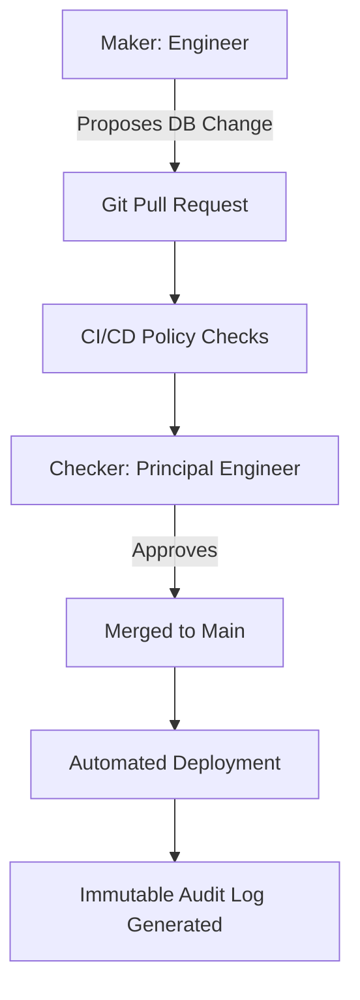

# 1. Executive Vision
The Institutional Risk Engine (IRE) operates in a highly regulated Tier-1 banking environment. Code is law, but compliance is survival. This specification defines the absolute governance guardrails ensuring that every line of code, every AI decision, and every data flow complies with global financial regulations, endures hostile regulatory examinations, and rigorously manages enterprise risk.

# 2. Architecture Principles & 3. Governance Principles
*   **Compliance by Design:** Regulatory adherence is baked into the CI/CD pipeline and the Database schema. It cannot be bypassed by engineers.
*   **Immutable Evidence:** "If it isn't logged immutably, it didn't happen." All system actions generate cryptographically signed audit trails.
*   **Assume Regulatory Hostility:** Systems are designed under the assumption that external auditors (e.g., OCC, Federal Reserve) are actively seeking compliance failures.

---

# Enterprise Risk Management (ERM) (4 - 13)

### 4. Enterprise Risk Management & 5. Risk Governance
ERM is the central nervous system of IRE. We operate under a strict **Risk Appetite Framework (6)**, defining exactly how much Operational, Financial, and Reputational risk the Board is willing to accept.

### 7. Risk Taxonomy
All risks are categorized into a standardized taxonomy (e.g., `Risk.Cyber.DataExfiltration`, `Risk.Model.Drift`) to ensure consistent Board reporting.

### 8. Three Lines of Defense
1.  **First Line (Engineering/Product):** Owns and manages the risk. Implements technical controls.
2.  **Second Line (Risk/Compliance):** Oversees the first line. Sets policies and conducts Risk Assessments.
3.  **Third Line (Internal Audit):** Independent verification reporting directly to the Board of Directors.

### 9. Enterprise Risk Register
A centralized GRC (Governance, Risk, and Compliance) system tracking all identified risks, mitigating controls, and residual risk scores.

### 10. Operational Risk & 11. Technology Risk
Tracking the risk of loss resulting from inadequate internal processes, people, or systems. Addressed via SRE automation (Doc 14).

### 12. Cyber Risk Governance & 13. Third-Party Risk
Cyber risk is quantified financially using the FAIR methodology. **Third-Party Risk (Vendor Risk / Concentration Risk)** is strictly managed; no single SaaS provider can cause a catastrophic bank failure.

---

# AI & Model Risk Management (MRM) (14 - 28)

### 14. AI Risk & 15. Model Risk Management
AI models are treated as financial models. They are subject to stringent MRM policies. A model is defined as any quantitative method applying statistical theories to process data into estimates.

### 16. Model Risk Committee & 17. AI Governance
The committee reviews every AI Swarm deployment. No AI agent can be deployed to production without explicit MRM sign-off.

### 18. Responsible AI, 19. Explainability, 20. Fairness
Models must be explainable (SHAP/LIME). AI is strictly monitored for **Bias Detection (21)** (e.g., ensuring rejection rates do not disproportionately impact protected classes under ECOA).

### 22. Human Oversight & 23. AI Accountability
AI is a Co-Pilot. High-risk decisions (e.g., loan rejection) mandate Human-in-the-Loop review. The Human is legally accountable for the AI's recommendation.

### 24. Regulatory AI Controls & 25. Model Validation
Adherence to the EU AI Act and NIST AI RMF. 
*   **26. Independent Model Review:** The Second Line of defense tests the model against adversarial datasets before deployment.
*   **27. Model Approval Process & 28. Change Risk Assessment:** Re-prompting an LLM constitutes a "Model Change" requiring full re-validation.

---

# Control Framework & Internal Controls (29 - 37)

### 29. Control Framework & 30. Internal Controls
Controls are mapped to specific risks in the Risk Register.
*   **31. Preventive Controls:** IAM policies blocking unauthorized access.
*   **32. Detective Controls:** SIEM alerts triggering on abnormal data egress.
*   **33. Corrective Controls:** Automated Terraform rollbacks.

### 34. Segregation of Duties (SoD)
A developer who writes code CANNOT approve their own Pull Request, nor can they deploy it to Production.

### 35. Maker Checker Controls & 36. Four Eyes Principle
All configuration changes (e.g., changing a feature flag in LaunchDarkly, modifying a risk threshold) require a Maker (who proposes the change) and a Checker (who approves it).

### 37. Approval Workflows


---

# Auditability & Evidence (38 - 48)

### 38. Enterprise Audit, 39. Internal Audit, 40. External Audit
The architecture is designed to be "Audit Ready" continuously.

### 41. Audit Evidence & 42. Audit Trails
Logs must answer: *Who* did *What*, *When*, *Where*, and *Why*.

### 43. Immutable Evidence & 44. Evidence Retention
Audit trails (CloudTrail, EKS Audit, Application Logs) are streamed to a Write-Once-Read-Many (WORM) AWS S3 bucket in a highly restricted AWS account. Retention is set to 7 years.

### 45. Regulatory Examinations & 46. Compliance Monitoring
During an OCC exam, engineers do not query databases for evidence. Evidence is queried from the centralized, read-only SIEM / Data Lake.

### 47. Continuous Compliance & 48. Regulatory Reporting
Automated SQL pipelines extract data from the Lakehouse specifically formatted for Federal Reserve (e.g., FR Y-9C) and OCC submissions.

---

# Banking Regulations & Standards (49 - 60)

### 49. Banking Regulations Overview
IRE must comply with a complex web of global and domestic financial regulations.

### 50. BCBS 239 (Risk Data Aggregation)
Requires banks to generate accurate, reliable risk data instantly during a crisis. Solved via the Immutable Data Lakehouse (Doc 15).

### 51. Basel III
Capital adequacy calculations depend on the accuracy of the Loan Risk outputs.

### 52. OCC (Office of the Comptroller of the Currency) & 53. Federal Reserve
The primary regulators. Architecture must support instantaneous stress-testing scenarios.

### 54. FFIEC (Federal Financial Institutions Examination Council)
Standards for IT operations and cybersecurity are strictly adhered to.

### 55. SOX (Sarbanes-Oxley)
Financial reporting controls. Any code impacting financial math requires SOX-compliant CI/CD traceability.

### 56. SOC 2, 57. ISO 27001, 58. NIST
Governs information security management. Drata/Vanta is used for continuous SOC2 control monitoring.

### 59. GDPR & 60. CCPA (Privacy)
"Right to be Forgotten" workflows are codified. PII is encrypted at the field level.

---

# Privacy, Legal, and Ethics Governance (61 - 71)

### 61. Privacy Governance & 62. Data Protection
Data is classified. PII cannot be used in lower environments (Dev/Test) under any circumstance.

### 63. Records Management & 64. Legal Hold
If litigation is pending, Legal Hold APIs prevent the automated purging of specific records, overriding standard 7-year retention policies.

### 65. Litigation Readiness & 66. Electronic Discovery (eDiscovery)
The architecture supports rapid eDiscovery queries across structured databases and unstructured document stores via the Data Catalog.

### 67. Policy Management & 68. Policy Lifecycle
Policies are stored as Markdown in a dedicated repository, mapped to Code via Policy-as-Code.

### 69. Exception Management, 70. Compensating Controls, 71. Waiver Process
Exceptions to policies (e.g., opening port 22 temporarily) require a formal Waiver, valid for max 30 days, approved by the CISO, with compensating controls (e.g., enhanced monitoring).

---

# Reporting & Financial Crime Governance (72 - 86)

### 72. Compliance KPIs & 73. KRIs (Key Risk Indicators)
*   **KRI Example:** Percentage of Critical CVEs unpatched after 48 hours. If > 0, triggers Red status.

### 74. Risk Dashboards, 75. Board Reporting, 76. Executive Reporting
Tableau dashboards aggregate KRIs directly from JIRA, SonarQube, and AWS Security Hub for the Board of Directors.

### 78. Risk Committees & 79. Compliance Committees
Meet monthly to review KRIs and approve major architectural shifts.

### 80. Ethics Committee & 81. Whistleblower Process
Independent system for reporting unethical algorithmic behavior or compliance violations.

### 82. Fraud Governance, 83. Financial Crime, 84. AML, 85. Sanctions, 86. KYC
IRE integrates directly with LexisNexis/Alloy for real-time OFAC sanctions screening and Anti-Money Laundering checks during loan origination.

---

# Resilience & Continuous Assurance (87 - 100)

### 87. Operational Resilience & 88. Crisis Governance
The platform must withstand severe cyber attacks. RTO/RPO limits are legally binding.

### 89. Business Continuity Governance
Verified through bi-annual Chaos Engineering simulations (Doc 13).

### 90. Regulatory Change Management & 91. Enterprise Policies
When the OCC issues new guidance, the Legal team maps it to JIRA Epics, ensuring the software architecture adapts.

### 94. Control Testing & 95. Continuous Assurance
Internal Audit scripts run continuously against the AWS APIs to ensure IAM roles comply with Least Privilege.

### 96. Compliance Automation & 97. Governance as Code
AWS Config rules automatically remediate compliance failures (e.g., re-enabling S3 block public access).

### 98. Policy as Code
Open Policy Agent (OPA) strictly blocks Terraform deployments that violate SOX/SOC2 requirements.

### 99. Regulatory Horizon Scanning & 100. Future Financial Regulations
The architecture is designed to be highly modular (Domain-Driven Design) to absorb upcoming regulations like the Digital Operational Resilience Act (DORA) and AI liability laws.

---

# 101. Risk & Compliance ADRs (Selected)
| ID | Decision | Rejected Alternative | Rationale |
| :--- | :--- | :--- | :--- |
| `RISK-01` | Immutable WORM Storage for Logs | Standard S3 | SOX/Audit requirements mandate cryptographic proof logs were not altered by root users. |
| `RISK-02` | Human-in-the-Loop for Rejections | Full Auto-Pilot AI | ECOA requires adverse action notices with explicit, explainable reasoning. |
| `RISK-03` | OPA for Infrastructure Policy | Manual Security Review | Manual reviews miss configurations; OPA guarantees 100% compliance at deploy time. |
| `RISK-04` | Multi-Region Active/Standby | Single Region | OCC guidelines mandate extreme resilience against regional cloud failures. |

# 102. Governance Anti-Patterns
*   **Compliance via Spreadsheet:** Tracking SOC2 controls in Excel instead of automated Vanta/Drata integration.
*   **Rubber Stamp Approvals:** A Manager clicking "Approve" on a PR without reading the code. (Solved via mandatory CI/CD gates).
*   **Audit as an Afterthought:** Trying to bolt on audit logs just before an OCC examination.

# 103. Risk Fitness Functions
```rego
# OPA Policy: Enforce WORM (Object Lock) on all Audit Buckets
deny[msg] {
  bucket := input.resource.aws_s3_bucket[name]
  bucket.tags.Type == "Audit"
  not bucket.object_lock_configuration.object_lock_enabled == "Enabled"
  msg = sprintf("Audit bucket %v MUST have Object Lock (WORM) enabled for Compliance", [name])
}
```

# 104. Production Regulatory Readiness Checklist
- [ ] SOC2 Continuous Monitoring agent deployed and passing all checks.
- [ ] Model Risk Committee has formally signed off on the AI Swarm Prompts.
- [ ] Data retention and GDPR "Right to be Forgotten" workflows tested in Staging.
- [ ] Segregation of Duties matrix verified (Devs do not have Prod AWS Console access).

# 105. Executive Compliance Scorecard
| Domain | Status | Owner | Criteria |
| :--- | :--- | :--- | :--- |
| **Model Risk (AI)** | PASS | CRO | SHAP explainability active; Bias metrics within threshold. |
| **Cyber Risk** | PASS | CISO | 0 unpatched Critical CVEs; OPA enforcing IaC policies. |
| **Audit Readiness** | PASS | Head of Audit | 100% immutable WORM logging for all DB transactions. |
| **Data Privacy** | PASS | DPO | PII field-level encryption active; GDPR deletion verified. |

---
*Approval: Chief Risk Officer, Chief Compliance Officer, Chief Information Security Officer*
