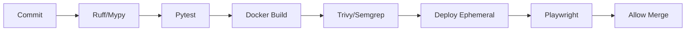

# 1. Executive Quality Vision
In a Tier-1 institutional banking environment, bugs do not just cause downtime—they cause catastrophic financial loss and regulatory fines. The Institutional Risk Engine (IRE) treats Quality Engineering (QE) not as an afterthought or a distinct phase, but as a continuous, mathematically provable discipline. Quality is engineered into the platform via automation, eliminating manual regression testing.

# 2. Quality Engineering Principles
*   **Quality is Everyone's Responsibility:** Engineers own the quality of their code. There is no "throw it over the wall to QA."
*   **100% Automation:** Manual testing is explicitly banned for regression.
*   **Fail Fast:** Bugs caught in the IDE cost $1 to fix. Bugs caught in Production cost $10,000.
*   **Determinism:** Tests must be 100% deterministic. Flaky tests are deleted or fixed immediately.

# 3. Shift Left Strategy & 4. Shift Right Strategy
*   **Shift Left:** Moving testing closer to the developer (IDE linting, pre-commit hooks, local Docker integration tests).
*   **Shift Right:** Testing in Production (Chaos Engineering, Canary deployments, Synthetic monitoring).

# 5. Quality Gates, 6. Definition of Ready, 7. Definition of Done
*   **DoR:** User story has BDD Acceptance Criteria, API contracts are drafted.
*   **DoD:** Code merged, 90% test coverage met, 0 SonarQube criticals, deployed to Staging, E2E passed.

---

# Test Strategy & Architecture (8 - 27)

### 8. Test Strategy & 9. Test Pyramid
IRE utilizes a rigid Test Pyramid:
*   **Unit (70%):** Blazing fast, isolated (Pytest/Jest).
*   **Integration (20%):** Testing DB/Redis/Kafka boundaries.
*   **E2E (10%):** Slow, brittle, user-journey focused (Playwright).

### 10. Test Trophy (Frontend)
For React, we favor the Test Trophy: heavy on Integration (React Testing Library) over pure Unit tests.

### 11. Static Analysis & 12. Code Quality
Enforced via SonarQube and Ruff. Cyclomatic complexity > 10 fails the build.

### 13. Unit Testing & 14. Component Testing
Strict isolation using Mocking. Business logic tested without DB calls.

### 15. Integration Testing
Uses `Testcontainers` to spin up ephemeral PostgreSQL and Redis instances.

### 16. Contract Testing & 17. Consumer Driven Contracts
Pact is used to ensure the React UI and Django API agree on JSON schemas before deployment.

### 18. API Testing
Direct REST/GraphQL testing using `pytest-django`.

### 19. UI Testing, 20. End-to-End Testing, 21. Smoke Testing
Playwright runs core journeys in headless Chromium. Smoke tests run post-deployment to verify basic Liveness.

### 22. Regression Testing & 23. Acceptance Testing
Fully automated via CI. Acceptance testing validates BDD `.feature` files via `pytest-bdd`.

### 24. UAT & 25. Exploratory Testing
The only permissible manual testing. Product Managers explore Edge Cases, not basic workflows.

### 26. Accessibility Testing & 27. Localization Testing
Axe-core runs inside Playwright to ensure WCAG 2.1 AA compliance.

---

# Security & Infrastructure Testing (28 - 37)

### 28. Security Testing
Shift-left security.

### 29. SAST, 30. DAST, 31. IAST
*   **SAST:** Semgrep scans code for secrets/vulns on PR.
*   **DAST:** OWASP ZAP runs against Staging.

### 32. Dependency Scanning & 33. Container Security
Trivy blocks Docker builds containing `HIGH` or `CRITICAL` CVEs.

### 34. Infrastructure Testing & 35. IaC Testing
`tfsec` and Checkov validate Terraform. `terratest` deploys AWS resources, tests them, and destroys them.

### 36. Database Testing & 37. Data Migration Testing
Migrations run against a sanitized clone of Production data in an ephemeral DB before merging.

---

# AI & Model Quality Engineering (38 - 44)

### 38. AI Model Testing & 39. Prompt Testing
Prompts are code. They require regression testing. We use `DeepEval` or `promptfoo`.

### 40. RAG Testing
Measuring `Context Precision` (Did we retrieve the right docs?) and `Answer Relevance` (Did the LLM answer the question?).

### 41. Hallucination Testing & 42. AI Safety Validation
LLM-as-a-Judge evaluates outputs against Golden Datasets to detect hallucinations.

### 43. Fairness Testing & 44. Explainability Validation
Ensuring the LightGBM models do not reject loans based on proxy variables (Zip Code). SHAP values are asserted in CI.

---

# Performance & Chaos Engineering (45 - 56)

### 45. Performance Testing & 46. Load Testing
`k6` scripts simulate 1,000 concurrent Loan Officers submitting applications.

### 47. Stress Testing & 48. Spike Testing
Determining the exact breaking point of the Aurora DB under 10x normal load.

### 49. Soak Testing & 50. Capacity Testing
Running the system at 80% load for 48 hours to detect Memory Leaks.

### 51. Chaos Engineering & 52. Fault Injection
Chaos Mesh randomly kills Kubernetes Pods and network links in Staging.

### 53. Disaster Recovery Testing & 54. Backup Restore Testing
Automated weekly restores of Aurora snapshots into an isolated VPC to prove RTO/RPO SLAs.

### 55. Resilience Testing & 56. Reliability Testing
Proving Celery queues successfully process DLQs (Dead Letter Queues) upon failure.

---

# Release Validation & Environments (57 - 69)

### 57. Browser, 58. Mobile, 59. Cross-Version Compatibility
Playwright tests run across Chrome, WebKit, and Firefox.

### 60. Backward & 61. Forward Compatibility
API tests assert `v1` endpoints still function when `v2` is deployed.

### 62. Feature Flag Testing
Playwright runs the E2E suite twice: once with the flag OFF, once with the flag ON.

### 63. Canary Validation & 64. Blue Green Validation
Argo Rollouts shift 10% traffic. If Datadog detects > 1% HTTP 500s, automated rollback occurs.

### 65. Production Verification & 66. Synthetic Monitoring
Datadog Synthetics run core E2E flows in Prod every 5 minutes.

### 67. Test Data Management (TDM)
`FactoryBoy` generates deterministic mock data. Production data is NEVER used in lower environments.

### 68. Test Environment Management & 69. Ephemeral Environments
Opening a PR automatically spins up a completely isolated Kubernetes namespace (`pr-1234`) via ArgoCD, runs E2Es against it, and destroys it.

---

# Automation & Metrics (70 - 93)

### 70. Test Automation
All tests run in GitHub Actions.

### 71. Selenium, 72. Playwright, 73. Cypress
Playwright is the enterprise standard due to auto-waiting and browser context isolation.

### 74. Pytest & 75. JUnit
Pytest for backend. Jest for frontend.

### 76. Mutation Testing
`mutmut` modifies our source code (e.g., changing `==` to `!=`). If our test suite still passes, our tests are weak.

### 77. Coverage Strategy & 78. Test Metrics
Absolute floor: 90% Line Coverage. 100% Branch Coverage for Financial Math functions.

### 79. Defect Management, 80. Severity, 81. Priority
Bugs are logged in Jira. Severity = Business Impact. Priority = Fix Order.

### 82. Root Cause Analysis & 83. Escaped Defects
Any bug found in Prod is an Escaped Defect requiring a "5 Whys" Postmortem.

### 84. Release Quality Gates & 85. CI/CD Test Pipeline


### 86. Parallel Testing & 87. Flaky Test Detection
Pytest runs via `pytest-xdist` on 16 cores. Flaky tests are automatically quarantined (skipped) by CI to avoid blocking deployments.

### 88. Test Observability, 89. Reporting, 90. Quality Dashboards
All test results stream to Datadog CI Visibility.

### 91. DORA Quality Metrics & 92. Reliability Metrics
Change Failure Rate must remain < 2%.

### 93. AI Quality Metrics
Tracking `Faithfulness` and `Answer Relevance` scores for RAG over time.

---

# Governance & Documentation (94 - 100)

### 94. Compliance Validation & 95. Audit Evidence
Test logs are immutably stored in S3 for SOX/OCC compliance.

### 96. Test Governance & 97. Quality Reviews
The QA Architect reviews the Test Strategy of any new Bounded Context.

---

# 98. Quality ADRs (Selected)
| ID | Decision | Rejected Alternative | Rationale |
| :--- | :--- | :--- | :--- |
| `QA-01` | Playwright for E2E | Selenium | Playwright's auto-waiting eliminates 90% of test flakiness. |
| `QA-02` | Testcontainers | In-Memory SQLite | SQLite behaves differently than Postgres. Tests must run against real DB engines. |
| `QA-03` | Delete Flaky Tests | Re-running Tests | Re-running hides race conditions. If a test is flaky, it provides no value and must be fixed or deleted. |
| `QA-04` | Mutation Testing | Code Coverage Only | 100% coverage means nothing if there are no `assert` statements. Mutation testing proves assert strength. |

# 99. Quality Anti-Patterns
*   **The Ice Cream Cone:** Having 1,000 slow UI E2E tests and only 10 fast unit tests. (Inverts the Test Pyramid).
*   **Testing Implementation:** Writing tests that break when a variable is renamed. Tests should only assert inputs/outputs.
*   **Database Mocks in Repositories:** Mocking the DB in a Repository layer test renders the test useless.

# 100. Quality Fitness Functions
```yaml
# GitHub Actions: Fail if coverage drops
name: Enforce Coverage Floor
run: |
  pytest --cov=src --cov-fail-under=90
```

```python
# pact_test.py
def test_contract_consumer():
    # Consumer Driven Contracts via Pact
    pact.given('User exists').upon_receiving('a request for user') \
        .with_request('GET', '/api/v1/users/1') \
        .will_respond_with(200, body={'id': 1, 'name': 'John'})
    with pact:
        user = api_client.get_user(1)
        assert user.name == 'John'
```

# 101. Production Quality Readiness Checklist
- [ ] Ephemeral environment E2E suite passes 100%.
- [ ] Chaos engineering confirms system recovers from a killed Redis pod.
- [ ] k6 Load test validates 95th percentile latency < 200ms.
- [ ] LLM Prompts pass regression suite against Golden Dataset.

# 102. Final Quality Scorecard
| Category | Status | Owner | Criteria |
| :--- | :--- | :--- | :--- |
| **Pyramid** | PASS | Principal QE | Unit tests > 80% of total test count. |
| **Flakiness** | PASS | QA Arch | Test suite failure rate due to flakes < 1%. |
| **Security** | PASS | CISO | 0 Critical/High findings in Trivy/Semgrep. |
| **AI RAG** | PASS | AI Arch | RAG Context Precision > 92%. |

---
*Approval: Distinguished Quality Architect, Principal Test Engineer, Chief Quality Officer*
