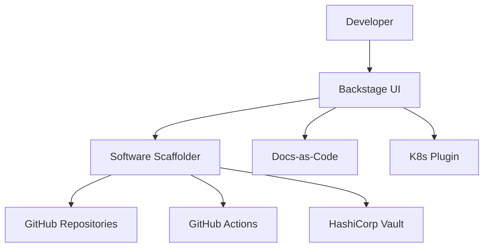

# 1. Executive DevEx Vision
The Institutional Risk Engine (IRE) treats developers as its most critical customers. Cognitive load is the enemy of velocity. This specification defines our **Internal Developer Platform (IDP)**, enforcing the philosophy that infrastructure, security, and compliance must be consumed via self-service APIs. Developers should spend 90% of their time writing domain logic, and 0% writing boilerplate Helm charts.

# 2. Internal Developer Platform & 3. Platform Engineering
The IDP abstracts AWS, Kubernetes, and Terraform behind a unified portal. Platform Engineering treats the IDP as an internal product, conducting user research (on developers) to eliminate workflow friction.

# 4. Developer Experience (DevEx), 5. Golden Paths, & 6. Paved Roads
The "Golden Path" is the heavily supported, ultra-secure, auto-compliant route to Production. Developers *can* stray off the Golden Path, but if they do, they lose access to Platform Support and must maintain their own CI/CD, security patching, and on-call rotations (Doc 16).

---

# Self-Service Architecture (7 - 14)

### 7. Self-Service Infrastructure & 8. Environments
Engineers do not open Jira tickets to request databases. They click a button in the IDP, which triggers a Terraform run, provisioning an Aurora PostgreSQL instance in an ephemeral namespace within 3 minutes.

### 10. Service Catalog & 11. Backstage.io Architecture
Spotify's Backstage is the core of the IDP. It centralizes TechDocs, Service Ownership, CI/CD status, and API definitions.



### 12. Software Templates, 13. Scaffolding, 14. Cookiecutter
Creating a new microservice or background worker is executed via Backstage Software Templates. This guarantees that the repo is created with the exact correct `pyproject.toml`, Dockerfile, OPA policies, and PagerDuty integration pre-configured.

---

# Repository & Code Governance (15 - 27)

### 15. Repository Standards & 16. Repository Governance
IRE uses a Polyrepo approach grouped by Bounded Context. A single repository contains both the Django Backend and the React Frontend for a specific domain.

### 17. Git Standards, 18. Branching, 19. Trunk-Based Development
GitFlow is explicitly banned. All engineers practice Trunk-Based Development, committing directly to `main` via short-lived branches (< 24 hours).

### 20. Pull Request Standards & 21. Code Review Standards
*   PRs must be < 400 lines of code.
*   "LGTM" is not a valid code review. Reviews must check for Domain logic flaws; CI checks the syntax.

### 22. Pair Programming & 23. Mob Programming
Required for complex architectural shifts or high-risk financial math changes.

### 24. InnerSource, 25. Internal Open Source, 26. Shared Libraries
Any team can submit a PR to another team's repository. The owning team acts as the "Maintainer."

---

# Local Development & IDE (28 - 39)

### 28. Developer Portal & 29. Documentation Portal
Aggregated in Backstage.

### 30. Docs-as-Code
Markdown files stored in `/docs` adjacent to the source code. Visio/Word docs are banned.

### 31. Local Development, 32. Dev Containers, 33. Docker
Engineers do not run `pip install` on their host machines. `devcontainers` ensure that a developer on a Mac M3 and a developer on a Windows PC have the exact same Debian/Python/PostgreSQL environment.

```json
// .devcontainer/devcontainer.json
{
  "name": "IRE Credit Context",
  "image": "mcr.microsoft.com/devcontainers/python:3.12",
  "features": {
    "ghcr.io/devcontainers/features/docker-in-docker:2": {}
  },
  "customizations": {
    "vscode": {
      "extensions": ["ms-python.python", "charliermarsh.ruff", "hashicorp.terraform"]
    }
  }
}
```

### 34. VS Code Standards & 35. IDE Standards
VS Code is standard. IntelliJ/PyCharm are supported but the Platform team only guarantees DevContainer compatibility for VS Code.

### 36. Local Kubernetes & 37. Tilt/Skaffold
`Tilt` is used to synchronize local file changes directly into a local `kind` (Kubernetes in Docker) cluster in milliseconds.

### 38. Remote Development & 39. Codespaces
GitHub Codespaces act as a fallback for contractors or engineers awaiting hardware provisioning.

---

# Infrastructure Provisioning (40 - 56)

### 42. Infrastructure Templates & 43. Terraform Modules
Terraform modules are versioned in an internal registry. Developers consume them, they do not write them.

### 45. Service Provisioning ... 55. Logging Provisioning
The `catalog-info.yaml` in Backstage defines the infrastructure needs.
```yaml
apiVersion: backstage.io/v1alpha1
kind: Component
metadata:
  name: credit-scoring-api
  annotations:
    ire.bank.com/requires-aurora: "true"
    ire.bank.com/requires-redis: "true"
spec:
  type: service
  lifecycle: production
  owner: team-credit
```
ArgoCD reads these annotations and provisions the AWS/K8s infrastructure automatically.

---

# Onboarding & Engineering Workflows (57 - 73)

### 57. Developer Onboarding
Time-to-10th-PR is a primary metric. Target: < 14 days.

### 62. Platform Guardrails & 63. Policy as Code
Conftest (Rego) scans all PRs to ensure developers haven't requested `cpu: 1000` in their K8s manifests.

### 65. Local Testing & 66. CI Integration
`tox` orchestrates local test environments mirroring CI.

### 69. Build Optimization & 70. Build Cache
Docker layer caching and `nx` (for frontend monorepos) are mandated to keep build times under 5 minutes.

### 71. Artifact Management & 73. Internal Registries
JFrog Artifactory hosts all internal Python wheels and npm packages. Public registries are proxied and scanned for malware.

---

# Productivity Metrics & Cognitive Load (74 - 82)

### 75. Cognitive Load Reduction
The IDP abstracts away Helm, Terraform, and Vault. The developer only interacts with `catalog-info.yaml`.

### 81. DORA Alignment & 82. SPACE Framework
*   **S**atisfaction: eNPS surveys.
*   **P**erformance: Story points delivered.
*   **A**ctivity: PR merge volume.
*   **C**ommunication: Code review turnaround times.
*   **E**fficiency: Time to first commit.

---

# AI & Developer Tools (87 - 90)

### 87. AI-Assisted Development & 89. Internal AI Coding Assistants
GitHub Copilot Enterprise is mandated. Code generated by AI is held to the exact same rigorous testing and security standards as human code.

### 88. Prompt Libraries
Backstage hosts a prompt library for standard engineering tasks (e.g., "Refactor this legacy Django view into a Clean Architecture Use Case").

### 90. Secure AI Development
Copilot is configured to block public code suggestions matching public GitHub repositories to avoid IP contamination.

---

# 91. Knowledge Management & 92. Engineering Communities
"Guilds" (Frontend Guild, Data Guild, SRE Guild) meet bi-weekly to share knowledge across domain squads.

---

# 93. Platform ADRs (Selected)
| ID | Decision | Rejected Alternative | Rationale |
| :--- | :--- | :--- | :--- |
| `IDP-01` | Backstage.io | Custom Internal Portal | Spotify's ecosystem is vast; rebuilding this internally is a massive waste of resources. |
| `IDP-02` | DevContainers | Local virtualenvs | Eliminates "It works on my machine" completely. |
| `IDP-03` | Trunk-Based Dev | GitFlow | Long-lived branches cause merge conflicts and violate continuous integration principles. |
| `IDP-04` | GitHub Actions | Jenkins | Jenkins requires dedicated maintenance and Grossy scripting. Actions are declarative and native. |

# 94. Platform Anti-Patterns
*   **TicketOps:** Requiring a Jira ticket for SREs to provision a database. (Solution: Self-service APIs).
*   **The Hero Developer:** Relying on one developer who knows how the deployment pipeline works.
*   **YAML Engineer:** Forcing application developers to learn the intricate details of Kubernetes networking.

# 95. Platform Fitness Functions
```yaml
# Enforce PR Size Limit
name: "Enforce PR Size"
on: [pull_request]
jobs:
  check_size:
    runs-on: ubuntu-latest
    steps:
      - uses: actions/checkout@v3
      - name: Check PR lines of code
        run: |
          LINES=$(git diff origin/main --shortstat | awk '{print $4}')
          if [ "$LINES" -gt 400 ]; then
            echo "PR exceeds 400 lines of code. Break it down."
            exit 1
          fi
```

# 96. Platform Readiness Checklist
- [ ] Backstage Scaffolder creates a repo that passes CI on commit #1.
- [ ] DevContainer fully boots within 60 seconds on a fresh clone.
- [ ] OPA policies correctly block insecure Dockerfile bases (e.g., `latest`).

# 97. Executive Scorecard
| Category | Status | Owner | Criteria |
| :--- | :--- | :--- | :--- |
| **Onboarding** | PASS | VP Eng | Time to 1st commit < 48 hours. |
| **CI Speed** | PASS | Plat Arch | P90 Build Time < 5 minutes. |
| **DevEx** | PASS | CPO | eNPS Developer Satisfaction > +40. |
| **Self-Service**| PASS | Plat Eng | 100% of DBs provisioned via Backstage. |

---
*Approval: Distinguished Platform Engineer, Principal Developer Experience Architect, CTO*
