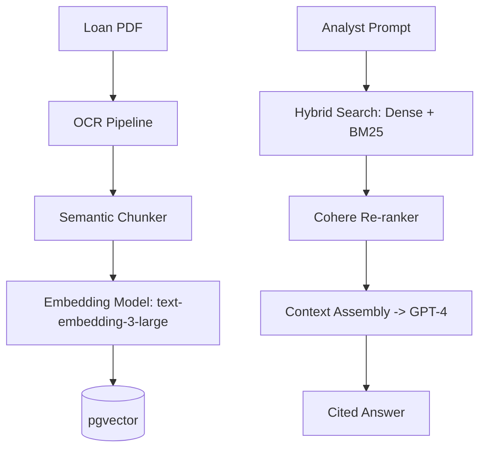

# 1. Executive Vision
The Institutional Risk Engine (IRE) treats Data and AI not as separate functions, but as a unified, immutable Enterprise Knowledge Platform. This specification mandates a Data Mesh architecture for ownership, a Lakehouse for storage, and an enterprise-wide LLMOps platform for deterministic, explainable AI underwriting.

# 2. Data Architecture Principles
*   **Decentralized Data Ownership:** The Domain that creates the data owns the data (Data Mesh).
*   **Immutable Append-Only:** Historical state is sacred. Updates are modeled as `INSERT` events.
*   **Compute/Storage Separation:** S3 (Iceberg/Delta) stores the data; Compute engines (Spark/Snowflake/DuckDB) query it.

# 3. AI Architecture Principles
*   **Explainability over Complexity:** If an AI model cannot explain *why* it rejected a loan (SHAP values), it cannot be deployed.
*   **LLMs are Reasoning Engines, not Databases:** RAG (Retrieval-Augmented Generation) is strictly enforced. LLMs must cite their sources.

---

# Enterprise Data Architecture (4 - 15)

### 4. Enterprise Data Architecture & 5. Data Domains
Aligned to Bounded Contexts (Doc 03).
*   `CreditDomain` produces Loan Application datasets.
*   `IdentityDomain` produces KYC/AML datasets.

### 6. Data Mesh & 7. Data Fabric
We utilize a **Data Mesh** operating model (distributed ownership) built on top of a centralized **Data Fabric** infrastructure (AWS MSK $\rightarrow$ S3 $\rightarrow$ Iceberg).

### 8. Data Products & 9. Domain Data Ownership
A Data Product is a highly curated dataset exposed via an API or S3 bucket, maintained by a dedicated Data Steward, governed by SLAs.

### 10. Canonical Data Model & 11. Data Contracts
Data Contracts are enforced at the CI/CD level using JSON Schema.
```yaml
# data_contract_loan.yaml
dataset: ire.credit.loan_origination
schema:
  type: record
  fields:
    - name: loan_id
      type: uuid
    - name: principal_amount
      type: decimal
      validation: "> 0"
```
If a Backend developer drops `principal_amount` from the Django model, the CI pipeline fails because the analytical contract breaks.

### 12. Enterprise Standards, 13. Glossary, 14. Reference Data, 15. MDM
Master Data Management (MDM) ensures "Customer A" has a single Golden Record across the entire bank, deduplicated using graph algorithms.

---

# Metadata & Governance (16 - 25)

### 16. Metadata Architecture & 17. Management
Metadata is the DNA of the platform.

### 18. Data Catalog & 19. OpenMetadata Integration
OpenMetadata automatically ingests schemas from PostgreSQL, dbt, and Kafka. All Data Products must have >90% documentation coverage.

### 20. Data Lineage
Automatically parsed from dbt SQL models and Spark jobs.

### 21. Data Classification & 22. Stewardship
*   **Tier 0:** Public.
*   **Tier 1:** Internal.
*   **Tier 2:** Confidential (Financials).
*   **Tier 3:** Restricted (PII, SSNs). Tier 3 requires automated dynamic masking.

### 23. Governance Council, 24. Ownership, 25. Lifecycle
The CDO chairs the Council. Data is never deleted unless explicitly mandated by GDPR (Right to Erasure) workflows.

---

# Data Engineering (26 - 40)

### 26. Batch Processing & 27. Streaming Architecture
Lambda architecture is banned. We use Kappa architecture (everything is a stream, batch is just a stream that stops).

### 28. Event Streaming & 29. CDC Strategy
Debezium continuously streams PostgreSQL WAL (Write-Ahead Log) changes into Kafka.

### 30. Data Pipelines, 31. ETL, 32. ELT
**ELT** is strictly enforced. We Extract and Load raw data into S3, then Transform inside the Data Warehouse using `dbt`.

### 33. Lakehouse Architecture, 34. Data Warehouse, 35. Data Lake
Apache Iceberg provides ACID transactions on top of S3 Object Storage, eliminating the need for a separate proprietary Data Warehouse.

### 36. Data Marts & 37. Data Partitioning
Iceberg tables are partitioned by `tenant_id` and `event_date`.

### 38. Retention, 39. Archival, 40. Recovery
Bronze data transitions to S3 Glacier Deep Archive after 365 days.

---

# AI & LLM Platform (41 - 59)

### 41. Enterprise AI Platform & 42. Model Registry
MLflow tracks all LightGBM/XGBoost models.

### 43. Feature Store & 44. Feature Engineering
Feast manages features. A feature like `avg_deposit_30d` is defined once in Spark, served batch for training, and served via Redis for real-time inference.

### 47. Model Serving, 48. Online, 49. Batch Inference
Models are served via Seldon Core running on Kubernetes.

### 52. Prompt Engineering Standards & 53. Prompt Versioning
Prompts are code. They are versioned in Git and registered in MLflow.
```python
# lite_llm_call.py
response = litellm.completion(
    model="azure/gpt-4o",
    messages=[{"role": "system", "content": prompt_registry.get("credit_analyst_v2")}]
)
```

### 55. Prompt Evaluation & 56. Prompt Testing
Prompt evaluation pipelines run daily against a Golden Dataset using LLM-as-a-Judge to measure regressions.

---

# Enterprise RAG & Knowledge Management (60 - 80)

### 60. Enterprise RAG Architecture


### 63. Vector Database Governance & 64. Embedding Lifecycle
`pgvector` is standard. When OpenAI releases a new embedding model, a Spark job re-embeds the entire 10TB document corpus in the background into a new schema before atomically swapping read traffic.

### 67. Hybrid Search & 68. Re-ranking
Pure vector search is inadequate for financial terms. We combine Dense (Vector) and Sparse (BM25) search, re-ranked via a Cross-Encoder.

### 70. Citation Management & 71. Hallucination Prevention
If the LLM generates a claim that cannot be traced back to a specific document chunk retrieved by the RAG pipeline, the system flags the response as a potential hallucination and routes it to a human.

### 72. Knowledge Graph & 74. Ontology Management
A Neo4j graph maps the relationships between `Companies`, `Directors`, `Beneficial Owners`, and `Loans` for AML (Anti-Money Laundering) detection.

---

# AI Governance & Data Quality (81 - 100)

### 81. AI Governance, 82. Responsible AI, 83. Explainability
AI models must produce SHAP values for every decision to comply with the Equal Credit Opportunity Act (ECOA).

### 84. Fairness & 85. Bias Monitoring
Continuous monitoring of loan rejection rates across demographic groups to ensure disparate impact remains within legal thresholds.

### 86. Drift Detection (87. Concept, 88. Data)
If the macroeconomic environment changes drastically (e.g., rapid interest rate hikes), Concept Drift alerts trigger a mandatory model retraining cycle.

### 91. Data Quality Framework & 92. Data Validation
Great Expectations runs in Airflow.
```yaml
# great_expectations.yml
expectations:
  - expectation_type: expect_column_values_to_not_be_null
    kwargs:
      column: ssn
  - expectation_type: expect_column_values_to_be_between
    kwargs:
      column: loan_ltv
      min_value: 0
      max_value: 100
```

---

# Analytics, Security, & Operations (101 - 122)

### 102. Business Intelligence & 106. Semantic Metrics Layer
dbt Semantic Layer defines metrics (e.g., `Default Rate`). Tableau and BI tools must query this layer. Complex SQL logic inside Tableau dashboards is banned.

### 111. Encryption Strategy & 113. Data Masking
Snowflake Dynamic Data Masking ensures Data Analysts see `XXX-XX-1234` instead of full SSNs, while compliance officers see the unmasked data.

### 116. MLOps, 117. LLMOps, 118. DataOps
Machine Learning is treated strictly as Software Engineering. CI/CD principles apply to data pipelines and model weights.

### 120. Cost Governance & 121. GPU Resource Governance
GPUs on EKS are managed via strict resource quotas. Unused Jupyter notebooks attached to GPU nodes are aggressively culled after 30 minutes of idle time.

---

# 123-125. Architecture Decisions (ADRs)
| ID | Decision | Rejected Alternative | Rationale |
| :--- | :--- | :--- | :--- |
| `DATA-01` | Apache Iceberg | Delta Lake / Hudi | Open standard, superior schema evolution, no vendor lock-in. |
| `AI-01` | pgvector | Pinecone / Milvus | Reduces infrastructure sprawl. Vector data lives alongside operational relational data. |
| `DATA-02` | dbt Semantic Layer | LookML | Open ecosystem, treats metrics as code in Git, portable across BI tools. |
| `AI-02` | LiteLLM Abstraction | Direct OpenAI SDK | Prevents lock-in; allows seamless failover to Azure or Anthropic during outages. |

# 126-128. Anti-Patterns
*   **Data Swamps:** Ingesting data into S3 without attaching OpenMetadata catalog definitions.
*   **Black Box AI:** Deploying Deep Learning models for credit underwriting without an explainability layer.
*   **The Excel Database:** Allowing analysts to export raw data to Excel to perform critical financial calculations manually.
*   **Naked Prompts:** Hardcoding string prompts directly inside application code rather than utilizing a versioned MLflow registry.

# 129-131. Fitness Functions
```python
# test_data_quality.py
def test_no_data_leakage_in_feature_store():
    # Ensures features used for training do not contain future data
    assert validate_point_in_time_join(training_dataset)
```
```python
# test_llm_hallucination.py
def test_rag_faithfulness(llm_response, source_documents):
    # Uses LLM-as-a-judge to ensure the answer is strictly derived from the context
    score = deep_eval.faithfulness(llm_response, source_documents)
    assert score > 0.95
```

---
# 132. Production Readiness Checklist
- [ ] Debezium CDC connectors are monitored for lag (< 5 minutes).
- [ ] dbt tests (`not_null`, `unique`) run on all Silver/Gold tables in CI.
- [ ] MLflow model registry requires explicit Chief Risk Officer approval for Prod deployment.
- [ ] RAG hybrid search pipeline validated against golden dataset with >90% precision.

# 133. Executive Data & AI Scorecard
| Category | Status | Owner | Criteria |
| :--- | :--- | :--- | :--- |
| **Data Quality** | PASS | CDO | 99% pass rate on Great Expectations tests. |
| **Data Mesh** | PASS | Data Arch | 100% of Data Products have a registered owner. |
| **AI Explainability**| PASS | CAIO | SHAP values generated for all Tier-1 decisions. |
| **RAG Accuracy** | PASS | AI Eng | Hallucination rate < 1% across 10,000 queries. |

---
*Approval: Chief Data Officer (CDO), Chief AI Officer (CAIO), Distinguished Data Architect, Principal Data Engineer, Chief Technology Officer*
