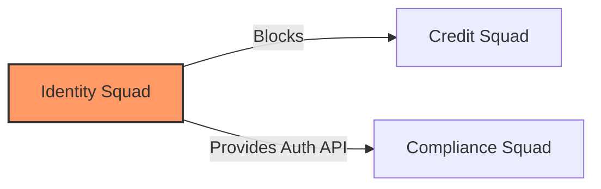

# 1. Executive Strategy & Vision
The Institutional Risk Engine (IRE) requires rigorous coordination between business strategy and engineering execution. This specification defines the absolute governance required to prioritize capital, manage massive multi-team dependencies, and deliver Tier-1 financial products iteratively without descending into bureaucratic stagnation.

# 2. Strategic Alignment & 3. Business Value
Every engineering effort must trace directly back to a **Strategic Theme** defined by the Board of Directors (e.g., "Reduce Credit Default Rates by 2%"). If an epic cannot be traced to a Strategic Theme, it is defunded.

---

# Enterprise Portfolio Management (EPM) (4 - 16)

### 4. Portfolio Management & 5. Portfolio Governance
The Enterprise Portfolio Management Office (EPMO) dictates investment. The portfolio is managed as a set of Venture Capital investments, not rigid annual budgets.

### 6. Portfolio Prioritization & 7. Strategic Themes
Prioritization relies strictly on WSJF (Weighted Shortest Job First). Executives do not dictate priority via rank; they dictate the weights of the WSJF formula.

### 8. Investment Planning & 9. Funding Models
Funding is allocated to *Value Streams* (long-lived teams), not temporary *Projects*. This eliminates the "Project Handover" anti-pattern.

### 11. Cost Governance & 12. Value Realization
Every Epic must state its hypothesized financial value. Six months post-launch, EPMO conducts a Value Realization audit. If the feature failed to deliver the ROI, it is marked for sunset.

### 15. Portfolio Risk & 16. Executive Portfolio Reviews
Quarterly Executive Portfolio Reviews assess the health of the H1 (Core), H2 (Growth), and H3 (Innovation) horizons.

---

# Program Management & Scaled Agile (17 - 30)

### 17. Program Governance & 18. Program Increment (PI) Planning
IRE utilizes a lightweight variation of SAFe (Scaled Agile Framework). PI Planning occurs every 10 weeks to align 50+ squads on cross-domain dependencies.

### 19. Cross-team Coordination & 20. Release Trains
An Agile Release Train (ART) consists of 50-125 individuals tightly coupled to a Value Stream (e.g., the `Credit Origination ART`).

### 21. Dependency Management

Dependencies are visualized on the Program Board during PI Planning. A string connecting two teams indicates a hard dependency that must be resolved in Sprint 1 or 2.

### 26. Program Health & 27. Executive Steering Committees
The Steering Committee unblocks systemic organizational impediments that the ART cannot solve itself (e.g., vendor legal negotiations).

---

# Product Management (31 - 48)

### 31. Product Vision & 32. Product Strategy
Product Managers own the *What* and *Why*. Engineering owns the *How*.

### 33. Product Discovery & 35. Customer Research
Discovery is continuous. Product Managers conduct a minimum of 5 customer interviews (Loan Officers) per sprint.

### 41. Product OKRs & 42. Feature Lifecycle
Features transition from `Idea` $\rightarrow$ `Discovery` $\rightarrow$ `Refinement` $\rightarrow$ `Development` $\rightarrow$ `Validation` $\rightarrow$ `General Availability (GA)`.

### 43. Feature Flags Governance & 46. A/B Testing
LaunchDarkly controls all rollouts. Features are merged to `main` instantly but hidden behind flags. A/B testing is mandatory for UI flow changes.

---

# Agile Delivery (49 - 71)

### 49. Agile Principles, 50. Scrum, 51. Kanban
Scrum is the default. Kanban is used for interrupt-driven teams (SRE, SecOps).

### 57. Backlog Management & 58. Story Mapping
The Backlog is a living document, not a dumping ground. Items older than 6 months are automatically deleted by a Jira automation script.

### 59. User Stories, 60. BDD, 61. Acceptance Criteria
```gherkin
Feature: Loan Approval Threshold
  Scenario: Automated Approval under $50k
    Given the loan applicant has a credit score > 720
    And the requested amount is < $50000
    When the AI Swarm evaluates the risk
    Then the loan should be automatically approved without human review
```

### 62. Definition of Ready (DoR) & 63. Definition of Done (DoD)
*   **DoR:** Architecture reviewed, ACs written in BDD, UX mockups attached.
*   **DoD:** Code merged, 90% coverage, 0 SonarQube bugs, deployed to Staging, Feature Flag created.

### 64. Sprint Planning, 65. Daily Standups, 67. Sprint Retrospectives
Retrospectives must yield at least one systemic improvement to the CI/CD pipeline or Developer Experience (Doc 21).

---

# Engineering Governance & Leadership (72 - 92)

### 72. Architecture Governance & 73. Architecture Review Board (ARB)
The ARB enforces cross-domain consistency (Doc 16).

### 77. Technical Debt & 78. Refactoring
Technical Debt is formalized as a first-class citizen in the Backlog. A fixed 20% of every sprint is reserved for debt repayment.

### 80. Engineering Metrics & 81. Engineering Health
Tracked via DORA and SPACE frameworks.

### 88. Technical Leadership & 89. Principal Engineers
Principal Engineers operate across squads. They are responsible for long-term technical strategy and mentoring Senior Engineers.

### 92. Distinguished Engineers
VP-equivalent individual contributors. They set the 3-5 year technical vision for the entire bank.

---

# Organizational & Financial Governance (93 - 117)

### 93. Executive Committees & 94. Technology Council
Meets monthly to approve major vendor shifts (e.g., migrating from AWS to Azure).

### 103. Delegation Models & 104. Decision Rights
Decisions should be made by the people closest to the work. The ARB does not dictate database table schemas; the Squad does.

### 110. Cloud Budgeting & 111. Chargeback
AWS costs are tagged per microservice and billed directly to the P&L of the Business Unit that owns the Value Stream.

### 116. Investment Approvals & 117. Financial Controls
Any unbudgeted cloud infrastructure exceeding $10k/month requires automated FinOps approval via Slack/Jira before Terraform can deploy it.

---

# Delivery Governance & Enterprise Metrics (118 - 132)

### 118. Quality Gates & 119. Release Governance
A release to Production is fully automated but requires a cryptographic signature from the CI/CD pipeline proving that all Unit, E2E, and SAST scans passed.

### 124. Go/No-Go Meetings
Eliminated. If the pipeline is green, the release is a Go. Rollouts are controlled via Feature Flags.

### 128. DORA Metrics & 129. SPACE Metrics
*   **Deployment Frequency:** Goal is Multiple per day.
*   **Lead Time for Changes:** Goal is < 1 hour.
*   **Time to Restore Service:** Goal is < 15 minutes.
*   **Change Failure Rate:** Goal is < 2%.

---

# AI-Assisted Engineering (133 - 142)

### 133. AI Product Management & 134. AI Portfolio Planning
Using LLMs to analyze customer feedback loops (Zendesk tickets, App Store reviews) to auto-generate prioritized feature recommendations for the Product Manager.

### 137. AI Code Review
GitHub Copilot Enterprise acts as the first pass Code Reviewer, checking for cyclomatic complexity and OWASP Top 10 vulnerabilities before a human looks at the PR.

### 140. AI Architecture Reviews
LLMs are utilized to scan proposed Architecture Decision Records (ADRs) against the existing IRE documentation suite to flag contradictions.

---

# Knowledge Management & Governance (143 - 152)

### 143. Enterprise Wikis & 144. Architecture Repository
Backstage.io TechDocs is the single source of truth.

### 148. Guilds & Communities of Practice
Cross-functional groups (e.g., "The React Guild") that meet bi-weekly to share best practices and standardize patterns across the enterprise.

### 152. Policy-as-Code & Governance Automation
```rego
# OPA Policy: Require Jira Ticket in Commit Message
deny[msg] {
  not re_match("^[A-Z]+-[0-9]+", input.commit.message)
  msg = "Commit message MUST start with a valid Jira Ticket ID (e.g., IRE-1234)"
}
```

---

# 153. Delivery Governance ADRs (Selected)
| ID | Decision | Rejected Alternative | Rationale |
| :--- | :--- | :--- | :--- |
| `GOV-01` | WSJF Prioritization | Executive Fiat | Forces executives to quantify value rather than dictating priorities based on rank. |
| `GOV-02` | Value Stream Funding | Project Funding | Project funding destroys team cohesion when the project ends. Value streams keep high-performing teams intact. |
| `GOV-03` | Automated Go/No-Go | CAB Meetings | Human CABs cannot effectively judge the risk of 10,000 lines of code. CI pipelines can. |
| `GOV-04` | 20% Tech Debt Budget | "When we have time" | Tech debt is never paid down unless explicitly budgeted. |

# 154. Delivery Anti-Patterns
*   **The Jira Black Hole:** Logging 500 tickets in the backlog that will never be built.
*   **Water-Scrum-Fall:** Doing 3 months of architectural design, 2-week coding sprints, and 1 month of manual UAT testing.
*   **Feature Factories:** Measuring PM success by the number of features shipped, regardless of whether anyone uses them.

# 155. Governance Fitness Functions
```yaml
# GitHub Actions: Fail if PR has no Jira link
name: Enforce Jira Link
on: pull_request
jobs:
  check-jira:
    runs-on: ubuntu-latest
    steps:
      - name: Regex Check PR Title
        run: |
          if ! [[ "${{ github.event.pull_request.title }}" =~ ^[A-Z]+-[0-9]+ ]]; then
            echo "PR Title must start with Jira ID"
            exit 1
          fi
```

# 156. Production Readiness Checklist
- [ ] Epic has documented WSJF score.
- [ ] Value Realization tracking metrics defined in Amplitude.
- [ ] Runbooks and CI/CD tests satisfy the Definition of Done.
- [ ] FinOps has reviewed the projected AWS cost of the architecture.

# 157. Executive Governance Scorecard
| Category | Status | Owner | Criteria |
| :--- | :--- | :--- | :--- |
| **DORA Metrics** | PASS | VP Eng | Elite performer status (Deployments/day). |
| **Alignment** | PASS | CPO | 100% of Epics map to Strategic Themes. |
| **Tech Debt** | PASS | CTO | 20% budget strictly enforced globally. |
| **Value Realization**| PASS | EPMO | Features missing ROI targets are sunset. |

---
*Approval: Distinguished Enterprise Architect, Chief Product Officer (CPO), Chief Technology Officer (CTO), PMO Director, VP Engineering*
