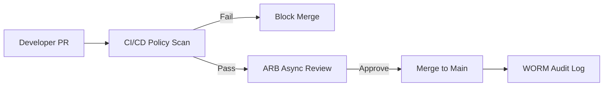

# 1. Governance Vision
The Institutional Risk Engine (IRE) operates in a hyper-regulated, zero-trust global banking environment. This specification establishes the definitive Governance, Risk, and Compliance (GRC) frameworks ensuring that the enterprise executes business strategy without violating international banking laws, security mandates, or ethical AI boundaries. Governance is not a manual checkpoint; it is mathematically enforced via Policy-as-Code.

# 2. Enterprise Governance Principles
*   **Default to Deny:** All actions, network requests, and data access attempts are denied unless explicitly authorized.
*   **Governance as Code:** Written policies (PDFs/Word docs) are useless unless codified into Rego (OPA) or Terraform Sentinel.
*   **Immutable Accountability:** Every system alteration must be cryptographically tied to an authenticated human or machine identity.

---

# Enterprise Architecture Governance (3 - 10)

### 3. Enterprise Architecture Governance & 4. Architecture Review Board (ARB)
The ARB ensures adherence to Documents 00-25. It meets bi-weekly. All proposed deviations from the "Golden Path" must be submitted as Architecture Decision Records (ADRs).

### 5. Technical Design Authority
For high-risk systems (e.g., Cryptographic Key Management), the Technical Design Authority (TDA) holds absolute veto power over Product Management.

### 6. Technology Standards & 7. Exception Management
Standards are enforced in CI/CD. Exceptions require a signed Waiver from the Chief Enterprise Architect, valid for a maximum of 90 days, tracked in Jira as `RiskDebt`.

### 8. Governance Workflow


### 9. Enterprise Policy Management & 10. Standards vs Policies vs Guidelines
*   **Policy:** Mandatory rule (e.g., "All data must be encrypted"). Board approved.
*   **Standard:** Mandatory implementation (e.g., "Use AES-256-GCM"). CISO approved.
*   **Guideline:** Recommended practice.

---

# Risk Management Framework (11 - 21)

### 11. Risk Management Framework & 12. Risk Appetite
The Board of Directors defines the Risk Appetite (e.g., "Zero tolerance for regulatory fines," "Low tolerance for unscheduled downtime").

### 13. Risk Register
Maintained in ServiceNow GRC. Risks are scored using the FAIR (Factor Analysis of Information Risk) methodology to quantify loss exposure in dollars.

### 14. Operational Risk & 15. Technology Risk
Mitigated via Site Reliability Engineering (SRE) error budgets and automated chaos engineering (Doc 24).

### 16. Cyber Risk & 17. Third Party Risk
All vendors must pass a rigorous 150-point security questionnaire and provide a SOC 2 Type II report annually.

### 18. Vendor Risk Management, 19. Supply Chain Security, 20. Software Supply Chain
The CI/CD pipeline blocks any open-source dependency lacking a signed provenance attestation (SLSA Level 3).

### 21. SBOM Governance
A Software Bill of Materials (SBOM) in SPDX format is generated and stored for every deployed container image.

---

# Compliance & Regulatory Framework (22 - 36)

### 22. Compliance Framework & 23. Regulatory Compliance
IRE is subject to overlapping global jurisdictions. The platform maps generic technical controls (e.g., "Encrypt Data") to specific regulatory requirements using a Unified Control Framework (UCF).

### 24. SOX (Sarbanes-Oxley)
Ensures financial reporting integrity. Requires strict separation of duties (SoD) between developers and production environments.

### 25. PCI DSS
While IRE does not process raw credit cards, PCI DSS encryption standards are applied globally as a baseline for all PII.

### 26. ISO 27001 & 27. SOC2
The foundational security frameworks. Continuous monitoring tools (e.g., Vanta, Drata) track compliance in real-time.

### 28. NIST CSF & 29. NIST 800-53
The primary control frameworks for defining identity, access, and boundary protections.

### 30. GDPR & 31. CCPA
Strict adherence to data residency, right-to-be-forgotten workflows, and cookie consent mechanisms.

### 33. OCC Guidelines, 34. FFIEC, 35. Basel III
OCC and FFIEC dictate IT operational resilience. Basel III dictates capital reserves based on the outputs of the Risk Engine.

### 36. SR 11-7 Model Risk Management
Federal Reserve standard for Model Risk. Defines the strict boundaries for AI validation and testing.

---

# Audit, Evidence & Legal (37 - 44)

### 37. Internal Audit & 38. External Audit
Internal Audit (3rd Line of Defense) operates independently, reporting directly to the Board Audit Committee.

### 39. Audit Evidence, 40. Audit Trails, 41. Digital Signatures
All logs are streamed to AWS S3 Object Lock (WORM). They cannot be deleted or mutated by any user, including the AWS Root user.

### 42. Records Management, 43. Data Retention, 44. Legal Hold
Financial records are retained for 7 years. A Legal Hold API prevents automated pruning of records under active litigation.

---

# Corporate & Executive Governance (45 - 55)

### 45. Corporate Governance & 46. Board Oversight
The Board receives quarterly risk posture briefings derived directly from automated CI/CD and SIEM dashboards.

### 47. Executive Steering Committee
Comprises the CEO, CTO, CRO, and CISO to resolve conflicting priorities between feature delivery and risk mitigation.

### 48. CIO, 49. CISO, 50. CRO Governance
*   **CIO/CTO:** Owns delivery and operational availability.
*   **CISO:** Owns cybersecurity and access controls.
*   **CRO:** Owns enterprise risk, model risk, and regulatory adherence.

### 51. Architecture Governance Council & 52. Security Governance Council
Sub-committees that translate Board directives into actionable engineering policies.

### 55. Ethics Committee
Reviews the usage of all alternative data sources in credit scoring models to prevent redlining or proxy discrimination.

---

# AI & Model Governance (56 - 64)

### 56. Responsible AI Governance & 57. AI Policy Management
AI must augment human decision-making, not operate as an unchecked black box.

### 58. AI Risk Management & 59. AI Approval Workflow
Every new ML model or LLM prompt requires explicit sign-off from the Model Risk Committee before production deployment.

### 60. AI Model Governance, 61. Prompt Governance, 62. LLM Governance
Prompts are treated as executable code. They are versioned in MLflow and undergo regression testing using LLM-as-a-judge frameworks.

### 63. RAG Governance
Retrieval-Augmented Generation (RAG) pipelines must explicitly cite the source document. If a citation cannot be generated, the response is blocked.

### 64. Human Approval Requirements
Automated loan rejections must be reviewed by a human underwriter to comply with Fair Lending (ECOA) adverse action notice requirements.

---

# Financial & Access Controls (65 - 73)

### 65. Financial Controls & 66. Segregation of Duties
Engineers cannot deploy code they wrote. SREs cannot authorize their own emergency access.

### 67. Maker Checker & 68. Four Eyes Principle
Critical infrastructure changes (e.g., modifying WAF rules, changing IAM policies) require two distinct humans: a Maker and a Checker.

### 69. Privileged Access Governance & 70. Identity Governance
Zero standing privileges (ZSP). All access is Just-In-Time (JIT) via CyberArk or HashiCorp Boundary.

### 71. Access Certification & 72. Joiner Mover Leaver
Quarterly automated reviews of all user access. Terminated employees have access revoked within 5 minutes via Okta lifecycle hooks.

### 73. Insider Threat Governance
SIEM (Splunk/Datadog) monitors for abnormal data exfiltration patterns (e.g., a developer downloading 10,000 customer records at 3 AM).

---

# Reporting, Dashboards & Continuous Monitoring (74 - 84)

### 74. Enterprise Risk Reporting, 75. Key Risk Indicators (KRIs), 76. Key Control Indicators (KCIs)
*   **KRI:** % of systems with unpatched critical CVEs > 48 hours.
*   **KCI:** % of code deployed without a peer review.

### 77. Governance Dashboards & 78. Compliance Dashboards
Real-time integration between AWS Security Hub, SonarQube, and Tableau.

### 81. Continuous Controls Monitoring
Controls are not tested annually; they are tested continuously via APIs.

### 82. Policy as Code Governance & 83. OPA Governance
Open Policy Agent (OPA) is the brain of the governance framework.
```rego
# Enforce Multi-Factor Authentication on all IAM Roles
deny[msg] {
  r := input.resource.aws_iam_role[name]
  not r.assume_role_policy.Statement[_].Condition.Bool["aws:MultiFactorAuthPresent"] == "true"
  msg = sprintf("IAM Role %v MUST require MFA", [name])
}
```

### 84. Regulatory Reporting
Automated SQL generation of FR Y-9C and OCC stress testing reports from the Lakehouse.

---

# IT Operations & Cloud Governance (85 - 100)

### 85. Change Governance & 86. Configuration Governance
Configuration drift is auto-remediated by Kubernetes operators and AWS Config rules.

### 89. Cloud Governance & 90. Multi Cloud Governance
IRE is primary on AWS but maintains Terraform abstraction layers to support an emergency failover to Azure if regulatory concentration risk limits are breached.

### 91. FinOps Governance
Cloud spend requires tagging. Resources lacking an `Owner` tag are automatically destroyed in Dev/Staging environments.

### 92. Sustainability Governance & 93. ESG Reporting
Carbon footprint metrics for model training are tracked and reported in the annual ESG disclosure.

### 94. Business Continuity Governance & 95. Disaster Recovery Governance
RTO (Recovery Time Objective) and RPO (Recovery Point Objective) are legally binding. Tested quarterly via full-scale failover drills.

### 96. Crisis Management, 97. Communications, 100. Legal Escalation
Pre-approved communication templates exist for SEV-0 incidents involving data breaches, triggering immediate 72-hour notification to GDPR authorities.

---

# 101. Governance ADRs (Selected)
| ID | Decision | Rejected Alternative | Rationale |
| :--- | :--- | :--- | :--- |
| `GRC-01` | Continuous SOC2 Monitoring | Annual Audits | Manual audits are obsolete instantly. Vanta/Drata ensures 24/7 compliance. |
| `GRC-02` | Open Policy Agent (OPA) | Manual Security Reviews | Humans make mistakes; Rego policies mathematically block insecure deployments. |
| `GRC-03` | JIT Privileged Access | Standing Admin Roles | Reduces blast radius of compromised credentials to near zero. |
| `GRC-04` | SHAP Explainability for AI | Black-box Deep Learning | Regulatory mandates (ECOA) require exact explanations for adverse credit actions. |

# 102. Governance Anti-Patterns
*   **Checkbox Compliance:** Writing a security policy document but failing to enforce it in the CI/CD pipeline.
*   **Security by Obscurity:** Relying on secret IP addresses instead of robust IAM and mTLS.
*   **The Shadow IT Swamp:** Business units buying SaaS tools on credit cards without passing the 150-point Vendor Risk Assessment.

# 103. Governance Fitness Functions
```yaml
# GitHub Actions: Trivy Container Vulnerability Scan
name: Container Security Gate
jobs:
  trivy:
    runs-on: ubuntu-latest
    steps:
      - name: Run Trivy vulnerability scanner
        uses: aquasecurity/trivy-action@master
        with:
          image-ref: 'ire-api:latest'
          format: 'table'
          exit-code: '1'
          ignore-unfixed: true
          vuln-type: 'os,library'
          severity: 'CRITICAL,HIGH' # Fails the build immediately
```

# 104. Production Governance Readiness Checklist
- [ ] Penetration test completed with zero Open Critical/High findings.
- [ ] SOC2 Type II report available and controls mapped to UCF.
- [ ] WORM logging verified on all production audit trails.
- [ ] Model Risk Management (MRM) signed off on AI Swarm deployment.

# 105. Executive Governance Scorecard
| Category | Status | Owner | Criteria |
| :--- | :--- | :--- | :--- |
| **Cyber Risk** | PASS | CISO | 0 unpatched Critical CVEs > 48h. |
| **Model Risk** | PASS | CRO | All AI Prompts versioned and explainable. |
| **Compliance** | PASS | CCO | Continuous SOC2/SOX monitoring active. |
| **Auditability**| PASS | Head of Audit | 100% API logs streamed to WORM storage. |

---
*Approval: Chief Information Security Officer (CISO), Chief Risk Officer (CRO), Chief Compliance Officer (CCO), Chief Enterprise Architect*
