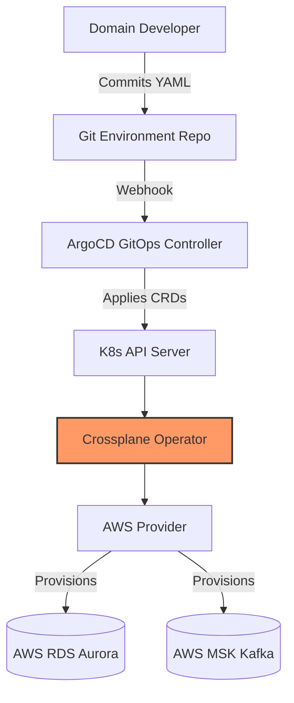
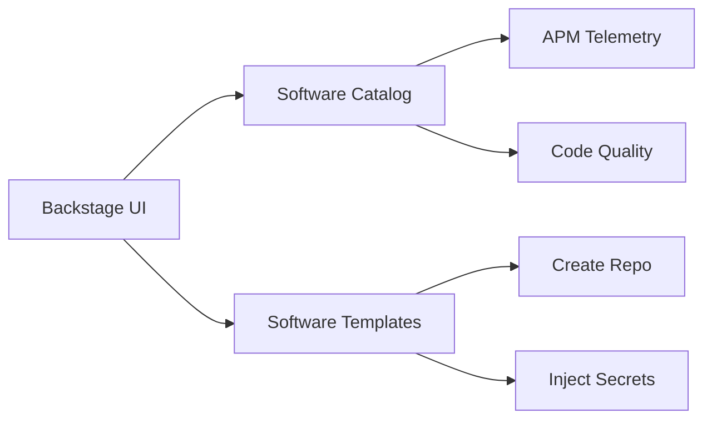

# 1. Platform Engineering Strategy & 2. Internal Developer Platform (IDP)
The Institutional Risk Engine (IRE) treats the Internal Developer Platform (IDP) as the most critical product in the bank. Platform Engineering is not an IT Operations team that closes Jira tickets; it is an elite product organization that builds highly scalable, self-service infrastructure APIs. The sole metric of success for the IDP is reducing the cognitive load on Domain Engineers, allowing them to ship business logic instantly.

# 3. Platform Product Model
The IDP is managed exactly like a commercial B2B SaaS product. It has dedicated Product Managers, OKRs, customer research (developer interviews), and SLA-backed SLAs. If developers bypass the IDP to build their own infrastructure, the Platform has failed its product-market fit.

# 4. Platform APIs & 5. Developer Self-Service
Infrastructure is exclusively consumed via APIs. "TicketOps" (opening a ServiceNow ticket to request a database) is strictly banned.

---

# Platform Reference Architectures & Request Lifecycle (6 - 10)

### 6. Platform Control Plane Architecture
The Control Plane is the Kubernetes-native brain of the IDP, combining Crossplane for infrastructure orchestration and ArgoCD for state synchronization.



### 7. Backstage Ecosystem
Backstage operates as the presentation layer, deeply integrated with the Control Plane.



---

# Developer Portal & Backstage Architecture (11 - 18)

### 11. Golden Paths & 12. Backstage Integration
Spotify's Backstage serves as the single pane of glass. It aggregates Kubernetes clusters, CI/CD pipelines, Vault secrets, and SonarQube metrics.

### 13. Software Templates & 14. Service Scaffolding
Creating a new Django microservice requires one click in Backstage.
```yaml
# Backstage Software Template Definition
apiVersion: scaffolder.backstage.io/v1beta3
kind: Template
metadata:
  name: ire-django-microservice
  title: IRE Django Microservice
spec:
  owner: platform-engineering
  type: service
  parameters:
    - title: Service Details
      properties:
        component_id:
          type: string
        requires_database:
          type: boolean
  steps:
    - id: fetch-base
      name: Fetch Base Skeleton
      action: fetch:template
      input:
        url: ./skeleton
    - id: publish
      name: Publish to GitHub
      action: publish:github
```
This guarantees the service is born with the correct logging standard, OPA policies, Datadog sidecars, and Helm charts.

### 15. Service Catalog & 16. Platform Marketplace
Every service, API, ML model, and Kafka topic must be registered in the Backstage `catalog-info.yaml` to establish explicit ownership and on-call routing.

---

# Platform API Governance (19 - 26)

### 19. Platform API Lifecycle & 20. Versioning Strategy
Platform APIs follow SemVer strictly. Minor versions must be 100% backwards compatible. Breaking changes require a major version bump.

### 21. API Compatibility Guarantees & 22. Deprecation Policy
The Platform provides a strict `n-2` version support guarantee for internal APIs. Deprecated endpoints trigger automated Slack warnings to the consuming team's channel for 90 days before termination.

### 23. API Ownership & 24. API Contracts
Platform squads (e.g., `DataPlatform`, `ComputePlatform`) explicitly own their respective APIs via OpenAPI definitions stored in the Backstage catalog.

### 25. Platform SDK Governance & 26. Internal Libraries
The Platform team maintains internal SDKs (e.g., `ire-core-python`) that abstract authentication, logging, and tracing. If an SDK version is deprecated, CI/CD pipelines automatically fail for consuming services until they upgrade.

---

# Self-Service Infrastructure & Crossplane Advanced Architecture (27 - 39)

### 27. Environment Provisioning & 28. Namespace Provisioning
Namespaces are ephemeral and provisioned dynamically via Kubernetes APIs during CI runs.

### 29. Terraform Automation & 30. Crossplane
While Terraform provisions foundational AWS resources (VPCs, EKS clusters), **Crossplane** is the enterprise standard for Developer Self-Service. Developers declare AWS resources natively via Kubernetes YAML.

### 31. Composite Resources (XR) & 32. Claims
Domain developers interact only with Claims (e.g., `IREPostgreSQLInstance`). They do not write raw AWS RDS definitions.

### 33. Composition Functions & 34. Composition Pipelines
Advanced Crossplane architectures utilize Go-based Composition Functions to dynamically generate infrastructure YAML based on the environment (Dev vs. Prod) rather than maintaining static patch files.

```yaml
# Crossplane Claim (Developer Abstraction)
apiVersion: ire.bank.com/v1alpha1
kind: IREPostgreSQLInstance
metadata:
  name: risk-scoring-db
  namespace: credit-domain
spec:
  parameters:
    storageGB: 100
    engineVersion: "15"
    highAvailability: true
# Crossplane intercepts this and provisions an AWS RDS instance, Security Groups, and Vault secrets.
```

### 37. Multi-Cloud Compositions
The Platform API abstracts the cloud provider. An `IREMessageQueue` claim translates to AWS MSK in AWS environments, but seamlessly translates to Azure Event Hubs if deployed in the Azure disaster recovery region.

---

# Platform Supply Chain Security (40 - 47)

### 40. Platform Component SBOM
Every internal tool, Crossplane provider, and Kubernetes operator built by the Platform team must generate an SBOM in SPDX format.

### 41. Plugin Verification & 42. Plugin Signing
Third-party Backstage plugins and Kubernetes Operators must be cryptographically verified against a known-good registry before the IDP will load them.

### 43. Artifact Signing & 44. SLSA Level 3+
All Platform infrastructure components are signed using Cosign. The Kubernetes admission controller rejects unsigned containers.

### 45. Secure Software Templates & 46. Provenance Verification
Backstage templates only reference golden, hardened base images (e.g., distroless Python images maintained by the Security team).

---

# Policy, Identity & Security (48 - 55)

### 48. Admission Controllers & 49. Policy Automation
Kyverno and OPA Gatekeeper act as Kubernetes Mutating and Validating Admission Controllers.
*   **Validation:** Block any Pod attempting to run as `root`.
*   **Mutation:** Automatically inject the Istio sidecar proxy into every Pod.

### 52. Platform Security & 53. Platform Identity
The IDP integrates natively with Okta/OIDC. Access to provision production infrastructure is restricted based on Azure AD group membership, enforced by the ArgoCD RBAC matrix.

---

# Developer Experience (DevEx) & Local Development (56 - 63)

### 56. Developer Experience & 57. Local Development
We optimize for "Time-to-10th-PR."

### 58. Dev Containers & 59. Remote Development
Local development is strictly containerized.
```json
// .devcontainer/devcontainer.json
{
  "name": "IRE Platform Workspace",
  "image": "mcr.microsoft.com/devcontainers/base:bullseye",
  "features": {
    "ghcr.io/devcontainers/features/docker-in-docker:2": {},
    "ghcr.io/devcontainers/features/kubectl:1": {}
  }
}
```

### 60. Ephemeral Environments & 61. Preview Environments
Every Pull Request automatically spins up a completely isolated, fully functioning instance of the application in an ephemeral Kubernetes namespace (vcluster) for automated integration testing, destroyed upon PR merge.

---

# Platform SRE Operations & Disaster Recovery (64 - 78)

### 64. Platform Runbooks & 65. Incident Playbooks
The IDP is a Tier-0 service. Runbooks for recovering ArgoCD or Crossplane state are automated as Jupyter Notebooks executable by on-call engineers.

### 66. Escalation Matrix & 67. Maintenance Windows
If the IDP goes down, developers cannot ship code. Escalation jumps directly to the Head of Platform Engineering within 15 minutes.

### 68. Platform Error Budgets & 69. Chaos Engineering for Platform
The IDP maintains an error budget of 21.6 minutes per month (99.95%). Chaos Mesh randomly terminates Crossplane operator pods in production to guarantee rapid reconciliation recovery.

### 71. Platform Disaster Recovery (DR) & 72. Backstage DR
The IDP control plane state is entirely backed up in Git. If `us-east-1` burns down, ArgoCD can rebuild the entire Backstage, Crossplane, and Kyverno control plane in `us-west-2` from the GitOps repository.

### 73. Vault Recovery & 74. Harbor/JFrog Registry Recovery
Vault is replicated cross-region. Image registries utilize continuous asynchronous replication to the DR region.

### 77. Platform RTO/RPO Objectives
*   **RPO (Recovery Point Objective):** 0 minutes (State is in Git).
*   **RTO (Recovery Time Objective):** < 45 minutes to rebuild the entire Platform Control Plane in a new region.

---

# AI for Platform Engineering (79 - 86)

### 79. AI-assisted Platform Engineering & 80. AI Platform Copilots
A custom LLM agent integrated into Backstage acts as an automated SRE.

### 81. AI Infrastructure Troubleshooting & 82. AI Kubernetes Debugging
If a developer's Pod CrashLoopBackOffs, the Backstage AI Copilot analyzes the OOMKilled metrics from Datadog, queries the Kubernetes events log, and suggests the precise memory limit increase.

### 83. AI-generated Infrastructure Templates & 84. AI Cost Optimization
The AI Copilot monitors Crossplane claims and dynamically recommends scaling down over-provisioned `storageGB` requests based on historical usage telemetry.

---

# Platform Engineering Metrics (87 - 97)

### 87. Platform Analytics beyond DORA
We measure the economic impact of the platform, not just speed.

### 88. Golden Path Adoption & 89. Template Adoption
Metric: Percentage of production services running on a verified Backstage Template vs. legacy custom Dockerfiles. Target: > 95%.

### 90. Developer Onboarding Time & 91. Time-to-10th-PR
Metric: Number of days for a new engineering hire to merge 10 pull requests into production. Target: < 14 days.

### 92. Crossplane Provisioning Latency
Metric: Time from a developer applying an `IREPostgreSQLInstance` CRD to the database being fully available and connection strings injected into Vault. Target: < 4 minutes.

### 96. Developer Satisfaction (DevEx) & 97. Platform ROI
Quarterly eNPS (Employee Net Promoter Score) surveys specifically targeting the IDP experience. Platform ROI is calculated based on engineering hours saved via automated scaffolding.

---

# Platform Governance & Continuous Improvement (98 - 110)

### 98. Platform Architecture Review Board & 99. Platform Standards Committee
A specialized ARB that strictly reviews additions to the IDP (e.g., evaluating whether to add Temporal.io to the Service Catalog).

### 100. Exception Process & 101. Platform Policy Lifecycle
Exceptions to IDP mandates (e.g., needing to write custom Terraform instead of using Crossplane) require a waiver signed by the Head of Platform Engineering, valid for 6 months.

### 103. Operational Maturity Model & 104. Platform Capability Maturity
The IDP is assessed against a maturity matrix (Level 1: Scripting $\rightarrow$ Level 5: AI-Driven Self-Correction). IRE currently operates at Level 4.

### 105. Platform Change Management & 106. Platform Roadmaps
IDP features are deployed continuously behind Feature Flags to opt-in beta testing squads before rolling out to the entire 5,000-engineer organization.

---

# 111. Platform Engineering ADRs
| ID | Decision | Rejected Alternative | Rationale |
| :--- | :--- | :--- | :--- |
| `PLAT-01` | Crossplane for Self-Service | Terraform Cloud / Jenkins | Crossplane uses the Kubernetes API reconciliation loop, ensuring state never drifts, whereas Terraform only checks state on execution. |
| `PLAT-02` | Backstage IDP | Custom React Portal | Backstage has a massive plugin ecosystem; rebuilding this UI layer internally is a waste of capital. |
| `PLAT-03` | Ephemeral vclusters | Persistent Staging | Shared staging environments are a bottleneck and constantly broken. Ephemeral environments guarantee isolation. |
| `PLAT-04` | Internal Platform as a Product | Platform as a Support Team | Support teams scale linearly with headcount. Products scale infinitely via automation. |
| `PLAT-05` | ArgoCD for Platform GitOps | FluxCD | ArgoCD provides a superior enterprise UI and SSO integration for multi-tenant developer visibility. |
| `PLAT-06` | External Secrets Operator | Sealed Secrets | Syncing Vault directly to K8s secrets prevents developers from storing encrypted secrets in their application repos. |
| `PLAT-07` | Go for Composition Functions | P&T (Patch & Transform) | Crossplane P&T YAML is too limiting for complex multi-resource financial environments; Go allows full unit testing of infra logic. |

# 112. Platform Anti-Patterns
*   **The Golden Cage:** Building a platform so rigid that developers cannot innovate or escape the abstraction when necessary.
*   **Ticketing is Not Self-Service:** Wrapping a ServiceNow Jira form in a shiny UI and calling it an "Internal Developer Platform," when a human still manually provisions the requested resource.
*   **Platform without Product Management:** Building features that Platform Engineers think are cool, rather than solving the actual friction experienced by Domain Engineers.
*   **The God Abstraction:** Trying to abstract 100% of AWS into a single CRD, creating a leaky, unmaintainable monster YAML file.
*   **ClickOps DR:** Relying on human memory to click the right buttons in the AWS Console during a catastrophic disaster, rather than relying on automated GitOps restoration.
*   **Zombie Infrastructure:** Allowing developers to spin up resources via API but providing no automated garbage collection or cost-attribution, resulting in million-dollar AWS bills for abandoned dev databases.

# 113. Platform Fitness Functions
```yaml
# Kubernetes Kyverno Policy: Require Cost Center Tags
apiVersion: kyverno.io/v1
kind: ClusterPolicy
metadata:
  name: require-cost-center-labels
spec:
  validationFailureAction: enforce
  rules:
    - name: check-for-labels
      match:
        resources:
          kinds:
            - Deployment
            - StatefulSet
      validate:
        message: "All deployments MUST have an ire.bank.com/cost-center label."
        pattern:
          metadata:
            labels:
              ire.bank.com/cost-center: "?*"
```
```yaml
# GitHub Actions: Verify Platform Component SBOM
name: Verify Platform SBOM
jobs:
  sbom-check:
    runs-on: ubuntu-latest
    steps:
      - name: Generate SBOM (Syft)
        uses: anchore/sbom-action@v0
        with:
          image: ire-platform-operator:latest
      - name: Assert No Unapproved Licenses
        run: |
          if grep -q "GPL-3.0" sbom.spdx.json; then
            echo "Viral GPL license detected. Failing build."
            exit 1
          fi
```

# 114. Production Readiness Checklist
- [ ] New software template successfully executes full CI/CD run on instantiation.
- [ ] Crossplane CRDs validated against IAM least-privilege boundaries (IRSA).
- [ ] Backstage service catalog synchronized with Okta AD groups.
- [ ] OPA Gatekeeper policies deployed in Audit mode for 7 days before shifting to Enforce mode.
- [ ] Platform Disaster Recovery (RTO < 45m) successfully proven via a cross-region Chaos test.
- [ ] Internal SDK deprecation paths clearly defined and communicated to Domain Squads.
- [ ] Kubecost tags actively feeding into the FinOps executive dashboard.

# 115. Executive Platform Scorecard
| Category | Status | Owner | Criteria | Trend |
| :--- | :--- | :--- | :--- | :--- |
| **Self-Service** | PASS | Head of Platform | > 95% of infra provisioned via API/CRD. | ↗️ Improving |
| **DevEx Speed** | PASS | DevEx Lead | Time to provision new microservice < 5 min. | ➡️ Stable |
| **Time-to-10th-PR**| PASS | DevEx Lead | New hire ramp-up < 14 days. | ↗️ Improving |
| **Cost Visibility**| PASS | FinOps | 100% of K8s namespaces map to a Cost Center. | ➡️ Stable |
| **Platform Uptime**| PASS | Platform Ops | Core IDP control plane > 99.95% availability. | ➡️ Stable |
| **DR Readiness** | PASS | SRE Lead | Full Control Plane failover tested this quarter. | ↗️ Improving |

---
*Approval: Distinguished Platform Engineer, Head of Platform Engineering, Chief Technology Officer*
