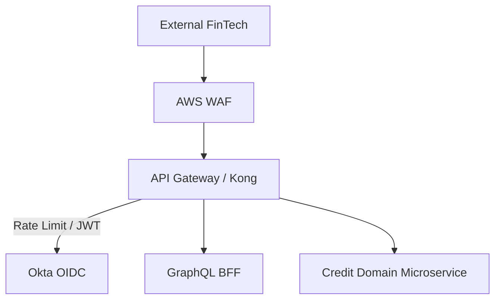

# 1. Enterprise Integration Strategy & 2. Integration Architecture Principles
The Institutional Risk Engine (IRE) does not exist in a vacuum. It sits at the nexus of legacy core banking mainframes, modern fintech partners, and global payment networks. This specification defines the **API Economy** architecture. We reject point-to-point spaghetti integrations and legacy ESBs (Enterprise Service Buses) in favor of decoupled, event-driven, API-first interoperability governed by strict consumer-driven contracts.

# 3. API Economy, 4. API Product Management & 5. API Lifecycle Management
APIs are not just IT interfaces; they are digital products. Every API exposed externally requires a dedicated Product Manager, a P&L (if monetized), and a strict lifecycle (Design $\rightarrow$ Mock $\rightarrow$ Implement $\rightarrow$ Publish $\rightarrow$ Deprecate).

# 6. API First Strategy & 7. API Governance
No backend code may be written until the API Contract (OpenAPI/AsyncAPI) is approved by the Architecture Review Board (ARB) and published to the developer portal.

---

# API Architecture & Protocols (8 - 15)

### 8. REST Standards
Level 2 Richardson Maturity Model. Nouns, not verbs (e.g., `POST /api/v1/loans`, not `POST /api/v1/createLoan`).

### 9. GraphQL & 10. gRPC
*   **GraphQL:** Used strictly as a Backend-For-Frontend (BFF) to aggregate data for the React UI. Avoid deep nesting to prevent DoS attacks.
*   **gRPC:** Used exclusively for high-throughput, low-latency internal microservice communication (e.g., AI swarm nodes).
```protobuf
// gRPC Example: Risk Scoring Service
syntax = "proto3";
package risk.v1;

service RiskScoringService {
  rpc EvaluateRisk (RiskRequest) returns (RiskResponse);
}
```

### 11. Async APIs & 13. AsyncAPI
Kafka topics are governed by the AsyncAPI specification, defining payload schemas and routing keys just like OpenAPI does for REST.

### 12. OpenAPI, 14. API Versioning, 15. Backward Compatibility
Versioning is handled in the URI (`/v1/`). Breaking changes require a `v2` bump. Adding a field is not a breaking change; removing a field or changing its type is.

---

# Gateway, Security & Monetization (21 - 34)

### 21. API Gateway Architecture & 22. API Gateway Policies
Kong (or AWS API Gateway) sits at the edge. It enforces generic policies (rate limiting, auth) so microservices focus strictly on domain logic.



### 23. API Security (24. OAuth2, 25. OIDC, 26. JWT, 27. mTLS)
External clients authenticate via OAuth2 Client Credentials flow. Internal service-to-service communication requires Istio mTLS to achieve Zero Trust.

### 28. Rate Limiting, 29. API Throttling & 30. API Monetization
Throttling is tiered.
*   **Bronze Tier (Free):** 10 req/sec.
*   **Platinum Tier (Paid):** 10,000 req/sec, billed per 100k API calls via Stripe integration.

### 31. API Analytics, 32. API Observability, 33. Distributed Tracing
OpenTelemetry trace IDs (`X-B3-TraceId`) must propagate from the API Gateway through Kafka brokers to the final database transaction.

---

# Event-Driven Architecture (EDA) (35 - 51)

### 35. Enterprise Integration Patterns (EIP)
Routing, Filtering, and Transformation patterns are implemented via Kafka Streams, not legacy ESBs.

### 36. Event-Driven Architecture, 37. Kafka, 38. Event Mesh
Apache Kafka is the enterprise nervous system. Topics are partitioned by `tenant_id` to guarantee ordering.

### 41. Schema Registry & 43. Event Contracts
Confluent Schema Registry enforces Avro/Protobuf validation. Producers cannot publish malformed events.

### 45. Change Data Capture (CDC) & 46. Debezium
To avoid the "Dual Write Problem," microservices write state to PostgreSQL. Debezium reads the WAL (Write-Ahead Log) and publishes the event to Kafka with zero data loss.

### 47. Outbox Pattern
Used in conjunction with CDC. Domain logic writes to a `Loan` table and an `Outbox` table in the same ACID transaction.

### 48. Saga Integration & 51. Temporal Integration
Distributed transactions (2PC) are banned. Multi-service state changes use the Saga pattern, orchestrated by Temporal.io, executing compensating transactions if a step fails.

---

# B2B & Banking Protocol Integration (52 - 72)

### 52. External System Integration & 53. Legacy System Integration
All external systems are shielded by an Anti-Corruption Layer (ACL).

### 54. Mainframe Integration & 63. Core Banking Integration
Mainframes (e.g., IBM z/OS) are integrated via asynchronous MQ-to-Kafka bridges. Direct synchronous REST calls to the mainframe are prohibited to prevent thread exhaustion during mainframe batch windows.

### 59. ISO 20022 Messaging & 60. SWIFT Integration
All cross-border payments must adhere to ISO 20022 XML formats. The Integration layer transforms our internal JSON Canonical Data Model into ISO 20022 `pacs.008` (Customer Credit Transfer) messages.

### 61. FIX Protocol
Financial Information eXchange (FIX) is used strictly for low-latency market data and trade execution routing, handled by dedicated C++ integration gateways.

### 69. FinTech Ecosystem, 71. Partner Onboarding, 72. API Marketplace
Partners self-onboard via the Backstage API Developer Portal, generating their own OAuth2 Sandbox credentials instantly without human intervention.

---

# Architecture Migration & Quality (74 - 95)

### 75. Canonical Data Models
We do not build point-to-point translations.
*   System A $\rightarrow$ Canonical JSON $\rightarrow$ System B.

### 76. Enterprise Message Bus (ESB) Modernization & 77. ESB Migration Strategy
Legacy ESBs (e.g., MuleSoft, TIBCO) contain hidden, unversioned business logic (The "Smart Pipe" anti-pattern). We migrate to "Smart Endpoints, Dumb Pipes" (Kafka). Business logic belongs in Microservices.

### 78. Anti-Corruption Layer & 79. Adapter Pattern
Adapters translate vendor APIs (e.g., Salesforce SOAP) into clean Domain JSON.

### 81. Contract Testing & 82. Pact
Pact mathematically guarantees that the Provider (API) has not broken the expectations of the Consumer (UI/Service).

```javascript
// Pact Consumer Test Example
const provider = new Pact({
  consumer: "CreditUI",
  provider: "RiskEngineAPI",
});
provider.addInteraction({
  state: "loan exists",
  uponReceiving: "request for risk score",
  withRequest: { method: "GET", path: "/v1/loans/123/risk" },
  willRespondWith: { status: 200, body: { score: Matchers.integer() } },
});
```

### 89. Error Handling & 90. Retry Patterns
Always use Exponential Backoff with Jitter for synchronous retries.

### 91. Dead Letter Queues (DLQ) & 92. Poison Messages
Messages that fail schema validation or cause unhandled exceptions are routed to a Kafka DLQ. DLQs have a 30-day retention and trigger PagerDuty alerts.

### 93. Idempotency & 94. Exactly Once Processing
Network calls will fail and retry. Every API endpoint that mutates state (`POST`, `PUT`) MUST accept an `Idempotency-Key` header. If the key was seen in the last 24 hours, the API returns the cached successful response without executing the transaction again.

---

# 101. Integration ADRs
| ID | Decision | Rejected Alternative | Rationale |
| :--- | :--- | :--- | :--- |
| `INT-05` | Debezium CDC + Outbox | Dual-Write to DB and Kafka | Dual-writes lead to race conditions and phantom events if the DB commits but the Kafka publish fails. |
| `INT-06` | Kong API Gateway | NGINX Custom Configs | Kong offers native OIDC plugins, rate limiting, and Kubernetes ingress integration out of the box. |
| `INT-07` | Temporal.io for Orchestration | RabbitMQ RPC Chaining | Chaining queues hides the overall business process flow. Temporal provides visibility and durability for multi-day workflows. |
| `INT-08` | ISO 20022 XML Standard | Legacy MT SWIFT Messages | Regulatory mandate by 2025. ISO 20022 provides richer data for AML/KYC scanning. |

# 102. Integration Anti-Patterns
*   **The Smart Pipe:** Putting complex business rules, loops, and data enrichments inside an ESB integration layer. (Business logic belongs in the microservice).
*   **Distributed Monolith:** Having 50 microservices that all call each other synchronously via REST. If one goes down, they all go down.
*   **The God API:** A single GraphQL endpoint that pulls data from every backend system, resulting in 30-second query times and database locks.
*   **Dual Writes:** Writing to a database and publishing an event to Kafka in two separate API calls without the Outbox pattern.

# 103. Integration Fitness Functions
```yaml
# GitHub Actions: Spectral API Linter
name: Enforce OpenAPI Standards
jobs:
  lint:
    runs-on: ubuntu-latest
    steps:
      - uses: actions/checkout@v3
      - name: Spectral Lint
        run: spectral lint openapi.yaml --ruleset .spectral.yaml
# Fails the build if the API definition uses verbs in paths or lacks HTTP 422 error definitions.
```

# 104. Production Readiness Checklist
- [ ] API has an approved OpenAPI 3.0 specification published to the Developer Portal.
- [ ] OIDC/OAuth2 validation is active on the API Gateway.
- [ ] `Idempotency-Key` header logic is unit tested and verified.
- [ ] Debezium CDC connectors are monitored for lag (< 5 seconds).
- [ ] Pact consumer contracts are verified against the provider in CI.
- [ ] Dead Letter Queues (DLQs) have active PagerDuty monitors.

# 105. Executive Integration Scorecard
| Category | Status | Owner | Criteria |
| :--- | :--- | :--- | :--- |
| **API Health** | PASS | API Lead | P99 API Latency < 200ms across all gateways. |
| **Event Streaming**| PASS | Data Eng | Kafka Consumer Lag < 1000 messages globally. |
| **B2B Connectivity**| PASS | Integration | 100% compliance with ISO 20022 messaging formats. |
| **Resilience** | PASS | SRE | Circuit breakers active; 0 cascading failure incidents. |

---
*Approval: Distinguished Integration Architect, Chief Enterprise Architect, API Product Lead, Chief Technology Officer*
