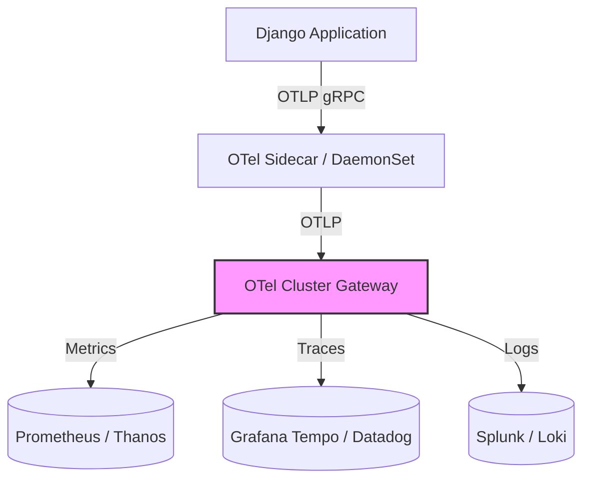

# 1. Enterprise Observability Strategy & 2. Observability Architecture
The Institutional Risk Engine (IRE) treats observability as a Tier-0 engineering requirement, equal in importance to security and data consistency. "Monitoring" is telling you a system is broken; "Observability" is letting you ask arbitrary questions about *why* it is broken. We rely on the absolute instrumentation of every single component in the bank via vendor-neutral OpenTelemetry standards.

# 3. Three Pillars of Observability
Our architecture unifies the three pillars:
1.  **Metrics (Prometheus):** Is there a problem? (Alerting on aggregated time-series data).
2.  **Traces (Jaeger/Datadog):** Where is the problem? (Visualizing the execution path across 50 microservices).
3.  **Logs (Loki/Splunk):** What exactly is the problem? (High-cardinality, unstructured diagnostic text).

---

# OpenTelemetry Standards & Telemetry Collection (7 - 15)

### 7. OpenTelemetry Standards & 8. Telemetry Collection
IRE explicitly bans proprietary vendor agents (e.g., direct Splunk forwarders, native Datadog agents) from the application container. The only acceptable telemetry egress is via the **OpenTelemetry (OTel) Collector**.


This architecture prevents vendor lock-in. If we migrate from Splunk to Datadog, we only change the OTel Gateway exporter configuration; no application code is touched.

### 9. Instrumentation Strategy (10. Auto, 11. Manual)
*   **Auto-Instrumentation:** Applied via Kubernetes mutating webhooks (injecting Python/Java byte-code manipulators) to capture basic HTTP, SQL, and gRPC metrics for free.
*   **Manual Instrumentation:** Developers MUST explicitly wrap complex business logic (e.g., Credit Score Calculation) in custom spans to capture domain-specific metadata.

### 12. Context Propagation & 13. Correlation IDs
The W3C `traceparent` header is the enterprise standard. It must propagate across HTTP, Kafka (record headers), and database queries (SQL comments). If a log entry lacks a `trace_id`, it is considered a defect.

### 15. Baggage Propagation
OTel Baggage is used to pass business metadata (e.g., `tenant_id=VIP-123`) down the call stack without requiring changes to function signatures, allowing downstream services to attach context to their spans.

---

# Metrics Architecture (16 - 26)

### 17. Prometheus & 18. VictoriaMetrics
Prometheus is used for edge scraping within EKS clusters. Data is federated to VictoriaMetrics (or Thanos) for long-term global retention and high-cardinality queries.

### 22. RED Method & 23. USE Method
*   **RED (For Services):** Rate (Requests/sec), Errors (5xx rate), Duration (P99 Latency).
*   **USE (For Infrastructure):** Utilization (% CPU), Saturation (Queue Depth), Errors (Disk I/O failures).

### 25. Business Metrics
SREs don't just alert on CPU usage. They alert on "Loan Originations per Minute." If CPU is normal but originations drop to zero, there is a Severity 1 incident.

---

# Logging Architecture (27 - 41)

### 28. Structured Logging & 29. JSON Logging
Unstructured string logging is banned. All logs must be emitted as JSON (`{"level": "INFO", "trace_id": "...", "msg": "Loan Approved", "loan_amount": 500000}`).

### 31. Log Routing & 33. Fluent Bit
Fluent Bit runs as a DaemonSet on every EKS node, tailing stdout/stderr, enriching logs with Kubernetes metadata (Namespace, Pod, Container ID), and routing them to the OTel Gateway.

### 40. Datadog & 41. Splunk
*   **Datadog:** Primary interface for engineering observability, APM, and alerting.
*   **Splunk:** Primary interface for immutable Security Incident and Event Management (SIEM) and audit compliance.

---

# Service Level Objectives (SLOs) & SRE (48 - 52)

### 48. SLI, 49. SLO, 50. SLA
*   **SLI (Indicator):** The percentage of HTTP 200s returning in < 200ms.
*   **SLO (Objective):** 99.9% (The internal engineering target).
*   **SLA (Agreement):** 99.9% (The financial contract with the client; breaches result in penalties).

### 51. Error Budgets
A 99.9% SLO provides an error budget of 43 minutes of downtime per month. If a Domain Squad exhausts their error budget, all feature development halts, and the squad is forced to work exclusively on reliability tech debt until the budget replenishes.

---

# Incident Management & Alerting (53 - 62)

### 53. Incident Management & 54. Incident Command System
Modeled after FEMA's ICS. During a Severity 1 incident, the Incident Commander (IC) has absolute authority. The IC does not debug; the IC coordinates.

### 56. PagerDuty
Alerts are routed dynamically based on Backstage `catalog-info.yaml` ownership.
*   **Severity 1 (P1):** Pages the primary on-call engineer immediately (24/7). If unacknowledged in 5 minutes, escalates to the Engineering Director.
*   **Severity 3 (P3):** Creates a Jira ticket; no page.

### 62. Alert Fatigue Reduction
"CPU > 80%" is not an actionable alert. We only alert on symptoms (Customer Impact), not causes. Alerting logic: "If error rate > 5% for 5 minutes AND user traffic > 100 req/sec $\rightarrow$ Page."

---

# AIOps, AI Observability & LLMOps (63 - 69, 89 - 91)

### 63. AIOps & 65. Root Cause Analysis
Datadog Watchdog automatically correlates a spike in 500 errors on the Credit Service with a spike in database lock contention, highlighting the root cause before the SRE even logs in.

### 89. AI Model Observability & 90. LLM Observability
Monitoring Generative AI introduces new SLIs.
*   **Time to First Token (TTFT):** Critical for streaming UX.
*   **Tokens per Second (TPS):** Measures inference throughput.
*   **Hallucination Rate:** Monitored asynchronously via LLM-as-a-Judge evaluations.

### 91. Prompt Telemetry
OpenTelemetry captures the exact prompt text, the LLM response, the model version, and the token count, allowing FinOps to calculate the precise dollar cost of an AI inference transaction.

---

# Load Testing & Resilience (71 - 76)

### 72. Load Testing & 76. Synthetic Monitoring
k6 is used for CI/CD load testing. Datadog Synthetics executes continuous "ping" transactions against production from global endpoints (Tokyo, London, NY) every 60 seconds to ensure the critical path (Login $\rightarrow$ Submit Application) is functional.

---

# 101. Observability ADRs
| ID | Decision | Rejected Alternative | Rationale |
| :--- | :--- | :--- | :--- |
| `OBS-01` | OpenTelemetry Collector | Native Datadog Agent | Vendor neutrality. OTel prevents vendor lock-in and allows dual-routing (e.g., APM traces to Datadog, Security logs to Splunk) simultaneously. |
| `OBS-02` | W3C Trace Context | B3 Headers | W3C is the industry standard for interoperability across different cloud providers, PaaS, and OSS frameworks. |
| `OBS-03` | JSON Structured Logging | Regex Parsing / Grok | Regex parsing of unstructured logs is CPU intensive and prone to breaking when a developer changes a log string. JSON is inherently queryable. |
| `OBS-04` | Alert on Symptoms (SLOs) | Alert on Causes (CPU) | High CPU is a normal state in Kubernetes if HPA is working. Paging an engineer for CPU usage creates severe alert fatigue. |

# 102. Observability Anti-Patterns
*   **The Sea of Red:** A dashboard with 50 flashing red alerts that engineers ignore because "it's always red."
*   **Log Spam:** Logging `INFO: User clicked button` 10,000 times a second, blowing through the Splunk licensing budget and burying actual error logs.
*   **Vendor Agent Sprawl:** Running the Splunk forwarder, Datadog agent, and AppDynamics agent simultaneously on the same EKS node, consuming 30% of the node's CPU just for telemetry.
*   **The Silent Failure:** A batch job fails, but because it didn't explicitly throw an HTTP 500, no alert fires. (Solution: Use Dead Man's Snitch / Cronitor).

# 103. Observability Fitness Functions
```yaml
# GitHub Actions: OPA Gatekeeper Check for OpenTelemetry Setup
apiVersion: kyverno.io/v1
kind: ClusterPolicy
metadata:
  name: require-otel-labels
spec:
  validationFailureAction: enforce
  rules:
    - name: check-for-otel-instrumentation
      match:
        resources:
          kinds:
            - Deployment
      validate:
        message: "All deployments MUST have OpenTelemetry auto-instrumentation labels."
        pattern:
          metadata:
            annotations:
              instrumentation.opentelemetry.io/inject-python: "true"
```

# 104. Production Readiness Checklist
- [ ] Application emits JSON structured logs to standard out (`stdout`).
- [ ] Application responds with HTTP 200 on `/health/liveness` and `/health/readiness`.
- [ ] OpenTelemetry trace IDs are actively propagated in all outbound HTTP/gRPC requests.
- [ ] SLIs are defined and configured in Datadog with associated Error Budgets.
- [ ] PagerDuty escalation policy is mapped in `catalog-info.yaml` with a secondary on-call backup.

# 105. Executive SRE Scorecard
| Category | Status | Owner | Criteria | Trend |
| :--- | :--- | :--- | :--- | :--- |
| **Availability** | PASS | VP Eng | P99 Tier-1 Services met 99.99% SLO. | ↗️ Improving |
| **MTTA (Acknowledge)**| PASS | SRE Lead | Time to acknowledge P1 < 5 minutes. | ➡️ Stable |
| **MTTR (Resolve)** | PASS | SRE Lead | Time to resolve P1 < 45 minutes. | ↗️ Improving |
| **Alert Noise** | PASS | SRE Lead | < 10% of alerts triggered outside business hours were non-actionable. | ➡️ Stable |
| **FinOps Cost** | PASS | FinOps | Telemetry storage costs < 15% of total cloud compute spend. | ↘️ Warning |

---
*Approval: Distinguished SRE Architect, Head of Reliability Engineering, Chief Technology Officer*
