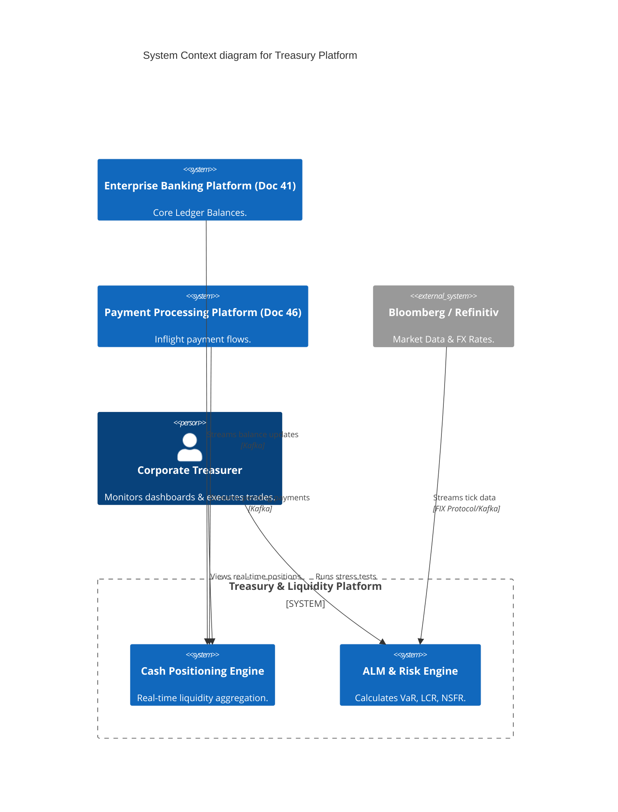
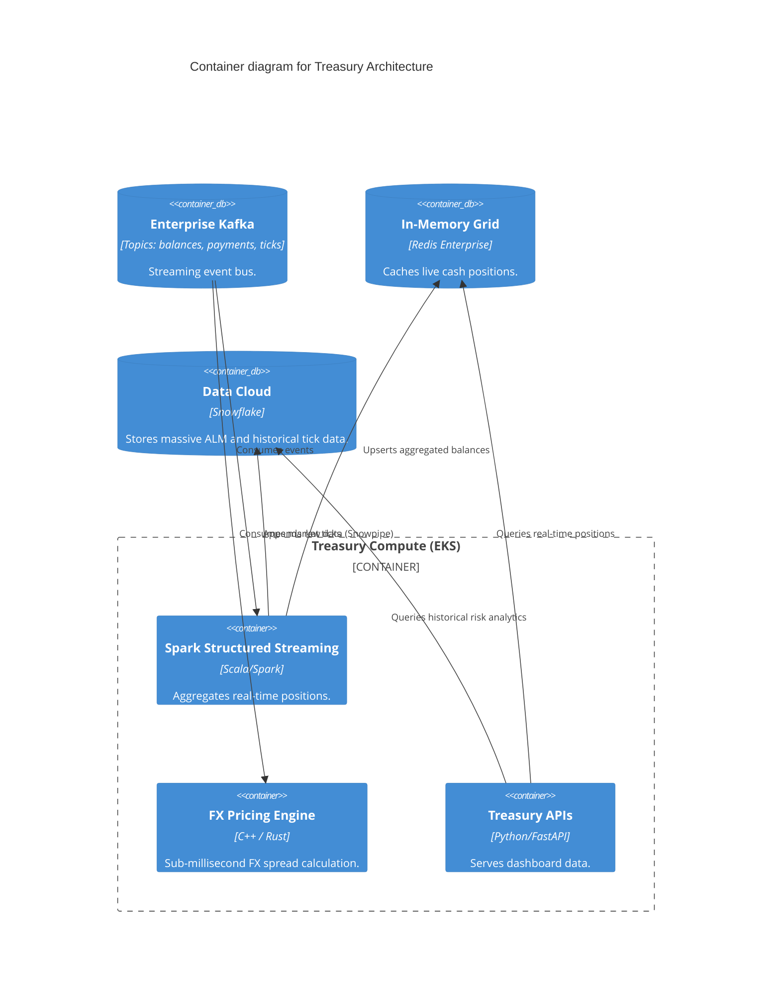
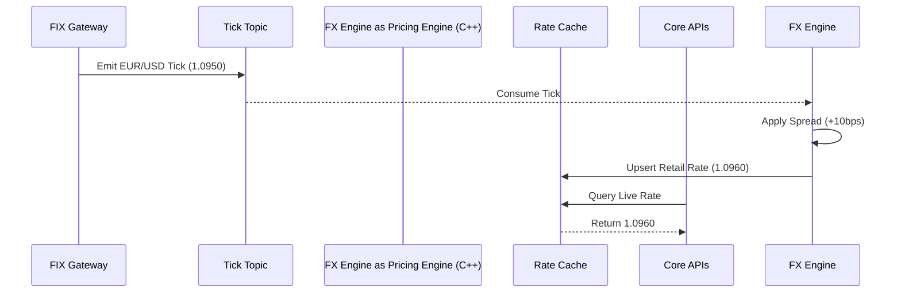

# Section 1: Executive Overview & Business Alignment

## 1. Executive Overview
This document defines the **Treasury & Liquidity Management Platform** blueprint. It provides the implementation architecture for managing the Bank's massive cash positions, capital allocation, liquidity buffers, and FX hedging. It bridges high-throughput operational systems (Ledger, Payments) with deep analytical compute engines (Spark, Snowflake) to ensure the Bank always meets its intraday liquidity requirements and Basel III regulatory capital constraints.

## 2. Business Purpose
Treasury is the financial heart of the Bank. A miscalculation in real-time liquidity can result in massive overnight borrowing costs or regulatory sanctions. This platform automates cash forecasting, Asset Liability Management (ALM), and risk analytics, replacing legacy EOD (End of Day) batch spreadsheets with near-real-time streaming analytics.

## 3. Functional Scope
*   Real-Time Cash Positioning & Forecasting
*   Intraday Liquidity Management
*   Market Data Ingestion (Bloomberg/Reuters)
*   Foreign Exchange (FX) Pricing & Hedging
*   Basel III / LCR / NSFR Capital Calculations
*   Asset Liability Management (ALM)

## 4. Non-Functional Requirements (NFRs)
*   **Availability:** 99.99% (Four Nines).
*   **Latency:** Real-time dashboards < 2 seconds. Batch risk analytics < 30 minutes.
*   **RTO/RPO:** RTO < 1 Hour, RPO < 5 Minutes.
*   **Throughput:** Ingestion of 5M+ market data ticks per second (FX feeds).

## 5. Domain Mapping & Bounded Contexts
*   `PositioningDomain`: Aggregates live balances from the Core Ledger.
*   `MarketDataDomain`: Ingests and normalizes external price feeds.
*   `RiskAnalyticsDomain`: Calculates VaR (Value at Risk) and interest rate risk.
*   `CapitalDomain`: Prepares regulatory capital and liquidity ratios.

---

# Section 2: Logical & Physical Architecture (C4 Models)

## 6. C4 Context Diagram
The Treasury Platform ingests data from internal ledgers, external market feeds, and payment rails to calculate the Bank's overall financial health.



## 7. C4 Container Diagram
This architecture requires a hybrid operational/analytical setup (HTAP). We use Spark for heavy computations and Snowflake for vast historical storage.



---

# Section 3: Liquidity, Cash Positioning & ALM

## 8. Real-Time Cash Positioning (Spark & Redis)
Treasurers cannot wait for overnight batch jobs to know the Bank's liquidity.
*   **Ingestion:** The Core Ledger (Doc 41) emits `BalanceChanged` events. The Payment Platform (Doc 46) emits `PaymentPending` events.
*   **Aggregation:** Spark Structured Streaming consumes these topics, calculating a continuous, rolling sum of the Bank's cash position per currency and per entity.
*   **Serving:** The aggregated sums are upserted into Redis. The Treasury Dashboard queries Redis, providing a sub-second, real-time view of global liquidity.

## 9. Asset Liability Management (ALM) & Basel III
Heavy regulatory computations (e.g., Liquidity Coverage Ratio - LCR) are executed in Snowflake.
*   We use dbt (Data Build Tool) within Snowflake to model the complex regulatory hierarchies.
*   **Stress Testing:** Treasurers use the UI to inject macroeconomic shocks (e.g., "Interest rates rise 200bps"). The API translates this into parameterized Snowflake queries, simulating the impact on Net Interest Income (NII).

---

# Section 4: Market Data & FX Pricing

## 10. High-Frequency Market Data Ingestion
Market data (Bloomberg, Refinitiv) flows via the FIX (Financial Information eXchange) protocol.
*   We utilize a dedicated edge gateway that translates FIX messages into Kafka events.
*   **FX Pricing Engine:** Written in C++ for deterministic latency, this engine consumes raw interbank FX rates, applies the Bank's risk spreads, and pushes the generated retail/corporate FX rates back to the Digital Banking platform (Doc 42).



---

# Section 5: Infrastructure as Code & Kubernetes

## 11. Kubernetes: Spark on EKS Autoscaling
Spark workloads require massive bursts of compute during end-of-day ALM processing.
*   We use the **Spark Operator** to manage Spark jobs natively in Kubernetes.
*   The EKS cluster uses Karpenter (Node Autoscaling) combined with EC2 Spot Instances to provision hundreds of nodes in seconds, tearing them down the moment the batch completes.

```yaml
apiVersion: "sparkoperator.k8s.io/v1beta2"
kind: SparkApplication
metadata:
  name: alm-stress-test
  namespace: treasury-analytics
spec:
  type: Scala
  mode: cluster
  image: "harbor.internal.ire/treasury/alm-engine:v2.1"
  mainClass: com.ire.treasury.ALMStressTest
  driver:
    cores: 2
    memory: "4096m"
  executor:
    instances: 50 # Scaled horizontally
    cores: 4
    memory: "16384m"
    labels:
      lifecycle: spot # Scheduled strictly on AWS Spot Instances
```

## 12. Terraform: Snowflake Integration
Snowflake integration is codified using the Snowflake Terraform provider, enforcing Role-Based Access Control (RBAC).

```hcl
resource "snowflake_role" "treasury_analyst" {
  name    = "TREASURY_ANALYST_ROLE"
  comment = "Role for ALM and Liquidity analytics"
}

resource "snowflake_database_grant" "grant" {
  database_name = "IRE_PROD_DWH"
  privilege     = "USAGE"
  roles         = [snowflake_role.treasury_analyst.name]
}
```

---

# Section 6: Security, Zero Trust & DR

## 13. Security & Zero Trust
*   **Market Data Segregation:** External FIX connections bypass standard API gateways and terminate inside a dedicated, isolated DMZ VPC to prevent lateral movement.
*   **Data Masking:** While Treasurers need access to aggregated volumes, they do NOT need access to individual customer names. Snowflake dynamic data masking policies automatically redact PII from Treasury queries.

## 14. Active-Active Disaster Recovery
While heavy analytical batch jobs can tolerate a Failover (Active-Passive), the Real-Time Cash Positioning system must run Active-Active.
*   Spark Streaming jobs run identically in `us-east-1` and `us-west-2`.
*   Both ingest the same Kafka topics (using Kafka MirrorMaker2 for cross-region replication) to ensure regional cache consistency.

---

# Section 7: Observability & SRE

## 15. OpenTelemetry & Data Observability
Beyond standard CPU/RAM metrics, we implement **Data Observability** (Monte Carlo / Great Expectations).
*   If the Market Data Kafka topic suddenly drops from 50,000 ticks/sec to 0, an alert fires instantly, as stale FX rates pose massive arbitrage risk to the Bank.

---

# Section 8: Governance Checklists & ADRs

## 16. Reference ADRs
| ID | Decision | Rationale |
| :--- | :--- | :--- |
| `TRSY-01` | Spark Streaming over Batch | Liquidity crashes happen intraday. Relying on EOD batch reporting obscures risk. Spark Streaming provides a perpetual, live view of cash. |
| `TRSY-02` | C++ for FX Pricing Engine | Python and Java Garbage Collection pauses introduce unacceptable latency jitter in FX pricing. C++ guarantees deterministic sub-millisecond execution. |
| `TRSY-03` | Snowflake for ALM | ALM requires complex, recursive stress-testing queries over terabytes of historical data. Postgres would buckle; Snowflake scales compute independently of storage. |

## 17. Architectural Anti-Patterns Avoided
*   **The Excel Monolith:** Allowing Treasury analysts to pull raw CSVs and calculate Basel III ratios on local Excel spreadsheets. This poses catastrophic compliance and operational risk. All logic must be codified in dbt/Spark.
*   **Shared Compute for OLTP/OLAP:** Running heavy VaR stress tests on the core PostgreSQL ledger database, starving transactional payment traffic of CPU resources. We strictly isolate OLAP to Snowflake.

## 18. Production Readiness Checklist
- [ ] Spark Operator deployed and configured to utilize AWS Spot Instances for executors.
- [ ] FIX Gateways are isolated in a DMZ VPC with strict IP whitelisting to external data providers.
- [ ] Snowflake Dynamic Data Masking policies applied to the `Treasury_Analyst` role.
- [ ] Kafka MirrorMaker2 configured for cross-region market data replication.
- [ ] Data Observability monitors active to detect stalled tick feeds.

## 19. Executive Treasury Dashboard
| Capability | Target | Achieved | Status |
| :--- | :--- | :--- | :--- |
| **Cash Positioning Latency** | < 2s | 0.8s | 🟢 PASS |
| **FX Tick Processing Time** | < 1ms | 0.4ms | 🟢 PASS |
| **ALM Stress Test Duration** | < 30 Mins | 18 Mins | 🟢 PASS |
| **Stale Feed Incidents** | 0 | 0 | 🟢 PASS |
| **Basel III Reporting Uptime** | 99.99% | 99.99% | 🟢 PASS |

---
*Blueprint Certification Level: 5 (Production-Ready)*
*Owner: Corporate Treasurer & Lead Data Architect*
