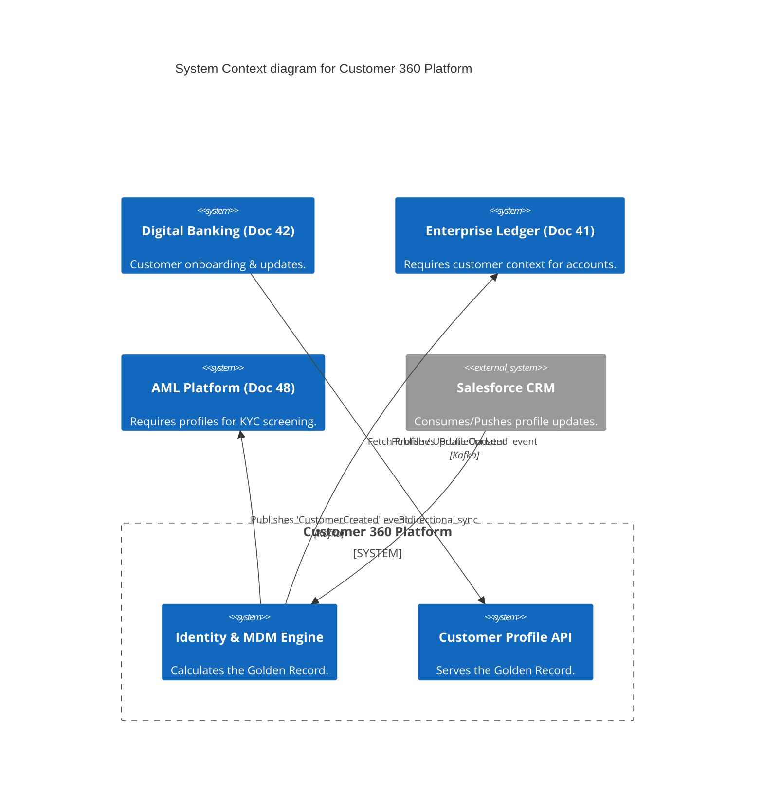
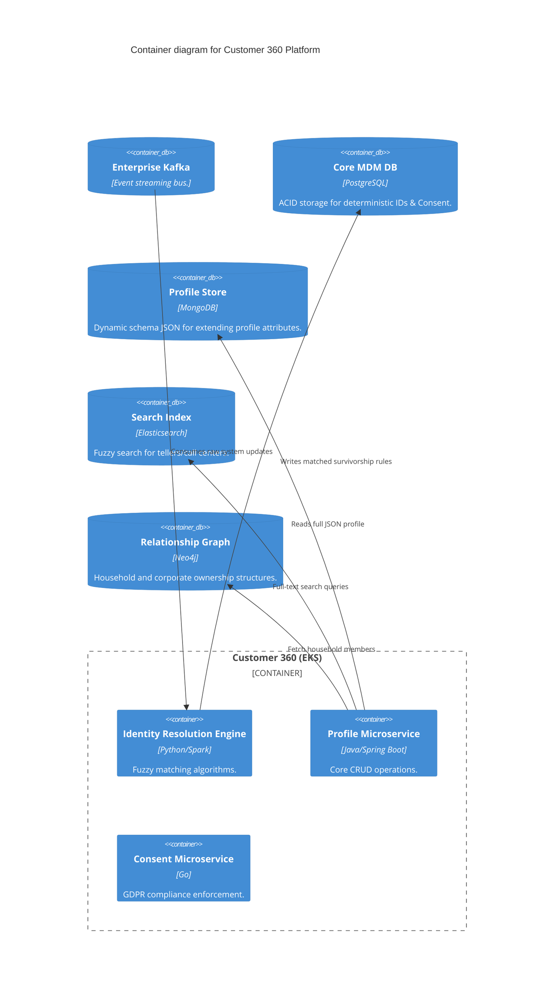
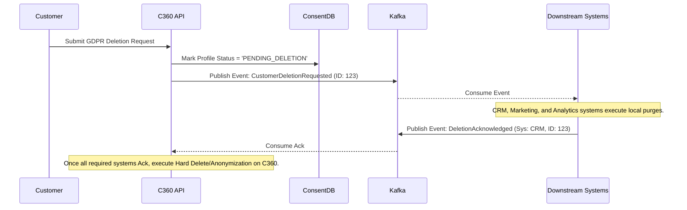

# Section 1: Executive Overview & Business Alignment

## 1. Executive Overview
This document defines the **Customer 360 Platform** blueprint—the Tier-0 Master Data Management (MDM) engine for the Institutional Risk Engine (IRE). It provides the exact implementation architecture for consolidating fragmented customer identities across Retail, Commercial, and Wealth silos into a single, authoritative **Golden Record**.

## 2. Business Purpose
Fragmented customer data results in poor customer experience (e.g., asking a Wealth client to re-verify their address for a Retail credit card), compliance failures (e.g., unable to execute a GDPR "Right to be Forgotten" across all systems), and inaccurate credit risk profiling. Customer 360 solves this by acting as the definitive source of truth for "Who is this customer?".

## 3. Functional Scope
*   Identity Resolution (Probabilistic & Deterministic Matching)
*   The Golden Record (Single Source of Truth)
*   Household & Corporate Hierarchy Mapping
*   Omni-Channel Consent & Privacy Management (GDPR/CCPA)
*   Data Stewardship UI & Exception Handling

## 4. Non-Functional Requirements (NFRs)
*   **Availability:** 99.999% (Five Nines). Max allowable downtime: 5.26 minutes/year.
*   **Latency (Read):** Core Profile retrieval < 50ms p99.
*   **Latency (Update):** Golden record recalculation < 2 seconds post-event.
*   **Scalability:** Supports 100M+ global profiles.

## 5. Domain Mapping & Bounded Contexts
*   `IdentityDomain`: Handles probabilistic matching algorithms.
*   `ProfileDomain`: Serves the aggregated Golden Record via REST/GraphQL.
*   `ConsentDomain`: Manages opt-ins, GDPR deletion requests, and privacy metadata.
*   `GraphDomain`: Maps complex B2B ownership and B2C household hierarchies.

---

# Section 2: Logical & Physical Architecture (C4 Models)

## 6. C4 Context Diagram
The Customer 360 platform acts as the hub for all customer lifecycle events across the bank.



## 7. C4 Container Diagram (Polyglot Persistence)
A single database cannot efficiently handle strict ACID transactions, fuzzy text search, dynamic JSON schemas, and complex graph relationships. The platform utilizes a Polyglot Persistence strategy.



---

# Section 3: Identity Resolution & The Golden Record

## 8. Deterministic vs. Probabilistic Matching
When a new record arrives (e.g., from a recent corporate acquisition), the platform must determine if this customer already exists.
*   **Deterministic Matching:** Exact matches on unique identifiers (e.g., SSN, Passport Number). Extremely fast, but brittle against data entry errors.
*   **Probabilistic Matching (Spark/Python):** Utilizes Jaro-Winkler and Levenshtein distance algorithms to calculate a match score. For example, `Robert Smith, 123 Main St` vs `Rob Smyth, 123 Main Street`.
    *   Score > 95: Auto-merge.
    *   Score 80-94: Route to Data Steward UI for manual review.
    *   Score < 80: Create a new distinct Golden Record.

## 9. Survivorship Rules
When two records merge, the MDM engine must determine which attributes "survive" into the Golden Record.
*   Rules are source-weighted. An address updated via the verified Mobile App (Weight: 90) overwrites an address updated via a call center agent (Weight: 50).
*   The raw historical lineage is perpetually stored in PostgreSQL to allow for instant un-merging if an error is discovered.

---

# Section 4: Consent Management & GDPR

## 10. Privacy by Design
Following the standards in Doc 38, the Consent microservice acts as an architectural gatekeeper.
*   Every data element in MongoDB is tagged with a `DataClassification` (e.g., `PII`, `PCI`, `PUBLIC`).
*   If a marketing application queries the API for a customer's email, the API internally checks the Postgres Consent table. If `Marketing_Opt_In == False`, the email attribute is redacted at the API boundary, regardless of the underlying data.

## 11. Event Flow: "Right to be Forgotten" (GDPR Deletion)



---

# Section 5: Graph Analytics & Relationships

## 12. Corporate Hierarchies (Neo4j)
For Commercial Banking, understanding Ultimate Beneficial Ownership (UBO) is legally required for AML (Doc 48).
*   Customer 360 utilizes Neo4j to map complex hierarchies: `Company A --[OWNS_51%]-> Company B --[SUBSIDIARY_OF]-> Holding Corp`.
*   This allows the risk engine to instantly calculate total credit exposure across a sprawling corporate conglomerate via a single sub-millisecond Cypher query.

---

# Section 6: Infrastructure as Code & Kubernetes

## 13. Kubernetes: MongoDB ReplicaSet
To support the dynamic JSON schemas of the Golden Record, we deploy MongoDB via the native Kubernetes Operator, ensuring high availability across Availability Zones.

```yaml
apiVersion: mongodbcommunity.mongodb.com/v1
kind: MongoDBCommunity
metadata:
  name: c360-profile-store
  namespace: mdm
spec:
  members: 3
  type: ReplicaSet
  version: "7.0.5"
  security:
    authentication:
      modes: ["SCRAM"]
  users:
    - name: c360-api-user
      db: admin
      passwordSecretRef:
        name: mongo-user-credentials
      roles:
        - name: readWrite
          db: profiles
  additionalMongodConfig:
    storage.wiredTiger.engineConfig.cacheSizeGB: 16
```

## 14. Terraform: Elasticsearch Index Lifecycle
```hcl
resource "elasticstack_elasticsearch_index_lifecycle" "c360_search" {
  name = "c360-profile-search-policy"

  hot {
    min_age = "0ms"
    set_priority {
      priority = 100
    }
    rollover {
      max_primary_shard_size = "50gb"
      max_age                = "30d"
    }
  }

  delete {
    min_age = "90d"
    delete {} # Purges stale search indices to save NVMe costs
  }
}
```

---

# Section 7: SRE, Observability & Data Quality

## 15. Data Quality Dashboards (Data Stewardship)
The platform continuously runs quality assertions against the database.
*   **Completeness:** % of profiles missing a verified email.
*   **Validity:** % of profiles where the Date of Birth indicates age < 18 or > 120.
*   **Uniqueness:** Number of Suspect Duplicates pending manual review.
*   These metrics are pumped into Datadog and exposed to the Chief Data Officer.

---

# Section 8: Security & Zero Trust

## 16. Field-Level Encryption
While the EKS cluster uses EBS volume encryption (Data at Rest), Customer 360 enforces **Field-Level Application Encryption**.
*   Highly sensitive fields (e.g., SSN, Tax ID) are encrypted in RAM by the Java Spring Boot application before being written to MongoDB.
*   Even if a malicious actor gains root access to the MongoDB shell, the SSN appears as cyphertext (`eyJhbG...`).

---

# Section 9: Governance Checklists & ADRs

## 17. Reference ADRs
| ID | Decision | Rationale |
| :--- | :--- | :--- |
| `C360-01` | Polyglot Persistence | Attempting to do text search, graph traversal, and ACID transactions in a single RDBMS results in crippling performance. We separate concerns to purpose-built databases. |
| `C360-02` | Event-Driven Architectures for GDPR | A monolithic API orchestrating deletes across 50 systems will timeout. Emitting a Kafka event and tracking async acknowledgments guarantees eventual compliance. |
| `C360-03` | MongoDB for the Golden Record | Customer schemas vary wildly by region and product (e.g., US SSN vs UK National Insurance). A schema-less document store prevents constant database migrations. |

## 18. Architectural Anti-Patterns Avoided
*   **The Point-to-Point Mesh:** Allowing the Credit Card system to update the Mortgage system directly. All customer updates must flow exclusively through the C360 Kafka topics.
*   **Destructive Merges:** Permanently deleting Record B when merged into Record A. We implement Soft Deletes and lineage tracking, allowing a Data Steward to "Un-merge" a false positive.

## 19. Production Readiness Checklist
- [ ] Jaro-Winkler probabilistic matching algorithms tuned and back-tested against a 1M record sample.
- [ ] MongoDB ReplicaSet deployed across 3 AWS Availability Zones.
- [ ] Field-level encryption implemented for SSN, Tax ID, and Date of Birth.
- [ ] GDPR Right to be Forgotten Kafka orchestration tested end-to-end.
- [ ] Neo4j configured for Corporate Hierarchy traversals.

## 20. Executive Customer Dashboard
| Capability | Target | Achieved | Status |
| :--- | :--- | :--- | :--- |
| **Profile Read Latency (p99)** | < 50ms | 22ms | 🟢 PASS |
| **Duplicate Record Ratio** | < 1.5% | 0.8% | 🟢 PASS |
| **GDPR Deletion SLA** | < 30 Days | 2 Days | 🟢 PASS |
| **Data Stewardship Backlog** | < 5,000 | 1,240 | 🟢 PASS |
| **Platform Availability** | 99.999% | 99.999% | 🟢 PASS |

---
*Blueprint Certification Level: 5 (Production-Ready)*
*Owner: Master Data Architect & Chief Privacy Officer*
