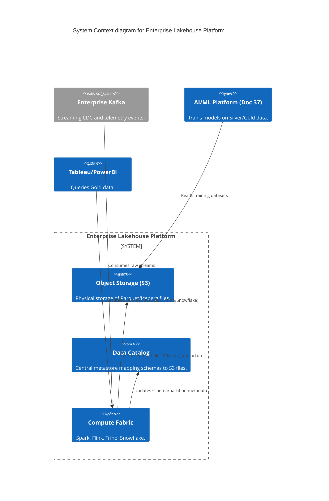
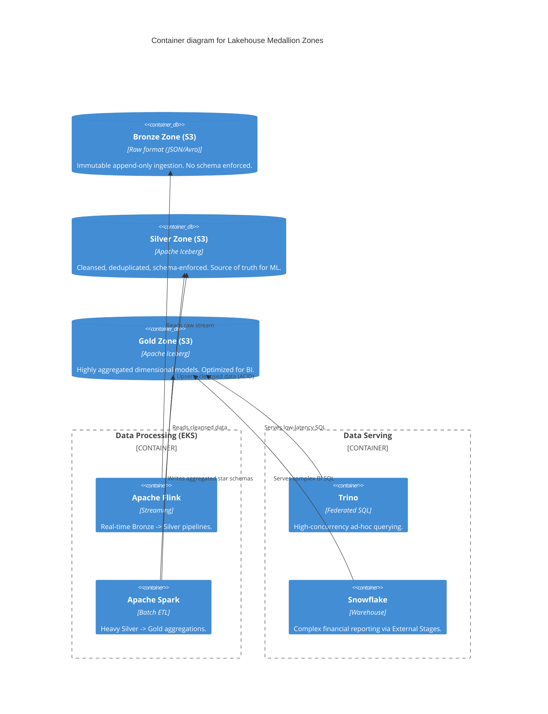

# Section 1: Executive Overview & Business Alignment

## 1. Executive Overview
This document defines the **Enterprise Lakehouse Platform** blueprint, drilling deep into the storage and compute mechanics introduced in Document 50. It provides the exact implementation architecture for converging the low cost and flexibility of a Data Lake (AWS S3) with the ACID compliance, schema enforcement, and high-performance querying of a traditional Data Warehouse. 

## 2. Business Purpose
Legacy Data Lakes became unmanageable "Data Swamps" due to a lack of schema enforcement, while legacy Data Warehouses became financially ruinous at petabyte scales due to tightly coupled compute and storage. The Lakehouse architecture solves both by utilizing open table formats (Apache Iceberg) to provide warehouse-like features directly on top of cheap object storage, eliminating vendor lock-in.

## 3. Functional Scope
*   Medallion Architecture (Bronze, Silver, Gold Data Zones)
*   Open Table Formats (Apache Iceberg as the standard)
*   Distributed Query Engines (Trino, Athena, Snowflake External Tables)
*   Streaming (Flink) & Batch (Spark) Processing
*   Schema Evolution & Storage Compaction

## 4. Non-Functional Requirements (NFRs)
*   **Availability:** 99.999% (Object Storage), 99.9% (Federated Query Engines).
*   **Storage Cost:** < $23/TB/Month (leveraging S3 Intelligent-Tiering).
*   **Query Performance:** < 5 seconds for Gold-tier aggregations via Trino.
*   **ACID Compliance:** 100% guarantee for concurrent reads/writes on S3.

## 5. Domain Mapping & Bounded Contexts
*   `IngestionDomain`: Lands raw JSON/CSV/Avro into the Bronze zone.
*   `CurationDomain`: Cleanses, deduplicates, and enforces schemas (Silver zone).
*   `AggregationDomain`: Builds dimensional models for BI tools (Gold zone).

---

# Section 2: Logical & Physical Architecture (C4 Models)

## 6. C4 Context Diagram
The Lakehouse centralizes storage while federating compute across purpose-built engines.



## 7. C4 Container Diagram (The Medallion Architecture)
Data flows through progressively cleaner zones. Compute engines read/write to S3, totally decoupled from the storage layer.



---

# Section 3: Open Table Formats & Apache Iceberg

## 8. Apache Iceberg (The Enterprise Standard)
We standardize on **Apache Iceberg** (over Delta Lake or Apache Hudi) due to its superior decoupled metadata management and vast ecosystem support.
*   **ACID on S3:** Iceberg uses a tree of metadata files (Manifest Lists, Manifest Files) to define exactly which Parquet files make up a snapshot. This allows writers to commit safely while readers scan an older snapshot, preventing dirty reads without requiring a running database engine.
*   **Schema Evolution:** Dropping, renaming, or reordering columns are instant metadata operations. No massive rewrite of historical Parquet files is required.

## 9. Hidden Partitioning
In legacy Hive, analysts had to query `WHERE year = '2026' AND month = '07'` to hit the right partition folders, leading to catastrophic full-table scans if they forgot.
*   Iceberg uses **Hidden Partitioning**. The analyst simply writes `WHERE event_timestamp >= '2026-07-01'`.
*   Iceberg's metadata layer automatically translates the timestamp into the physical partition folders behind the scenes, eliminating query errors.

---

# Section 4: Compute Engines & Integration

## 10. Trino (Federated SQL Engine)
Trino is deployed on Kubernetes to provide a unified SQL interface across the entire Lakehouse.
*   **Separation of Compute:** Trino holds no data. It merely orchestrates massively parallel reads of Iceberg files from S3.
*   **Federation:** Trino can execute a single SQL `JOIN` that combines a massive historical Iceberg table on S3 with a live operational table in PostgreSQL.

## 11. Snowflake Integration (External Tables)
While Snowflake is incredibly fast, storing 100 PB of raw data inside Snowflake's proprietary storage layer is cost-prohibitive.
*   **External Stages:** Snowflake is configured to read Iceberg tables directly from S3 using External Tables. We only load the highly aggregated "Gold" data physically into Snowflake for specific ultra-fast reporting dashboards; everything else remains in S3.

---

# Section 5: Storage Optimization & Lifecycle

## 12. Compaction (The Small File Problem)
Streaming data via Flink into S3 results in thousands of tiny Parquet files (e.g., 50KB each), which destroys query performance due to S3 GET request overhead.
*   **Maintenance Jobs:** A scheduled Apache Spark job runs nightly to perform **Bin-packing**. It merges thousands of 50KB files into optimal 256MB Parquet files in the background, without locking the table.

## 13. S3 Lifecycle Management & Intelligent Tiering
*   **Bronze Zone:** Data older than 90 days automatically transitions to S3 Glacier Deep Archive (costing $0.00099/GB).
*   **Silver/Gold Zones:** Utilize S3 Intelligent-Tiering. If a dataset isn't queried for 30 days, AWS automatically moves it to the Infrequent Access tier, saving 50% on storage costs without requiring engineering intervention.

---

# Section 6: Infrastructure as Code & Kubernetes

## 14. Kubernetes: Trino Autoscaling
Trino workers scale based on CPU utilization and query queue depth via HPA.

```yaml
apiVersion: autoscaling/v2
kind: HorizontalPodAutoscaler
metadata:
  name: trino-worker-hpa
  namespace: lakehouse
spec:
  scaleTargetRef:
    apiVersion: apps/v1
    kind: Deployment
    name: trino-worker
  minReplicas: 10
  maxReplicas: 100
  metrics:
  - type: Resource
    resource:
      name: cpu
      target:
        type: Utilization
        averageUtilization: 75
```

## 15. Terraform: AWS Glue Catalog (Metastore)
The Glue Catalog acts as the central Hive Metastore, storing the Iceberg table definitions.

```hcl
resource "aws_glue_catalog_database" "silver_zone" {
  name        = "ire_silver_zone"
  description = "Cleansed, Iceberg-formatted data products"
}

# Example of IAM restriction ensuring only Spark/Trino can write
resource "aws_iam_policy" "lakehouse_writer" {
  name        = "Lakehouse_Iceberg_Writer"
  description = "Allows writing Parquet/Metadata to S3 Silver Zone"
  policy = jsonencode({
    Version = "2012-10-17"
    Statement = [
      {
        Action   = ["s3:PutObject", "s3:DeleteObject"]
        Effect   = "Allow"
        Resource = "arn:aws:s3:::ire-lakehouse-silver/*"
      }
    ]
  })
}
```

---

# Section 7: Security, Governance & Zero Trust

## 16. IAM & Lake Formation
Raw S3 IAM policies are too blunt for enterprise data governance. We implement AWS Lake Formation.
*   **Column-Level Access:** Lake Formation intercepts queries from Athena/Trino. If an analyst without the `PII_Clearance` tag queries a Silver table, Lake Formation dynamically nullifies the `SSN` column before returning the result set.

## 17. Data Contracts & Schema Validation
Following Doc 50, Data Contracts are strictly enforced. If a Kafka event arrives in the Bronze zone that violates the YAML contract (e.g., an `int` field arrives as a `string`), it is routed to a Dead Letter Queue (DLQ) in S3; it never corrupts the Silver zone.

---

# Section 8: SRE, Observability & FinOps

## 18. Cost Optimization (FinOps)
Lakehouse queries scan massive amounts of data. Without controls, a poorly written `SELECT *` query can cost thousands of dollars on Athena (which charges per TB scanned).
*   **Partition Pruning:** Iceberg metadata allows query engines to skip 99% of files.
*   **Trino Resource Groups:** Hard limits are placed on analysts. If a query attempts to scan > 10 TB of data, Trino instantly rejects it with an error: *"Query exceeds maximum scan threshold. Please refine your WHERE clause."*

---

# Section 9: Governance Checklists & ADRs

## 19. Reference ADRs
| ID | Decision | Rationale |
| :--- | :--- | :--- |
| `LAKE-01` | Apache Iceberg over Delta/Hudi | Iceberg has the broadest multi-engine support (Trino, Snowflake, Spark, Athena, BigQuery) ensuring absolute zero compute lock-in. |
| `LAKE-02` | S3 Intelligent-Tiering | Manually writing S3 lifecycle rules for millions of objects is error-prone. Intelligent-tiering uses AWS ML to automatically reduce storage costs based on access patterns. |
| `LAKE-03` | Parquet over ORC/Avro | Parquet's columnar layout is mathematically optimized for analytical aggregations (SUM, AVG), drastically reducing read I/O compared to row-based Avro. |

## 20. Architectural Anti-Patterns Avoided
*   **The Data Swamp:** Dumping CSV/JSON into S3 without a central catalog or schema validation. We strictly mandate Iceberg tables in the Silver/Gold zones.
*   **The Mega-Warehouse:** Loading raw Bronze telemetry directly into Snowflake. At $40/TB/Month, this bankrupts the IT budget. Bronze/Silver must remain on S3 ($23/TB/Month).
*   **Missing Compaction:** Allowing streaming pipelines to write billions of 10KB files, causing S3 `LIST` API calls to timeout and queries to crawl. Nightly compaction is mandatory.

## 21. Production Readiness Checklist
- [ ] AWS Glue Data Catalog configured as the central Iceberg metastore.
- [ ] Automated Spark Compaction jobs (Bin-packing) scheduled nightly for active partitions.
- [ ] S3 Intelligent-Tiering enabled on the Silver and Gold S3 buckets.
- [ ] Lake Formation column-level masking policies mapped to IAM/Okta roles.
- [ ] Trino Resource Groups configured to kill runaway queries before they drain compute.

## 22. Executive Lakehouse Dashboard
| Capability | Target | Achieved | Status |
| :--- | :--- | :--- | :--- |
| **Bronze -> Silver Latency** | < 5 mins | 2.1 mins | 🟢 PASS |
| **Query p95 (Trino Gold)** | < 5s | 3.2s | 🟢 PASS |
| **Storage Cost per TB** | < $25 | $21.50 | 🟢 PASS |
| **Small File Ratio** | < 5% | 1.2% | 🟢 PASS |
| **ACID Conflict Rate** | 0% | 0% | 🟢 PASS |

---
*Blueprint Certification Level: 5 (Production-Ready)*
*Owner: Head of Data Platform Engineering*
