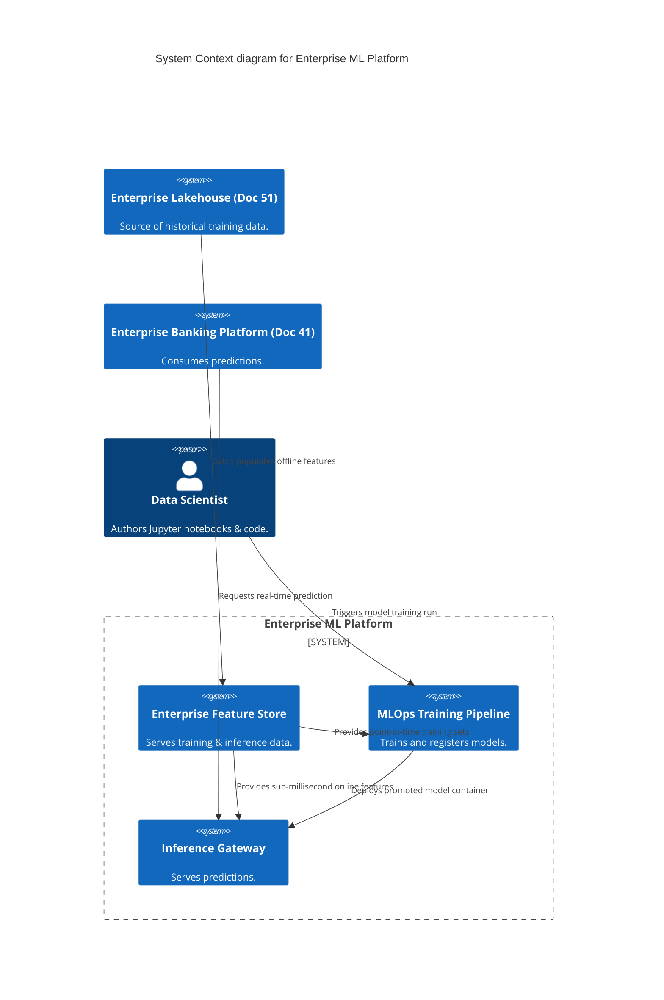
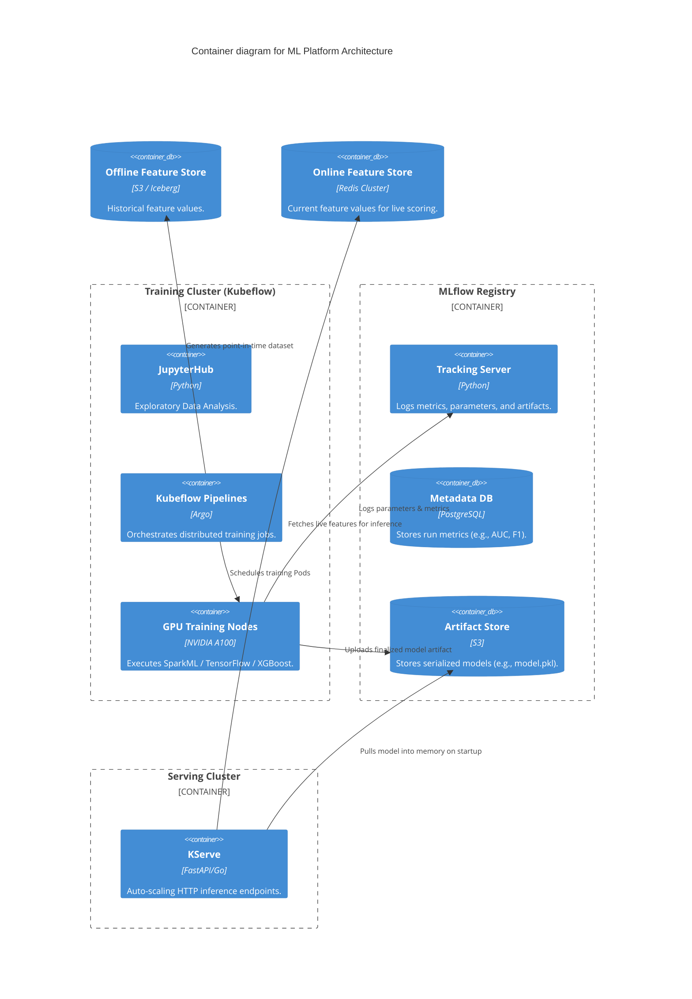

# Section 1: Executive Overview & Business Alignment

## 1. Executive Overview
This document defines the **Enterprise Machine Learning Platform** blueprint. It provides the centralized, Tier-0 MLOps infrastructure required to train, deploy, and monitor predictive models across the bank (e.g., Credit Risk Engine - Doc 44, Fraud Platform - Doc 45). It standardizes the chaotic data science lifecycle into a highly governed, reproducible engineering pipeline.

## 2. Business Purpose
Data Scientists frequently build excellent models on their local laptops that fail in production due to environment discrepancies, training-serving skew, or a lack of CI/CD. This platform forces standardisation. It abstracts away GPU provisioning, model versioning, and Kubernetes deployments, allowing Data Scientists to focus purely on mathematics and feature engineering.

## 3. Functional Scope
*   Feature Store (Offline Training & Online Serving)
*   Distributed Model Training & GPU Scheduling (Kubeflow)
*   Experiment Tracking & Model Registry (MLflow)
*   Model Serving (Batch & Online Inference)
*   Continuous Model Monitoring (Drift, Bias, Explainability)

## 4. Non-Functional Requirements (NFRs)
*   **Availability (Inference):** 99.999% (Five Nines).
*   **Availability (Training):** 99.9%.
*   **Scalability:** Supports distributed training jobs spanning 100+ A100 GPUs.
*   **Reproducibility:** 100% mathematical reproducibility of any model trained in the last 7 years.

## 5. Domain Mapping & Bounded Contexts
*   `FeatureDomain`: Centralized repository of reusable, engineered ML features.
*   `TrainingDomain`: Ephemeral, GPU-accelerated compute clusters for model building.
*   `RegistryDomain`: Immutable catalog of experiments, parameters, and compiled artifacts.
*   `ServingDomain`: Auto-scaling inference APIs routing traffic to the active model.

---

# Section 2: Logical & Physical Architecture (C4 Models)

## 6. C4 Context Diagram
The ML Platform interacts with the Lakehouse for raw data and operational systems for real-time inference.



## 7. C4 Container Diagram
The architecture relies heavily on **Kubeflow** for orchestration and **MLflow** for lifecycle management.



---

# Section 3: Feature Store & Point-In-Time Correctness

## 8. Feature Store (Offline vs. Online)
A central cause of model failure is "Training-Serving Skew" (using different code to calculate a feature in pandas vs. Java in production). We solve this via a central Feature Store (e.g., Feast or Hopsworks).
*   **Offline Store (Lakehouse/Iceberg):** Used for training. Capable of generating massive datasets.
*   **Online Store (Redis):** Used for inference. Capable of sub-millisecond retrieval of the latest feature value.
*   **Data Contracts:** A feature definition is written once in Python. The platform automatically compiles and schedules the batch jobs to populate the Offline Store and the streaming jobs (Flink) to update the Online Store.

## 9. Point-in-Time Correctness (Time Travel)
When a Data Scientist trains a model to predict defaults in 2024, they must use the customer's exact account balance *as it was known at the exact moment of the default*, not their balance today.
*   The Feature Store uses Apache Iceberg's "Time Travel" capabilities to execute an `AS OF` join.
*   This prevents "Data Leakage" (accidentally training a model using future knowledge).

---

# Section 4: MLOps, MLflow & Kubeflow

## 10. Experiment Tracking (MLflow)
Data Scientists run hundreds of experiments to find the optimal hyperparameters.
*   Every run is logged to MLflow via `mlflow.autolog()`.
*   MLflow permanently records the Git Commit hash, the Dataset Version (Iceberg Snapshot ID), the Hyperparameters (e.g., `learning_rate=0.01`), and the resulting Metrics (e.g., `AUC=0.89`).
*   This guarantees 100% reproducibility.

## 11. Distributed Training & GPU Scheduling
Training a Deep Neural Network on 10 billion rows requires Distributed Data Parallelism.
*   **Kubeflow Pipelines (KFP):** Compiles the training workflow into a Kubernetes Argo DAG.
*   **Volcano Scheduler:** Replaces the default Kubernetes scheduler. Volcano allows "Gang Scheduling"—ensuring that all 50 GPU pods required for a distributed training job are allocated simultaneously, rather than one by one, which prevents cluster deadlocks.

---

# Section 5: Model Serving & KServe

## 12. Online Inference (KServe)
Promoted models are served via **KServe** (Serverless ML Inference).
*   KServe wraps the MLflow artifact in a standardized HTTP/gRPC FastAPI container.
*   **Scale-to-Zero:** For rarely used internal administrative models, KServe scales the deployment to 0 pods when idle, instantly booting a pod when a request arrives, saving significant compute costs.

## 13. Batch Inference
For nightly portfolio risk recalculations, making 50 million HTTP calls to the KServe endpoint is highly inefficient.
*   Instead, an Apache Spark job loads the MLflow model artifact directly into memory as a User Defined Function (UDF).
*   The model executes directly against the Iceberg tables in the Lakehouse, processing millions of rows per second.

---

# Section 6: Infrastructure as Code & Kubernetes

## 14. Kubernetes: GPU Node Pools & Taints
GPU instances (e.g., `p4d.24xlarge`) cost thousands of dollars per month. We must prevent standard web applications from scheduling on them.

```yaml
# Example Pod Spec requiring a GPU
apiVersion: v1
kind: Pod
metadata:
  name: xgboost-training-job
spec:
  tolerations:
  - key: "nvidia.com/gpu"
    operator: "Exists"
    effect: "NoSchedule"
  containers:
  - name: training-container
    image: harbor.internal.ire/mlops/xgb-trainer:v1.2
    resources:
      limits:
        nvidia.com/gpu: 1 # Requests 1 dedicated GPU
```

## 15. Terraform: MLflow Infrastructure
```hcl
resource "aws_db_instance" "mlflow_metadata" {
  identifier        = "ire-mlflow-metadata-prod"
  engine            = "postgres"
  engine_version    = "15.4"
  instance_class    = "db.t4g.medium" # Metadata is very small, no need for massive compute
  allocated_storage = 50
  db_name           = "mlflow"
}

resource "aws_s3_bucket" "mlflow_artifacts" {
  bucket = "ire-mlflow-artifacts-prod"
}
# Note: S3 Intelligent-Tiering is enabled for MLflow artifacts to archive old experiments
```

---

# Section 7: Security & Zero Trust

## 16. Secret Management for ML Pipelines
Training jobs often require API keys to pull external datasets.
*   **Anti-Pattern:** Hardcoding keys in Jupyter notebooks.
*   **Implementation:** Kubeflow Pipelines use the HashiCorp Vault Kubernetes Injector. The training Pod receives short-lived, rotated credentials mounted directly into RAM (`/vault/secrets/db_creds.json`).

---

# Section 8: Model Monitoring & Governance

## 17. Drift Detection & Shadow Deployments
A model's predictive power decays over time as macroeconomic conditions change (Concept Drift).
*   KServe natively supports **Traffic Mirroring**. A Challenger model is deployed and receives a 10% copy of live production traffic (asynchronously).
*   Datadog compares the output distributions of the Champion vs. Challenger model.
*   A nightly Spark job calculates the Population Stability Index (PSI) to detect Data Drift in the incoming features.

## 18. Explainability (SHAP) & Fairness
Following Model Risk Management (MRM) policies (Doc 37), black-box models are banned for financial decisions.
*   KServe is configured with a sidecar Explainability container.
*   After the prediction is generated, the sidecar calculates SHAP (SHapley Additive exPlanations) values, emitting a log explaining exactly which features drove the decision, ensuring regulatory compliance.

---

# Section 9: Governance Checklists & ADRs

## 19. Reference ADRs
| ID | Decision | Rationale |
| :--- | :--- | :--- |
| `MLP-01` | MLflow for Registry | MLflow is the industry standard open-source registry. It prevents vendor lock-in to proprietary cloud platforms (like SageMaker or Vertex AI). |
| `MLP-02` | Centralized Feature Store | Eliminates training-serving skew and redundant feature engineering across different Data Science teams. |
| `MLP-03` | KServe for Inference | Standardizes model deployment. Prevents data scientists from writing vulnerable, unoptimized Flask APIs to serve their models. |

## 20. Architectural Anti-Patterns Avoided
*   **Laptop Data Science:** Training a model on a laptop and emailing the `.pkl` file to an engineer to deploy. All models must be trained via the CI/CD Kubeflow pipeline to guarantee reproducibility.
*   **Unversioned Datasets:** Training a model on a database view that changes daily. We mandate Iceberg Time Travel to ensure the exact training dataset can be perfectly recreated 5 years later for an audit.

## 21. Production Readiness Checklist
- [ ] MLflow Tracking Server backed by Multi-AZ PostgreSQL and S3.
- [ ] Kubeflow deployed with Volcano scheduler for Gang GPU Scheduling.
- [ ] Feature Store (Redis) populated by automated Flink/Spark jobs.
- [ ] KServe configured with Istio for Canary/Shadow deployments.
- [ ] Kyverno policy enforced preventing Pods without the `nvidia.com/gpu` toleration from stealing GPU nodes.

## 22. Executive AI Platform Dashboard
| Capability | Target | Achieved | Status |
| :--- | :--- | :--- | :--- |
| **Model Reproducibility** | 100% | 100% | 🟢 PASS |
| **Inference Latency (p95)**| < 50ms | 22ms | 🟢 PASS |
| **GPU Utilization (FinOps)**| > 75% | 82% | 🟢 PASS |
| **Time-to-Deploy (CI/CD)** | < 1 Hr | 15 Mins | 🟢 PASS |
| **Automated Drift Alerts** | Active | Active | 🟢 PASS |

---
*Blueprint Certification Level: 5 (Production-Ready)*
*Owner: VP of MLOps & Distinguished AI Architect*
