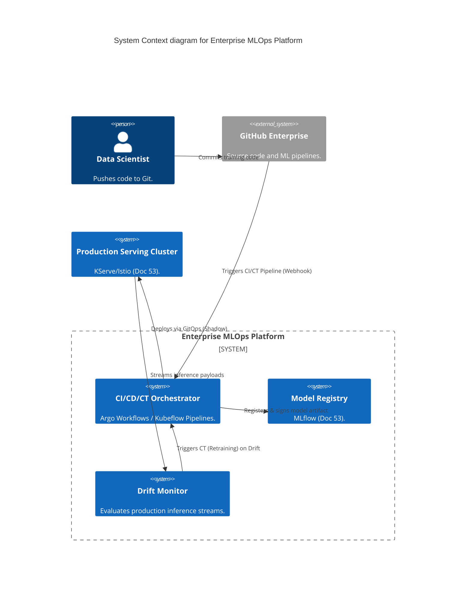

# Section 1: Executive Overview & Business Alignment

## 1. Executive Overview
This document defines the **Enterprise MLOps Platform** blueprint. While Document 53 defined the *compute and storage infrastructure* for Machine Learning, this document defines the strict *software engineering lifecycles* required to move models from Jupyter Notebooks to Production. It implements automated Continuous Integration (CI), Continuous Deployment (CD), and Continuous Training (CT), ensuring predictive models are governed with the same rigor as mission-critical Java applications.

## 2. Business Purpose
Models decay in production. Without MLOps, Data Scientists manually retrain models, leading to deployment bottlenecks, unexplainable model bias, and sudden performance degradation. This platform automates the retraining, validation, and safe deployment (Shadow/Canary) of models, protecting the Bank from algorithmic failure while maximizing AI ROI.

## 3. Functional Scope
*   ML CI/CD/CT (Continuous Integration, Deployment, and Training)
*   Automated Model Validation & Bias Testing
*   Deployment Strategies (Shadow, Canary, Champion/Challenger)
*   Continuous Drift Detection (Data, Feature, Concept)
*   Automated Rollbacks & Auditability

## 4. Non-Functional Requirements (NFRs)
*   **Time-to-Deploy:** Automated pipeline execution < 2 hours (post-training).
*   **Rollback Time:** Instantaneous (< 5 seconds) via Istio route updates.
*   **Auditability:** 100% cryptographic lineage from prediction back to the training dataset.

## 5. Domain Mapping & Bounded Contexts
*   `PipelineDomain`: Argo Workflows orchestrating CI/CD/CT DAGs.
*   `ValidationDomain`: Automated tests checking AUC, F1, and Disparate Impact (Fairness).
*   `DeploymentDomain`: GitOps (ArgoCD) injecting model artifacts into Istio meshes.
*   `MonitoringDomain`: Real-time streaming jobs calculating Population Stability Index (PSI).

---

# Section 2: Logical & Physical Architecture (C4 Models)

## 6. C4 Context Diagram
The MLOps platform orchestrates the flow between the Data Scientists, the Git Repository, the Model Registry, and the Production Cluster.



## 7. C4 Container Diagram (The MLOps Lifecycle)
The architecture separates Training (CT) from Deployment (CD).

```mermaid
C4Container
    title Container diagram for MLOps CI/CD/CT

    ContainerDb(git, "Git Repository", "GitHub", "Stores pipeline YAML & Python logic.")
    
    Container_Boundary(argo_eks, "Orchestration (Argo)") {
        Container(argo_wf, "Argo Workflows", "CT Engine", "Executes multi-step training DAGs.")
        Container(argocd, "ArgoCD", "CD Engine", "Syncs deployment manifests to K8s.")
    }

    Container_Boundary(validation, "Automated Validation") {
        Container(bias_checker, "Fairness Validator", "Python", "Checks Adverse Impact Ratios.")
        Container(metric_checker, "Performance Validator", "Python", "Ensures AUC > Champion.")
    }
    
    Container(mlflow, "MLflow Registry", "Model Store", "Holds Promoted Models.")
    Container(kserve, "KServe (Production)", "Inference", "Hosts Champion & Challenger.")

    Rel(git, argo_wf, "Trigger Continuous Training")
    Rel(argo_wf, validation, "Run tests on trained model")
    Rel(validation, mlflow, "Register & Tag 'Staging'")
    Rel(mlflow, argocd, "Webhook on Tag Promotion")
    Rel(argocd, kserve, "Apply Shadow Deployment")
```

---

# Section 3: ML CI/CD & Continuous Training (CT)

## 8. Continuous Training (CT) Automation
In traditional software, CI tests code. In ML, CI (or CT) trains the model.
*   **Trigger:** A CT pipeline is triggered either by a Git commit (algorithm change) or by the Drift Monitor (data change).
*   **DAG Execution:** Argo Workflows executes the DAG:
    1.  Pull dataset from Feature Store (Iceberg snapshot).
    2.  Execute distributed training on GPU nodes.
    3.  Log hyperparams/metrics to MLflow.
    4.  Serialize artifact (e.g., ONNX, serialized XGBoost).

## 9. Continuous Validation (Automated Quality Gates)
Before a model can be tagged as `Production-Ready`, it must pass automated gates:
*   **Accuracy Check:** The new model's primary metric (e.g., F1 Score) must exceed the currently deployed Champion model by at least 1% on a holdout dataset.
*   **Fairness Check:** Disparate Impact Analysis must confirm the model does not violate anti-discrimination laws (Doc 44).
*   **Latency Check:** The serialized model is booted in an ephemeral pod and bombarded with 1,000 requests. p99 latency must remain under the 50ms SLA.

---

# Section 4: Safe Deployment Strategies

## 10. Shadow Deployment (Dark Launch)
We never deploy a new model directly to real users.
*   The CD pipeline deploys the new model as a `Challenger`.
*   Istio is configured to **Mirror 100% of live traffic** from the `Champion` to the `Challenger`.
*   The Challenger processes the payload and logs the prediction to Kafka, but the HTTP response is dropped. The user only ever receives the Champion's response.
*   This allows MLOps to validate the Challenger's real-world accuracy and compute performance safely over 7 days.

## 11. Canary & Champion/Challenger
Once Shadow validation passes:
*   ArgoCD updates the Istio `VirtualService`.
*   5% of live traffic is routed to the Challenger (Canary).
*   If error rates and latency remain stable, Datadog triggers a webhook to slowly ramp traffic to 100%, decommissioning the old Champion.

```yaml
# Istio VirtualService executing a 95/5 Canary
apiVersion: networking.istio.io/v1alpha3
kind: VirtualService
metadata:
  name: credit-scoring-routing
spec:
  hosts:
  - credit-scoring.internal.ire
  http:
  - route:
    - destination:
        host: credit-scoring-champion
      weight: 95
    - destination:
        host: credit-scoring-challenger
      weight: 5
```

---

# Section 5: Drift Detection & Automated Rollbacks

## 12. Drift Detection (Data & Concept Drift)
Models degrade because the world changes.
*   **Feature Drift (Data Drift):** We use Flink to calculate the Population Stability Index (PSI) of incoming feature streams. If the distribution of "Income" suddenly skews left compared to the training dataset, an alert is fired.
*   **Concept Drift:** Assessed by joining the model's past predictions with the actual ground-truth outcomes (e.g., 30 days later, did the customer actually default?). If predictive accuracy drops below the threshold, a webhook automatically triggers a Continuous Training (CT) pipeline to retrain the model on the latest data.

## 13. Automated Rollbacks
If a Canary deployment causes a spike in HTTP 500 errors (detected by Datadog):
*   A webhook is sent to ArgoCD.
*   ArgoCD instantly reverts the Istio `VirtualService` weight back to 100% Champion.
*   This rollback occurs in < 5 seconds, minimizing customer impact without requiring human intervention.

---

# Section 6: Infrastructure as Code & Security

## 14. Terraform: GitOps Repository & Webhooks
```hcl
resource "github_repository" "mlops_manifests" {
  name        = "ire-mlops-manifests-prod"
  description = "GitOps repository for ML deployments"
  visibility  = "internal"
}

resource "github_repository_webhook" "argocd_sync" {
  repository = github_repository.mlops_manifests.name
  
  configuration {
    url          = "https://argocd.internal.ire/api/webhook"
    content_type = "json"
    insecure_ssl = false
  }
  events = ["push"] # Instantly triggers ArgoCD on merge
}
```

## 15. Security, Auditability & Model Signing
*   **Cryptographic Lineage:** When a model passes the Continuous Validation gates, the artifact is cryptographically signed using Cosign.
*   **Admission Control:** Kyverno policies in the Kubernetes cluster intercept any attempt to deploy an ML model. If the artifact lacks the signature proving it passed the Fairness checks, the deployment is blocked.

---

# Section 7: Governance Checklists & ADRs

## 16. Reference ADRs
| ID | Decision | Rationale |
| :--- | :--- | :--- |
| `MLOPS-01` | Argo Workflows over Airflow | Airflow is excellent for batch ETL, but Argo is native to Kubernetes, allowing seamless orchestration of complex containerized ML DAGs and direct integration with ArgoCD. |
| `MLOPS-02` | Shadow Deployments | Financial models carry too much risk for standard Blue/Green deployments. Running in "Shadow Mode" allows us to build a statistically significant performance comparison without risking actual capital. |
| `MLOPS-03` | Immutable MLflow Tags | Once a model is tagged `Production` in MLflow, that tag cannot be reassigned or deleted, guaranteeing a permanent audit trail for regulators. |

## 17. Architectural Anti-Patterns Avoided
*   **Manual Retraining:** Waiting for a Data Scientist to realize a model is broken, manually pull data, retrain, and deploy. CT pipelines automate this entirely based on Drift metrics.
*   **Testing in Production (Without Shadowing):** Deploying a model directly to 100% traffic. Algorithmic bugs in credit models can approve millions in bad loans in minutes.
*   **Missing Holdout Sets:** Training and validating a model on the exact same dataset, leading to overfitting and catastrophic real-world failure. CI pipelines enforce strict dataset splits.

## 18. Production Readiness Checklist
- [ ] Argo Workflows deployed and integrated with GitHub Webhooks.
- [ ] Automated Disparate Impact Analysis (Fairness) gates configured in all CT pipelines.
- [ ] Istio traffic mirroring (Shadow mode) configured for all Tier-1 model deployments.
- [ ] Flink streaming jobs active for calculating PSI (Data Drift).
- [ ] Cosign integration active; Kyverno blocking unsigned model artifacts.

## 19. Executive MLOps Dashboard
| Capability | Target | Achieved | Status |
| :--- | :--- | :--- | :--- |
| **Pipeline Success Rate** | > 95% | 98.2% | 🟢 PASS |
| **Shadow Validation Time** | 7 Days | 7 Days | 🟢 PASS |
| **Automated Rollback Time**| < 10s | 3s | 🟢 PASS |
| **Models Monitored for Drift**| 100% | 100% | 🟢 PASS |
| **CT Trigger to Deploy** | < 4 Hrs | 2.5 Hrs | 🟢 PASS |

---
*Blueprint Certification Level: 5 (Production-Ready)*
*Owner: Head of MLOps & Chief Enterprise Architect*
