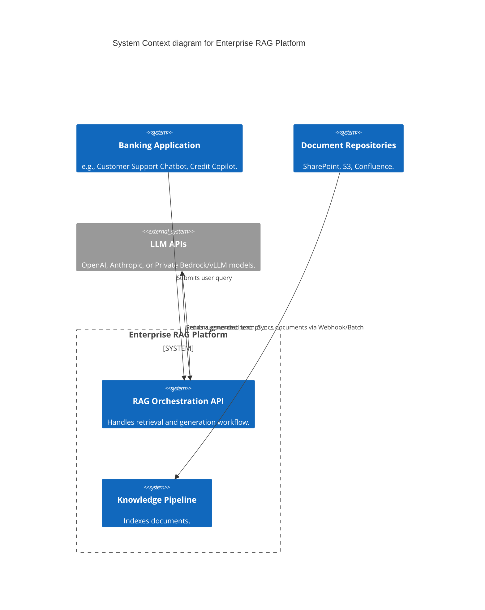
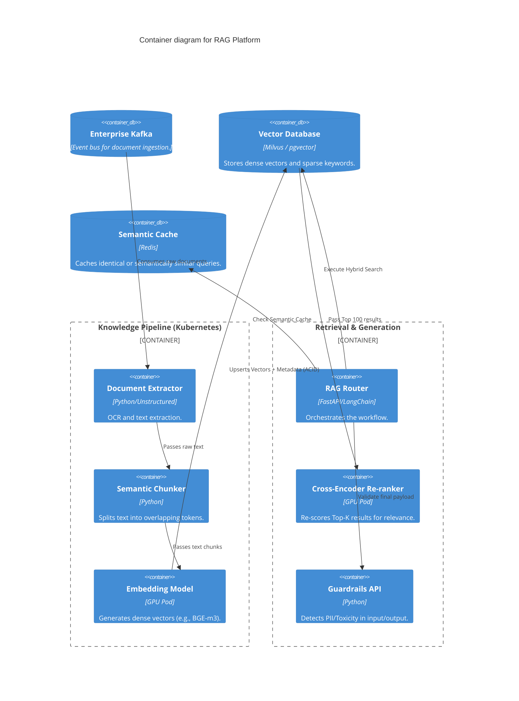

# Section 1: Executive Overview & Business Alignment

## 1. Executive Overview
This document defines the **Enterprise Retrieval-Augmented Generation (RAG) Platform** blueprint. It provides the Tier-0 architecture required to securely ground Large Language Models (LLMs) with the Bank's proprietary, highly classified internal data. This platform prevents LLM hallucinations, enforces strict Row-Level Security (RLS) on document retrieval, and abstracts away the complexities of vector databases and prompt engineering from downstream application developers.

## 2. Business Purpose
Off-the-shelf LLMs possess zero knowledge of the Bank's internal credit policies, customer profiles, or proprietary research. Fine-tuning an LLM on this data is prohibitively expensive and makes enforcing access control impossible (an LLM cannot "forget" a document a user isn't allowed to see). RAG solves this by retrieving relevant data at inference time and injecting it securely into the prompt context window.

## 3. Functional Scope
*   Knowledge Ingestion Pipeline (OCR, Chunking, Embedding)
*   Vector Storage & Hybrid Search (Semantic + Keyword)
*   Advanced RAG (Re-ranking, Query Expansion, Knowledge Graphs)
*   Semantic Caching & LLM Routing
*   Guardrails (DLP, PII redaction, Hallucination detection)

## 4. Non-Functional Requirements (NFRs)
*   **Retrieval Latency:** Sub-100ms vector search across 1B+ chunks.
*   **Time-to-Index:** Uploaded documents queryable within < 5 seconds.
*   **Security:** 100% enforcement of document-level Entitlements/RBAC.
*   **Accuracy:** > 95% Retrieval precision (Top-K relevance).

## 5. Domain Mapping & Bounded Contexts
*   `IngestionDomain`: Extracts text from PDFs/HTML and generates vector embeddings.
*   `RetrievalDomain`: Executes Hybrid Search against the Vector Database.
*   `AssemblyDomain`: Manages prompt templates and injects context.
*   `GuardrailDomain`: Enforces data loss prevention (DLP) and output validation.

---

# Section 2: Logical & Physical Architecture (C4 Models)

## 6. C4 Context Diagram
The RAG platform acts as a secure intermediary between internal banking applications and external/internal LLM APIs.



## 7. C4 Container Diagram
The architecture relies on a highly decoupled pipeline, utilizing Kafka for async indexing and a dedicated Vector Database for retrieval.



---

# Section 3: Knowledge Pipeline & Ingestion

## 8. Document Extraction & OCR
Banking documents are complex (e.g., tabular financial statements in PDF).
*   Standard text extraction destroys table structure, rendering the data useless to an LLM.
*   We utilize specialized layout-aware extractors (e.g., `Unstructured.io` or AWS Textract) to preserve Markdown-formatted tables and hierarchical headings.

## 9. Semantic Chunking
Splitting text blindly by character count (e.g., every 500 chars) cuts sentences in half, destroying semantic meaning.
*   **Implementation:** We implement recursive character splitting backed by semantic boundary detection (splitting on paragraphs or Markdown headers).
*   **Overlap:** A 15% token overlap is mandated to ensure context is not lost at the chunk boundaries.

## 10. Embeddings & Metadata Injection
Every chunk is converted into a high-dimensional vector. Crucially, raw text is not enough.
*   **Metadata:** Before upserting to the Vector DB, every chunk is enriched with strict metadata: `Document_ID`, `Author`, `Classification_Level`, and `Allowed_AD_Groups`.
*   This metadata is the absolute foundation of our Zero Trust security model.

---

# Section 4: Advanced Retrieval Strategies

## 11. Hybrid Search (Semantic + Keyword)
Dense vector search (Semantic) is excellent for conceptual queries ("How do I handle a default?"), but terrible for exact matches ("Show me policy ABC-123").
*   The Vector Database must support **Hybrid Search**, executing both a Dense Vector search (Cosine Similarity) and a Sparse Keyword search (BM25) simultaneously.
*   The scores are mathematically fused via Reciprocal Rank Fusion (RRF) to return a unified result set.

## 12. Cross-Encoder Re-Ranking
Standard vector similarity (Bi-Encoders) is fast but computationally shallow.
*   The Vector DB returns a broad Top-100 candidates.
*   These candidates are passed to a highly accurate **Cross-Encoder Model** (e.g., `bge-reranker-large`) running on GPUs. The re-ranker evaluates the exact relationship between the user's query and the chunk, sorting the Top-5 most relevant chunks to actually feed into the LLM context window.

## 13. Knowledge Graph Integration (GraphRAG)
For complex multi-hop reasoning ("Which subsidiaries of Corp X hold loans under Policy Y?"), vector similarity fails.
*   The RAG Router integrates with the AML Neo4j Graph (Doc 48).
*   LLM function calling executes Cypher queries against the graph, combining the structured graph data with unstructured document text in the final prompt.

---

# Section 5: Guardrails, Caching & Generation

## 14. Semantic Caching (Redis)
LLM calls are expensive and slow (e.g., 2+ seconds).
*   We utilize Redis with Vector Search capabilities as a **Semantic Cache**.
*   If User B asks, "What are the rules for late fees?", and User A previously asked, "How do late fees work?", the cache recognizes the semantic similarity (Cosine Distance > 0.95) and instantly returns the cached LLM response in 10ms, entirely bypassing the Vector DB and the LLM API.

## 15. Guardrails & DLP
Following Doc 38, PII cannot be sent to external APIs (even enterprise-contracted ones).
*   The Guardrails API intercepts the assembled prompt.
*   Named Entity Recognition (NER) models scan for SSNs, Account Numbers, and restricted keywords. If found, they are masked (e.g., `[REDACTED_SSN]`) before transmission.
*   Output is similarly scanned for hallucinations or toxic content.

## 16. Citation Engine
An LLM answer without a verifiable source is useless in banking.
*   The RAG API forces the LLM to provide citations mapping back to the injected chunks.
*   The API returns a JSON payload containing the Answer and a list of Source Documents with deep-links, allowing the human to verify the exact paragraph the LLM used.

---

# Section 6: Infrastructure as Code & Kubernetes

## 17. Kubernetes: GPU Inference (Embeddings & Re-ranking)
Embedding and Re-ranking models require extreme throughput. We deploy them to EKS using KServe (Doc 53).

```yaml
apiVersion: serving.kserve.io/v1beta1
kind: InferenceService
metadata:
  name: bge-m3-embedder
  namespace: rag-platform
spec:
  predictor:
    minReplicas: 2
    maxReplicas: 10
    tolerations:
      - key: "nvidia.com/gpu"
        operator: "Exists"
        effect: "NoSchedule"
    containers:
      - name: kserve-container
        image: harbor.internal.ire/ai/embedding-server:v1.4
        resources:
          limits:
            nvidia.com/gpu: 1
```

## 18. Terraform: Vector Database (Milvus / pgvector)
For massive scale (> 1 Billion vectors), we deploy Milvus. For smaller domains, we use `pgvector` on Aurora PostgreSQL to simplify operations.

```hcl
# Example provisioning of Aurora Serverless with pgvector
resource "aws_rds_cluster" "rag_vector_db" {
  cluster_identifier = "ire-rag-vector-store"
  engine             = "aurora-postgresql"
  engine_mode        = "provisioned"
  engine_version     = "15.4"
  
  serverlessv2_scaling_configuration {
    max_capacity = 64.0
    min_capacity = 2.0
  }
}

# The pgvector extension must be explicitly enabled inside the DB
```

---

# Section 7: Security & Entitlements

## 19. Enforcing Row-Level Security (RLS) in Vector Search
An LLM cannot filter data after it has been read. Access control must occur at the database layer.
*   When the RAG Router executes a similarity search, it injects the user's Active Directory (AD) groups into the query metadata filter.
*   `SELECT * FROM chunks WHERE vector <=> [user_query_vector] AND ad_group IN ('HR_Internal', 'Public') LIMIT 5`
*   This mathematically guarantees a user can never retrieve a chunk from a document they lack permissions to read.

---

# Section 8: Observability & SRE

## 20. OpenTelemetry for RAG (LangSmith / Arize)
Traditional APM traces are insufficient. We must trace the complex LangChain/LlamaIndex execution paths.
*   Spans include: `Retrieve_from_Milvus`, `Re-rank_Results`, `Assemble_Prompt`, `LLM_Generation`.
*   We monitor **Retrieval Latency** (p99 must be < 100ms) and **Time to First Token (TTFT)** for the LLM streaming response.

---

# Section 9: Governance Checklists & ADRs

## 21. Reference ADRs
| ID | Decision | Rationale |
| :--- | :--- | :--- |
| `RAG-01` | RAG over Fine-Tuning | Fine-tuning an LLM on proprietary data risks catastrophic data leakage (memorization) and makes document-level access control impossible. |
| `RAG-02` | Hybrid Search + Re-ranking | Pure vector search fails on keyword-heavy financial documents (e.g., finding a specific SEC filing ID). Hybrid search ensures both semantic and lexical accuracy. |
| `RAG-03` | Semantic Caching | Reduces expensive LLM API calls by up to 40% for common queries, cutting costs and dropping latency from 3 seconds to 10ms. |

## 22. Architectural Anti-Patterns Avoided
*   **Blindly Stuffing the Context Window:** Passing 100-page PDFs into a 128k context window. This causes "Lost in the Middle" syndrome where the LLM forgets data in the center of the prompt, and it drastically increases API costs. Strict chunking and Top-5 retrieval is mandatory.
*   **Ignoring Metadata:** Upserting vectors without source metadata, making it impossible to provide citations or enforce security access controls.
*   **Synchronous Indexing:** Forcing the user to wait for a 500-page PDF to be chunked and embedded before returning a 200 HTTP OK. Ingestion must be handled asynchronously via Kafka.

## 23. Production Readiness Checklist
- [ ] Embedding models (BGE-m3) deployed to dedicated GPU nodes via KServe.
- [ ] Vector Database configured with HNSW (Hierarchical Navigable Small World) indices.
- [ ] Semantic Cache (Redis) implemented with a strict Cosine Similarity threshold (>0.95).
- [ ] Guardrails API deployed and intercepting all outbound LLM payloads for DLP.
- [ ] RLS metadata filters enforced on every single Vector DB query.

## 24. Executive AI Operations Dashboard
| Capability | Target | Achieved | Status |
| :--- | :--- | :--- | :--- |
| **Vector Retrieval Latency** | < 100ms | 45ms | 🟢 PASS |
| **Time to First Token (TTFT)**| < 500ms | 380ms | 🟢 PASS |
| **Semantic Cache Hit Rate** | > 30% | 36% | 🟢 PASS |
| **Ingestion Pipeline Delay** | < 5s | 1.2s | 🟢 PASS |
| **DLP Interceptions (Masked)**| N/A | 14,200/day| 🟢 PASS |

---
*Blueprint Certification Level: 5 (Production-Ready)*
*Owner: Distinguished AI Architect & Head of Generative AI*
