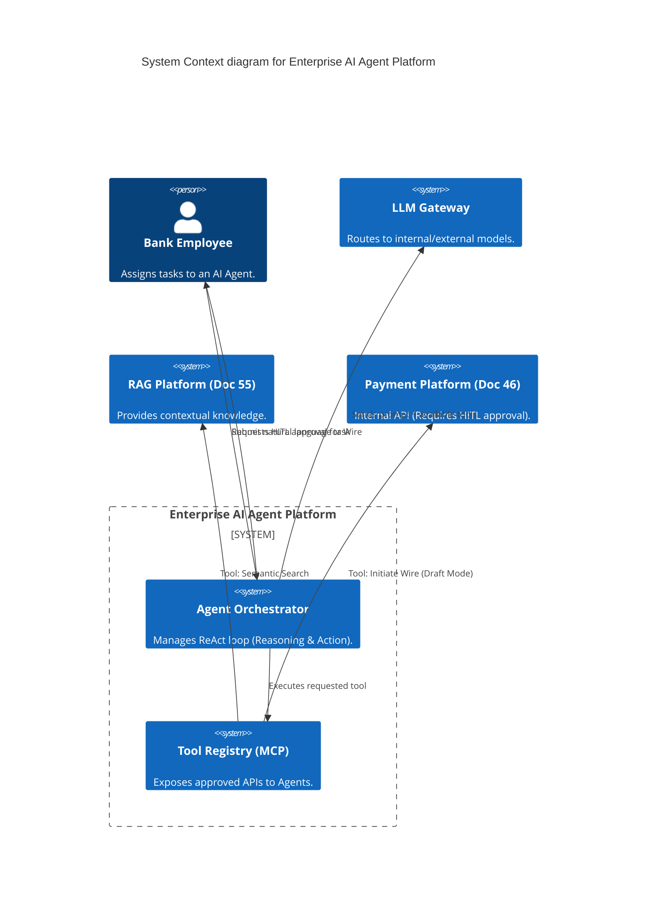
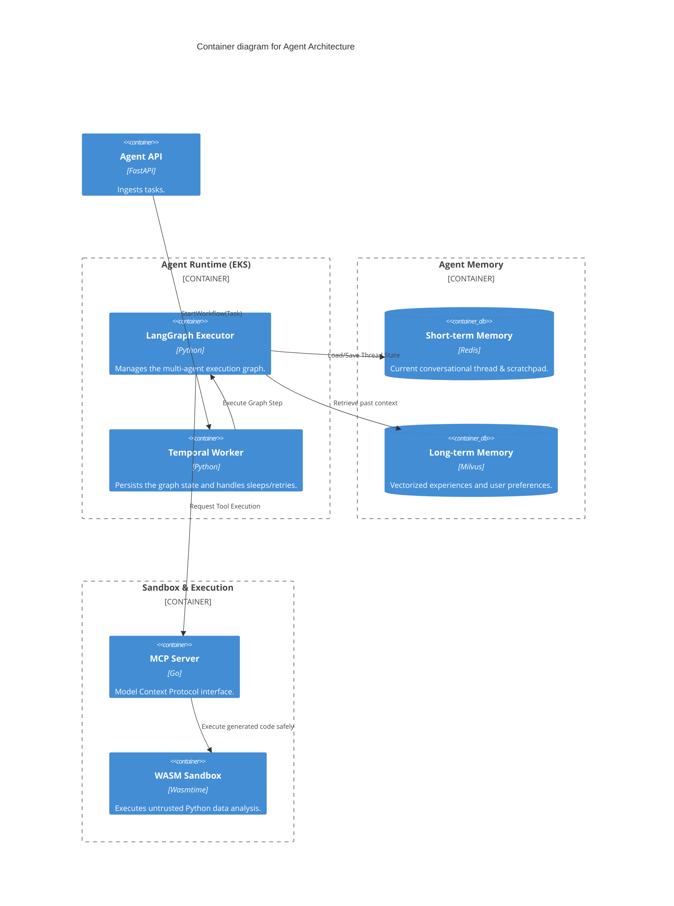
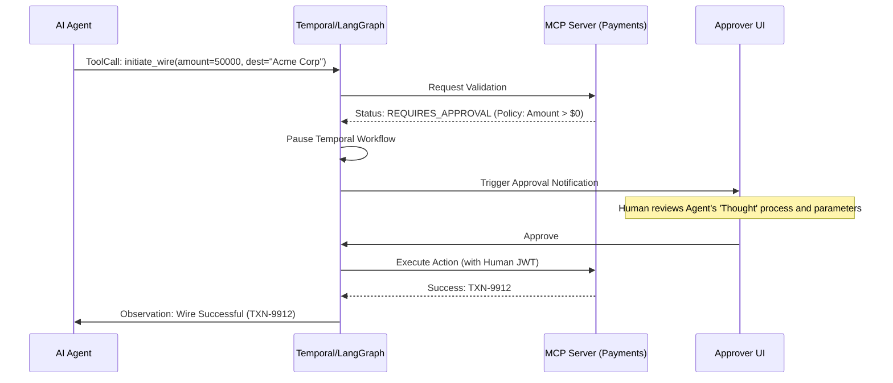

# Section 1: Executive Overview & Business Alignment

## 1. Executive Overview
This document defines the **Enterprise AI Agent Platform** blueprint. Moving beyond the static question-and-answer paradigm of RAG (Doc 55), this platform provides the Tier-0 architecture for deploying **Autonomous AI Agents** capable of planning, reasoning, and executing multi-step workflows. It defines the strict guardrails, sandbox environments, and memory mechanisms required to allow an LLM to take actions (e.g., executing an API call, querying a database, or drafting a wire transfer) securely within the Bank's network.

## 2. Business Purpose
Traditional Robotic Process Automation (RPA) is brittle; if a UI button moves, the bot breaks. AI Agents provide *Semantic Automation*. By granting LLMs access to controlled tools via the Model Context Protocol (MCP), agents can dynamically reason through ambiguous tasks (e.g., "Analyze these three unstructured loan applications, query the Risk Engine for their credit scores, and draft an approval memo for the ones above 700").

## 3. Functional Scope
*   Multi-Agent Orchestration (LangGraph / Temporal)
*   Agent Memory (Short-term/Conversational & Long-term/Vector)
*   Tool Calling & Model Context Protocol (MCP) Integration
*   Agent Sandboxing & Identity (OAuth2 / SPIFFE)
*   Human-in-the-Loop (HITL) Workflows

## 4. Non-Functional Requirements (NFRs)
*   **Availability:** 99.99% (Four Nines).
*   **Safety:** 100% enforcement of Human-in-the-Loop for all write operations > $0.
*   **Auditability:** Cryptographic logging of every tool call and prompt reasoning step.
*   **Execution Scalability:** Capable of running 10,000 concurrent long-running agent workflows.

## 5. Domain Mapping & Bounded Contexts
*   `OrchestrationDomain`: Manages the state machine of the Agent's reasoning loop (ReAct).
*   `MemoryDomain`: Manages context windows, summarization, and vector storage.
*   `ToolDomain`: Executes external API calls (sandboxed via MCP).
*   `ApprovalDomain`: Routes critical actions to human supervisors.

---

# Section 2: Logical & Physical Architecture (C4 Models)

## 6. C4 Context Diagram
The AI Agent Platform acts as the autonomous execution engine, interacting with internal APIs on behalf of users.



## 7. C4 Container Diagram (Multi-Agent State Machine)
Because Agent workflows can take minutes or hours (involving API calls and human approvals), we utilize **Temporal** coupled with **LangGraph** to maintain a persistent state machine.



---

# Section 3: Reasoning, Planning & Multi-Agent Teams

## 8. The ReAct (Reason + Act) Loop
Agents do not blindly execute commands; they plan.
*   The Orchestrator utilizes the **ReAct** prompting strategy.
*   **Thought:** The LLM outputs its internal reasoning (e.g., "To evaluate this loan, I first need to pull the customer's credit score using the `get_credit_score` tool.").
*   **Action:** The LLM outputs a structured JSON function call.
*   **Observation:** The Orchestrator executes the tool and injects the JSON response back into the prompt, forcing the LLM to evaluate the result before taking its next action.

## 9. Multi-Agent Orchestration (LangGraph)
A single monolithic Agent gets confused on complex tasks. We utilize LangGraph to build multi-agent teams.
*   **Supervisor Agent:** Breaks down the user's task and delegates sub-tasks.
*   **Researcher Agent:** Has tools restricted to RAG (Doc 55) and web searching.
*   **Coder Agent:** Has tools restricted to executing Python inside the WASM Sandbox.
*   LangGraph manages the cyclic graph, passing state between agents until the Supervisor determines the primary goal is achieved.

---

# Section 4: Memory & State Management

## 10. Short-Term Memory (Conversational State)
*   The current "Thread" of conversation and tool executions is stored in Redis.
*   **Context Window Management:** Because 50 tool executions will quickly blow past a 128k context window, the platform implements **Automated Summarization**. When the thread exceeds 80k tokens, an LLM call summarizes the earliest interactions, swapping the raw messages for the summary to preserve space.

## 11. Long-Term Memory (Vectorized Experiences)
*   When a thread completes, the final outcome and key learnings are embedded (via Doc 55's embedding pipeline) into the Milvus Vector Database.
*   When the user initiates a future task, the Agent automatically performs a similarity search against Long-Term Memory (e.g., "I remember last time we evaluated this corporate client, their primary risk factor was FX exposure in APAC").

---

# Section 5: Tool Calling & Model Context Protocol (MCP)

## 12. Standardizing Tools via MCP
Providing LLMs with raw REST APIs requires massive prompt engineering. We utilize the **Model Context Protocol (MCP)** as the standard interface.
*   Internal microservices expose an MCP Server interface.
*   The MCP Server provides a standardized JSON Schema of its capabilities (Tools, Resources, and Prompts).
*   The Agent Orchestrator dynamically reads these schemas and formats them into the OpenAI/Anthropic native Tool Calling format.

## 13. Event Flow: Human-in-the-Loop (HITL) Execution
Agents cannot execute destructive or financial actions autonomously.



---

# Section 6: Security, Sandboxing & Identity

## 14. Agent Identity & Authorization (SPIFFE/OAuth2)
Agents execute actions on behalf of users, but they must be strictly constrained.
*   When a user initiates an Agent, the platform mints a scoped OAuth2 JWT.
*   This token implements **Delegated Identity**. The Agent runs as `Agent-482 (Acting as: User-JohnDoe)`.
*   If the Agent attempts to use the `query_customer_db` tool, the downstream database evaluates *John Doe's* Row-Level Security (RLS) entitlements, preventing the Agent from accessing data John Doe cannot see.

## 15. The Execution Sandbox (WebAssembly)
Agents are frequently asked to "Write a python script to analyze this CSV and generate a chart."
*   Executing LLM-generated code natively on a Kubernetes pod is a critical security vulnerability (Remote Code Execution).
*   All generated code is executed inside a **WebAssembly (WASM) Sandbox** (e.g., Wasmtime) with strict CPU limits, zero network access, and an ephemeral filesystem.

---

# Section 7: Infrastructure as Code & Kubernetes

## 16. Kubernetes: Temporal & LangGraph Deployment
Agent workflows require extreme fault tolerance. Temporal handles process persistence natively.

```yaml
apiVersion: apps/v1
kind: Deployment
metadata:
  name: agent-runtime-worker
  namespace: ai-agents
spec:
  replicas: 10
  template:
    spec:
      containers:
      - name: temporal-langgraph-worker
        image: harbor.internal.ire/ai/agent-runtime:v2.1
        env:
        - name: TEMPORAL_ADDRESS
          value: "temporal-frontend.core.svc:7233"
        - name: MCP_REGISTRY_URL
          value: "http://mcp-registry.internal.ire"
        resources:
          requests:
            cpu: "2"
            memory: "4Gi"
```

## 17. Terraform: Tool Registry Networking
MCP Servers must be network-isolated from the open internet, communicating only via the Agent Runtime VPC.

```hcl
resource "aws_security_group_rule" "allow_mcp_from_agents" {
  type                     = "ingress"
  from_port                = 8080
  to_port                  = 8080
  protocol                 = "tcp"
  security_group_id        = aws_security_group.mcp_internal_api.id
  source_security_group_id = aws_security_group.agent_runtime.id
  description              = "Allow MCP Tool Calls only from Agent EKS Nodes"
}
```

---

# Section 8: SRE, Observability & Cost Monitoring

## 18. AI Telemetry & LangSmith
Monitoring Agents requires tracking non-deterministic loops.
*   We utilize LangSmith (or DataDog LLM Observability) to trace every step of the ReAct loop.
*   **Tool Error Rates:** If the `get_customer` tool returns an HTTP 500, the LLM will often retry wildly, generating a loop that consumes $50 of API credits in 2 minutes. The platform enforces a hard limit of 3 consecutive tool failures before terminating the workflow.

## 19. FinOps (Token Cost Monitoring)
Multi-agent workflows consume massive amounts of tokens as they pass context back and forth.
*   Every Temporal workflow is tagged with a `CostCenter` ID.
*   The LLM Gateway aggregates Token input/output counts and multiplies them by the model's pricing (e.g., GPT-4o at $5/$15 per 1M).
*   If an Agent exceeds a $10 intraday budget, it is paused pending human approval.

---

# Section 9: Governance Checklists & ADRs

## 20. Reference ADRs
| ID | Decision | Rationale |
| :--- | :--- | :--- |
| `AGT-01` | Temporal for Orchestration | AI Agents often hit rate limits or wait for human approvals. Standard Python threads will crash/timeout. Temporal natively persists the state machine to Cassandra, allowing workflows to sleep for days safely. |
| `AGT-02` | WebAssembly Sandboxing | Docker-in-Docker (DinD) is too heavy and insecure for executing LLM-generated Python. WASM provides millisecond startup times and mathematically proven memory isolation. |
| `AGT-03` | Model Context Protocol (MCP) | Hardcoding API specs into prompts is unmaintainable. MCP standardizes tool discovery, allowing microservices to define their own capabilities securely. |

## 21. Architectural Anti-Patterns Avoided
*   **The Unbounded Loop:** Allowing an Agent to reason indefinitely. We implement strict recursion limits (e.g., Max Steps = 15). If the Agent hasn't solved the task, it must halt and ask the user for help.
*   **Autonomous Write Access:** Granting an Agent an API key with `WRITE` access to the core ledger. All write actions mandate a cryptographically signed HITL approval.
*   **System Prompt Bloat:** Shoving 50 tool descriptions into the system prompt. We use dynamic RAG to inject only the tool schemas that are semantically relevant to the current task.

## 22. Production Readiness Checklist
- [ ] Temporal cluster deployed and integrated with LangGraph worker queues.
- [ ] Model Context Protocol (MCP) Registry established for internal APIs.
- [ ] Wasmtime sandboxes configured with zero network egress for code execution.
- [ ] Human-in-the-Loop (HITL) approval UI integrated with Temporal Signals.
- [ ] FinOps Token Budgets enforced at the workflow invocation layer.
- [ ] Context window summarizers configured to trigger at 80% capacity.

## 23. Executive AI Operations Dashboard
| Capability | Target | Achieved | Status |
| :--- | :--- | :--- | :--- |
| **Agent Task Completion Rate** | > 85% | 89% | 🟢 PASS |
| **HITL Interception Rate** | 100% | 100% | 🟢 PASS |
| **Tool Execution Latency** | < 500ms | 210ms | 🟢 PASS |
| **Average Cost per Task** | < $0.10 | $0.08 | 🟢 PASS |
| **Sandbox Escapes** | 0 | 0 | 🟢 PASS |

---
*Blueprint Certification Level: 5 (Production-Ready)*
*Owner: Distinguished AI Architect & VP of Automation*
