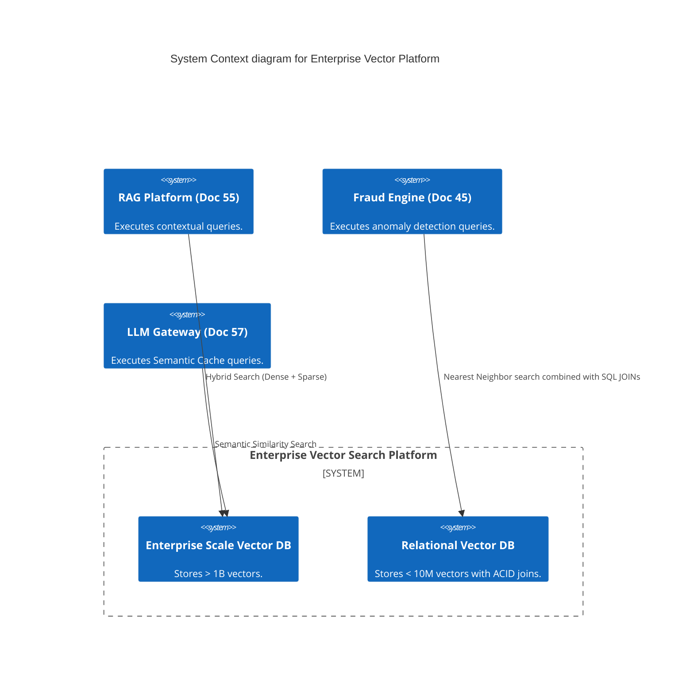
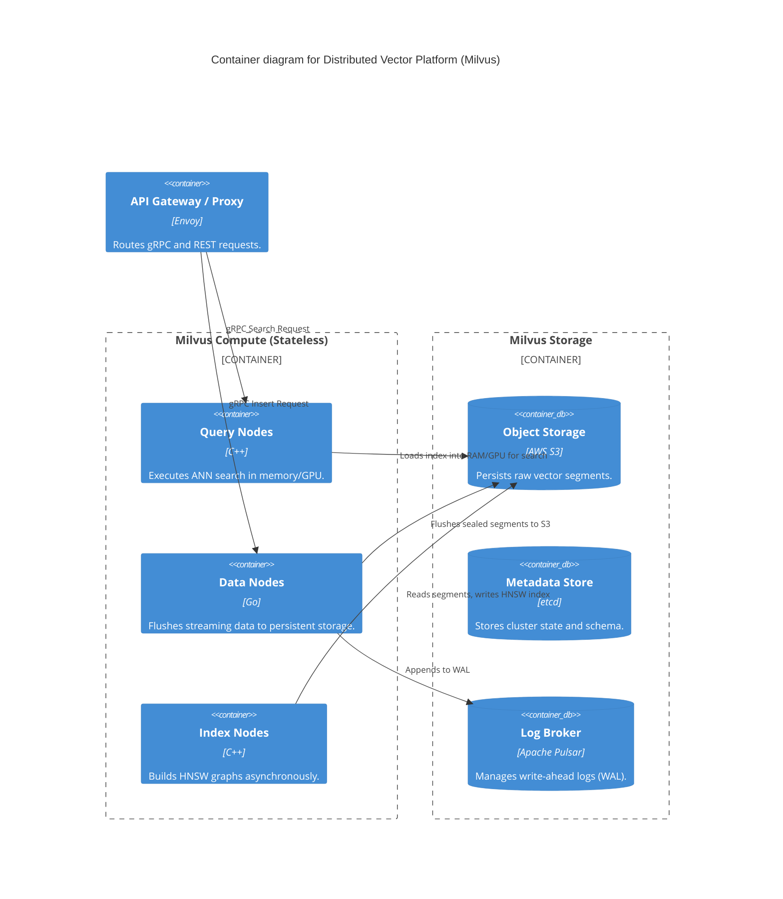

# Section 1: Executive Overview & Business Alignment

## 1. Executive Overview
This document defines the **Enterprise Vector Search Platform** blueprint. While Document 55 defined the *application-layer workflows* for RAG (Retrieval-Augmented Generation), this blueprint defines the massive, highly distributed *database infrastructure* required to store and instantly search billions of high-dimensional dense vectors.

## 2. Business Purpose
Traditional databases index text using inverted indices (B-Trees, Lucene), which match exact keywords. Generative AI requires matching *semantic meaning*. The Vector Search Platform allows the bank to search through petabytes of unstructured text, images, and audio by calculating mathematical distances (Cosine, L2) between dense vectors in sub-100 millisecond timeframes, powering RAG, Fraud Anomaly Detection, and Semantic Caching.

## 3. Functional Scope
*   Approximate Nearest Neighbor (ANN) Indexing (HNSW, IVF_FLAT)
*   Hybrid Search (Dense Vector + Sparse Keyword / BM25)
*   Distributed Vector Storage (Milvus for scale, pgvector for simplicity)
*   Multi-Tenancy & Hardware-Accelerated (GPU) Search
*   Vector Lifecycle Management & Garbage Collection

## 4. Non-Functional Requirements (NFRs)
*   **Search Latency:** < 50ms for Top-K=100 search over 1 Billion vectors.
*   **Throughput:** > 10,000 Queries Per Second (QPS) globally.
*   **Availability:** 99.99% across multiple Availability Zones.
*   **Scale:** Support for vectors up to 4,096 dimensions (e.g., OpenAI `text-embedding-3-large`).

## 5. Domain Mapping & Bounded Contexts
*   `IndexDomain`: Constructs and maintains memory-mapped ANN graphs.
*   `SearchDomain`: Executes distributed vector distance calculations.
*   `MetadataDomain`: Executes scalar pre-filtering for RBAC enforcement.
*   `LifecycleDomain`: Manages the expiration, archiving, and compaction of vectors.

---

# Section 2: Logical & Physical Architecture (C4 Models)

## 6. C4 Context Diagram
The Vector Search Platform acts as the mathematical retrieval engine for all AI systems in the bank.



## 7. C4 Container Diagram (The Distributed Milvus Architecture)
For enterprise-scale vector storage (> 100 Million vectors), we deploy **Milvus** on Kubernetes, which completely separates storage from compute.



---

# Section 3: Vector Database Selection Matrix

## 8. Database Tiers & Platforms
We reject the "One Size Fits All" database anti-pattern. We deploy three distinct vector architectures based on scale and consistency needs:
*   **Tier 1: Massive Scale (> 100M Vectors).** Standard: **Milvus**. Highly distributed, separates storage/compute, native GPU indexing. (Alternatives evaluated: Qdrant, Weaviate, Pinecone. Pinecone rejected due to SaaS-only lock-in and PII egress risks).
*   **Tier 2: Relational Fusion (< 100M Vectors).** Standard: **pgvector (PostgreSQL)**. Used when vectors must be tightly joined with complex ACID transaction data in real-time.
*   **Tier 3: Ultra-Low Latency Cache.** Standard: **Redis Vector Search**. Used strictly by the LLM Gateway (Doc 57) for sub-10ms Semantic Caching where data durability is not required.

---

# Section 4: Indexing & Search Algorithms

## 9. Approximate Nearest Neighbor (ANN) Indexing
Searching 1 Billion vectors sequentially (Flat/Brute Force) takes minutes. We utilize ANN indexing to trade a fraction of a percent of accuracy for 10,000x speed.
*   **HNSW (Hierarchical Navigable Small World):** The default index for the bank. It creates a multi-layered graph in memory. Search time is `O(log N)`, returning Top-K results in < 10ms.
    *   *Tradeoff:* HNSW is highly memory-intensive. It requires the entire index to reside in RAM.
*   **IVF_PQ (Inverted File with Product Quantization):** Used for massive archival datasets. It compresses the vectors (PQ), drastically reducing RAM costs, at the expense of slightly higher latency and lower recall.

## 10. Hybrid Search (Dense + Sparse) & RRF
To solve the exact-match problem in banking (e.g., searching for "Policy 10-A" vs "Policy 10-B" where the semantic dense vectors are 99% identical), the database executes **Hybrid Search**.
*   **Dense Vector (Embedding):** Captures semantic meaning using Cosine distance.
*   **Sparse Vector (BM25/SPLADE):** Captures exact lexical keyword frequency.
*   **RRF (Reciprocal Rank Fusion):** The database executes both searches in parallel and mathematically fuses the rankings, returning the ultimate Top-K list.

---

# Section 5: Security, Multi-Tenancy & RBAC

## 11. Pre-Filtering vs. Post-Filtering (Metadata)
Implementing Row-Level Security (RLS) in a vector database is mathematically complex.
*   **Anti-Pattern (Post-Filtering):** The database finds the Top 10 closest vectors, and *then* checks if the user has permission to see them. If the user lacks permission for all 10, the query returns 0 results, breaking the application.
*   **Implementation (Pre-Filtering):** We mandate **Pre-Filtering** using Milvus Partition Keys. The user's AD Group (e.g., `role=HR_Internal`) is pushed down into the HNSW graph traversal. The database *only* calculates distances against nodes that match the metadata filter, guaranteeing a full Top 10 result set that the user is legally allowed to view.

## 12. Multi-Tenancy & Partitioning
For SaaS platforms provided by the bank to corporate clients:
*   We use **Physical Partitions** within the Vector Database collection.
*   `Client_A`'s vectors are physically isolated from `Client_B`'s vectors in memory, guaranteeing zero cross-tenant data leakage during a similarity search.

---

# Section 6: Infrastructure as Code & Kubernetes

## 13. Kubernetes: Milvus Deployment
Milvus is deployed to EKS via Helm, utilizing dedicated memory-optimized nodes (r6i) for Query Nodes, and storage-optimized nodes for Data Nodes.

```yaml
apiVersion: milvus.io/v1alpha1
kind: Milvus
metadata:
  name: enterprise-milvus
  namespace: vector-platform
spec:
  components:
    queryNode:
      replicas: 10
      resources:
        requests:
          memory: "64Gi" # HNSW indices must fit entirely in RAM
          cpu: "8"
    dataNode:
      replicas: 3
    indexNode:
      replicas: 3
  dependencies:
    etcd:
      endpoints: ["etcd-cluster.core.svc:2379"]
    storage:
      type: S3
      endpoint: s3.amazonaws.com
      bucketName: ire-milvus-storage-prod
```

## 14. Terraform: pgvector Aurora Infrastructure
For relational-bound vectors, we provision Aurora PostgreSQL with the pgvector extension pre-compiled.

```hcl
resource "aws_rds_cluster" "pgvector_db" {
  cluster_identifier = "ire-pgvector-core"
  engine             = "aurora-postgresql"
  engine_version     = "15.4" # Requires pg15+ for optimized pgvector

  # Ensure the pgvector extension is loaded in the parameter group
  db_cluster_parameter_group_name = aws_rds_cluster_parameter_group.pgvector_params.name
}

resource "aws_rds_cluster_parameter_group" "pgvector_params" {
  name   = "ire-pgvector-params"
  family = "aurora-postgresql15"

  parameter {
    name  = "shared_preload_libraries"
    value = "vector"
  }
}
```

---

# Section 7: SRE, Observability & Cost Optimization

## 15. Vector FinOps & Garbage Collection
RAM is the single most expensive component of a Vector Search platform.
*   **DiskANN:** For massive datasets where HNSW RAM costs are prohibitive, we implement DiskANN on NVMe SSDs. This allows searching vectors directly from fast disk, cutting infrastructure costs by 80% while only increasing latency by 10ms.
*   **Time-to-Live (TTL):** Vectors tied to transient events (e.g., a user's web browsing session for recommendations) are inserted with a strict TTL. Milvus automatically drops them after 24 hours, freeing up RAM.

## 16. Observability Metrics
Datadog monitors the critical vector metrics:
*   `milvus_query_latency_ms`: Alert if p99 > 50ms.
*   `milvus_memory_usage_bytes`: Alert if Query Node RAM > 85%. (If OOM occurs, the HNSW graph crashes, halting all AI retrieval).
*   `pgvector_index_hit_rate`: Alert if < 95%. (Indicates PostgreSQL is falling back to a sequential brute-force scan, which will crush the CPU).

---

# Section 8: Governance Checklists & ADRs

## 17. Reference ADRs
| ID | Decision | Rationale |
| :--- | :--- | :--- |
| `VEC-01` | Milvus for Enterprise Scale | Qdrant and Weaviate are excellent, but Milvus's strict separation of compute and storage allows us to scale Query Nodes (RAM) completely independently of Data Nodes (Disk), heavily optimizing FinOps. |
| `VEC-02` | Rejection of SaaS Vector DBs | Pinecone requires sending raw proprietary bank vectors (which can often be mathematically reversed back into text) over the internet to a multi-tenant SaaS provider. This violates Doc 38 (Privacy). All Vector DBs must be hosted within our VPC. |
| `VEC-03` | pgvector for Relational Data | When vectors are 1:1 mapped to a complex relational entity (e.g., a Customer Profile with 50 relational joins), replicating that data to Milvus causes sync drift. pgvector allows us to execute `SELECT * FROM customers ORDER BY embedding <-> '[...]' LIMIT 5`. |

## 18. Architectural Anti-Patterns Avoided
*   **Over-Indexing:** Creating an HNSW index on a collection of 5,000 vectors. The memory overhead of the index is larger than just executing a brute-force sequential scan (Flat index), which would execute in 1ms anyway.
*   **Missing Normalization:** Using Cosine Distance on vectors that have not been L2-normalized. This breaks the mathematical distance calculation. All vectors must be normalized by the embedding model before database insertion.

## 19. Production Readiness Checklist
- [ ] Milvus deployed to EKS with storage strictly mapped to AWS S3.
- [ ] HNSW index parameters (M, efConstruction) tuned for latency vs. recall tradeoffs.
- [ ] Pre-filtering configured for all collections containing PII or classified data.
- [ ] pgvector HNSW indices configured (requires `ivfflat` or `hnsw` index creation in SQL).
- [ ] Datadog alerts configured for Query Node memory utilization (OOM prevention).

## 20. Executive Vector Operations Dashboard
| Capability | Target | Achieved | Status |
| :--- | :--- | :--- | :--- |
| **Search Latency (p99)** | < 50ms | 22ms | 🟢 PASS |
| **Vector Index Recall Rate** | > 98% | 99.1% | 🟢 PASS |
| **Active Vectors in RAM** | N/A | 1.2 Billion | 🟢 PASS |
| **Index Build Latency** | < 10 mins| 4.2 mins | 🟢 PASS |
| **Infrastructure Cost/100M**| < $1000/mo| $850/mo | 🟢 PASS |

---
*Blueprint Certification Level: 5 (Production-Ready)*
*Owner: Principal AI Infrastructure Engineer & Head of Data Platform*
