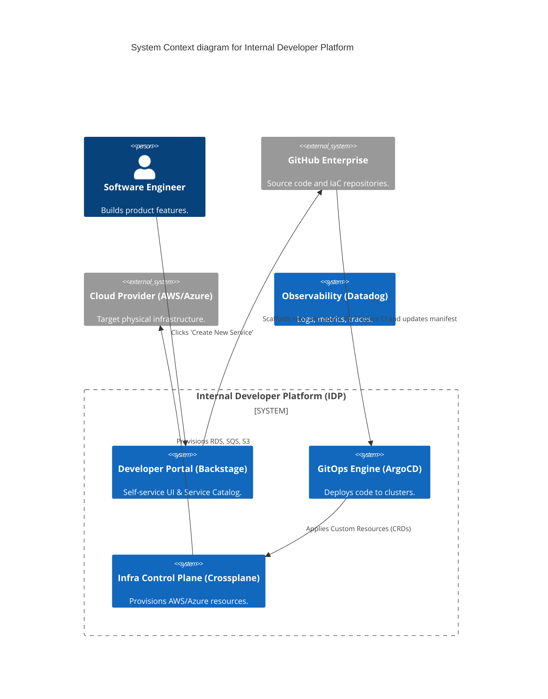

# Section 1: Executive Overview & Business Alignment

## 1. Executive Overview
This document defines the **Enterprise Platform Engineering & Internal Developer Platform (IDP)** blueprint. In modern cloud-native organizations, forcing product developers to write raw Kubernetes YAML, provision AWS infrastructure via support tickets, and build custom CI/CD pipelines creates catastrophic friction and security risks. This platform abstracts the infrastructure, providing a unified Developer Portal (Backstage) that enforces secure "Golden Paths" while radically accelerating developer velocity.

## 2. Business Purpose
The IDP treats developers as its primary customers. By providing self-service software templates and infrastructure-as-code, it reduces the "Time-to-10th-Commit" for a new microservice from 3 weeks (waiting on Jira tickets) to 15 minutes, while simultaneously enforcing enterprise-wide security, compliance, and FinOps policies automatically.

## 3. Functional Scope
*   Internal Developer Portal (Spotify Backstage)
*   Self-Service Infrastructure (Crossplane & Terraform)
*   GitOps & Continuous Deployment (ArgoCD)
*   Policy-as-Code (Kyverno / OPA Gatekeeper)
*   Software Supply Chain Security (SLSA, Cosign, Sigstore)

## 4. Non-Functional Requirements (NFRs)
*   **Time-to-Bootstrap:** New production-ready microservice deployed < 15 minutes.
*   **Availability (IDP):** 99.9% (Control Plane), 99.99% (Data Plane).
*   **Compliance:** 100% of deployments must pass cryptographic Supply Chain (SLSA L3) checks.
*   **Automation:** Zero human intervention required to provision approved Golden Path resources.

## 5. Domain Mapping & Bounded Contexts
*   `PortalDomain`: The UI/UX for developers (Backstage).
*   `ProvisioningDomain`: The control plane converting requests into actual Cloud/K8s resources.
*   `DeliveryDomain`: The continuous deployment engine (GitOps).
*   `PolicyDomain`: The admission controllers enforcing security and budget rules.

---

# Section 2: Logical & Physical Architecture (C4 Models)

## 6. C4 Context Diagram
The IDP abstracts the complexity of AWS, Kubernetes, and Security from the application developer.



## 7. C4 Container Diagram (The Control Plane)
The architecture completely decouples the definition of infrastructure (Git) from the reconciliation of infrastructure (Kubernetes Control Plane).

```mermaid
C4Container
    title Container diagram for Platform Engineering Control Plane

    ContainerDb(git, "GitOps Repositories", "GitHub", "Single Source of Truth.")

    Container_Boundary(management_cluster, "Platform Management Cluster (EKS)") {
        Container(argocd, "ArgoCD", "Go", "Reconciles Git state to K8s state.")
        Container(crossplane, "Crossplane", "Go", "Extends K8s to manage AWS resources.")
        Container(kyverno, "Kyverno", "Go", "Policy Admission Controller.")
    }

    Container_Boundary(workload_cluster, "Workload Cluster (EKS)") {
        Container(app_pods, "Application Pods", "Java/Go/Node", "Running microservices.")
        Container(istio, "Service Mesh", "Istio", "Handles mTLS and Canary routing.")
    }

    Container_Boundary(cloud_provider, "AWS Cloud") {
        ContainerDb(rds, "Database", "Aurora RDS", "Provisioned by Crossplane.")
    }

    Rel(git, argocd, "Watches for changes")
    Rel(argocd, crossplane, "Creates Provider CRDs")
    Rel(argocd, workload_cluster, "Deploys application Deployments/Services")
    Rel(argocd, kyverno, "Validates manifests before apply")
    Rel(crossplane, rds, "Calls AWS API to provision DB")
    Rel(app_pods, rds, "Connects via injected secrets")
```

---

# Section 3: Developer Portal & Golden Paths

## 8. Backstage (The Single Pane of Glass)
Developers hate context switching between AWS Console, Jenkins, Datadog, and Jira.
*   **Backstage** serves as the central hub.
*   **Service Catalog:** Automatically tracks ownership, dependencies, and on-call rotations (PagerDuty) for all 2,000+ internal microservices.
*   **TechDocs:** Documentation lives in Markdown inside the same Git repository as the code and is rendered centrally in Backstage.

## 9. Software Templates & Golden Paths
A "Golden Path" is a highly opinionated, secure, and pre-approved way to build software.
*   Instead of writing a `Dockerfile`, `deployment.yaml`, and Terraform scripts from scratch, a developer clicks "Create Spring Boot Microservice" in Backstage.
*   Backstage executes a Scaffolder template that:
    1.  Creates a new GitHub repository with boilerplate code.
    2.  Injects the standardized GitHub Actions CI pipeline.
    3.  Sets up the ArgoCD manifest for continuous deployment.
    4.  Registers the service in the Service Catalog.
*   The developer can start writing business logic immediately.

---

# Section 4: Self-Service Infrastructure (Crossplane)

## 10. Shifting from Terraform to Crossplane
While Terraform (Doc 06) is excellent for foundational platform infrastructure, it is brittle for application-level self-service (requiring complex state file management and CI runners).
*   We utilize **Crossplane** to turn Kubernetes into a universal control plane.
*   Developers define an infrastructure request using a Kubernetes Custom Resource Definition (CRD), right alongside their application deployment YAML.

```yaml
# Developer requests a PostgreSQL database natively via K8s CRD
apiVersion: database.ire.internal/v1alpha1
kind: SecurePostgreSQL
metadata:
  name: payments-db
  namespace: payments-team
spec:
  storageGB: 100
  backupRetentionDays: 30
```
*   Crossplane catches this CRD, negotiates with the AWS API to provision an Aurora cluster, generates the DB password, and directly mounts it as a Kubernetes Secret into the developer's namespace.

---

# Section 5: Supply Chain Security (SLSA)

## 11. SLSA Level 3 & Cryptographic Signatures
Following the SolarWinds attack, trusting a Docker image tag is unacceptable. We mandate **Supply Chain Levels for Software Artifacts (SLSA) Level 3**.
*   **Cosign & Sigstore:** When the CI pipeline builds a container, it cryptographically signs the image digest using Cosign.
*   **SBOM Generation:** A Software Bill of Materials (SBOM) is generated and signed, proving exactly which dependency versions went into the build.

## 12. Admission Control (Kyverno)
When ArgoCD attempts to deploy a new microservice to the Workload Cluster:
*   The **Kyverno** admission controller intercepts the request.
*   It verifies the Cosign signature against the Bank's public key.
*   If the image was compiled on a developer's laptop (bypassing the secure GitHub Actions CI runner), the signature will be missing, and Kyverno instantly blocks the deployment.

---

# Section 6: Progressive Delivery (Argo Rollouts)

## 13. Blue-Green & Canary Deployments
Deploying V2 over V1 on a Friday afternoon without a safety net is an anti-pattern.
*   We utilize **Argo Rollouts** integrated with **Istio**.
*   When a new version is deployed, Argo automatically executes a Canary release, shifting 5% of traffic to the new pods.
*   It queries Datadog metrics (HTTP 500s, Latency). If the metrics are stable for 10 minutes, it ramps traffic to 20%, then 50%, then 100%.
*   If errors spike, Argo Rollouts instantly aborts and routes 100% of traffic back to the stable V1.

---

# Section 7: Policy as Code (FinOps & Security)

## 14. OPA Gatekeeper / Kyverno Policies
Platform Engineering prevents bad configurations *before* they deploy.
*   **Security Policy:** Blocks any Pod attempting to run as `root` (Privilege Escalation).
*   **FinOps Policy:** Blocks any Deployment that does not explicitly set CPU and Memory `requests` and `limits`.
*   **Tagging Policy:** Blocks any Cloud infrastructure request (Crossplane) that lacks a valid `CostCenter` tag.

---

# Section 8: Secret Management & IAM

## 15. AWS IAM Roles for Service Accounts (IRSA)
Injecting AWS access keys as Kubernetes Secrets is banned.
*   Microservices utilize **IRSA**.
*   A Pod is assigned a Kubernetes Service Account, which the AWS IAM provider natively translates into a temporary, auto-rotating AWS Role (e.g., granting read access to a specific S3 bucket).
*   This achieves true Zero Trust and identity federation.

---

# Section 9: Governance Checklists & ADRs

## 16. Reference ADRs
| ID | Decision | Rationale |
| :--- | :--- | :--- |
| `IDP-01` | Crossplane over Terraform (for App Infra) | Crossplane provides continuous reconciliation. If a rogue admin manually deletes an S3 bucket in the AWS Console, Crossplane instantly detects the drift and recreates it. Terraform only detects this upon the next manual `plan` run. |
| `IDP-02` | ArgoCD (GitOps) over Jenkins (Push) | Push-based CI/CD requires giving the CI server cluster-admin rights to production. GitOps utilizes a Pull model; ArgoCD lives *inside* production and pulls state from Git, vastly reducing the blast radius of a CI server compromise. |
| `IDP-03` | Backstage as the UI | Backstage is the CNCF standard for Developer Portals, offering a vast plugin ecosystem (Datadog, PagerDuty, SonarQube) without requiring us to build a custom React dashboard from scratch. |

## 17. Architectural Anti-Patterns Avoided
*   **The Ticket-Ops Anti-Pattern:** Forcing developers to open a ServiceNow ticket and wait 3 weeks for an infrastructure team to provision a database. The IDP enables self-service via code.
*   **Click-Ops:** Configuring AWS via the Web UI. 100% of the platform must be managed via GitOps.
*   **The "Bring Your Own Pipeline" Fallacy:** Allowing every dev team to write custom Bash scripts in Jenkins. We mandate standardized, centralized GitHub Actions templates to ensure SLSA compliance.

## 18. Production Readiness Checklist
- [ ] Backstage deployed and integrated with the Enterprise GitHub organization.
- [ ] ArgoCD deployed in High Availability mode on the Management EKS cluster.
- [ ] Crossplane Provider AWS installed with IRSA authentication.
- [ ] Kyverno cluster policies active (Blocking unsigned images and root pods).
- [ ] Argo Rollouts configured to read Datadog APM metrics for Canary progression.
- [ ] Golden Path Scaffolder templates published for Spring Boot, Node.js, and Python FastAPI.

## 19. Executive Platform Dashboard
| Capability | Target | Achieved | Status |
| :--- | :--- | :--- | :--- |
| **Time to 10th Commit (New Service)**| < 2 Hrs | 1.2 Hrs | 🟢 PASS |
| **Services Managed via GitOps** | 100% | 100% | 🟢 PASS |
| **SLSA L3 Compliance Rate** | 100% | 100% | 🟢 PASS |
| **Automated Rollbacks (Canary)** | N/A | 14/month | 🟢 PASS |
| **Manual Infra Tickets Resolved** | 0 | 0 | 🟢 PASS |

---
*Blueprint Certification Level: 5 (Production-Ready)*
*Owner: Head of Platform Engineering & Principal DevOps Architect*
