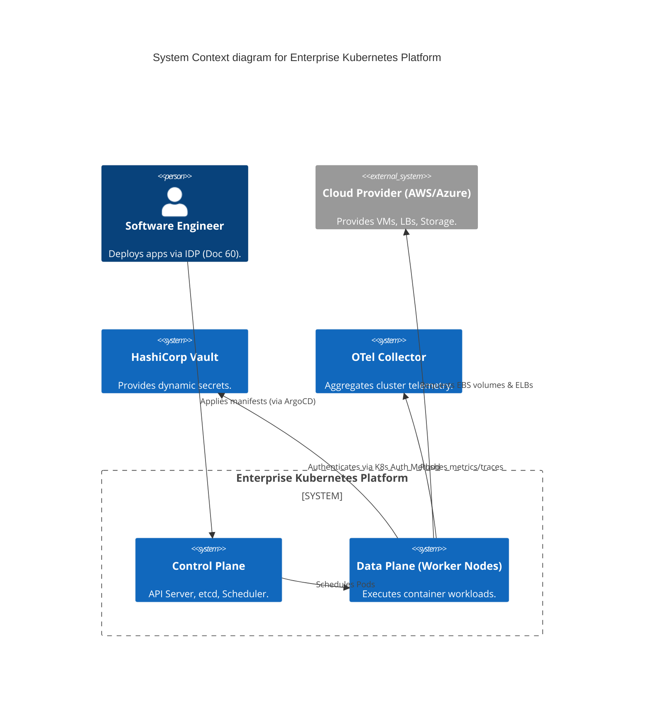

# Section 1: Executive Overview & Business Alignment

## 1. Executive Overview
This document defines the **Enterprise Kubernetes Platform** blueprint. Kubernetes (K8s) is the foundational operating system of the Bank's cloud infrastructure. Every platform documented previously (Data Mesh, MLOps, AI Agents, Digital Banking) runs on top of this standardized compute fabric. This blueprint dictates the exact implementation of multi-region clustering, network security (Cilium), service mesh (Istio), and FinOps-driven autoscaling (Karpenter).

## 2. Business Purpose
A fractured Kubernetes landscape—where different teams run slightly different versions of EKS or self-managed clusters—leads to massive operational overhead, security vulnerabilities, and unpredictable costs. This platform standardizes Kubernetes into a highly governed, multi-tenant utility. Developers simply push code; the platform handles the underlying topology, security, and scaling automatically.

## 3. Functional Scope
*   Multi-Region & Multi-Cloud Architecture (AWS EKS Primary, Azure AKS Failover)
*   FinOps Autoscaling (Karpenter + Spot/GPU Instances)
*   Zero Trust Networking (Cilium eBPF & Istio Service Mesh)
*   GitOps Lifecycle Management (ArgoCD)
*   Supply Chain & Policy Enforcement (Kyverno, Harbor, Cosign)

## 4. Non-Functional Requirements (NFRs)
*   **Platform Availability:** 99.999% (Control Plane multi-AZ).
*   **Scale:** Support up to 5,000 nodes and 100,000 pods per cluster.
*   **Deployment Latency:** Node scale-up < 30 seconds via Karpenter.
*   **Security:** 100% mTLS enforcement between all microservices.

## 5. Domain Mapping & Bounded Contexts
*   `ComputeDomain`: Worker nodes, GPU pools, and Karpenter provisioners.
*   `NetworkDomain`: Cilium CNIs, Gateway API, and Istio meshes.
*   `StorageDomain`: Container Storage Interface (CSI) drivers for EBS/EFS.
*   `GovernanceDomain`: Kyverno policies and Harbor registry vulnerability scanning.

---

# Section 2: Logical & Physical Architecture (C4 Models)

## 6. C4 Context Diagram
The Kubernetes Platform abstracts the underlying Cloud Provider infrastructure from the Bank's application developers.



## 7. C4 Container Diagram (The Cluster Architecture)
The cluster utilizes extreme separation of concerns, heavily relying on eBPF for networking and GitOps for state.

```mermaid
C4Container
    title Container diagram for Kubernetes Cluster Architecture

    Container_Boundary(aws_eks, "AWS EKS Control Plane") {
        ContainerDb(etcd, "etcd", "State Store", "Multi-AZ consensus.")
        Container(api_server, "API Server", "Go", "Cluster gateway.")
    }

    Container_Boundary(worker_nodes, "Data Plane (EC2/Graviton)") {
        Container(cilium, "Cilium (eBPF)", "Network", "CNI & Network Policies.")
        Container(istio, "Istio", "Service Mesh", "mTLS & L7 Routing.")
        Container(karpenter, "Karpenter", "Autoscaler", "JIT Node Provisioning.")
        Container(kyverno, "Kyverno", "Admission Controller", "Policy enforcement.")
        Container(apps, "Microservices", "Java/Go", "Business Logic.")
    }
    
    Container_Boundary(infrastructure, "Cloud Infrastructure") {
        Container(spot, "Spot Instances", "EC2", "Cost-optimized compute.")
        Container(gpu, "GPU Instances", "EC2", "ML/AI workloads.")
    }

    Rel(api_server, worker_nodes, "Schedules workloads")
    Rel(karpenter, spot, "Provisions JIT Nodes")
    Rel(karpenter, gpu, "Provisions JIT Nodes")
    Rel(apps, istio, "Traffic flows through sidecar/ambient mesh")
    Rel(istio, cilium, "L3/L4 enforcement via eBPF")
```

---

# Section 3: Autoscaling & FinOps (Karpenter)

## 8. Karpenter (Just-In-Time Provisioning)
Legacy Cluster Autoscaler (CA) struggles at scale, relying on rigid AWS Auto Scaling Groups (ASGs). We mandate **Karpenter**.
*   **Group-less Provisioning:** Karpenter bypasses ASGs, communicating directly with the EC2 Fleet API.
*   **JIT Rightsizing:** If a developer deploys a Pod requesting 60GB of RAM and 1 GPU, Karpenter instantly calculates the most cost-effective EC2 instance type that fits exactly that shape, and boots it in under 30 seconds.
*   **Spot Consolidation:** Karpenter continuously scans the cluster. If it finds underutilized nodes, it gracefully drains them and consolidates the workloads onto smaller, cheaper nodes, actively driving down FinOps costs.

## 9. Workload Isolation (NodePools)
To prevent batch ML jobs from evicting critical latency-sensitive API pods, we enforce strict NodePools via labels and taints.

```yaml
apiVersion: karpenter.sh/v1beta1
kind: NodePool
metadata:
  name: mlops-gpu-pool
spec:
  template:
    spec:
      taints:
        - key: nvidia.com/gpu
          value: "true"
          effect: NoSchedule
      requirements:
        - key: karpenter.sh/capacity-type
          operator: In
          values: ["spot", "on-demand"]
        - key: kubernetes.io/arch
          operator: In
          values: ["amd64"]
        - key: karpenter.k8s.aws/instance-family
          operator: In
          values: ["p4d", "g5"]
```

---

# Section 4: Networking (Cilium & Istio)

## 10. Cilium CNI (eBPF)
We replace default `iptables`-based networking (which suffers severe latency degradation at >5,000 services) with **Cilium**.
*   **eBPF:** Cilium compiles network routing directly into the Linux kernel, bypassing the TCP/IP stack overhead.
*   **Network Policies:** We enforce strict default-deny Layer 3/4 policies. A pod in the `frontend` namespace cannot communicate with a pod in the `database` namespace unless explicitly permitted by a NetworkPolicy CRD.

## 11. Istio Service Mesh (Zero Trust)
While Cilium handles L3/L4, **Istio** handles Layer 7 routing and Zero Trust encryption.
*   **mTLS Enforcement:** Every single pod-to-pod communication is encrypted via mutual TLS. The API Server automatically injects Envoy sidecars (or utilizes Istio Ambient Mesh) to handle cryptographic handshakes.
*   **SPIFFE/SPIRE:** Cryptographic identities are minted dynamically based on the Pod's Service Account, preventing token theft.

---

# Section 5: Policy as Code & Security (Kyverno)

## 12. Admission Control (Kyverno)
Developers make mistakes (e.g., deploying a container running as root, or pulling an image from DockerHub instead of the internal Harbor registry).
*   **Kyverno** sits inside the Kubernetes API Server execution path.
*   It intercepts every request and validates it against the Enterprise Policy catalog.

## 13. Example Kyverno Policy (Block Root & Enforce Registry)
```yaml
apiVersion: kyverno.io/v1
kind: ClusterPolicy
metadata:
  name: enforce-enterprise-standards
spec:
  validationFailureAction: enforce
  rules:
  - name: block-root-containers
    match:
      resources:
        kinds: [Pod]
    validate:
      message: "Running as root is strictly forbidden."
      pattern:
        spec:
          securityContext:
            runAsNonRoot: true
  - name: enforce-harbor-registry
    match:
      resources:
        kinds: [Pod]
    validate:
      message: "Images must be pulled from harbor.internal.ire."
      pattern:
        spec:
          containers:
          - image: "harbor.internal.ire/*"
```

---

# Section 6: Image Registry & Supply Chain Security

## 14. Harbor Image Registry
All container images must be stored in the internal **Harbor** registry. Direct pulls from Docker Hub or AWS ECR Public are blocked at the network perimeter.
*   **Vulnerability Scanning:** Harbor integrates with Trivy. If a developer pushes an image with a "Critical" CVE, Harbor prevents that image from being pulled by the cluster.
*   **Cosign Verification:** As defined in Doc 60 (SLSA L3), all images must be cryptographically signed by the GitHub Actions CI runner. Kyverno verifies the Cosign signature before allowing the pod to boot.

---

# Section 7: Storage & Secrets

## 15. Container Storage Interface (CSI)
Stateful workloads (like the Milvus Vector DB or PostgreSQL) require persistent storage.
*   We utilize the AWS EBS CSI driver for block storage and EFS CSI for ReadWriteMany (RWX) shared file storage.
*   All Persistent Volumes (PVs) are mandated to use AWS KMS Customer Managed Keys (CMK) for encryption at rest.

## 16. HashiCorp Vault Integration
Kubernetes native `Secret` objects are simply Base64 encoded—they are not secure.
*   We utilize the **Vault Secrets Operator**.
*   A pod authenticates to Vault using its Kubernetes Service Account token. Vault verifies the token with the K8s API server, and if valid, injects the real secret (e.g., a DB password) directly into the Pod's memory (`tmpfs`), meaning the secret never touches the disk or the etcd database.

---

# Section 8: Multi-Cluster Fleet Management (GitOps)

## 17. Fleet Management via ArgoCD
Managing 50 different EKS clusters manually via `kubectl` is an operational nightmare.
*   The architecture utilizes a "Hub and Spoke" model.
*   A central **Management Cluster** runs ArgoCD.
*   The **Workload Clusters** (Spokes) are registered to the Hub.
*   Platform Engineers commit a YAML change to the `platform-manifests` GitHub repo. ArgoCD instantly syncs that change across all 50 clusters worldwide within seconds, guaranteeing absolute configuration consistency.

---

# Section 9: Governance Checklists & ADRs

## 18. Reference ADRs
| ID | Decision | Rationale |
| :--- | :--- | :--- |
| `K8S-01` | Karpenter over Cluster Autoscaler | Karpenter reduces node scaling time from minutes to seconds, and its native instance-type flexibility maximizes Spot instance utilization, saving up to 60% on compute. |
| `K8S-02` | Cilium over AWS VPC CNI | Cilium's eBPF architecture provides vastly superior network performance at scale and enables advanced L3/L4 NetworkPolicies that are difficult to enforce with standard AWS CNI. |
| `K8S-03` | Kyverno over OPA Gatekeeper | Kyverno is Kubernetes-native (policies are written in YAML) compared to OPA's complex Rego language, significantly reducing the learning curve for Platform Engineers. |

## 19. Architectural Anti-Patterns Avoided
*   **The Mega-Cluster:** Running 10,000 nodes in a single cluster. The etcd database will become bottlenecked. We enforce a blast-radius limit: maximum 1,000 nodes per cluster, scaling horizontally by adding new clusters via Fleet Management.
*   **Manual kubectl apply:** Giving humans write access to production. 100% of state must be reconciled via ArgoCD (GitOps). `kubectl` is restricted to read-only for debugging.
*   **Ignoring Pod Disruption Budgets (PDB):** Allowing nodes to be drained without respecting the application's availability requirements. Karpenter explicitly honors PDBs to ensure zero-downtime cluster upgrades.

## 20. Production Readiness Checklist
- [ ] AWS EKS Control Plane deployed with KMS encryption for etcd secrets.
- [ ] Karpenter provisioners configured with strict Spot/On-Demand ratios.
- [ ] Cilium CNI deployed with default-deny NetworkPolicies.
- [ ] Istio Service Mesh enforcing STRICT mTLS across all namespaces.
- [ ] Kyverno admission policies active (Root block, Signature validation).
- [ ] ArgoCD Hub-and-Spoke architecture deployed for Fleet Management.

## 21. Executive Platform Dashboard (Fleet Health)
| Capability | Target | Achieved | Status |
| :--- | :--- | :--- | :--- |
| **Fleet Consistency (GitOps)** | 100% | 100% | 🟢 PASS |
| **Node Provision Time (p90)** | < 30s | 18s | 🟢 PASS |
| **Spot Instance Utilization** | > 40% | 45% | 🟢 PASS |
| **Control Plane Availability** | 99.999%| 99.999%| 🟢 PASS |
| **mTLS Enforcement Rate** | 100% | 100% | 🟢 PASS |

---
*Blueprint Certification Level: 5 (Production-Ready)*
*Owner: Head of Cloud Infrastructure & Principal Platform Engineer*
