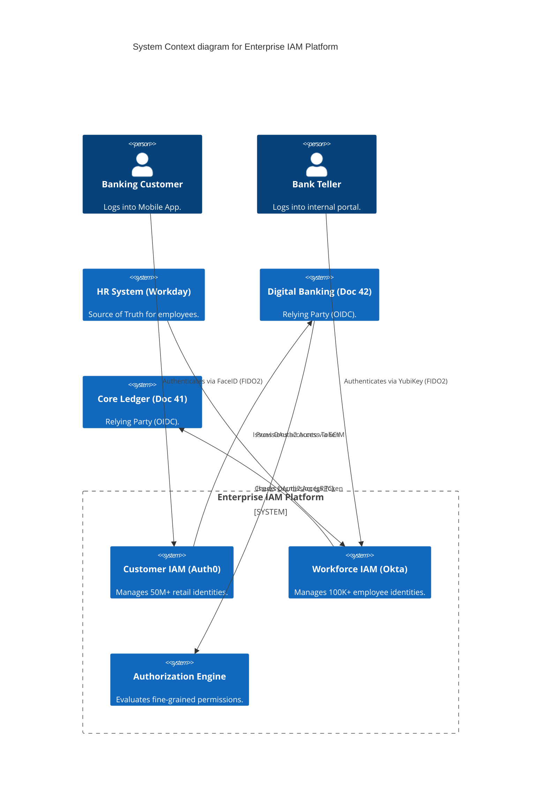
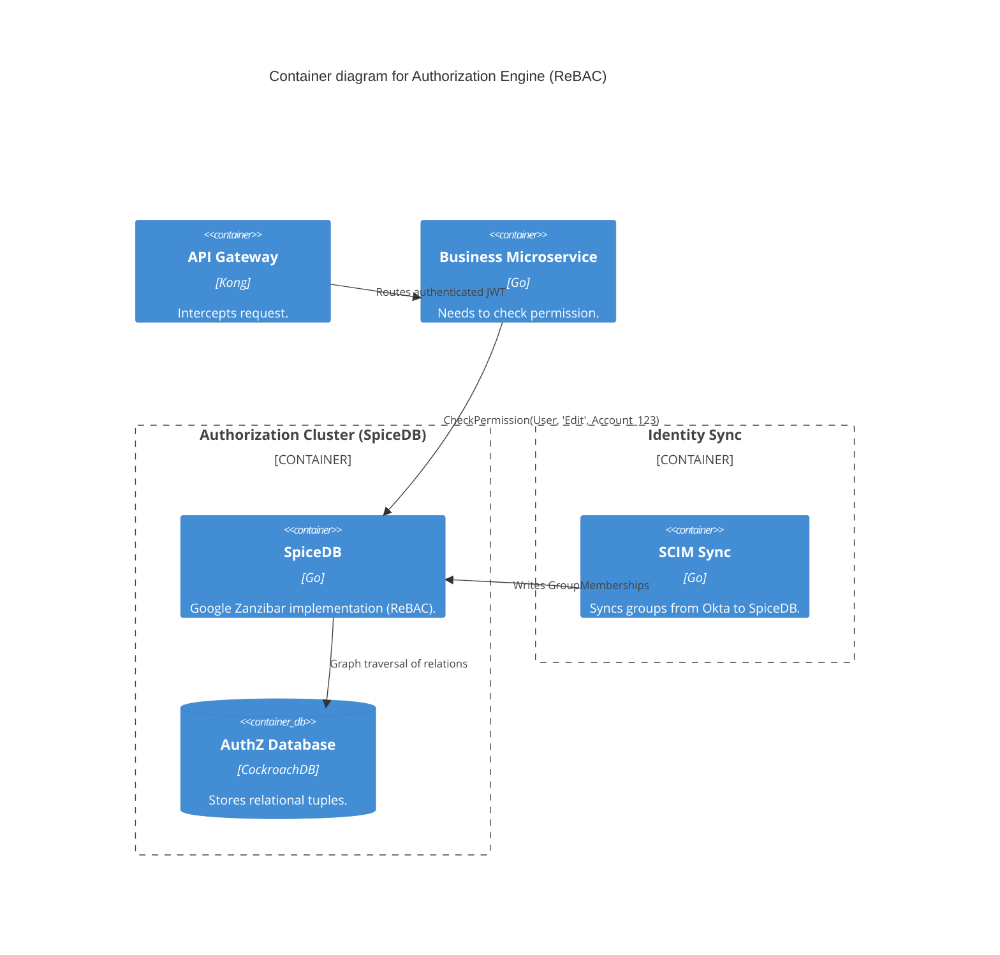

# Section 1: Executive Overview & Business Alignment

## 1. Executive Overview
This document defines the **Enterprise Identity & Access Management (IAM) Platform** blueprint. Identity is the new security perimeter. This platform provides the unified cryptographic foundation for authenticating every human (Workforce & Customer) and machine (Workload Identity) interacting with the Bank. It enforces modern Passwordless authentication (FIDO2) and centralizes fine-grained authorization policies (ABAC/ReBAC) across all microservices.

## 2. Business Purpose
A fragmented identity landscape—where every application implements its own local user database and login screen—is an unmanageable security vulnerability. This platform centralizes Identity into two distinct pillars: **Workforce IAM** (for employees, heavily utilizing Just-In-Time access) and **Customer IAM** (CIAM, prioritizing frictionless, biometric-driven mobile experiences).

## 3. Functional Scope
*   Customer Identity (CIAM) & Workforce Identity (Okta / Auth0)
*   Passwordless Authentication (FIDO2, WebAuthn, Biometrics)
*   Federated Identity Protocols (OIDC, OAuth2, SAML 2.0)
*   Automated Provisioning (SCIM 2.0)
*   Fine-Grained Authorization (RBAC, ABAC, ReBAC via SpiceDB/OPA)
*   Privileged Access Management (Just-In-Time Access)

## 4. Non-Functional Requirements (NFRs)
*   **Availability:** 99.999% (Five Nines). A failure here locks out the entire bank.
*   **Authentication Latency:** < 200ms per OAuth token minting.
*   **Authorization Latency:** < 10ms per microservice permission check.
*   **Scalability:** Supports 50M+ Customer Identities globally.

## 5. Domain Mapping & Bounded Contexts
*   `WorkforceDomain`: Internal Active Directory, Okta, and HR IS integration.
*   `CustomerDomain`: Auth0, social login, and biometric mobile auth.
*   `AuthorizationDomain`: The centralized policy engine evaluating permissions.
*   `PrivilegedDomain`: The Bastion and JIT access control plane.

---

# Section 2: Logical & Physical Architecture (C4 Models)

## 6. C4 Context Diagram
The IAM Platform brokers trust between the external world, internal employees, and the Bank's application portfolio.



## 7. C4 Container Diagram (Fine-Grained Authorization)
While Okta/Auth0 handles *Authentication* (Who are you?), the platform utilizes specialized engines for *Authorization* (What are you allowed to do?), decoupling policy from application code.



---

# Section 3: Authentication & Passwordless

## 8. The Eradication of Passwords (FIDO2 / WebAuthn)
Passwords are mathematically broken (phishable, guessable, reusable). We mandate **Passwordless** authentication for all Tier-1 systems.
*   **Workforce:** Employees authenticate to Okta using hardware security keys (YubiKeys) or Windows Hello for Business via FIDO2. Phishing a FIDO2 credential is mathematically impossible because the cryptographic challenge is bound to the specific TLS origin (e.g., `okta.internal.ire`).
*   **Customers:** The Digital Banking mobile app (Doc 42) uses WebAuthn/Passkeys (FaceID/TouchID). The private key never leaves the customer's secure enclave (Secure Enclave on iOS).

## 9. Federated Identity Protocols (OIDC / OAuth2 / SAML)
We strictly enforce standards-based federation.
*   **SAML 2.0:** Deprecated for new internal applications, maintained only for legacy third-party SaaS integrations.
*   **OpenID Connect (OIDC):** The absolute standard for all authentication. Applications never see a user's password; they receive a cryptographically signed ID Token (JWT) from the IAM provider.
*   **OAuth2:** Used for API authorization (machine-to-machine and delegated access).

---

# Section 4: Fine-Grained Authorization (ReBAC & ABAC)

## 10. Beyond RBAC: Relationship-Based Access Control (ReBAC)
Role-Based Access Control (RBAC) fails at scale. If an analyst needs access to a specific corporate account, creating a custom role `Analyst_Account_9912` leads to role explosion (millions of roles).
*   **Implementation:** We deploy **SpiceDB** (an open-source implementation of Google's Zanzibar).
*   It utilizes **Relationship-Based Access Control (ReBAC)**.
*   Permissions are defined as relational tuples: `User:Alice` is an `Owner` of `Folder:X`. `Folder:X` is a `Parent` of `Document:Y`.
*   When a microservice asks, "Can Alice read Document Y?", SpiceDB executes a graph traversal in < 10ms to calculate the inherited permission, massively simplifying application code.

## 11. Attribute-Based Access Control (ABAC - OPA)
For policy decisions based on environmental attributes (e.g., "A teller cannot transfer > $10,000 if they are currently connected from a non-corporate IP address"), we utilize **Open Policy Agent (OPA)**. OPA evaluates the ABAC rule locally at the microservice level as a sidecar, preventing network hops.

---

# Section 5: Privileged Access Management (PAM) & JIT

## 12. Just-In-Time (JIT) Access
Standing privileges (e.g., a DBA who always has `admin` rights to the database) are a massive security risk.
*   All persistent elevated access is revoked.
*   When a DBA needs to perform maintenance, they request access via a Slack bot or ITSM portal.
*   Upon managerial approval, the IAM platform provisions a JIT Role assignment in Okta, valid for exactly 2 hours.
*   Vault (Doc 63) provisions a dynamic database password tied to that role.
*   After 2 hours, the Okta role assignment expires, the Vault password is mathematically destroyed, and the DBA loses access automatically.

---

# Section 6: Lifecycle Management & SCIM

## 13. Automated Provisioning (SCIM 2.0)
Manual account creation via Helpdesk tickets causes onboarding delays and "orphan account" security breaches when employees are terminated.
*   **Source of Truth:** Workday (HR IS) is the authoritative source.
*   When an employee is hired, terminated, or changes departments, Workday triggers the Okta lifecycle API.
*   Okta pushes the identity state downstream to thousands of applications (e.g., Slack, GitHub, internal databases) simultaneously using the **SCIM 2.0 (System for Cross-domain Identity Management)** protocol.
*   A terminated employee loses access to 1,000+ systems globally in < 3 seconds.

---

# Section 7: Infrastructure as Code & Kubernetes

## 14. Kubernetes: SpiceDB Deployment
SpiceDB is deployed as a highly available, memory-intensive deployment backed by CockroachDB for global consistency.

```yaml
apiVersion: apps/v1
kind: Deployment
metadata:
  name: spicedb-core
  namespace: iam-platform
spec:
  replicas: 10
  template:
    spec:
      containers:
      - name: spicedb
        image: authzed/spicedb:v1.30
        command: ["spicedb", "serve"]
        env:
        - name: SPICEDB_DATASTORE_ENGINE
          value: "cockroachdb"
        - name: SPICEDB_DATASTORE_CONN_URI
          valueFrom:
            secretKeyRef:
              name: spicedb-db-creds
              key: uri
        resources:
          requests:
            cpu: "4"
            memory: "8Gi"
```

## 15. Terraform: Okta Configuration as Code
IAM configuration must not be managed via "Click-Ops" in the Okta GUI. We use the Okta Terraform provider to define policies declaratively.

```hcl
# Define a strict Sign-On Policy requiring FIDO2 (WebAuthn)
resource "okta_app_signon_policy" "strict_fido2" {
  name        = "Require-Hardware-Key"
  description = "Forces FIDO2 WebAuthn for Tier 1 Applications"
}

resource "okta_app_signon_policy_rule" "require_mfa" {
  policy_id          = okta_app_signon_policy.strict_fido2.id
  name               = "Require MFA"
  access             = "ALLOW"
  factor_mode        = "REQUIRED"
  type               = "ASSURANCE"

  # Ensure only high-assurance hardware keys are accepted
  constraints = [
    jsonencode({
      "knowledge": { "types": ["PASSWORD"] },
      "possession": { "types": ["HARDWARE"] } # Enforces YubiKey / WebAuthn
    })
  ]
}
```

---

# Section 8: Security & OAuth Token Lifecycle

## 16. Token Lifecycle & Expiration
*   **Access Tokens (JWT):** Designed for extreme scale. They are stateless and validated locally by APIs using the IAM provider's public JWKS. To limit the blast radius of a stolen token, Access Tokens have a strict **15-minute TTL**.
*   **Refresh Tokens:** Stored securely (e.g., HttpOnly, Secure cookies for Web apps). They have a longer TTL (e.g., 24 hours) but are subject to strict **Sender Constraining (DPoP)** and **Token Rotation**. If a Refresh Token is stolen and reused, the IAM platform detects the anomaly, instantly revokes the entire session, and forces a re-authentication.

---

# Section 9: Governance Checklists & ADRs

## 17. Reference ADRs
| ID | Decision | Rationale |
| :--- | :--- | :--- |
| `IAM-01` | Separation of Authentication and Authorization | Okta/Auth0 handle authentication. SpiceDB/OPA handle authorization. Forcing an OAuth token to carry 500 RBAC groups creates massive JWT bloat (exceeding HTTP header limits) and requires the app to parse complex logic. |
| `IAM-02` | ReBAC (SpiceDB) over custom SQL | Writing recursive SQL queries to determine if User A has access to Document B through a 6-level deep corporate hierarchy is slow and error-prone. SpiceDB (Zanzibar) executes graph traversals in milliseconds. |
| `IAM-03` | Complete Passwordless (FIDO2) | Passwords account for >80% of enterprise breaches. Hardware-bound FIDO2 keys are mathematically immune to Man-in-the-Middle (MitM) phishing attacks. |

## 18. Architectural Anti-Patterns Avoided
*   **The "God Token":** Issuing an OAuth token with scopes like `*` or `admin_all`. We mandate the Principle of Least Privilege. Tokens must contain exact, granular scopes (`read:account:123`).
*   **Local Application User Tables:** A developer creating a `Users` table in their application's PostgreSQL database with a `password_hash` column. This is strictly banned. All authentication must federate to the central IAM platform.
*   **Static Privileged Accounts:** Leaving an active `Administrator` account in AWS. All elevated access must flow through Just-In-Time (JIT) provisioning.

## 19. Production Readiness Checklist
- [ ] Okta/Auth0 deployed with Custom Domains to prevent TLS origin mismatch phishing.
- [ ] FIDO2 / WebAuthn enforced for 100% of internal Workforce authentications.
- [ ] SCIM 2.0 integrations established between HR IS (Workday) and Okta.
- [ ] SpiceDB (ReBAC) clusters deployed globally backed by CockroachDB.
- [ ] Just-In-Time (JIT) workflows configured for all production database access.
- [ ] Terraform GitOps pipeline established for managing Okta Policies & Apps.

## 20. Executive Identity Dashboard
| Capability | Target | Achieved | Status |
| :--- | :--- | :--- | :--- |
| **Passwordless Adoption (Workforce)**| 100% | 100% | 🟢 PASS |
| **AuthZ Latency (SpiceDB p99)** | < 10ms | 4ms | 🟢 PASS |
| **Automated Offboarding Time** | < 1 Min | 12s | 🟢 PASS |
| **Standing Privileged Accounts** | 0 | 0 | 🟢 PASS |
| **IAM Control Plane Availability** | 99.999%| 99.999%| 🟢 PASS |

---
*Blueprint Certification Level: 5 (Production-Ready)*
*Owner: Chief Information Security Officer & Head of Identity Engineering*
