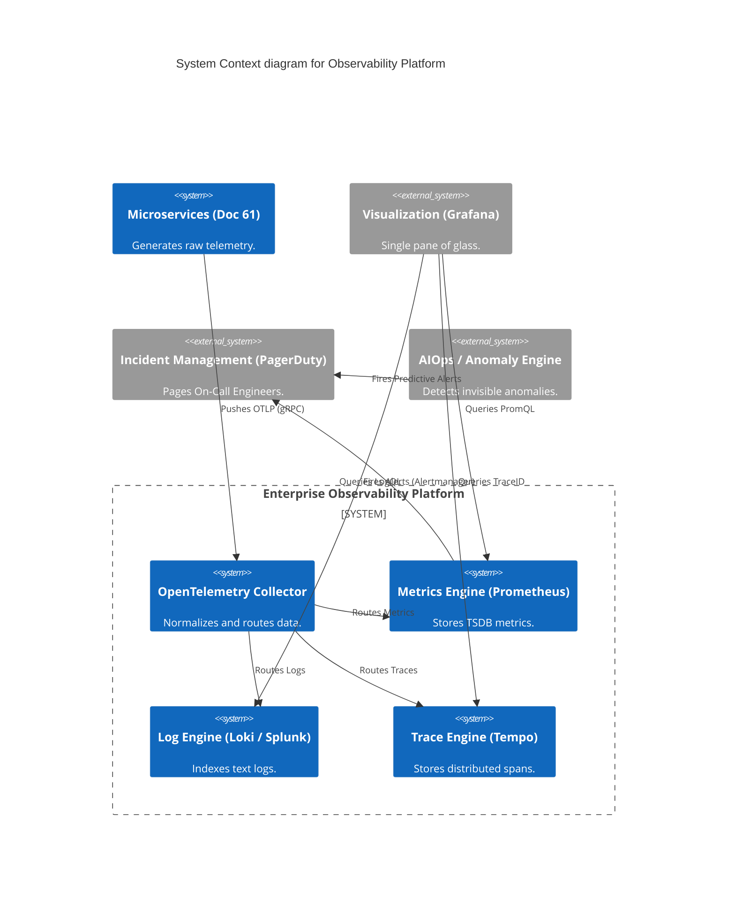
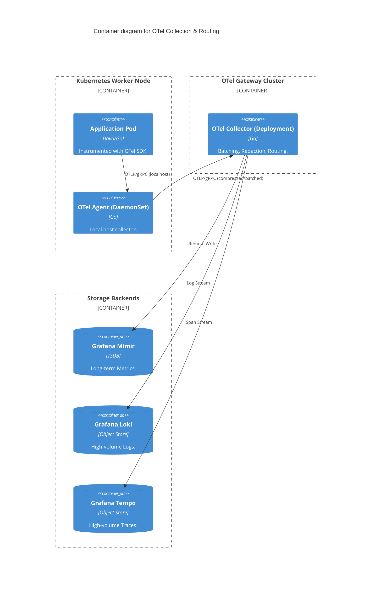

# Section 1: Executive Overview & Business Alignment

## 1. Executive Overview
This document defines the **Enterprise Observability & Site Reliability Engineering (SRE) Platform** blueprint. In a highly distributed multi-cloud microservices architecture, traditional "monitoring" (checking if a server's CPU is high) is obsolete. True **Observability** provides the ability to mathematically infer the internal state of the system based on its external outputs (Metrics, Logs, Traces), while SRE principles (SLOs, Error Budgets) provide the cultural framework to balance feature velocity with system stability.

## 2. Business Purpose
Downtime in Tier-1 banking systems (Payments, Trading) costs millions of dollars per minute. This platform reduces Mean Time to Detect (MTTD) from hours to seconds and Mean Time to Resolve (MTTR) to under 15 minutes. It achieves this by democratizing telemetry data via OpenTelemetry, breaking vendor lock-in, and implementing automated AIOps anomaly detection before customers even notice a degradation.

## 3. Functional Scope
*   OpenTelemetry (OTel) Collector & Agent Architecture
*   The Three Pillars: Metrics (Prometheus), Logs (Loki/Splunk), Traces (Tempo/Jaeger)
*   SRE Framework: SLIs, SLOs, and Error Budgets
*   Incident Management (PagerDuty) & Automated Runbooks
*   Chaos Engineering & Continuous Verification
*   Synthetic Monitoring & Real User Monitoring (RUM)

## 4. Non-Functional Requirements (NFRs)
*   **Telemetry Ingestion:** > 10 Million data points per second.
*   **Query Latency:** < 500ms for 95th percentile dashboard loads over 30 days of data.
*   **Availability (Observability Tier):** 99.999%. The monitoring system must survive when the primary cluster fails.
*   **Data Retention:** 30 days hot (SSD), 7 years cold (S3 Glacier for compliance).

## 5. Domain Mapping & Bounded Contexts
*   `IngestionDomain`: OTel Collectors scraping and normalizing telemetry.
*   `StorageDomain`: Time-series databases (TSDB) and log indices.
*   `VisualizationDomain`: Grafana dashboards and executive reporting.
*   `ActionDomain`: Alertmanager, PagerDuty, and automated remediation scripts.

---

# Section 2: Logical & Physical Architecture (C4 Models)

## 6. C4 Context Diagram
The platform intercepts telemetry from all internal systems and routes it to specialized analytical backends.



## 7. C4 Container Diagram (OpenTelemetry Architecture)
To eliminate vendor lock-in (e.g., Datadog or Splunk agents), we mandate a unified OpenTelemetry architecture deployed as a DaemonSet across the Kubernetes fleet.



---

# Section 3: OpenTelemetry (The Unified Standard)

## 8. Vendor Agnosticism via OTel
Historically, the Bank deployed multiple agents per node (Splunk Universal Forwarder, Datadog Agent, AppDynamics). This crushed CPU and created extreme lock-in.
*   **Mandate:** 100% of telemetry must flow through the **OpenTelemetry (OTel) Collector**.
*   If the Bank decides to migrate from Splunk to Datadog, or from Datadog to Grafana LGTM, *zero application code changes are required*. Platform Engineering simply updates the OTel Collector `exporters` configuration via GitOps.

## 9. PII Redaction & DLP at the Edge
Developers occasionally log sensitive data (SSNs, API Keys) by mistake.
*   The OTel Gateway Cluster utilizes the `transform` and `redaction` processors.
*   Before any log reaches the central storage backend, the Collector executes Regex patterns to mask Credit Cards, SSNs, and OAuth tokens, ensuring the Observability cluster never violates PCI-DSS.

---

# Section 4: Site Reliability Engineering (SRE) Framework

## 10. Service Level Indicators (SLIs)
We measure what the *Customer* actually experiences, not what the *CPU* is doing.
*   **Availability SLI:** (Successful HTTP 2xx requests) / (Total HTTP requests).
*   **Latency SLI:** (HTTP requests completing in < 200ms) / (Total HTTP requests).

## 11. Service Level Objectives (SLOs) & Error Budgets
*   **SLO:** "99.9% of payment requests will complete in under 200ms over a rolling 30-day window."
*   **Error Budget:** This gives the team exactly 43 minutes of allowed failure per month.
*   **The SRE Contract:** If a development team exhausts their Error Budget (due to buggy code pushing), the CI/CD pipeline (Doc 60) automatically locks. The team is forbidden from deploying new features and must dedicate 100% of their sprints to reliability work until the 30-day budget recovers.

---

# Section 5: The Three Pillars of Observability

## 12. Metrics (Prometheus / Mimir)
Metrics are highly compressible numbers used for alerting and dashboards.
*   We utilize **Grafana Mimir** for horizontally scalable, multi-tenant Prometheus storage.
*   All alerts are written in **PromQL** and evaluated by Mimir Ruler.

## 13. Distributed Tracing (Tempo)
When a customer clicks "Transfer Funds", the request might hit 15 different microservices.
*   The OTel SDK injects a `trace_id` HTTP header into the first request.
*   Every subsequent microservice passes this header along, emitting "Spans".
*   **Grafana Tempo** reconstructs these spans into a single visual Waterfall graph. If a transaction fails on hop #14, the engineer can instantly see exactly which downstream DB query timed out.

## 14. Logging (Loki)
Traditional log engines (Splunk/Elastic) index the full text of every log line, making them astronomically expensive at Petabyte scale.
*   We utilize **Grafana Loki**.
*   Loki *only* indexes the metadata labels (e.g., `app=payment-api`, `level=error`), storing the raw text compressed in cheap AWS S3 buckets.
*   Because Logs are intrinsically tied to Traces via the `trace_id`, engineers find the error via the Trace, and Loki fetches *only* the specific log lines for that exact `trace_id`, saving millions in indexing costs.

---

# Section 6: Incident Management & Chaos Engineering

## 15. Alerting & PagerDuty Integration
*   Alerts are configured symptom-based (e.g., "Payment Error Rate > 2%"), not cause-based (e.g., "CPU > 90%").
*   Alertmanager routes Critical alerts to PagerDuty, which triggers automated phone calls to the on-call engineer.
*   Every alert *must* include a link to a centralized **Runbook** (Markdown file in Backstage) detailing exactly how to triage the issue. Alerts without runbooks are automatically suppressed.

## 16. Chaos Engineering (Continuous Verification)
We do not wait for a disaster to test our resilience; we induce it intentionally.
*   We utilize **Gremlin** or **Chaos Mesh**.
*   Every week during business hours, automated Chaos Experiments randomly terminate EKS worker nodes, inject 500ms of latency into the network, and sever database connections in production.
*   If the observability platform fails to detect the anomaly within 30 seconds, or if the architecture fails to auto-heal, an SRE Incident is raised to fix the architectural flaw.

---

# Section 7: Infrastructure as Code & Configuration

## 17. Kubernetes: OpenTelemetry Collector Config
This configures the Gateway to receive OTLP data, batch it, and export it to Mimir (Metrics), Tempo (Traces), and Loki (Logs).

```yaml
apiVersion: opentelemetry.io/v1alpha1
kind: OpenTelemetryCollector
metadata:
  name: enterprise-gateway
spec:
  mode: deployment
  config: |
    receivers:
      otlp:
        protocols:
          grpc:
    processors:
      batch:
        send_batch_size: 10000
        timeout: 1s
      redaction:
        allow_all_keys: false
        allowed_keys: ["trace_id", "span_id"]
        blocked_values: ["(?i)bearer [a-z0-9\\-._~+/]+=*"] # Mask OAuth tokens
    exporters:
      otlp/tempo:
        endpoint: "tempo-gateway.observability.svc:4317"
        tls:
          insecure: true
      otlphttp/mimir:
        endpoint: "http://mimir-gateway.observability.svc/api/v1/push"
      loki:
        endpoint: "http://loki-gateway.observability.svc/loki/api/v1/push"
    service:
      pipelines:
        traces:
          receivers: [otlp]
          processors: [redaction, batch]
          exporters: [otlp/tempo]
        metrics:
          receivers: [otlp]
          processors: [batch]
          exporters: [otlphttp/mimir]
        logs:
          receivers: [otlp]
          processors: [redaction, batch]
          exporters: [loki]
```

---

# Section 8: Governance Checklists & ADRs

## 18. Reference ADRs
| ID | Decision | Rationale |
| :--- | :--- | :--- |
| `OBS-01` | OpenTelemetry Standard | Proprietary agents lock the Bank into specific vendors (e.g., Datadog), destroying negotiating leverage. OTel decouples instrumentation from the storage backend. |
| `OBS-02` | Loki over Elasticsearch for Logs | Elasticsearch requires massive RAM for indexing full text. Loki acts like Prometheus for logs, indexing only labels and relying on S3 for cheap bulk storage, cutting costs by 80%. |
| `OBS-03` | Symptom-Based Alerting | Paging an engineer at 3 AM because a server's CPU hit 95% causes alert fatigue. CPU is irrelevant if the API is still responding in 50ms. We only page when Customer-facing SLIs are breached. |

## 19. Architectural Anti-Patterns Avoided
*   **The Dash-Trash Anti-Pattern:** Creating 500 Grafana dashboards with 10,000 graphs that nobody understands. We enforce the **USE Method** (Utilization, Saturation, Errors) for infrastructure and the **RED Method** (Rate, Errors, Duration) for applications.
*   **Logs as Metrics:** Using Splunk to count the number of times the word "Exception" appears to calculate an error rate. This is wildly inefficient. Error rates must be calculated via native Prometheus Counters.
*   **Siloed Telemetry:** Having one tool for infrastructure (e.g., SolarWinds), one for APM (e.g., AppDynamics), and one for logs (e.g., Splunk). When an incident occurs, engineers waste 30 minutes correlating timestamps. Grafana LGTM links them intrinsically via TraceID.

## 20. Production Readiness Checklist
- [ ] OTel DaemonSet deployed to 100% of EKS/AKS nodes.
- [ ] OTel SDK integrated into Golden Path Java/Go software templates (Doc 60).
- [ ] PII redaction processors validated in the OTel Gateway.
- [ ] SLOs formally defined and codified (Sloth) for all Tier-1 APIs.
- [ ] Error Budget policies approved by Engineering Leadership.
- [ ] Chaos Mesh installed and automated Game Days scheduled.

## 21. Executive SRE Dashboard
| Capability | Target | Achieved | Status |
| :--- | :--- | :--- | :--- |
| **Mean Time to Detect (MTTD)** | < 1 Min | 45s | 🟢 PASS |
| **Mean Time to Resolve (MTTR)**| < 15 Min | 12.4 Min | 🟢 PASS |
| **Tier-1 Services with SLIs** | 100% | 100% | 🟢 PASS |
| **Alert-to-Noise Ratio** | > 90% | 94% | 🟢 PASS |
| **Trace Sampling Rate** | 100% | 100% | 🟢 PASS |

---
*Blueprint Certification Level: 5 (Production-Ready)*
*Owner: Chief Reliability Engineer & Head of Cloud Infrastructure*
