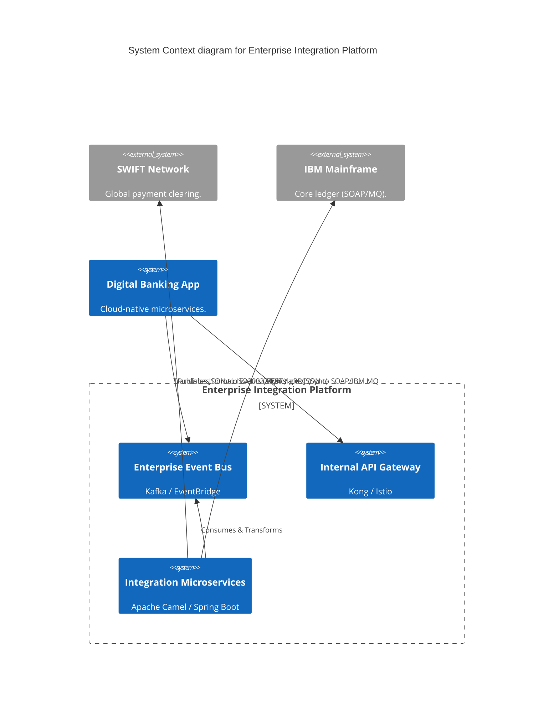
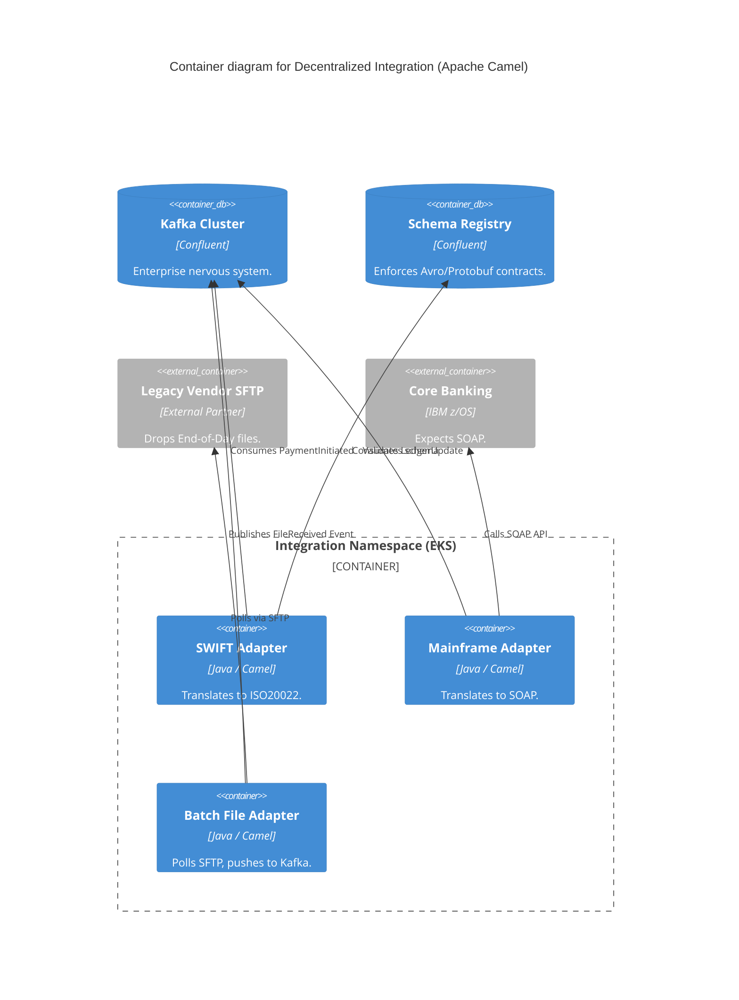
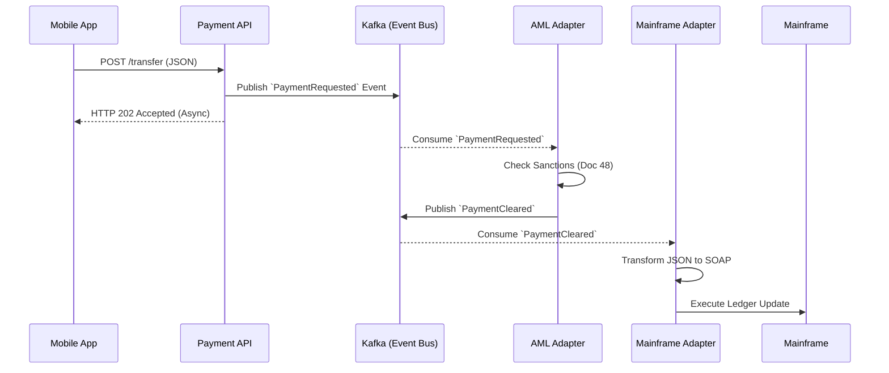

# Section 1: Executive Overview & Business Alignment

## 1. Executive Overview
This document defines the **Enterprise Integration Platform (EIP)** blueprint. Large global banks cannot function without integrating decades of disparate systems—ranging from 1980s IBM Mainframes speaking EBCDIC, to external SWIFT networks, to modern cloud-native AI microservices. This platform defines the architectural patterns and technologies required to seamlessly translate, route, and orchestrate petabytes of data across these boundaries using Event-Driven and API-First principles.

## 2. Business Purpose
Legacy Enterprise Service Buses (ESBs) from the 2000s have become catastrophic single points of failure and bottlenecks for feature delivery. This blueprint modernizes integration by transitioning from centralized "Smart Pipes, Dumb Endpoints" (monolithic ESBs) to decentralized "Dumb Pipes, Smart Endpoints" (Event-Driven Microservices), accelerating speed-to-market for new payment and trading flows.

## 3. Functional Scope
*   Decentralized Integration (Apache Camel / Spring Integration)
*   Event-Driven Messaging (Kafka / AWS EventBridge / IBM MQ)
*   Legacy Protocol Translation (FTP/SFTP, SOAP, EDI, ISO20022, SWIFT)
*   Resilience Patterns (Sagas, DLQs, Circuit Breakers, Idempotency)
*   Change Data Capture (Debezium)

## 4. Non-Functional Requirements (NFRs)
*   **Throughput:** > 100,000 messages per second (Kafka backbone).
*   **Latency:** < 10ms for internal API integration (gRPC).
*   **Reliability:** Exactly-Once Processing (Idempotency) for all financial transactions.
*   **Availability:** 99.999% (Active-Active multi-region support).

## 5. Domain Mapping & Bounded Contexts
*   `EventDomain`: Kafka topics, schemas, and pub/sub routing.
*   `TranslationDomain`: Translating legacy XML/SOAP/EBCDIC to JSON/Protobuf.
*   `OrchestrationDomain`: Temporal/Camunda engines managing long-running Sagas.
*   `GatewayDomain`: Internal API gateways (Kong/Istio) routing sync requests.

---

# Section 2: Logical & Physical Architecture (C4 Models)

## 6. C4 Context Diagram
The Integration Platform connects internal cloud-native applications with legacy core systems and external clearing networks.



## 7. C4 Container Diagram (ESB Modernization)
We explicitly ban monolithic ESBs (e.g., massive Tibco or IBM Integration Bus deployments). Integrations are deployed as independent, horizontally scalable Kubernetes Pods using Apache Camel.



---

# Section 3: Integration Patterns & Resilience

## 8. Choreography vs. Orchestration
*   **Orchestration (Avoid where possible):** A central controller (e.g., a BPEL engine) tells every service exactly what to do. This creates a tightly coupled single point of failure.
*   **Choreography (Preferred):** Services emit Domain Events to Kafka (e.g., `OrderCreated`). Other services listen and react independently without knowing about each other. This creates a highly decoupled, scalable architecture.

## 9. The Saga Pattern (Distributed Transactions)
Traditional databases use Two-Phase Commit (2PC) for transactions. In a microservices architecture spanning multiple databases, 2PC causes massive locking and latency.
*   We utilize the **Saga Pattern**.
*   A transaction is broken into local transactions.
*   If Step 1 (Deduct Account A) succeeds, but Step 2 (Credit Account B) fails, the system automatically fires a **Compensating Transaction** to reverse Step 1, ensuring eventual consistency without distributed locks.

## 10. Idempotency (Exactly-Once Processing)
Financial messages can be retried due to network timeouts. Processing a $1M payment twice is catastrophic.
*   All integration endpoints must be **Idempotent**.
*   Every incoming message must contain an `Idempotency-Key` (UUID).
*   The API checks a Redis cache or Database table. If the UUID was already processed in the last 24 hours, it returns the cached HTTP 200 success response *without* executing the business logic again.

## 11. Dead Letter Queues (DLQ) & Retry Policies
*   **Transient Errors:** (e.g., Network timeout). The integration layer implements exponential backoff (e.g., retry in 1s, 5s, 30s) using Circuit Breakers.
*   **Poison Pills:** (e.g., Malformed JSON payload). Retrying will never fix this. The message is instantly routed to a **Dead Letter Queue (DLQ)**.
*   An operations team monitors the DLQ, fixes the payload bug, and replays the message from the DLQ back into the main pipeline.

---

# Section 4: Data Transformation & Legacy Protocols

## 12. SWIFT & ISO20022 Transformation
The global banking system is migrating to ISO20022 (XML-based standard).
*   Internal microservices communicate exclusively in JSON or Protobuf.
*   When a payment leaves the bank, an Apache Camel Integration Route validates the JSON, maps the fields, and transforms the payload into a strictly compliant ISO20022 XML document before pushing it to the SWIFT Gateway.

## 13. File Transfer (SFTP / EDI)
Many B2B partners still rely on End-of-Day batch files via SFTP.
*   Instead of writing custom cron jobs, we use Camel's SFTP component.
*   The adapter polls the SFTP server. When a file arrives, it streams the file, splits it line-by-line, transforms the CSV/EDI format into JSON, and streams individual events onto a Kafka topic for real-time downstream processing.

---

# Section 5: API-First Integration & CDC

## 14. API Standardization (REST, gRPC, GraphQL)
*   **gRPC:** Mandated for all high-performance, internal Service-to-Service communication. Uses Protobuf for binary compression and strong typing.
*   **REST (OpenAPI):** Mandated for all external B2B integrations and standard internal APIs.
*   **GraphQL:** Mandated strictly for the Frontend (Mobile/Web) Backend-for-Frontend (BFF) layer to prevent over-fetching data.

## 15. Change Data Capture (CDC - Debezium)
To integrate legacy relational databases that lack API layers:
*   We deploy **Debezium** (Kafka Connect).
*   Debezium attaches to the PostgreSQL/Oracle transaction log (WAL).
*   Every `INSERT`, `UPDATE`, or `DELETE` is instantly streamed as an event onto Kafka, allowing modern microservices to react to legacy database changes in real-time without modifying the legacy application code.

---

# Section 6: Security & Identity Federation

## 16. Authentication & Authorization
*   **Internal Service-to-Service:** Enforced via Istio **mTLS** (Zero Trust, Doc 63).
*   **Cross-Domain APIs:** Secured via **OAuth 2.0 (Client Credentials Grant)**. The calling service must request a short-lived JWT from Okta (Doc 64) and pass it in the `Authorization: Bearer` header. The receiving service validates the JWT signature and scopes locally.
*   **Secrets:** API Keys for external third parties (e.g., Salesforce, SWIFT) are never hardcoded. They are injected at runtime into the Camel Pod's memory using HashiCorp Vault.

---

# Section 7: Infrastructure as Code & Kubernetes

## 17. Kubernetes: Apache Camel Deployment
Integrations are deployed as lightweight, horizontally scalable Spring Boot / Camel containers.

```yaml
apiVersion: apps/v1
kind: Deployment
metadata:
  name: swift-iso20022-adapter
  namespace: integration
spec:
  replicas: 3
  template:
    spec:
      containers:
      - name: camel-adapter
        image: harbor.internal.ire/integration/swift-adapter:v1.2
        env:
        - name: KAFKA_BOOTSTRAP_SERVERS
          value: "kafka-cluster.core:9092"
        - name: SWIFT_API_KEY
          valueFrom:
            secretKeyRef:
              name: vault-swift-creds
              key: api-key
        resources:
          requests:
            memory: "512Mi"
            cpu: "500m"
```

## 18. Sequence Diagram: Event-Driven Choreography


---

# Section 8: Governance Checklists & ADRs

## 19. Reference ADRs
| ID | Decision | Rationale |
| :--- | :--- | :--- |
| `INT-01` | Apache Camel over Monolithic ESB | Commercial ESBs (MuleSoft/TIBCO) centralize integration logic, creating deployment bottlenecks. Camel allows integration logic to be distributed as independent Kubernetes Pods, enabling Agile CI/CD. |
| `INT-02` | Event Choreography over Orchestration | Orchestrators (like BPEL) become tightly coupled single points of failure. Kafka-based Event Choreography allows decoupled teams to scale independently. |
| `INT-03` | Schema Registry Enforcement | Publishing unstructured JSON to Kafka creates chaos. All Kafka topics must enforce Avro or Protobuf schemas via the Confluent Schema Registry to ensure backward compatibility. |

## 20. Architectural Anti-Patterns Avoided
*   **The God API:** Building a single API endpoint that orchestrates calls to 15 different backend systems synchronously. If one system is slow, the entire API times out. Integrations must be Async/Event-Driven where possible.
*   **Missing DLQs:** Failing to implement Dead Letter Queues. When a malformed message arrives, the system attempts to process it, fails, and retries infinitely in a loop, stalling the entire partition (Head of Line Blocking).
*   **File Transfer Polling at Scale:** Having 5,000 microservices all independently polling an SFTP server every minute. This crashes the SFTP server. A single Adapter should poll, and stream the files as events to Kafka.

## 21. Production Readiness Checklist
- [ ] Confluent Kafka Cluster deployed across 3 Availability Zones.
- [ ] Schema Registry deployed and CI/CD pipelines enforcing Schema validation.
- [ ] HashiCorp Vault integrated for all third-party API keys and SFTP passwords.
- [ ] Idempotency filters active on all financial integration endpoints.
- [ ] DLQs configured in Kafka/SQS with automated alerting to PagerDuty.
- [ ] Debezium CDC connectors tested for legacy Mainframe/Oracle integration.

## 22. Executive Integration Dashboard
| Capability | Target | Achieved | Status |
| :--- | :--- | :--- | :--- |
| **Event Bus Latency (p99)** | < 10ms | 4ms | 🟢 PASS |
| **Schema Compliance Rate** | 100% | 100% | 🟢 PASS |
| **Messages in DLQ** | < 0.01% | 0.002% | 🟢 PASS |
| **Idempotency Cache Hit Rate**| N/A | 0.5% | 🟢 PASS |
| **API Availability (Gateway)** | 99.999%| 99.999%| 🟢 PASS |

---
*Blueprint Certification Level: 5 (Production-Ready)*
*Owner: Principal Integration Architect & Head of Core Banking*
