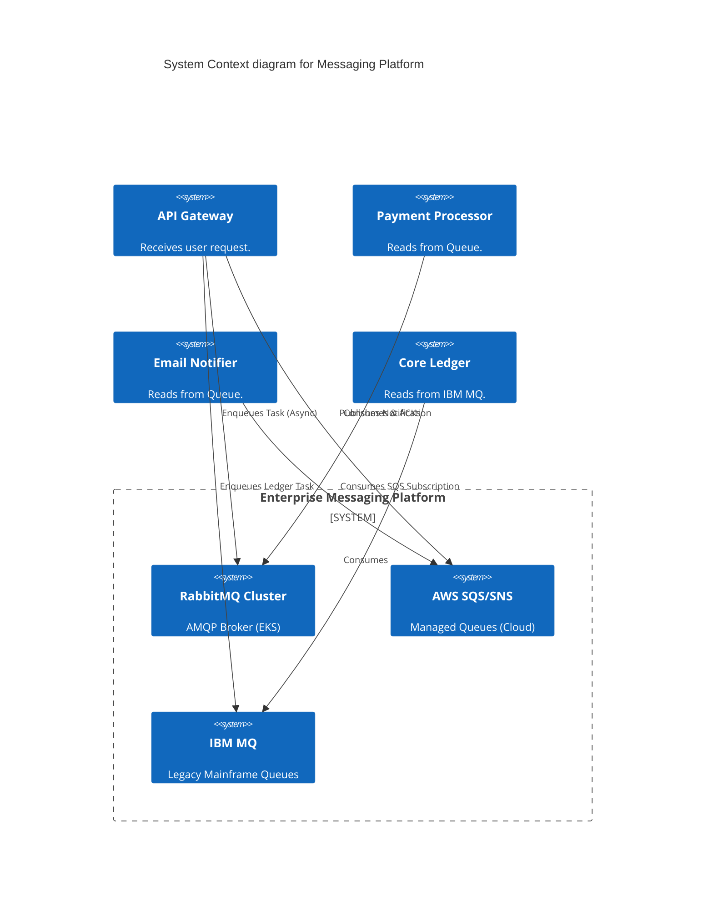
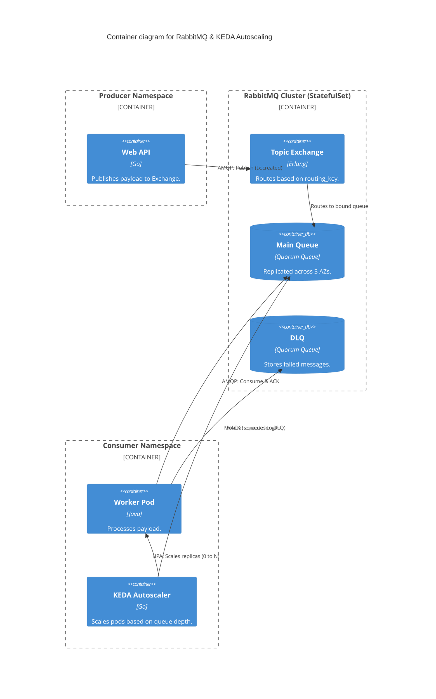

# Section 1: Executive Overview & Business Alignment

## 1. Executive Overview
This document defines the **Enterprise Messaging Platform** blueprint. While Kafka (Doc 50, 66) is the enterprise nervous system for continuous event streaming and replay, traditional Message Queues (RabbitMQ, SQS, IBM MQ) are absolutely critical for discrete, asynchronous task delegation, work queues, and point-to-point guaranteed delivery. This blueprint standardizes the patterns for decoupling microservices via transient message queues.

## 2. Business Purpose
Synchronous HTTP REST calls between microservices create fragile architectures. If Service A calls Service B synchronously, and B is down, A fails. By introducing an asynchronous Messaging Queue, A drops the payload into the queue and immediately returns a success to the user. Service B can process the payload at its own pace (Leveling/Buffering). This ensures Tier-1 banking APIs remain responsive even during extreme traffic spikes.

## 3. Functional Scope
*   Message Brokers (RabbitMQ on K8s, AWS SQS/SNS, IBM MQ for Mainframe)
*   Message Routing (Fan-out, Topic Exchange, Direct)
*   Queue Semantics (FIFO, Priority Queues, Delayed Messages)
*   Resilience (Dead Letter Queues, Exponential Backoff Retries)
*   Idempotency & Delivery Guarantees (At-Least-Once)

## 4. Non-Functional Requirements (NFRs)
*   **Latency:** < 5ms for message enqueuing.
*   **Durability:** Messages must be written to disk (Persistent) before returning an ACK to the publisher.
*   **Availability:** 99.99% via Multi-AZ cluster quorum.
*   **Scale:** Support millions of messages in queue backlog without degrading insert performance.

## 5. Domain Mapping & Bounded Contexts
*   `BrokerDomain`: The core queue infrastructure (RabbitMQ / SQS).
*   `RoutingDomain`: The exchanges routing messages to appropriate queues.
*   `ConsumerDomain`: The worker pods polling/subscribing to the queues.
*   `PoisonDomain`: Dead Letter Exchanges managing unprocessable payloads.

---

# Section 2: Logical & Physical Architecture (C4 Models)

## 6. C4 Context Diagram
The Messaging Platform acts as the asynchronous shock absorber between high-throughput client requests and slower backend processing systems.



## 7. C4 Container Diagram (RabbitMQ on Kubernetes)
RabbitMQ is deployed as a stateful, highly available Quorum Cluster on EKS, utilizing KEDA for event-driven autoscaling of consumer pods.



---

# Section 3: Messaging vs. Streaming (RabbitMQ vs Kafka)

## 8. Architectural Distinction
Engineers frequently confuse Messages with Events. We mandate strict boundaries:
*   **Kafka (Events / Streaming):** Use Kafka when data is a *Fact* (e.g., `OrderPlaced`). Kafka stores events in an immutable log. Multiple independent consumers can read the same event, and new consumers can replay the history from day zero.
*   **RabbitMQ / SQS (Commands / Tasks):** Use Messaging when data is an *Action* (e.g., `ProcessPayment`). Once a Consumer successfully processes the message and sends an ACK, the message is permanently deleted from the queue. It is transient work delegation.

---

# Section 4: Queue Patterns & Semantics

## 9. Pub/Sub & Fan-Out
*   **SNS to SQS:** In AWS, an API publishes a single message to an SNS Topic. Three different SQS queues are subscribed to that topic. The message is "Fanned-out" (duplicated) into all three queues simultaneously, allowing three distinct microservices to process the task at their own pace.

## 10. FIFO (First-In, First-Out) vs Standard Queues
*   **Standard Queues (Default):** Guarantee high throughput but *do not* guarantee exact ordering. A message published first might be processed second.
*   **FIFO Queues:** When exact ordering is critical (e.g., Trade Execution), we utilize SQS FIFO or RabbitMQ Single Active Consumer. *Tradeoff:* Throughput drops drastically (e.g., capped at 3,000 TPS on SQS FIFO vs nearly unlimited on Standard).

## 11. Priority Queues & Delayed Messages
*   **Priority:** A VIP customer's payment needs to bypass a backlog of 10,000 standard payments. We utilize RabbitMQ Priority Queues (max priority 10) to force the VIP message to the front of the line.
*   **Delayed/Scheduled:** Sending a reminder email exactly 24 hours after sign-up. The message is dropped into a RabbitMQ Delayed Message Exchange, where it sleeps in RAM/Disk until the TTL expires, at which point it is routed to the active consumer queue.

---

# Section 5: Resilience & Delivery Guarantees

## 12. Dead Letter Queues (DLQ) & Poison Pills
If a worker crashes while processing a message (e.g., a Null Pointer Exception due to malformed JSON):
*   The worker sends a `NACK` (Negative Acknowledgement).
*   The Queue increments the `delivery_count`.
*   If `delivery_count > 3`, the Queue automatically routes the message to the **Dead Letter Queue (DLQ)**. This prevents a single "Poison Pill" from blocking the entire queue in an infinite retry loop.

## 13. Delivery Guarantees & Idempotency
*   **At-Least-Once Delivery (Standard):** The platform guarantees the message will be delivered, but in scenarios like network partitions, it *might* be delivered twice.
*   **Exactly-Once Processing:** Because network delivery is At-Least-Once, the *Consumer* is responsible for Exactly-Once processing via **Idempotency** (Doc 66). The consumer checks a Redis cache for the message UUID. If found, it drops the duplicate.

---

# Section 6: Infrastructure as Code & Kubernetes

## 14. Kubernetes: KEDA (Event-Driven Autoscaling)
Standard Kubernetes HPA scales based on CPU. For messaging, CPU is a lagging indicator. We utilize KEDA to scale pods based on actual Queue Depth.

```yaml
apiVersion: keda.sh/v1alpha1
kind: ScaledObject
metadata:
  name: payment-worker-scaler
  namespace: payments
spec:
  scaleTargetRef:
    name: payment-worker-deployment
  minReplicaCount: 0  # Scale to Zero to save costs when queue is empty
  maxReplicaCount: 50
  triggers:
  - type: rabbitmq
    metadata:
      queueName: core.payments.queue
      queueLength: "50" # Add 1 pod for every 50 messages in the queue
      host: RabbitMqConnectionSecret
```

## 15. Terraform: AWS SQS & SNS (Fan-Out)
Defining a resilient Fan-out architecture with DLQs in Terraform.

```hcl
# The central Fan-out Topic
resource "aws_sns_topic" "order_events" {
  name = "order-events-topic"
}

# The Target Queue for the Payment Service
resource "aws_sqs_queue" "payment_queue" {
  name = "payment-processing-queue"
  
  # Configure the Dead Letter Queue
  redrive_policy = jsonencode({
    deadLetterTargetArn = aws_sqs_queue.payment_dlq.arn
    maxReceiveCount     = 3
  })
}

resource "aws_sqs_queue" "payment_dlq" {
  name = "payment-processing-dlq"
}

# Bind the Queue to the SNS Topic
resource "aws_sns_topic_subscription" "payment_sub" {
  topic_arn = aws_sns_topic.order_events.arn
  protocol  = "sqs"
  endpoint  = aws_sqs_queue.payment_queue.arn
}
```

---

# Section 7: Security & Observability

## 16. Security (mTLS & KMS)
*   **Transit:** All AMQP/MQTT connections to RabbitMQ require TLS 1.3. For internal EKS clusters, Istio strictly enforces mTLS.
*   **At Rest:** Messages persisted to disk in RabbitMQ or SQS are encrypted using AWS KMS Customer Managed Keys (CMK).
*   **Payload Encryption:** For highly classified data (e.g., passing PII through the queue), the Publisher encrypts the exact JSON payload attributes before enqueuing (Envelope Encryption), ensuring the Broker admins cannot read the payload.

## 17. Observability
Datadog is configured to monitor critical queue SLIs:
*   `queue_depth`: The raw number of messages waiting.
*   `queue_age_oldest_message`: If this exceeds 5 minutes, Consumers are deadlocked.
*   `dlq_depth`: If this spikes > 0, an alert is instantly routed to PagerDuty, indicating a code bug producing Poison Pills.

---

# Section 8: Governance Checklists & ADRs

## 18. Reference ADRs
| ID | Decision | Rationale |
| :--- | :--- | :--- |
| `MSG-01` | SQS vs. RabbitMQ | SQS is mandated for Cloud-native AWS architectures due to zero maintenance. RabbitMQ (Quorum Queues) is mandated for Kubernetes multi-cloud environments requiring advanced routing (Topic Exchanges) not supported by SQS. |
| `MSG-02` | KEDA over HPA | Scaling consumers based on CPU causes extreme lag. KEDA directly queries the RabbitMQ/SQS API, proactively scaling Pods *before* the CPU spikes, ensuring SLA compliance. |
| `MSG-03` | Quorum Queues (RabbitMQ) | Legacy Mirrored Queues are deprecated. Quorum queues use the Raft consensus algorithm, guaranteeing that if a node crashes, no acknowledged messages are lost. |

## 19. Architectural Anti-Patterns Avoided
*   **The Synchronous Chain:** API Gateway -> Service A -> Service B -> Service C (all via HTTP). If C is slow, the API Gateway times out. Use queues to decouple A, B, and C.
*   **Missing Idempotency:** Assuming the broker will only deliver a message exactly once. Network partitions cause duplicate deliveries. Consumers *must* enforce idempotency locally.
*   **Infinite Retry Loops:** Failing to implement a DLQ. A malformed message hits the queue, crashes the worker, gets placed back on the queue, and crashes the next worker, effectively DDOSing the cluster.

## 20. Production Readiness Checklist
- [ ] RabbitMQ deployed in Quorum mode across 3 Availability Zones.
- [ ] AWS SQS/SNS configured with KMS Encryption at Rest.
- [ ] Dead Letter Queues (DLQs) strictly enforced on all production queues.
- [ ] KEDA Autoscalers deployed and tuned for TargetQueueDepth.
- [ ] Consumer applications audited for Idempotency compliance.
- [ ] PagerDuty alerts configured for `queue_age_oldest_message`.

## 21. Executive Messaging Dashboard
| Capability | Target | Achieved | Status |
| :--- | :--- | :--- | :--- |
| **Publish Latency (p99)** | < 10ms | 4ms | 🟢 PASS |
| **Max Queue Age (SLA)** | < 30s | 5s | 🟢 PASS |
| **Messages in DLQ** | < 0.01% | 0.001% | 🟢 PASS |
| **Delivery Success Rate** | 99.99% | 99.999%| 🟢 PASS |
| **Platform Availability** | 99.999%| 99.999%| 🟢 PASS |

---
*Blueprint Certification Level: 5 (Production-Ready)*
*Owner: Principal Messaging Architect & Head of Cloud Infrastructure*
