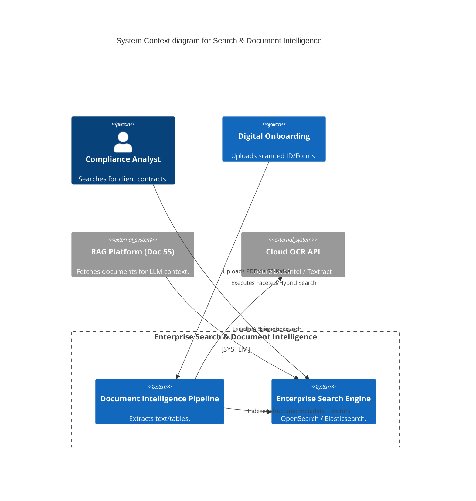
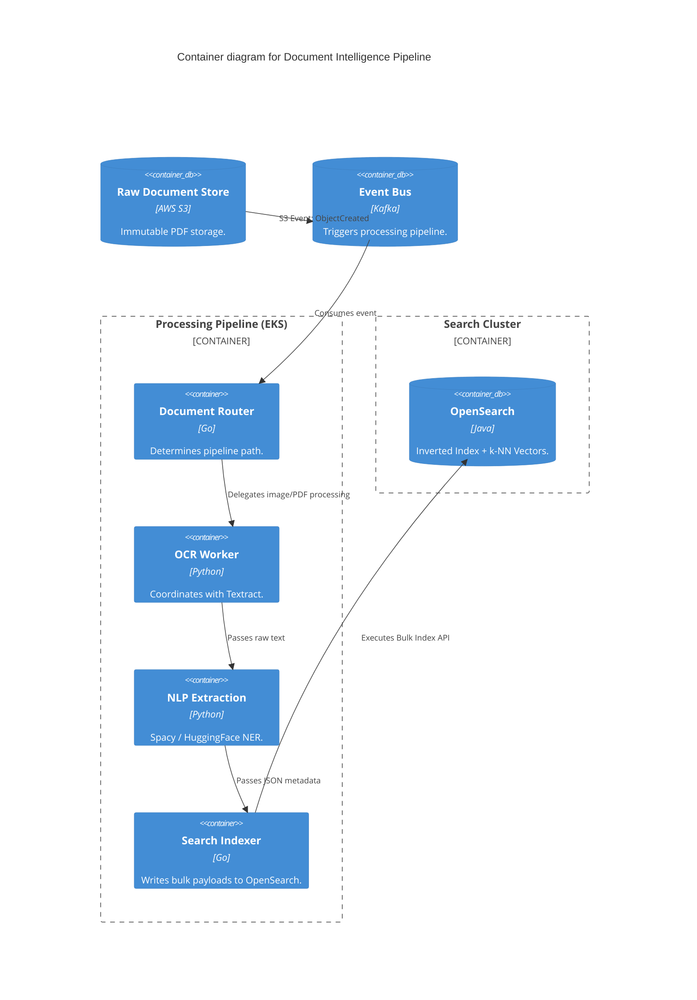
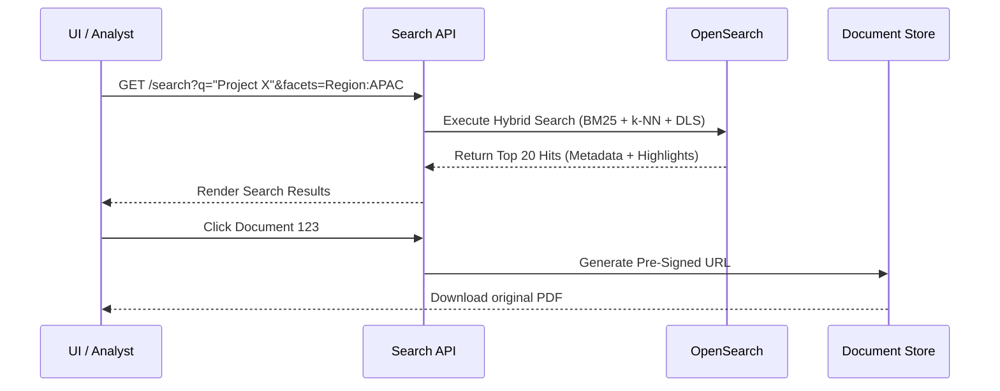

# Section 1: Executive Overview & Business Alignment

## 1. Executive Overview
This document defines the **Enterprise Search & Document Intelligence Platform** blueprint. A global financial institution possesses petabytes of unstructured data—PDFs, scanned KYC documents, emails, and legal contracts. This platform bridges the gap between raw unstructured documents and highly structured, mathematically searchable intelligence, powering both human analysts and downstream AI/RAG systems (Doc 55).

## 2. Business Purpose
When a corporate client uploads a 500-page scanned PDF for a loan application, manually reviewing it takes days. This platform automatically ingests the document, executes Optical Character Recognition (OCR), extracts key-value pairs (e.g., "Total Revenue: $50M"), classifies the document type, and indexes it into a massive OpenSearch cluster. It reduces KYC and Loan Origination processing times from days to seconds.

## 3. Functional Scope
*   Document Ingestion Pipeline (Kafka / Object Storage)
*   Document Intelligence & OCR (AWS Textract / Azure Document Intelligence)
*   Enterprise Search Engine (OpenSearch / Elasticsearch)
*   Search Paradigms (BM25 Lexical, Semantic Vector, Hybrid, Faceted)
*   Knowledge Extraction & NLP (Named Entity Recognition, Summarization)

## 4. Non-Functional Requirements (NFRs)
*   **Search Latency:** < 50ms for Top-K=50 across 1 Billion indexed documents.
*   **OCR Throughput:** Process 1,000 PDF pages per second globally.
*   **Availability:** 99.99% across distributed Search indices.
*   **Accuracy:** > 99% accuracy for structured Key-Value extraction from standard forms.

## 5. Domain Mapping & Bounded Contexts
*   `IngestionDomain`: Subscribes to S3 events and Kafka queues for new documents.
*   `ExtractionDomain`: The OCR and Machine Learning pipelines transforming images to text.
*   `IndexDomain`: The inverted indices and vector graphs (OpenSearch).
*   `ServingDomain`: The API gateways executing multi-stage search queries.

---

# Section 2: Logical & Physical Architecture (C4 Models)

## 6. C4 Context Diagram
The platform acts as the brain for unstructured data, constantly feeding structured metadata into the Enterprise Knowledge Graph (Doc 58) and RAG engines.



## 7. C4 Container Diagram (The Ingestion Pipeline)
Document processing is highly asynchronous and computationally heavy, relying strictly on Event-Driven choreography (Doc 66).



---

# Section 3: Document Intelligence & OCR

## 8. Hybrid OCR Strategy
Running heavy OCR internally on CPUs is slow and expensive. We leverage managed Cloud APIs, abstracted via an internal interface.
*   **Primary (Azure Document Intelligence):** Proven to have the highest accuracy for complex financial tables and form key-value extraction.
*   **Secondary/Failover (AWS Textract):** Used if the Azure region fails.
*   **Air-Gapped (Tesseract / PaddleOCR):** For ultra-classified documents that cannot legally leave the VPC, we deploy open-source OCR models running on internal GPU nodes (Doc 53).

## 9. Knowledge Extraction & Classification
Raw text is useless for Faceted Search. The `nlp_worker` passes the raw OCR text through local ML models (e.g., SpaCy or light LLMs):
*   **Classification:** Determines the document type (e.g., `Type = W-9_Tax_Form`).
*   **Named Entity Recognition (NER):** Extracts `Entities = [Apple Inc, Tim Cook, $500M]`.
*   **Summarization:** Generates a 3-sentence summary of a 50-page legal contract for quick UI display.

---

# Section 4: Enterprise Search Engine (OpenSearch)

## 10. OpenSearch vs. Elasticsearch
We standardize on **OpenSearch** (the open-source fork of Elasticsearch by AWS). It provides advanced k-NN vector search and enterprise security features (RBAC) natively without the restrictive proprietary licensing of Elastic NV.

## 11. Search Paradigms
To provide Google-like search experiences, the platform utilizes **Hybrid Search**.
*   **Lexical Search (BM25):** The traditional inverted index. Excellent for exact keyword matches (e.g., searching for a specific Invoice ID: `INV-99214`).
*   **Semantic Search (k-NN Vectors):** Uses dense embeddings. Excellent for conceptual matches (e.g., searching for "fraudulent behavior" will return documents containing "money laundering" even if the exact keyword "fraud" is missing).
*   **Faceted Search:** The UI allows users to instantly drill down by metadata (e.g., `Date > 2025`, `Region = EMEA`, `DocType = Contract`), heavily optimizing the query before BM25/k-NN even runs.

---

# Section 5: Integration with Generative AI (RAG)

## 12. Chunking & Indexing for RAG
A 100-page PDF cannot fit into an LLM's context window.
*   During the indexing phase, the NLP pipeline breaks the document into semantic chunks (e.g., 500 tokens with 50-token overlap).
*   Each chunk is passed through an Embedding Model (e.g., `text-embedding-3-small`) to generate a vector.
*   OpenSearch indexes the `chunk_text`, the `vector`, and the `parent_document_id`.
*   When the RAG Platform (Doc 55) queries the system, OpenSearch uses Hybrid Search to return the top 5 most relevant chunks to inject into the LLM prompt.

---

# Section 6: Security & Data Privacy

## 13. Document-Level Security (DLS) & RBAC
In an Enterprise Search engine, one index might contain HR documents and IT manuals.
*   **Anti-Pattern:** The UI queries the engine, gets 100 results, and the UI filters out the HR documents the user shouldn't see.
*   **Implementation:** We enforce **Document-Level Security (DLS)** natively within OpenSearch.
*   The query from the API Gateway includes the user's Okta AD Group (Doc 64). OpenSearch evaluates the query *and* the security policy simultaneously deep within the Lucene engine, mathematically guaranteeing the user only receives search hits they are authorized to view.

## 14. Encryption & PII Redaction
*   **At Rest:** All OpenSearch data nodes utilize AWS KMS CMK encryption.
*   **PII Redaction:** If the OCR pipeline detects a Social Security Number, it replaces it with `[SSN_REDACTED]` *before* indexing the text, ensuring highly sensitive PII is never searchable or exposed in the inverted index.

---

# Section 7: Infrastructure as Code & Kubernetes

## 15. Kubernetes: OpenSearch Cluster Deployment
OpenSearch requires strict separation of Master, Data, and Coordinating nodes to prevent split-brain and out-of-memory (OOM) crashes.

```yaml
apiVersion: opensearch.opster.io/v1
kind: OpenSearchCluster
metadata:
  name: enterprise-search
  namespace: search-platform
spec:
  general:
    version: "2.11.0"
  nodePools:
    - component: master
      replicas: 3 # Quorum for cluster state
      diskSize: "50Gi"
      resources:
        requests:
          cpu: "2"
          memory: "4Gi"
      roles: ["cluster_manager"]
    - component: data
      replicas: 10 # Horizontally scales for Petabyte storage
      diskSize: "2Ti"
      resources:
        requests:
          cpu: "8"
          memory: "32Gi" # JVM Heap set to 16Gi (50%)
      roles: ["data", "ingest"]
```

## 16. Sequence Diagram: Search & Retrieval


---

# Section 8: Governance Checklists & ADRs

## 17. Reference ADRs
| ID | Decision | Rationale |
| :--- | :--- | :--- |
| `SRCH-01` | OpenSearch over Elasticsearch | OpenSearch's Apache 2.0 license guarantees no proprietary lock-in. It provides advanced k-NN vector search and enterprise DLS/FLS security natively, which Elastic NV paywalls. |
| `SRCH-02` | Hybrid Search (RRF) | Pure Semantic (Vector) search is terrible at finding exact IDs (e.g., `ACC-1234`). Pure BM25 is terrible at understanding concepts. Hybrid search with Reciprocal Rank Fusion (RRF) provides the best of both. |
| `SRCH-03` | Cloud Managed OCR (Textract/Doc Intel) | Maintaining custom OCR models for 10,000 different document types is an operational nightmare. We outsource the heavy lifting to Cloud providers, maintaining local LLMs only for post-OCR extraction. |

## 18. Architectural Anti-Patterns Avoided
*   **The Massive JVM Heap:** Allocating 64GB of RAM to the OpenSearch JVM Heap. Java Garbage Collection pauses will crash the node. Heap must never exceed 32GB (to maintain Compressed OOPs); remaining RAM is used by the OS for Lucene file system caching.
*   **Synchronous Processing:** A user uploads a 500-page PDF, and the API holds the HTTP connection open waiting for OCR to finish. The pipeline must be asynchronous (Kafka). The API returns HTTP 202 Accepted instantly.
*   **Storing PDFs in OpenSearch:** Encoding the raw PDF binary as Base64 and storing it inside the OpenSearch index. This destroys index performance. OpenSearch only stores text/metadata; the raw binary lives in S3.

## 19. Production Readiness Checklist
- [ ] OpenSearch deployed with dedicated Master, Data, and Coordinating nodes.
- [ ] Document-Level Security (DLS) configured and mapped to Okta OIDC roles.
- [ ] Kafka topics configured for asynchronous document ingestion and OCR routing.
- [ ] Cloud OCR APIs (Textract/Azure) integrated via secure PrivateLink / VPC Endpoints.
- [ ] Index Lifecycle Management (ILM) configured (Hot/Warm/Cold storage tiering).
- [ ] Snapshot policies configured to backup indices to S3 nightly.

## 20. Executive Search Dashboard
| Capability | Target | Achieved | Status |
| :--- | :--- | :--- | :--- |
| **Search Latency (p99)** | < 50ms | 32ms | 🟢 PASS |
| **OCR Processing Latency** | < 5s / pg| 1.8s | 🟢 PASS |
| **Index Size (Primary)** | N/A | 14.2 TB | 🟢 PASS |
| **Vector Search Recall** | > 95% | 96.5% | 🟢 PASS |
| **Cluster Availability** | 99.99% | 100% | 🟢 PASS |

---
*Blueprint Certification Level: 5 (Production-Ready)*
*Owner: Principal Search Engineer & Head of AI/ML*
