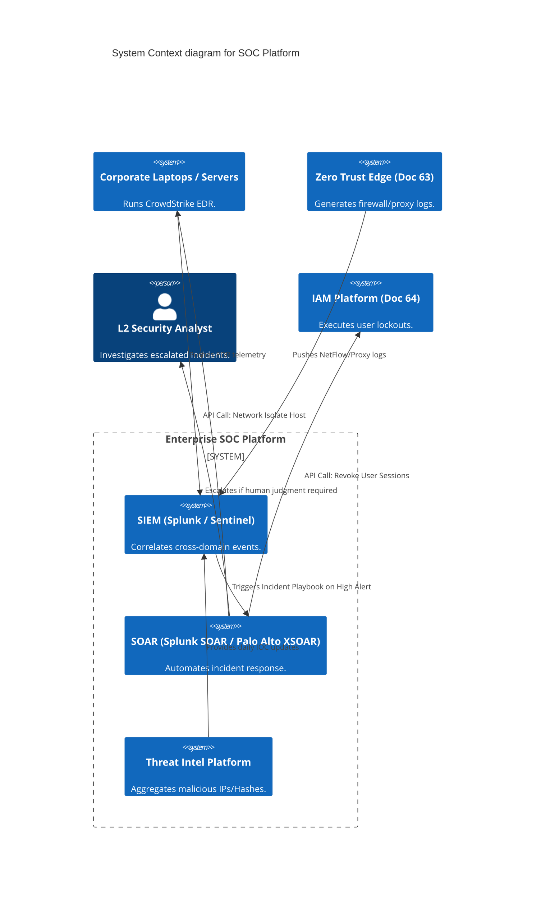
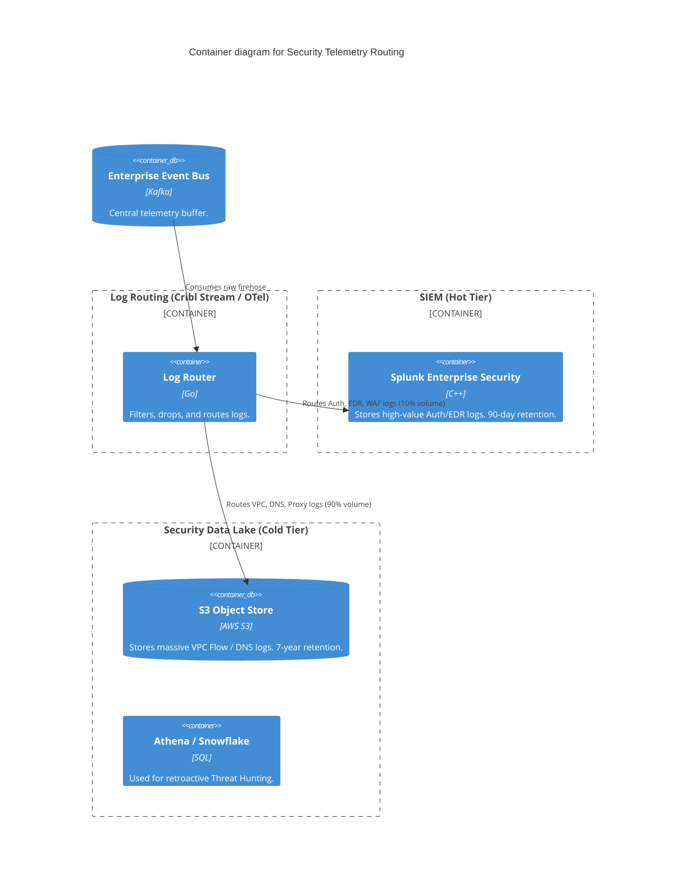

# Section 1: Executive Overview & Business Alignment

## 1. Executive Overview
This document defines the **Enterprise Security Operations Center (SOC) Platform** blueprint. As the bank's digital perimeter dissolves into multi-cloud (Doc 62) and Zero Trust (Doc 63) architectures, legacy signature-based antivirus and manual log reviews are entirely obsolete. This platform defines the automated, AI-driven nervous system for Threat Detection, Incident Response, and Vulnerability Management, utilizing SIEM, SOAR, and EDR/XDR technologies.

## 2. Business Purpose
The dwell time of an Advanced Persistent Threat (APT) actor in a corporate network averages 21 days before detection. This platform exists to reduce dwell time from days to minutes. By automating incident triage via SOAR (Security Orchestration, Automation, and Response), the SOC scales to handle 10 billion daily security events without burning out human analysts, ensuring continuous compliance with PCI DSS and ISO27001.

## 3. Functional Scope
*   **SIEM (Security Information & Event Management):** Splunk ES / Microsoft Sentinel.
*   **SOAR:** Automated Incident Response Playbooks.
*   **XDR/EDR:** CrowdStrike Falcon / Microsoft Defender for Endpoint.
*   **Detection Engineering:** Sigma Rules, YARA, MITRE ATT&CK mapping.
*   **Security Data Lake:** Low-cost, long-term retention of telemetry (Snowflake/Iceberg).

## 4. Non-Functional Requirements (NFRs)
*   **Ingestion Volume:** > 5 Terabytes of security telemetry per day.
*   **Mean Time to Detect (MTTD):** < 5 minutes for Critical severity alerts.
*   **Mean Time to Respond (MTTR):** < 15 minutes for automated containment (SOAR).
*   **Data Retention:** 90 Days Hot (SIEM), 7 Years Cold (Security Data Lake) for forensics.

## 5. Domain Mapping & Bounded Contexts
*   `TelemetryDomain`: Kafka and OTel routing logs to the SIEM and Data Lake.
*   `DetectionDomain`: SIEM correlation engines evaluating Sigma rules.
*   `ResponseDomain`: SOAR executing API playbooks to isolate hosts or block IPs.
*   `IntelligenceDomain`: Threat Intel Platforms (TIP) managing Indicators of Compromise (IOCs).

---

# Section 2: Logical & Physical Architecture (C4 Models)

## 6. C4 Context Diagram
The SOC Platform acts as the centralized brain, ingesting telemetry from all enterprise assets and automatically coordinating defenses across the network and endpoints.



## 7. C4 Container Diagram (Telemetry Routing & The Security Data Lake)
Ingesting 5TB of VPC Flow Logs and DNS queries daily into a commercial SIEM costs millions of dollars in licensing. We utilize a **Security Data Lake** architecture to route high-volume, low-value logs to cheap storage, while only sending high-value alerts to the SIEM.



---

# Section 3: Detection Engineering & MITRE ATT&CK

## 8. Detection as Code (Sigma)
Writing proprietary SPL (Splunk) or KQL (Sentinel) queries tightly couples the SOC to a single vendor.
*   **Implementation:** We mandate **Sigma** rules. Sigma is an open-source, generic signature format for SIEM systems (the "Terraform for Detections").
*   Detection Engineers write Sigma rules in Git. The CI/CD pipeline compiles the Sigma rule into the target language (SPL/KQL) and deploys it to the SIEM via API.
*   If the Bank migrates from Splunk to Sentinel, 100% of the detection logic is instantly portable.

## 9. MITRE ATT&CK Mapping
Every detection rule deployed in the SIEM *must* be mapped to a specific MITRE ATT&CK Tactic and Technique (e.g., `T1078 - Valid Accounts`).
*   This provides a mathematical heat-map of the SOC's detection coverage, exposing blind spots where the bank is vulnerable to specific APT behaviors.

## 10. User and Entity Behavior Analytics (UEBA)
Static threshold alerts ("Alert if > 5 failed logins") are noisy.
*   **UEBA** uses Machine Learning to establish a baseline of normal behavior for every employee.
*   If an employee in Finance, who typically accesses internal wikis from New York, suddenly uses a valid token to download 50GB of data from a restricted GitHub repo via a VPN in Eastern Europe, UEBA triggers a massive risk-score anomaly, bypassing static rules.

---

# Section 4: Automated Response (SOAR)

## 11. The Power of SOAR Playbooks
An L1 analyst taking 45 minutes to manually query logs, look up an IP on VirusTotal, and email the network team to block it is unacceptable.
*   **Playbook Example: Ransomware Outbreak**
    1.  CrowdStrike detects ransomware behavior and alerts the SIEM.
    2.  SIEM triggers the SOAR `Ransomware_Containment` Playbook.
    3.  SOAR calls the CrowdStrike API to **Network Isolate** the infected laptop (cutting all network access except the CrowdStrike management port).
    4.  SOAR calls the Okta API to instantly **Revoke** the user's sessions and force a password reset.
    5.  SOAR creates a Jira ticket, attaches all forensic logs, and pages the L2 Analyst.
*   **Total execution time:** 3 seconds.

---

# Section 5: Threat Intelligence & Vulnerability Management

## 12. Threat Intelligence Platform (TIP)
The SOC ingests feeds from FS-ISAC, CrowdStrike Falcon X, and open-source intelligence.
*   The TIP aggregates, deduplicates, and scores millions of Indicators of Compromise (IOCs)—malicious IP addresses, domains, and file hashes (YARA).
*   The TIP automatically pushes high-confidence IOCs into the Zero Trust Network edge (Cloudflare WAF) and the EDR platform for real-time blocking.

## 13. Continuous Vulnerability Management
Monthly Nessus network scans are obsolete.
*   Vulnerability detection is agent-based (CrowdStrike Spotlight) and container-based (Trivy/Harbor, Doc 61).
*   If a critical zero-day (e.g., Log4Shell) is announced, the SOC does not run a scan; they query the SIEM inventory database, which instantly identifies every server and container running the vulnerable library in real-time.

---

# Section 6: Infrastructure as Code & SOAR Playbooks

## 14. SOAR Playbook Definition (YAML / Python)
Playbooks are treated as software, managed via GitOps.

```yaml
name: Contain_Compromised_Host
description: "Automatically isolates a host and revokes identity upon Critical EDR alert."
trigger:
  type: siem_alert
  severity: Critical
  source: CrowdStrike
steps:
  - id: network_isolate
    action: crowdstrike.falcon.isolate_host
    inputs:
      device_id: "{{ alert.device.id }}"
  
  - id: revoke_identity
    action: okta.user.clear_sessions
    inputs:
      user_id: "{{ alert.user.email }}"
  
  - id: create_ticket
    action: jira.issue.create
    inputs:
      project: "SOC_INCIDENT"
      summary: "Automated Containment: {{ alert.user.email }}"
      description: "Host isolated due to {{ alert.signature }}"
```

---

# Section 7: Purple Teaming & Continuous Validation

## 15. Purple Team Operations
Historically, Red Teams (Attackers) and Blue Teams (Defenders) operated in silos.
*   **Purple Teaming:** We mandate collaborative exercises. The Red Team executes a specific MITRE ATT&CK technique (e.g., dumping LSASS memory). The Blue Team watches the SIEM in real-time.
*   If the alert does not fire, the Detection Engineering team immediately writes a new Sigma rule, deploys it, and the Red Team executes the attack again to validate the fix.

## 16. Breach and Attack Simulation (BAS)
We deploy BAS tools (e.g., AttackIQ or SafeBreach) that continuously and automatically launch safe, simulated attacks against production servers to ensure EDR sensors and SIEM rules have not silently failed or drifted.

---

# Section 8: Governance Checklists & ADRs

## 17. Reference ADRs
| ID | Decision | Rationale |
| :--- | :--- | :--- |
| `SOC-01` | Security Data Lake vs. SIEM-Only | Ingesting all telemetry into Splunk costs $10M+/year. By routing high-volume/low-value logs to S3 (Athena), we save 80% on licensing while retaining forensic search capabilities. |
| `SOC-02` | Detection as Code (Sigma) | Prevents vendor lock-in and allows the SOC to apply software engineering practices (Version Control, Unit Testing, CI/CD) to security alerting rules. |
| `SOC-03` | Agent-based Vulnerability Scanning | Network scanners require complex credential management and cause network congestion. EDR agents continuously report software vulnerabilities in real-time with zero network impact. |

## 18. Architectural Anti-Patterns Avoided
*   **Alert Fatigue:** Enabling thousands of out-of-the-box SIEM rules. The SOC receives 10,000 alerts a day, analysts ignore them, and a real breach is missed. We enforce strict tuning: if a rule has a >10% False Positive rate, it is automatically demoted to "Informational" until retuned.
*   **Human-Dependent Containment:** Requiring a human manager's approval to quarantine a laptop infected with ransomware. The ransomware will encrypt the hard drive before the manager reads the email. Containment must be automated via SOAR.
*   **Siloed SOC Data:** The SOC has a different inventory list than the IT department. The SOC must integrate deeply with the Enterprise CMDB/ServiceNow to understand the business criticality of an infected server.

## 19. Production Readiness Checklist
- [ ] Log routing pipeline (Cribl/OTel) deployed to filter data before SIEM ingestion.
- [ ] CrowdStrike EDR deployed to 100% of end-user endpoints and cloud workloads.
- [ ] Sigma rules CI/CD pipeline integrated with the SIEM API.
- [ ] SOAR Playbooks tested for automated network isolation and identity revocation.
- [ ] Threat Intel feeds (FS-ISAC) integrated and automatically pushing to WAF/EDR.
- [ ] Compliance reporting dashboards configured (PCI DSS, ISO27001).

## 20. Executive Security Dashboard (SOC)
| Capability | Target | Achieved | Status |
| :--- | :--- | :--- | :--- |
| **Mean Time to Detect (MTTD)** | < 5 Mins | 2.1 Mins | 🟢 PASS |
| **Mean Time to Respond (MTTR)**| < 15 Mins| 4.3 Mins | 🟢 PASS |
| **SOAR Automation Rate** | > 80% | 86% | 🟢 PASS |
| **MITRE ATT&CK Coverage** | > 85% | 88% | 🟢 PASS |
| **False Positive Rate** | < 5% | 3.2% | 🟢 PASS |

---
*Blueprint Certification Level: 5 (Production-Ready)*
*Owner: Global Head of SOC & Principal Detection Engineer*
