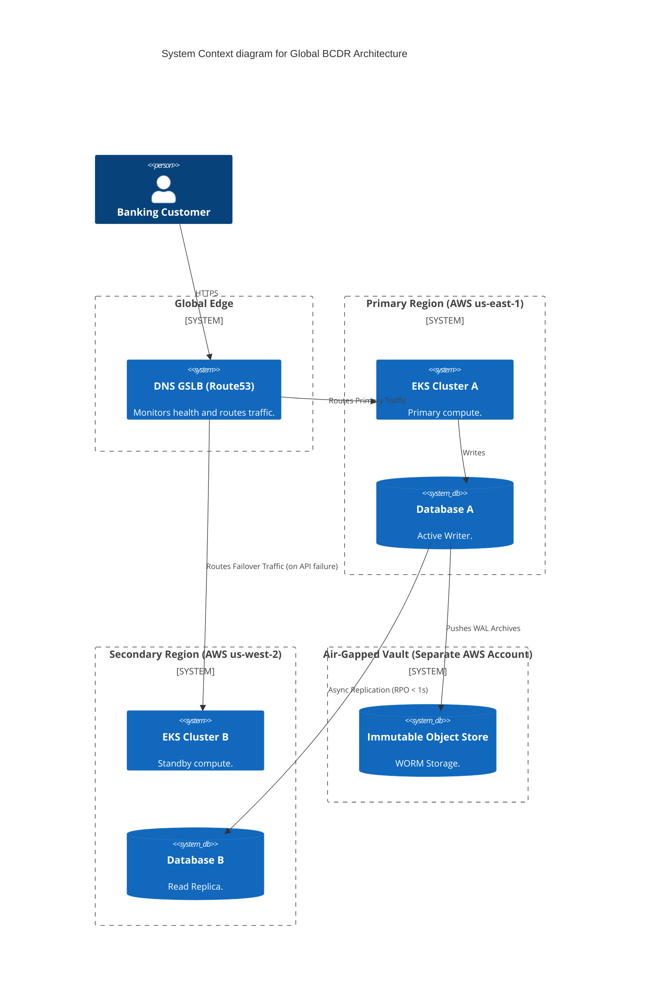
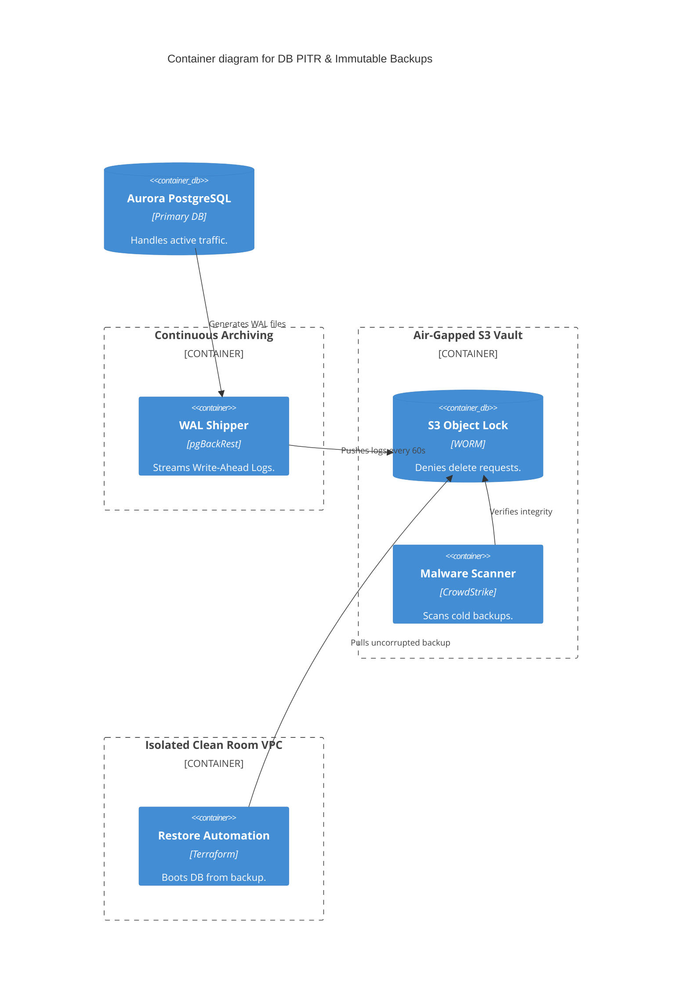

# Section 1: Executive Overview & Business Alignment

## 1. Executive Overview
This document defines the **Enterprise Business Continuity & Disaster Recovery (BCDR) Platform** blueprint. In the modern cloud era, disaster recovery is no longer about driving backup tapes to an offsite bunker. It is about cryptographic immutability, automated GitOps cluster resurrection, and Active-Active multi-region database replication. This blueprint defines how the bank survives catastrophic regional cloud outages (e.g., AWS us-east-1 going dark) and destructive ransomware events.

## 2. Business Purpose
Downtime for a Tier-1 Global SIFI (Systemically Important Financial Institution) incurs devastating regulatory fines, liquidity crises, and irreparable reputational damage. The BCDR platform ensures that core banking operations resume within minutes (RTO) with zero data loss (RPO) during natural disasters, and provides mathematically isolated Clean Room recovery paths for nation-state ransomware attacks.

## 3. Functional Scope
*   Multi-Region & Multi-Cloud Failover (Route53 / Azure Traffic Manager)
*   Continuous State Replication (PostgreSQL PITR, Kafka MirrorMaker)
*   Ransomware Defense (Immutable S3 Object Lock, Air-Gapped Vaults)
*   Automated Clean Room Recovery & Malware Scanning
*   Chaos Engineering (Continuous Game Days)

## 4. Non-Functional Requirements (NFRs)
*   **Recovery Time Objective (RTO):** < 5 minutes for Tier-1 Active-Passive failovers.
*   **Recovery Point Objective (RPO):** < 1 second (Async Replication) / 0 seconds (Sync Replication).
*   **Maximum Tolerable Downtime (MTD):** 2 hours for catastrophic Multi-Cloud failovers.
*   **Backup Immutability:** 100% of Tier-1 backups mathematically locked for 90 days.

## 5. Domain Mapping & Bounded Contexts
*   `RoutingDomain`: DNS-based traffic switching.
*   `ReplicationDomain`: Continuous synchronization of databases and event streams.
*   `VaultDomain`: Air-gapped storage for immutable backup artifacts.
*   `ResurrectionDomain`: GitOps automation to recreate clusters from scratch.

---

# Section 2: Logical & Physical Architecture (C4 Models)

## 6. C4 Context Diagram
The BCDR architecture relies heavily on Global Server Load Balancing (GSLB) and underlying state replication.



## 7. C4 Container Diagram (PostgreSQL Point-in-Time Recovery)
Continuous replication handles node failures, but Point-in-Time Recovery (PITR) handles logical corruption (e.g., a DBA accidentally dropping a table).



---

# Section 3: High Availability Strategies

## 8. Active-Active vs. Active-Passive
*   **Active-Passive (Standard):** 90% of Tier-1 applications. Compute is running in Region B, but the Database is a Read Replica. Failover requires promoting the database to Master (RTO ~5 minutes). This avoids complex split-brain data conflicts.
*   **Active-Active (Exceptional):** Used *only* for stateless gateways and globally distributed NoSQL databases (CockroachDB / Cassandra). Traffic hits both regions simultaneously. Extremely complex and expensive; reserved for 99.999% Tier-0 systems.

## 9. DNS Failover & Global Routing
*   Failover is executed at the DNS layer using Route53 or Cloudflare.
*   Health checks hit a dedicated `/health/deep` endpoint on the microservice that checks DB connectivity.
*   If the primary region fails 3 consecutive health checks, DNS automatically updates the A/CNAME records, failing traffic over to the secondary region instantly.

---

# Section 4: Ransomware & Clean Room Recovery

## 10. The Threat of Destructive Malware
Standard DB replication replicates *everything*, including ransomware encryption commands or `DROP TABLE` statements. Standard backups are often deleted by attackers who compromise the AWS root account.
*   **Air-Gapped Vault:** Backups are pushed to a completely separate AWS Account using cross-account IAM roles. The production AWS account has *Write-Only* access to the vault; it possesses zero permissions to `Delete` or `Modify`.
*   **S3 Object Lock (WORM):** Backups are configured with Compliance Mode Object Lock. Even the root user of the Vault account cannot delete the backup until the 90-day retention period expires. It is mathematically immutable.

## 11. Clean Room Recovery
If the primary VPC is compromised:
1.  Terraform spins up a completely isolated "Clean Room" VPC with zero internet ingress/egress.
2.  The backups are mounted and scanned by EDR/Malware engines to ensure the backup itself isn't carrying dormant ransomware.
3.  The database is restored via PITR to 5 minutes *before* the attack occurred.

---

# Section 5: Platform Specific Recovery Patterns

## 12. Kafka Recovery (MirrorMaker 2)
Kafka state cannot be backed up like a traditional database.
*   We utilize **MirrorMaker 2** in Active-Passive mode.
*   Events published to the Primary cluster are continuously asynchronously replicated to the Secondary cluster.
*   *Consumer Offset Sync:* MirrorMaker syncs consumer offsets so that in a failover, consumers resume reading in Region B exactly where they left off in Region A.

## 13. Kubernetes & GitOps Recovery
We do not backup Kubernetes clusters (etcd). Clusters are treated as ephemeral cattle.
*   If a cluster is destroyed, Terraform provisions a blank EKS cluster in 15 minutes.
*   ArgoCD is bootstrapped into the cluster and connected to the GitHub repository.
*   ArgoCD automatically pulls the manifests and deploys all 5,000 microservices. The cluster restores its own state from Git.

## 14. Identity & Vault Recovery
If Okta or HashiCorp Vault goes down, the entire bank halts.
*   **Vault:** Deployed with cross-region Enterprise Performance Replication. Secrets minted in `us-east-1` are instantly replicated to `us-west-2`.
*   **Break-Glass Accounts:** We maintain physical, offline Smart Cards in a physical bank vault containing "Break-Glass" root credentials to restore IAM infrastructure if the primary IdP is locked out.

---

# Section 6: Infrastructure as Code & Automation

## 15. Terraform: S3 Immutable Object Lock
This code creates a mathematically immutable backup vault that protects against rogue admins and ransomware.

```hcl
resource "aws_s3_bucket" "bcdr_vault" {
  bucket = "ire-enterprise-bcdr-vault"

  # Prevents the bucket from ever being deleted
  lifecycle {
    prevent_destroy = true
  }
}

# Enforce Object Lock at the bucket level
resource "aws_s3_bucket_object_lock_configuration" "vault_lock" {
  bucket = aws_s3_bucket.bcdr_vault.id

  rule {
    default_retention {
      mode = "COMPLIANCE" # Cannot be bypassed, even by AWS root
      days = 90
    }
  }
}
```

## 16. Automated Recovery Runbooks (Temporal)
A human opening a PDF runbook and typing CLI commands during a disaster guarantees failure.
*   We utilize the Workflow Platform (Doc 67 - Temporal) to execute automated recovery sagas.
*   A Slack command (`/dr execute failover us-east-1`) triggers a Temporal workflow that automatically:
    1. Pauses DNS routing.
    2. Promotes the Aurora Read Replica to Master.
    3. Reconfigures the Kafka publishers.
    4. Resumes DNS routing to the new region.

---

# Section 7: Chaos Engineering & Continuous Validation

## 17. Chaos Engineering (Game Days)
A DR plan that has not been tested is just a theory.
*   Every quarter, the engineering team executes a **Game Day** during business hours.
*   Using Gremlin or Chaos Mesh, an entire Availability Zone (AZ) or Database Master is intentionally terminated.
*   The system must automatically heal within the defined RTO (e.g., 5 minutes) with zero human intervention.

## 18. Restore Validation
Backups are useless if they cannot be restored.
*   Every 24 hours, an automated pipeline pulls a random tier-1 database backup from the Vault.
*   It restores the database into a temporary namespace, runs a suite of data integrity queries, reports success to Datadog, and destroys the temporary database.

---

# Section 8: Governance Checklists & ADRs

## 19. Reference ADRs
| ID | Decision | Rationale |
| :--- | :--- | :--- |
| `DR-01` | GitOps vs. Cluster Backup (Velero) | Backing up Kubernetes state (etcd) leads to restoring stale/corrupted state. GitOps guarantees the cluster is rebuilt cleanly from the exact desired state stored in version control. |
| `DR-02` | Compliance Mode Object Lock | Governance mode can be bypassed by an IAM user with specific privileges. Compliance mode is mathematically enforced by AWS and cannot be bypassed, protecting against Insider Threats. |
| `DR-03` | Active-Passive for Databases | Multi-region Active-Active writes for relational databases introduce massive latency (speed of light) and split-brain resolution complexity. Async replication (Active-Passive) handles 95% of use cases safely. |

## 20. Architectural Anti-Patterns Avoided
*   **The Single Subnet Database:** Placing the Master DB and Read Replica in the same Availability Zone. They must span AZs (High Availability) and Regions (Disaster Recovery).
*   **The Shared Backup Account:** Storing backups in the same AWS account as production. If the production account is compromised, the backups will be deleted.
*   **Manual DNS Failover:** Requiring a human to log into Route53 to change IP addresses during an outage. DNS failover must be tied to automated health checks.

## 21. Production Readiness Checklist
- [ ] Tier-1 databases configured for cross-region asynchronous replication.
- [ ] S3 Immutable Object Lock (Compliance Mode) enforced on all backup buckets.
- [ ] Route53 health checks configured for automated DNS failover.
- [ ] Kafka MirrorMaker 2 continuously syncing topics and consumer offsets.
- [ ] GitOps (ArgoCD) DR pipeline tested for bare-metal cluster resurrection.
- [ ] Automated restore validation running nightly on Tier-1 backups.

## 22. Executive DR Dashboard
| Capability | Target | Achieved | Status |
| :--- | :--- | :--- | :--- |
| **Tier-1 Recovery Time (RTO)** | < 5 Mins | 3.2 Mins | 🟢 PASS |
| **Tier-1 Data Loss (RPO)** | < 1 Sec | 0.4 Sec | 🟢 PASS |
| **Immutable Backup Coverage** | 100% | 100% | 🟢 PASS |
| **Successful Nightly Restores** | 100% | 100% | 🟢 PASS |
| **Quarterly Game Day Success** | 100% | 100% | 🟢 PASS |

---
*Blueprint Certification Level: 5 (Production-Ready)*
*Owner: Global Head of Disaster Recovery & Chief Information Security Officer*
