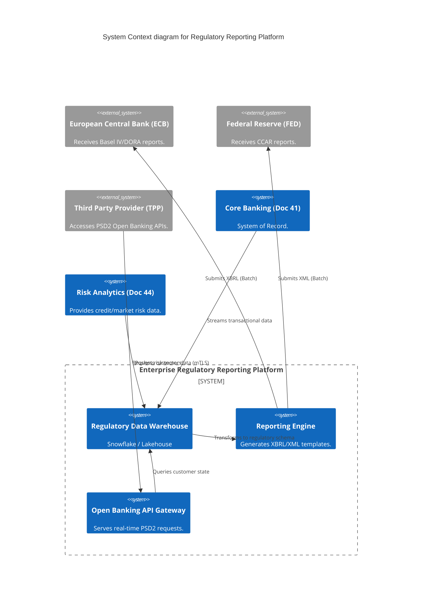
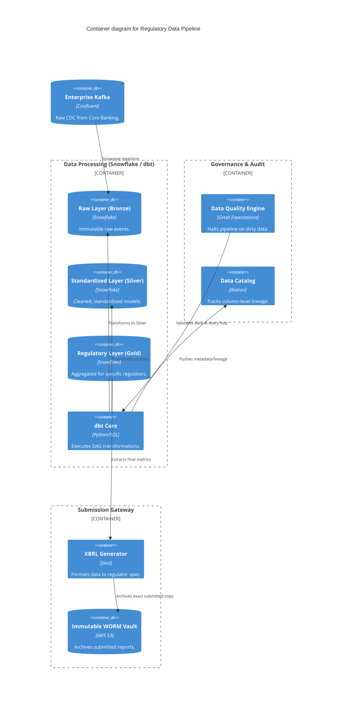

# Section 1: Executive Overview & Business Alignment

## 1. Executive Overview
This document defines the **Enterprise Regulatory Reporting Platform** blueprint. A Tier-1 global financial institution operates under the constant scrutiny of dozens of regulatory bodies (FED, ECB, PRA, OCC, RBI). Failing to provide accurate, timely, and provable data to these regulators results in massive fines (often in the hundreds of millions) and revoked banking licenses. This platform defines the automated data pipelines, immutable storage, and cryptographic lineage required to satisfy global regulatory mandates.

## 2. Business Purpose
Historically, regulatory reporting was achieved by analysts manually downloading CSVs, manipulating them in Excel, and emailing them to regulators. This approach violates **BCBS 239** (principles for effective risk data aggregation). This platform entirely automates the end-to-end flow of financial data from the Core Ledger (Doc 41) to the Regulator, guaranteeing mathematically provable data lineage and absolute data quality.

## 3. Functional Scope
*   **Risk & Capital Reporting:** Basel III, Basel IV, CCAR.
*   **Operational Resilience:** DORA (Digital Operational Resilience Act).
*   **Privacy & Security:** GDPR, PCI DSS, SOC2, ISO27001, SOX.
*   **Open Banking:** PSD2 Regulatory APIs.
*   **Data Provenance:** Cryptographic Data Lineage & Immutable Audit Trails.

## 4. Non-Functional Requirements (NFRs)
*   **Data Accuracy:** 100% reconciliation match between source systems and regulatory outputs.
*   **Auditability:** Every metric must have 1-click end-to-end data lineage back to the raw system of record.
*   **Reporting Latency:** T+1 (End of Day + 1) for batch capital reporting; Real-time (< 5s) for PSD2 APIs.
*   **Storage Immutability:** Regulatory reports must be stored in WORM storage for 7-10 years.

## 5. Domain Mapping & Bounded Contexts
*   `IngestionDomain`: Kafka streaming and batch ETL from banking core.
*   `ProcessingDomain`: Snowflake and dbt executing complex risk aggregations.
*   `LineageDomain`: Alation/Collibra tracking column-level data provenance.
*   `SubmissionDomain`: Automated APIs and secure file gateways pushing to regulators.

---

# Section 2: Logical & Physical Architecture (C4 Models)

## 6. C4 Context Diagram
The Regulatory Reporting Platform acts as the singular, trusted interface between the Bank's internal chaos and the Regulator's strict templates.



## 7. C4 Container Diagram (Data Processing Pipeline)
To satisfy BCBS 239, human intervention is stripped from the pipeline. Transformations are executed entirely as code (dbt).



---

# Section 3: Global Regulatory Frameworks

## 8. BCBS 239 (Risk Data Aggregation)
*   **Mandate:** Banks must have automated, verifiable data lineage from the source system to the final report. Manual Excel manipulation is a violation.
*   **Implementation:** All transformations are executed via **dbt (Data Build Tool)**. dbt parses the SQL transformations and automatically generates a Directed Acyclic Graph (DAG) proving exactly how `Total_Exposure_Amount` was calculated, back to the raw source column.

## 9. Basel III & IV (Capital Adequacy)
*   **Mandate:** Banks must calculate Risk-Weighted Assets (RWA) and maintain sufficient capital reserves.
*   **Implementation:** The Regulatory Data Warehouse (Snowflake) executes massive daily batch queries against the Credit Risk models (Doc 44) and Market Risk models to aggregate exposure at the Counterparty, Country, and Global levels.

## 10. DORA (Digital Operational Resilience Act)
*   **Mandate:** EU financial entities must prove they can withstand extreme cyber-attacks and ICT failures.
*   **Implementation:** The Regulatory Platform pulls directly from the BCDR Platform (Doc 71) and Observability Platform (Doc 65). It automatically generates reports proving the success rates of Quarterly Chaos Engineering Game Days and RTO/RPO SLA compliance.

## 11. PSD2 & Open Banking
*   **Mandate:** Banks must provide secure APIs for Third-Party Providers (TPPs) to access customer account data.
*   **Implementation:** A dedicated external-facing API Gateway (Kong/Apigee) utilizing strict **eIDAS Certificates** and **mTLS** for TPP authentication. It queries the `Silver` data layer in real-time, enforcing explicit customer Consent limits (managed via IAM - Doc 64).

---

# Section 4: Data Quality & Governance

## 12. "Shift-Left" Data Quality (Great Expectations)
A report submitted to the FED with null values for critical risk fields will trigger an audit.
*   We utilize **Great Expectations** integrated directly into the dbt pipeline.
*   Before the `Gold` regulatory table is generated, rules are evaluated (e.g., `expect_column_values_to_not_be_null('counterparty_id')`).
*   If the data quality check fails, the pipeline *halts immediately*, preventing dirty data from being aggregated into the final report. An alert is sent to PagerDuty.

## 13. Cryptographic Audit Trails & Immutable Storage
Regulators often ask to see exactly what report was submitted 5 years ago.
*   Once the XBRL/XML report is generated, it is hashed (SHA-256).
*   The report and its hash are pushed to an AWS S3 Bucket configured with **Compliance Mode Object Lock** (Doc 71).
*   This provides mathematical proof that the historical report has never been retroactively altered by a rogue database administrator.

---

# Section 5: Security & Compliance (PCI DSS / GDPR / SOX)

## 14. SOX (Sarbanes-Oxley) IT General Controls
SOX requires strict change management over systems impacting financial reporting.
*   **GitOps (Doc 60):** No human has direct write access to the Snowflake Production environment.
*   If a Data Engineer needs to update the logic for a Basel III calculation, they must open a Pull Request.
*   The PR requires two approvals. Upon merge, a GitHub Action automatically executes the SQL change via dbt, providing an immutable audit trail of *who* changed the financial logic, *what* the change was, and *who* approved it.

## 15. GDPR & PII Masking
Regulatory reports primarily require aggregated data, not raw PII.
*   **Dynamic Data Masking:** Snowflake is configured with native masking policies. If an analyst queries the `Silver` layer, columns like `Customer_SSN` or `Email` are dynamically masked (e.g., `***-**-1234`) based on their Active Directory Role, preventing PII exfiltration while allowing them to build aggregation logic.

---

# Section 6: Infrastructure as Code & Pipeline Automation

## 16. Terraform: Snowflake Dynamic Masking Policy
Implementing GDPR/PCI DSS compliance directly at the database layer.

```sql
-- Executed via Terraform Snowflake Provider
CREATE MASKING POLICY email_mask AS (val string) RETURNS string ->
  CASE
    WHEN current_role() IN ('REGULATORY_ADMIN', 'COMPLIANCE_OFFICER') THEN val
    ELSE '***@***.com'
  END;

ALTER TABLE silver.customer_master
MODIFY COLUMN email SET MASKING POLICY email_mask;
```

## 17. YAML: dbt Data Quality Check
Defining strict data quality assertions that must pass before regulatory aggregation.

```yaml
models:
  - name: gold_basel_iii_exposure
    description: "Aggregated exposure for Basel III reporting."
    columns:
      - name: counterparty_lei
        description: "Legal Entity Identifier of the counterparty."
        tests:
          - not_null
          - unique
      - name: total_exposure_usd
        description: "Total risk exposure in USD."
        tests:
          - not_null
          - dbt_expectations.expect_column_values_to_be_between:
              min_value: 0 # Exposure cannot be negative
```

---

# Section 7: Governance Checklists & ADRs

## 18. Reference ADRs
| ID | Decision | Rationale |
| :--- | :--- | :--- |
| `REG-01` | Code-Based Transformations (dbt) | Visual ETL tools (Informatica/Talend) obscure data lineage inside proprietary XML files. dbt uses pure SQL in Git, making transformations completely transparent and auditable by SOX regulators. |
| `REG-02` | Shift-Left Data Quality | Aggregating dirty data and finding the error in the final report takes days to untangle. Halting the pipeline at the source immediately prevents downstream contamination. |
| `REG-03` | Immutable WORM Storage | Regulators do not trust standard database backups, which can be altered. S3 Object Lock provides cryptographic proof of report integrity. |

## 19. Architectural Anti-Patterns Avoided
*   **EUC (End User Computing) Sprawl:** Allowing analysts to download data into MS Access or Excel macros to calculate capital requirements. This destroys data lineage, violates BCBS 239, and guarantees regulatory fines. All calculations must exist in the centralized Code Repository.
*   **The "Fix it in Prod" Anti-Pattern:** A data engineer manually updating a row in the production database to fix a reporting error. This bypasses SOX controls. The error must be fixed at the source system and naturally flow through the Kafka CDC pipeline.
*   **Decentralized Reporting:** Every business unit buying their own reporting tool and submitting different numbers to the regulator. The Enterprise Regulatory Platform acts as the single, enforced funnel.

## 20. Production Readiness Checklist
- [ ] dbt CI/CD pipelines enforcing SQL linting and data quality tests.
- [ ] Snowflake Dynamic Data Masking active on all PII/PCI columns.
- [ ] S3 Compliance Mode Object Lock enabled for the XBRL/XML submission vault.
- [ ] Data Catalog (Alation/Collibra) successfully parsing automated lineage graphs.
- [ ] PSD2 Open Banking APIs secured via Istio mTLS and eIDAS certificates.
- [ ] PagerDuty alerts configured for Data Quality pipeline halts.

## 21. Executive Regulatory Dashboard
| Capability | Target | Achieved | Status |
| :--- | :--- | :--- | :--- |
| **Data Quality Pass Rate** | > 99.9% | 99.95% | 🟢 PASS |
| **Report Submission Latency** | T+1 | T+1 | 🟢 PASS |
| **Lineage Coverage (Gold)** | 100% | 100% | 🟢 PASS |
| **Automated SOX Approvals** | 100% | 100% | 🟢 PASS |
| **Platform Availability** | 99.999%| 99.999%| 🟢 PASS |

---
*Blueprint Certification Level: 5 (Production-Ready)*
*Owner: Chief Data Officer & Chief Compliance Officer*
