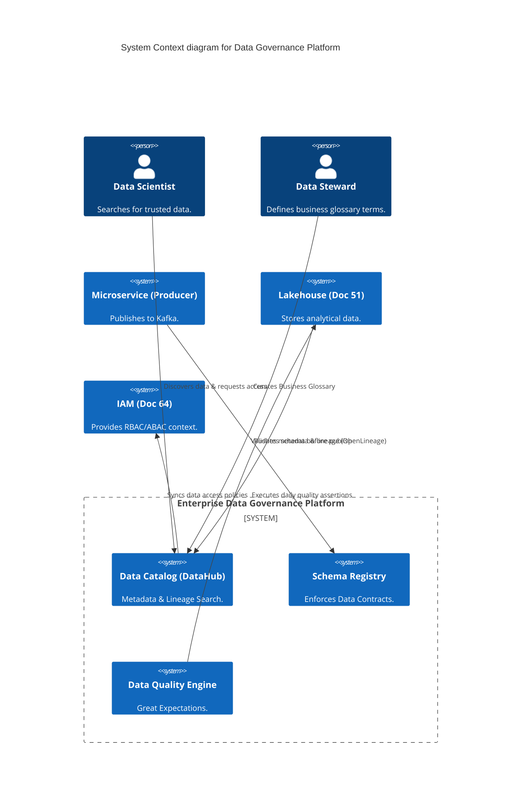
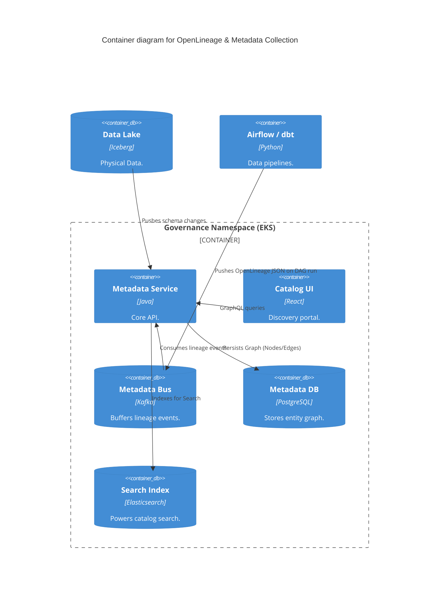

# Section 1: Executive Overview & Business Alignment

## 1. Executive Overview
This document defines the **Enterprise Data Governance Platform** blueprint. In a decentralized Data Mesh architecture (Doc 50), raw data is produced by hundreds of independent microservice teams. Without strict governance, this creates a data swamp of undocumented, low-quality, non-compliant data. This platform establishes the automated, API-driven guardrails for Data Contracts, Lineage, Metadata, and Privacy, ensuring data is a trusted, secure asset across the bank.

## 2. Business Purpose
To satisfy global privacy laws (GDPR, CCPA) and risk aggregation mandates (BCBS 239), the bank must know exactly *where* PII resides, *who* owns it, and *how* it was transformed. This platform shifts data governance from a manual, bureaucratic spreadsheet exercise into a highly automated, "Governance-as-Code" engineering discipline.

## 3. Functional Scope
*   **Data Contracts & Schemas:** Confluent Schema Registry, Protobuf.
*   **Metadata & Discovery:** Enterprise Data Catalog (DataHub / Collibra).
*   **Data Lineage:** OpenLineage tracking cross-system DAGs.
*   **Data Quality:** Great Expectations (Shift-Left Validation).
*   **Data Privacy:** Automated PII Classification, Tokenization, and Dynamic Masking.
*   **Master Data Management (MDM):** Golden records for Customer/Product.

## 4. Non-Functional Requirements (NFRs)
*   **Lineage Latency:** < 5 minutes from pipeline execution to catalog update.
*   **Schema Enforcement:** 100% strict validation at the Producer level (Kafka).
*   **Catalog Scalability:** Support > 10 Million metadata entities (tables, columns, topics).
*   **Privacy SLA:** Automated PII tagging of new columns within 24 hours of creation.

## 5. Domain Mapping & Bounded Contexts
*   `RegistryDomain`: The single source of truth for technical data schemas.
*   `CatalogDomain`: The searchable metadata portal for analysts and engineers.
*   `QualityDomain`: Execution engines running assertions against data at rest and in motion.
*   `PrivacyDomain`: Scanners and policy engines enforcing access control and masking.

---

# Section 2: Logical & Physical Architecture (C4 Models)

## 6. C4 Context Diagram
The Governance Platform sits across the operational (microservices) and analytical (lakehouse) planes, enforcing rules and harvesting metadata.



## 7. C4 Container Diagram (Metadata & Lineage Architecture)
Governance is driven by the push model. Execution engines (Spark, Snowflake, Kafka, Airflow) push OpenLineage events to the central catalog.



---

# Section 3: Data Contracts & Quality

## 8. Data Contracts (Governance as Code)
In a Data Mesh, if a Producer drops a column, it breaks 50 downstream consumers.
*   **Implementation:** We mandate **Data Contracts**. A contract is a strictly typed schema (e.g., Protobuf/Avro) stored in the Enterprise Schema Registry.
*   If a developer attempts to deploy a microservice that publishes a payload breaking the contract (e.g., changing `account_id` from INT to STRING), the CI/CD pipeline and the Kafka broker will explicitly reject the deployment/message.

## 9. Shift-Left Data Quality (Great Expectations)
Data quality cannot be checked at the end of the pipeline.
*   **Assertions:** We deploy Great Expectations in the dbt/Airflow pipelines.
*   Before data is promoted from the `Bronze` to `Silver` layer in the Lakehouse, assertions are run (e.g., `expect_column_to_exist`, `expect_values_to_be_unique`).
*   If data fails the assertion, the pipeline is halted (Data Circuit Breaker), and a Data Incident is created in ServiceNow for the Data Steward to resolve.

---

# Section 4: Metadata, Lineage, and The Data Catalog

## 10. The Enterprise Data Catalog (DataHub / Collibra)
The catalog is the "Google Search" for enterprise data.
*   It links the **Business Glossary** (e.g., "What is the official definition of Total Risk Exposure?") to the **Technical Metadata** (e.g., `snowflake.risk_db.fact_exposure.total_amt`).
*   Analysts use the Catalog to find data, understand its quality score, and click a button to request access via automated IAM workflows.

## 11. Automated Data Lineage (OpenLineage)
*   Manual Visio diagrams of data flows are banned.
*   All data processing engines (Spark, dbt, Snowflake) are configured to emit **OpenLineage** JSON events.
*   The Catalog aggregates these events into a visual Directed Acyclic Graph (DAG), showing exactly how a column in a dashboard was calculated, all the way back to the Kafka topic that generated it.

---

# Section 5: Data Privacy & Lifecycle Management

## 12. Automated PII Classification & Tagging
Relying on humans to manually tag PII in databases is prone to failure.
*   We utilize automated Data Classification agents (e.g., BigID or native Cloud DLP).
*   Agents scan the Lakehouse daily using regex and NLP. If they detect 9-digit numbers matching SSN patterns in a column named `tax_id`, they automatically tag the column as `PII_HIGH` in the Data Catalog.

## 13. Dynamic Data Masking & Tokenization
*   If a column is tagged `PII_HIGH`, the Governance Platform pushes a policy to the Lakehouse (Snowflake/Starburst) to enforce **Dynamic Data Masking**.
*   When a Data Scientist `SELECTs` the column, the database automatically masks the data (e.g., `***-**-1234`) based on the user's role.
*   For analytics requiring joins on PII, **Tokenization** (Vault) replaces the PII with a mathematically irreversible, format-preserving token.

## 14. Data Retention & Destruction
*   GDPR mandates the "Right to be Forgotten."
*   When a customer requests deletion, the MDM system broadcasts a `CustomerDeleted` event.
*   All downstream systems consume this event and execute soft/hard deletes. The Governance platform audits the databases 30 days later to prove the data was destroyed.

---

# Section 6: Infrastructure as Code & Policies

## 15. Terraform: Snowflake Masking Policy Automation
Governance tags in the catalog drive physical masking policies via Terraform.

```sql
-- Create a generic PII masking policy
CREATE MASKING POLICY IF NOT EXISTS pii_mask AS (val string) RETURNS string ->
  CASE
    WHEN current_role() IN ('DATA_STEWARD', 'COMPLIANCE') THEN val
    ELSE '***MASKED***'
  END;

-- Apply the policy automatically based on Object Tags
ALTER TAG pii_high SET MASKING POLICY pii_mask;
```

## 16. YAML: Data Contract Definition
A sample Data Contract enforced by the CI/CD pipeline.

```yaml
# Data Contract for Customer Onboarding
schema:
  type: record
  name: CustomerOnboarded
  fields:
    - name: customer_id
      type: string
      logicalType: uuid
    - name: email
      type: string
      tags: ["PII", "Email"] # Parsed by the Catalog
    - name: kyc_status
      type: enum
      symbols: ["PENDING", "APPROVED", "REJECTED"]
```

---

# Section 7: Master Data Management (MDM)

## 17. The Golden Record
A global bank may have 15 different systems holding an address for "John Doe" (Mortgages, Retail, Trading).
*   The **MDM Platform** uses Entity Resolution (Machine Learning and fuzzy matching) to merge these records into a single "Golden Record."
*   This Golden Record is published back to the Enterprise Event Bus, ensuring all operational systems eventually converge on the correct, governed data.

---

# Section 8: Governance Checklists & ADRs

## 18. Reference ADRs
| ID | Decision | Rationale |
| :--- | :--- | :--- |
| `GOV-01` | Push-based Lineage (OpenLineage) | Polling logs to parse lineage is fragile. Mandating that all engines natively push OpenLineage events ensures 100% accurate, real-time lineage mapping. |
| `GOV-02` | Shift-Left Data Quality | Running quality checks *after* the dashboard is built ruins trust in data. Quality checks are run in the pipeline; bad data breaks the build, just like bad software code. |
| `GOV-03` | Schema on Write (Data Contracts) | "Schema on Read" (Data Lakes) leads to data swamps where analysts spend 80% of their time cleaning data. "Schema on Write" forces Producers to maintain backward compatibility. |

## 19. Architectural Anti-Patterns Avoided
*   **The Excel Data Dictionary:** Maintaining the Business Glossary in an Excel file on SharePoint. It is instantly out of date. The Glossary must be integrated into the Data Catalog where the actual data lives.
*   **Governance by Committee:** Creating a Data Governance Board that meets monthly to approve schema changes. This halts Agile development. Governance must be automated as CI/CD checks (Data Contracts).
*   **Orphaned Data:** Data products without an assigned owner. The Catalog enforces that every dataset must have an Active Directory group mapped as the `Data_Owner`.

## 20. Production Readiness Checklist
- [ ] Enterprise Data Catalog (DataHub/Collibra) deployed with SSO (Okta) integration.
- [ ] Schema Registry (Confluent) active, with CI/CD rejecting breaking schema changes.
- [ ] OpenLineage integration enabled on Airflow, dbt, and Spark clusters.
- [ ] Automated PII scanning active, tagging new columns within 24 hours.
- [ ] Dynamic Data Masking policies tied directly to Catalog PII tags.
- [ ] Data Quality circuit breakers (Great Expectations) active on Tier-1 pipelines.

## 21. Executive Governance Dashboard
| Capability | Target | Achieved | Status |
| :--- | :--- | :--- | :--- |
| **Datasets with Assigned Owners**| 100% | 98.5% | 🟡 WARN |
| **Tier-1 Data Lineage Coverage** | 100% | 100% | 🟢 PASS |
| **Data Quality Pass Rate** | > 99.9% | 99.95% | 🟢 PASS |
| **PII Scan Coverage (Lakehouse)**| 100% | 100% | 🟢 PASS |
| **Platform Availability** | 99.99% | 99.999%| 🟢 PASS |

---
*Blueprint Certification Level: 5 (Production-Ready)*
*Owner: Chief Data Officer & Chief Privacy Officer*
