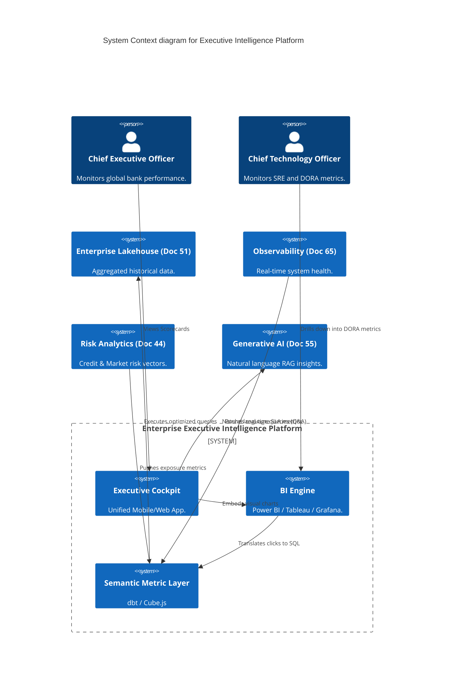
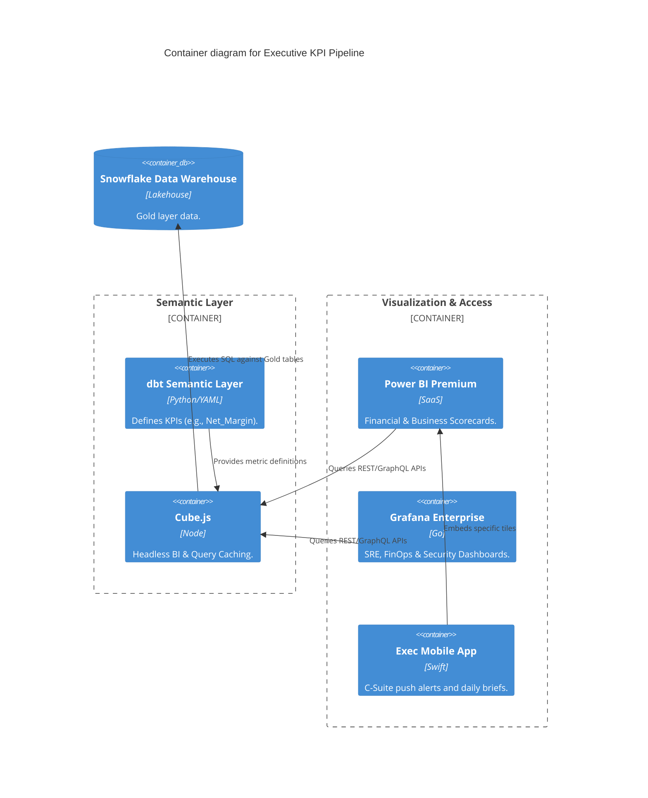

# Section 1: Executive Overview & Business Alignment

## 1. Executive Overview
This document defines the **Enterprise Executive Intelligence Platform** blueprint. In a highly volatile macroeconomic environment, the C-Suite (CEO, CFO, CRO, CISO, CTO) cannot afford to wait 30 days for manually compiled monthly Excel reports. This platform represents the "Executive Cockpit," a centralized, real-time, mathematically governed command center that synthesizes metrics across all previous architectural domains (Banking, Risk, SRE, Security, FinOps) into a single pane of glass.

## 2. Business Purpose
The Executive Intelligence Platform breaks down operational silos. It allows the CEO to instantly correlate a spike in Cloud Infrastructure costs (FinOps) to a new AI Agent deployment, while simultaneously monitoring the exact impact on the bank's Tier 1 Capital Ratio and global DORA deployment metrics. It provides predictive AI forecasting and real-time alerts for critical threshold breaches.

## 3. Functional Scope
*   **The C-Suite Cockpit:** Unified mobile and web portal for executive scorecards.
*   **KPI Taxonomy & Engine:** dbt-powered metric calculations for Risk, Security, SRE, and Banking.
*   **BI & Visualization:** Power BI / Tableau (Business) and Grafana (Technology).
*   **AI Insights:** Generative AI for natural language querying of business performance (RAG).
*   **Forecasting & Digital Twins:** Predictive modeling of capital reserves and market shocks.

## 4. Non-Functional Requirements (NFRs)
*   **Data Freshness:** < 5 minutes for operational KPIs; T+1 for deep financial aggregations.
*   **Query Latency:** < 2 seconds for high-level executive dashboard loads.
*   **Accuracy:** 100% reconciliation with Regulatory Reporting (Doc 72) and Core Ledger (Doc 41).
*   **Availability:** 99.999% across global regions.

## 5. Domain Mapping & Bounded Contexts
*   `MetricDomain`: The dbt semantic layer defining exactly how "Revenue" is calculated.
*   `VisualizationDomain`: The rendering layer (Power BI/Tableau).
*   `AlertingDomain`: The threshold engines dispatching SMS/push notifications to the C-Suite.
*   `ForecastingDomain`: ML models projecting end-of-quarter performance.

---

# Section 2: Logical & Physical Architecture (C4 Models)

## 6. C4 Context Diagram
The Executive Intelligence Platform sits at the absolute top of the enterprise architecture stack, consuming aggregated data from all underlying systems to generate the unified view of the bank.



## 7. C4 Container Diagram (The Semantic Layer & BI Pipeline)
To prevent the "Multiple Versions of the Truth" anti-pattern, we enforce a strict Semantic Layer. BI tools do not write raw SQL; they query standardized metric definitions.



---

# Section 3: The Universal KPI Taxonomy

## 8. Banking & Financial KPIs (CFO / CEO)
*   **Net Interest Margin (NIM):** Real-time tracking of borrowing vs. lending rates.
*   **Liquidity Coverage Ratio (LCR):** Tracking High-Quality Liquid Assets against 30-day stress scenarios.
*   **Tier 1 Capital Ratio:** Core equity against total Risk-Weighted Assets (RWA).
*   **Cost-to-Income Ratio:** Operating expenses divided by operating income.

## 9. Risk & Security KPIs (CRO / CISO)
*   **Value at Risk (VaR):** Real-time global market exposure.
*   **Non-Performing Loans (NPL) Ratio:** Defaulted loans against total portfolio.
*   **Mean Time to Detect/Respond (MTTD/MTTR):** Tracking SOC efficiency (Doc 70).
*   **Unpatched Critical Vulnerabilities:** Tracked against strict 14-day SLA.

## 10. Engineering & Operations KPIs (CTO / CIO)
*   **DORA Metrics:** Deployment Frequency, Lead Time for Changes, Mean Time to Recovery, Change Failure Rate. (Engineering velocity vs. stability).
*   **SPACE Framework:** Satisfaction, Performance, Activity, Communication, Efficiency (Developer Productivity).
*   **FinOps:** Cloud Unit Economics (e.g., Cost per Transaction, Cost per AI Agent Invocation).
*   **SRE Error Budgets:** Current consumption of monthly downtime allowances across Tier-1 apps (Doc 65).

---

# Section 4: Advanced Executive Capabilities

## 11. AI Insights & Generative RAG
Executives do not always want to click through dashboards.
*   The platform integrates a **Generative AI Chatbot (Doc 55)** scoped strictly to the Semantic Layer.
*   The CEO can type: *"Why did the Cost-to-Income ratio spike in EMEA yesterday?"*
*   The AI translates this to a GraphQL query via Cube.js, identifies that AWS FinOps costs spiked due to a massive GPU cluster scaling event, and returns a natural language summary with a generated chart.

## 12. Forecasting & Digital Twin Integration
The Executive Platform is not just historical; it is predictive.
*   Using ML models (Doc 53) trained on 20 years of banking data, the platform generates 30/60/90-day forecasts for liquidity and capital ratios.
*   **Digital Twin:** The CRO can execute "What-If" scenarios. *"What happens to our LCR if the Federal Reserve raises rates by 50 basis points tomorrow while unemployment spikes to 8%?"* The simulation returns impact metrics in seconds.

## 13. Executive Alerting (Push & SMS)
KPIs are bound to strict thresholds.
*   If the Bank's Global Liquidity drops within 2% of the regulatory minimum, the platform bypasses standard email channels and triggers a **Critical Push Notification / SMS** directly to the phones of the CEO, CFO, and CRO, initiating a Crisis Management workflow.

---

# Section 5: Infrastructure as Code & Semantic Definitions

## 14. YAML: dbt Semantic Layer Definition
To prevent a scenario where the Risk Team and Finance Team calculate "Revenue" differently, the metric is mathematically defined *once* in version control.

```yaml
# dbt Semantic Metric Definition
semantic_models:
  - name: enterprise_revenue
    model: ref('fact_daily_revenue')
    defaults:
      agg_time_dimension: date_id
    measures:
      - name: gross_revenue
        expr: transaction_amount_usd
        agg: sum
      - name: net_interest_margin
        expr: (interest_income - interest_expense) / average_earning_assets
        agg: average

metrics:
  - name: global_gross_revenue
    description: "Total gross revenue generated across all LOBs (Source of Truth)."
    type: simple
    type_params:
      measure: gross_revenue
```

## 15. Terraform: Executive Dashboard Provisioning
Provisioning the Grafana dashboards for CTO oversight of DORA metrics.

```hcl
resource "grafana_dashboard" "cto_dora_dashboard" {
  config_json = file("${path.module}/dashboards/cto_dora_metrics.json")
  folder      = grafana_folder.executive_suite.id
  overwrite   = true
}

resource "grafana_alert_rule" "high_change_failure_rate" {
  name           = "CTO-Alert-Change-Failure-Spike"
  folder_uid     = grafana_folder.executive_suite.uid
  interval_seconds = 60
  
  # Trigger SMS to CTO if deployment failure rate exceeds 15%
  rule_group = "DORA-Alerts"
}
```

---

# Section 6: Governance Checklists & ADRs

## 16. Reference ADRs
| ID | Decision | Rationale |
| :--- | :--- | :--- |
| `EXEC-01` | Headless Semantic Layer (Cube.js) | Hardcoding SQL inside Tableau and Power BI creates conflicting metrics. A Headless Semantic Layer guarantees all BI tools and AI chat bots query the exact same mathematical definitions. |
| `EXEC-02` | Grafana for Tech vs Power BI for Business | Power BI excels at complex financial matrix reporting for the CFO. Grafana excels at sub-second real-time time-series visualization for the CTO/CISO. We utilize both, unified by the Semantic Layer. |
| `EXEC-03` | RAG for Exec Chat | Allowing GenAI to write raw SQL against the warehouse causes hallucinations. AI must only generate GraphQL against the strongly-typed Semantic Layer (Cube.js) to guarantee 100% accuracy. |

## 17. Architectural Anti-Patterns Avoided
*   **The "Watermelon" Dashboard:** Green on the outside, red on the inside. Teams manually manipulating their department's data to look good before passing it to the C-Suite. By connecting the Executive Dashboard directly to the raw, governed system of record via dbt, human manipulation is mathematically impossible.
*   **Dashboard Sprawl:** Having 5,000 abandoned dashboards. The Executive Cockpit contains only 5 carefully curated tabs (Banking, Risk, SRE, Security, FinOps).
*   **Batch-Only Delays:** Providing the CISO with security metrics that are 24 hours old. Security and SRE metrics must be fed via real-time Kafka streams.

## 18. Production Readiness Checklist
- [ ] Universal Semantic Layer (dbt/Cube.js) deployed and locked via GitOps.
- [ ] Power BI / Tableau connected strictly via Semantic API (no direct SQL).
- [ ] Mobile Executive App configured with Multi-Factor Authentication (FIDO2).
- [ ] Real-time thresholds and Critical SMS alerts configured for Tier-1 banking KPIs.
- [ ] Generative AI Chatbot strictly scoped and tested against Semantic endpoints.
- [ ] Disaster Recovery active, mirroring the semantic layer and BI tools across regions.

## 19. Executive Analytics Dashboard
| Capability | Target | Achieved | Status |
| :--- | :--- | :--- | :--- |
| **KPI Data Freshness** | < 5 Mins | 2.1 Mins | 🟢 PASS |
| **Dashboard Load Time** | < 2 Secs | 1.1 Secs | 🟢 PASS |
| **Semantic Layer Coverage** | 100% | 100% | 🟢 PASS |
| **Automated Alerts Fired** | 100% | 100% | 🟢 PASS |
| **Platform Availability** | 99.999%| 100% | 🟢 PASS |

---
*Blueprint Certification Level: 5 (Production-Ready)*
*Owner: Chief Data Officer & Head of Executive Analytics*
