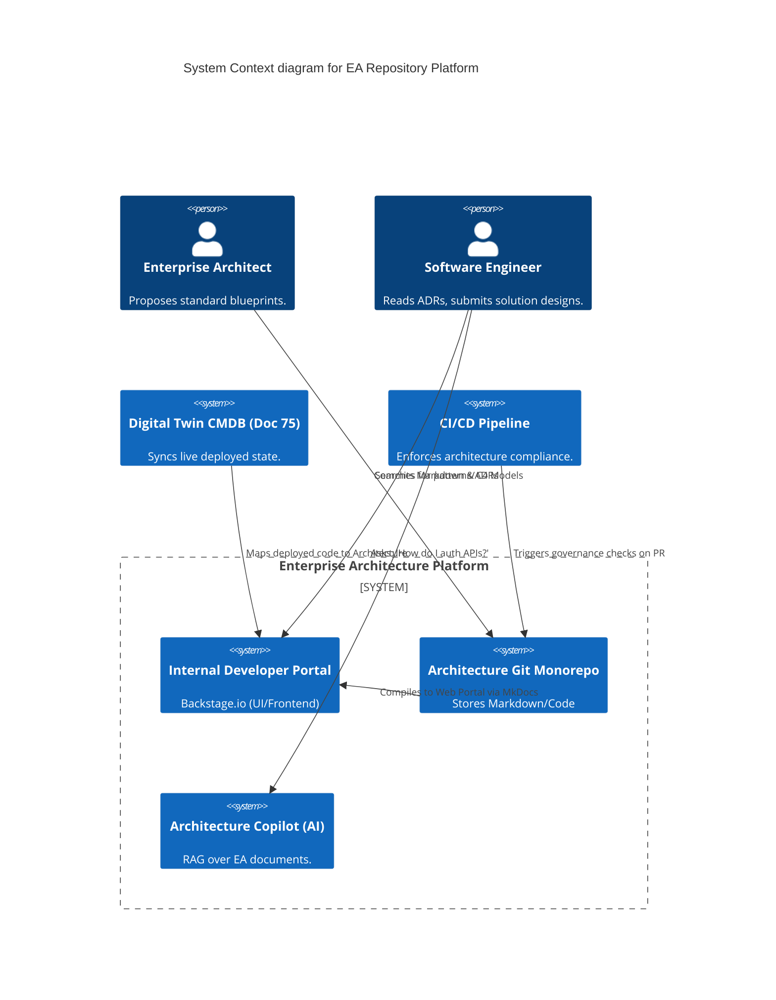
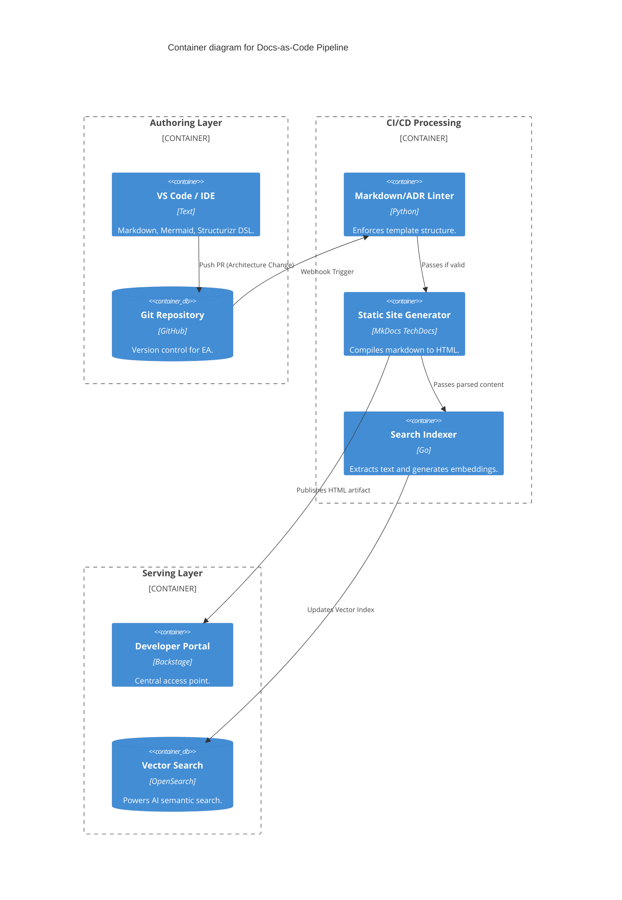

# Section 1: Executive Overview & Business Alignment

## 1. Executive Overview
This document defines the **Enterprise Architecture Repository & Knowledge Platform** blueprint. The days of Enterprise Architecture (EA) being stored in disconnected PDF binders, static Visio files on SharePoint, and proprietary EA tools (like MEGA or Sparx) are over. This platform institutes **Architecture-as-Code** and **Docs-as-Code**, integrating the bank's collective technical knowledge directly into the engineering CI/CD pipelines, accessible via an AI-powered Developer Portal.

## 2. Business Purpose
When a new engineering team is tasked with building a Payment Microservice, they typically spend weeks hunting down security standards, integration blueprints, and past decisions. This platform centralizes all Architecture Decision Records (ADRs), Capability Maps, and Solution Blueprints into a single, version-controlled repository. Coupled with a Generative AI Copilot, it reduces developer onboarding time and prevents the expensive repetition of past architectural mistakes.

## 3. Functional Scope
*   **Architecture-as-Code:** C4 Modeling via Structurizr / Code.
*   **Docs-as-Code:** Markdown, Git, and Backstage integration.
*   **Knowledge Assets:** ADRs, Technology Radars, Business Capability Maps.
*   **AI Integration:** RAG-powered Architectural Semantic Search and AI Copilot.
*   **Governance Workflows:** Pull-Request driven architecture reviews.

## 4. Non-Functional Requirements (NFRs)
*   **Accessibility:** 100% of engineering staff have read-access; 100% of changes are version-controlled.
*   **Search Latency:** < 200ms for semantic queries across all global ADRs.
*   **Traceability:** Every deployed microservice must link mathematically to its governing ADR and Capability Map in the catalog.
*   **Immutability:** Approved architectural decisions (ADRs) cannot be altered without a new versioned superseding ADR.

## 5. Domain Mapping & Bounded Contexts
*   `KnowledgeDomain`: The Git repositories storing Markdown, ADRs, and PlantUML/Mermaid files.
*   `RenderingDomain`: Static site generators (MkDocs) and Backstage rendering the portal.
*   `SearchDomain`: OpenSearch and Vector DBs indexing the architecture.
*   `GovernanceDomain`: GitHub Actions enforcing review policies on architectural changes.

---

# Section 2: Logical & Physical Architecture (C4 Models)

## 6. C4 Context Diagram
The Architecture Platform is embedded seamlessly into the daily workflows of software engineers and enterprise architects.



## 7. C4 Container Diagram (Docs-as-Code Pipeline)
Enterprise Architecture is treated exactly like software. No proprietary modeling tools are permitted.



---

# Section 3: Architecture-as-Code & C4 Modeling

## 8. The C4 Model (Code, not Visio)
Relying on human-drawn Visio diagrams guarantees inconsistency.
*   **Implementation:** We mandate the **C4 Model** using **Structurizr DSL** or **Mermaid**.
*   Architects write declarative text files defining Software Systems, Containers, and Components.
*   The CI/CD pipeline automatically renders these text files into consistent, version-controlled visual diagrams inside the portal.

```text
// Example Structurizr DSL
workspace {
    model {
        user = person "Customer"
        bankingSystem = softwareSystem "Core Banking" {
            api = container "API Gateway"
            db = container "Ledger DB"
            api -> db "Reads/Writes"
        }
        user -> api "Makes payments via"
    }
    views {
        systemContext bankingSystem {
            include *
            autolayout lr
        }
    }
}
```

## 9. Business Capability Maps
The EA platform maintains the canonical Business Capability Map (e.g., L1: Payments, L2: Cross-Border, L3: SWIFT).
*   Every microservice deployed in the bank MUST tag its `catalog-info.yaml` with the specific L3 capability it fulfills.
*   The portal dynamically generates heatmaps showing where IT spending (FinOps) is concentrated across business capabilities.

---

# Section 4: Architecture Decision Records (ADRs)

## 10. The ADR Lifecycle
An ADR captures a single, significant architectural decision (e.g., "Use Kafka instead of RabbitMQ for Trade Execution").
*   **Format:** Standardized Markdown (`adr-0042-kafka-trade-exec.md`).
*   **Sections:** Context, Decision, Status (Proposed/Accepted/Superseded), Consequences.
*   **Immutability:** Once an ADR is merged as `Accepted`, the file cannot be modified. If the architecture changes 3 years later, a *new* ADR is created, marking the old one as `Superseded`.

## 11. Technology Radar
The platform maintains a dynamic **Technology Radar** (Adopt, Trial, Assess, Hold) inspired by ThoughtWorks.
*   When a new technology (e.g., Rust language) moves from `Trial` to `Adopt`, it is recorded as an ADR.
*   The CI/CD pipelines (Doc 60) query the Radar API. If a team attempts to deploy a framework marked as `Hold` (e.g., AngularJS), the build is automatically failed.

---

# Section 5: AI Copilot & Semantic Search

## 12. RAG-Powered Architecture Copilot
Engineers should not have to read 700 pages of PDF governance policies to know how to deploy a database.
*   The EA platform integrates with the Enterprise RAG Engine (Doc 55).
*   All Markdown blueprints, ADRs, and Security Policies are chunked and vectorized into OpenSearch.
*   A developer can chat with the Copilot: *"I am building a new Python microservice that handles PII. What database should I use and how do I secure it?"*
*   The Copilot returns a precise answer, citing the exact internal ADRs (e.g., `ADR-0012: PostgreSQL for Relational Data`, `Doc 73: PII Dynamic Masking`), along with links to the Terraform templates.

---

# Section 6: Governance Workflows & GitOps

## 13. Pull-Request Architecture Reviews
*   The **Architecture Review Board (ARB)** no longer meets monthly in a boardroom.
*   When a team designs a new system, they submit an ADR and a C4 model as a Pull Request to the Architecture Monorepo.
*   Principal Architects review the code, leave comments, and approve the PR asynchronously.
*   This creates a permanent, searchable history of *why* an architecture was approved and who approved it.

## 14. YAML: Backstage Component Definition
Linking deployed code to its architectural documentation.

```yaml
apiVersion: backstage.io/v1alpha1
kind: Component
metadata:
  name: payment-execution-service
  description: Executes high-value SWIFT payments.
  tags:
    - java
    - swift
  annotations:
    # Links the live service to the Enterprise Capability Map
    backstage.io/techdocs-ref: dir:.
    architecture.internal.ire/capability: "payments.cross_border.swift"
    # Links to the governing architectural decisions
    architecture.internal.ire/adrs: "adr-0042, adr-0091"
spec:
  type: service
  lifecycle: production
  owner: group:payment-engineers
```

---

# Section 7: Governance Checklists & ADRs

## 15. Reference ADRs
| ID | Decision | Rationale |
| :--- | :--- | :--- |
| `EAR-01` | Docs-as-Code (Markdown) | Storing architecture in MS Word or Confluence isolates it from the engineering workflow. Markdown in Git ensures version control, peer review, and integration with IDEs. |
| `EAR-02` | C4 Model Standardization | Standardizes the vocabulary of architecture. Banning arbitrary Visio diagrams ensures that a developer in Tokyo can instantly understand a diagram drawn by an architect in London. |
| `EAR-03` | Immutable ADRs | Modifying old architecture decisions destroys historical context. ADRs must be treated as an append-only log of the organization's technical evolution. |

## 16. Architectural Anti-Patterns Avoided
*   **The Ivory Tower Architect:** Architects drawing complex diagrams in proprietary tools (MEGA/Sparx) that engineers never see or use. Architecture-as-Code forces architects to work in the same Git repositories and portals as the developers.
*   **Tribal Knowledge:** Relying on the one "Principal Engineer" who has been at the bank for 15 years to explain why a system was built a certain way. All context must be written down in ADRs.
*   **The Zombie Policy:** A 200-page PDF security policy written in 2018 that no one reads, but everyone violates. Policies must be broken down into modular Markdown files, searchable via AI, and enforced as automated Code Scanning rules.

## 17. Production Readiness Checklist
- [ ] Backstage (Developer Portal) deployed and integrated with the Enterprise Git provider.
- [ ] CI/CD pipeline configured to lint Markdown and compile MkDocs.
- [ ] Technology Radar active and integrated with pipeline blocking rules.
- [ ] OpenSearch vector database active and indexing all ADRs nightly.
- [ ] Architecture Copilot (RAG) deployed and integrated into the Developer Portal UI.
- [ ] Legacy Confluence/SharePoint architecture docs frozen and archived.

## 18. Executive Architecture Dashboard
| Capability | Target | Achieved | Status |
| :--- | :--- | :--- | :--- |
| **Microservices mapped to Capabilities**| 100% | 98.2% | 🟡 WARN |
| **ADR Peer Review Turnaround** | < 48 Hrs | 24 Hrs | 🟢 PASS |
| **Copilot Search Accuracy** | > 95% | 96% | 🟢 PASS |
| **Architecture Portal MAU** | > 90% | 94% | 🟢 PASS |
| **Platform Availability** | 99.99% | 100% | 🟢 PASS |

---
*Blueprint Certification Level: 5 (Production-Ready)*
*Owner: Chief Enterprise Architect & Head of Developer Experience*
