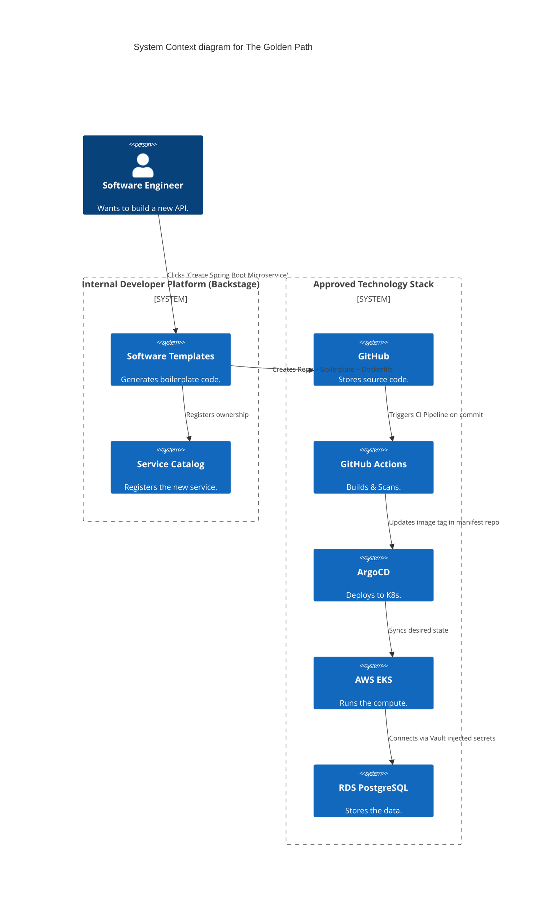

# Section 1: Executive Overview & Business Alignment

## 1. Executive Overview
This document defines the **Enterprise Technology Reference Stack & Golden Paths** blueprint. A global financial institution employing 20,000 engineers cannot allow every team to choose their own programming language, database, and CI/CD tool. Technology sprawl leads to unmaintainable code, catastrophic security vulnerabilities, and massive technical debt. This blueprint strictly defines the approved enterprise technology stack and the automated "Golden Paths" provided by the Internal Developer Platform (IDP).

## 2. Business Purpose
To maximize Developer Velocity, the bank provides **Golden Paths**—pre-configured, highly automated software templates. If an engineering team stays on the Golden Path (e.g., using Java Spring Boot with PostgreSQL on EKS), they receive out-of-the-box CI/CD pipelines, automated security scanning, observability dashboards, and instant infrastructure provisioning. If they deviate, they assume 100% of the operational, security, and maintenance burden.

## 3. Functional Scope
*   **The Technology Radar:** The official list of Adopt, Trial, Assess, and Hold technologies.
*   **Approved Languages & Frameworks:** Java, Go, Python, TypeScript.
*   **Approved Databases & Messaging:** PostgreSQL, Kafka, Redis, Snowflake.
*   **Approved AI/ML Stack:** PyTorch, MLflow, vLLM, LangChain.
*   **Technology Lifecycle Management:** Upgrade SLAs and End-of-Life (EOL) deprecation policies.

## 4. Non-Functional Requirements (NFRs)
*   **Golden Path Adoption:** > 90% of all net-new microservices must use Golden Path templates.
*   **Vulnerability Remediation:** 0 days tolerance for deploying EOL/Unsupported frameworks.
*   **Provisioning Time:** < 15 minutes to bootstrap a new Golden Path repository and deploy to Dev.

## 5. Domain Mapping & Bounded Contexts
*   `ComputeDomain`: EKS, Fargate, Lambda.
*   `DataDomain`: RDS, Confluent, ElastiCache.
*   `DevExDomain`: Backstage, GitHub Actions, ArgoCD.
*   `ObservabilityDomain`: OTel, Grafana, Splunk.

---

# Section 2: Logical & Physical Architecture (C4 Models)

## 6. C4 Context Diagram
The Golden Path abstracts the complexity of the underlying enterprise stack, allowing developers to focus purely on business logic.



---

# Section 3: The Approved Technology Stack (The Radar)

## 7. Programming Languages & Frameworks
*   **Backend (High Throughput / Concurrency):** `Go` (Standard Library). Mandated for infrastructure tooling, Kubernetes operators, and ultra-low latency gateways.
*   **Backend (Enterprise Business Logic):** `Java 21+` (Spring Boot 3). Mandated for heavy transactional systems, core banking, and complex orchestrations.
*   **Backend (Data & AI):** `Python 3.11+` (FastAPI). Mandated for ML model serving, data pipelines, and AI orchestrations.
*   **Frontend (Web & Mobile BFF):** `TypeScript` (React / Next.js). Mandated for all UI development.
*   *Hold (Deprecated):* C#, Ruby, PHP, Node.js (for heavy backend), Java 8/11.

## 8. Data Storage & Messaging
*   **Relational (OLTP):** `PostgreSQL 15+` (AWS Aurora). Default for 95% of stateful applications.
*   **Event Streaming:** `Apache Kafka` (Confluent). Mandated for all asynchronous choreography (Doc 66).
*   **Caching & Idempotency:** `Redis` (ElastiCache).
*   **Data Warehouse (OLAP):** `Snowflake`.
*   **Vector Database:** `Milvus` or `pgvector`.
*   **Graph Database:** `Neo4j`.
*   *Hold (Deprecated):* Oracle (Migrating off), IBM DB2, RabbitMQ (Migrating to Kafka/SQS for new workloads).

## 9. Artificial Intelligence & Machine Learning (Doc 53)
*   **Deep Learning Framework:** `PyTorch`.
*   **LLM Serving:** `vLLM` or `TensorRT-LLM`.
*   **AI Orchestration:** `LangChain` / `LangGraph`.
*   **MLOps:** `MLflow` (Experiment tracking) and `Kubeflow`.

## 10. Infrastructure, CI/CD, & Observability
*   **Compute:** `Kubernetes` (AWS EKS).
*   **Infrastructure as Code:** `Terraform` (HashiCorp).
*   **CI/CD:** `GitHub Actions` (CI) and `ArgoCD` (GitOps CD).
*   **Observability:** `OpenTelemetry` (Instrumentation), `Grafana LGTM` (Metrics/Logs/Traces).
*   **Security:** `HashiCorp Vault` (Secrets), `CrowdStrike` (EDR), `Kyverno` (K8s Policy).

---

# Section 4: Golden Path Architecture (Docs-as-Code)

## 11. What is included in a Golden Path Template?
When a developer generates a `Go Microservice` via the Backstage portal, the repository is automatically populated with:
1.  **Boilerplate Code:** A highly opinionated folder structure (e.g., Domain-Driven Design layout).
2.  **Dockerfile:** Optimized, distroless, multi-stage build.
3.  **CI Pipeline (`.github/workflows/`):** Pre-configured to run unit tests, SonarQube, Trivy container scanning, and push to Harbor.
4.  **Helm Chart / Kustomize:** Pre-configured for ArgoCD deployment, including Horizontal Pod Autoscaler (HPA) and Pod Disruption Budgets (PDB).
5.  **Observability:** Pre-instrumented with OpenTelemetry SDKs and a JSON file defining a standard Datadog/Grafana dashboard.
6.  **Security:** OPA/Kyverno policies for namespace isolation and mTLS via Istio.

---

# Section 5: Technology Lifecycle & Deprecation Policy

## 12. Version Upgrades & SLAs
Running End-of-Life (EOL) software is a massive security and compliance violation.
*   **N-1 Rule:** All teams must run either the current major release (`N`) or the immediately preceding major release (`N-1`) of a framework or language.
*   **Critical Patches (CVEs):** Must be patched within 48 hours.
*   **Minor Version Upgrades:** Must be applied within 30 days.

## 13. The Deprecation Workflow (Hold Status)
When a technology (e.g., Java 11) is moved to `Hold` on the Technology Radar:
1.  **Block New Adoption:** The Backstage scaffolder removes the template. CI/CD pipelines block any *new* repositories from using the technology.
2.  **Deprecation Window:** Existing teams are given a strict 6-month window to migrate to the approved standard (e.g., Java 21).
3.  **Enforcement:** On month 7, the CI/CD deployment pipelines are mathematically locked. The team cannot deploy *any* new features until they complete the migration.

---

# Section 6: Infrastructure as Code & Pipeline Standards

## 14. YAML: GitHub Actions Standard CI Pipeline
This pipeline is injected into every Golden Path repository, ensuring standard security and quality gates cannot be bypassed.

```yaml
name: Enterprise Standard CI
on:
  push:
    branches: [ "main" ]
  pull_request:
    branches: [ "main" ]

jobs:
  security-and-build:
    runs-on: ubuntu-latest
    steps:
      - uses: actions/checkout@v4
      
      - name: Code Quality (SonarQube)
        uses: sonarsource/sonarqube-scan-action@v2
        env:
          SONAR_TOKEN: ${{ secrets.SONAR_TOKEN }}
          
      - name: Build Distroless Container Image
        run: docker build -t harbor.internal.ire/apps/${{ github.repository }}:${{ github.sha }} .
        
      - name: Container Security Scan (Trivy)
        uses: aquasecurity/trivy-action@master
        with:
          image-ref: 'harbor.internal.ire/apps/${{ github.repository }}:${{ github.sha }}'
          severity: 'CRITICAL,HIGH'
          exit-code: 1 # Fails the build if vulnerabilities are found
          
      - name: Push to Enterprise Registry
        run: docker push harbor.internal.ire/apps/${{ github.repository }}:${{ github.sha }}
```

## 15. Terraform: Standard Database Provisioning Module
Teams do not write raw Terraform. They consume the Enterprise Golden Path module.

```hcl
module "enterprise_postgres" {
  source  = "git.internal.ire/terraform-modules/aws-aurora-postgres?ref=v2.1.0"
  
  cluster_name           = "payment-ledger-db"
  engine_version         = "15.4"
  instance_class         = "db.r6g.large"
  
  # Security standards enforced by the module (cannot be overridden)
  # storage_encrypted    = true 
  # vpc_security_group   = internal_only
  
  # Backup & DR standards (Doc 71)
  backup_retention_period = 35
  enable_global_cluster   = true
}
```

---

# Section 7: Governance Checklists & ADRs

## 16. Reference ADRs
| ID | Decision | Rationale |
| :--- | :--- | :--- |
| `STK-01` | Golden Paths over Checklists | Providing developers with a 50-page PDF checklist of security requirements guarantees non-compliance. Providing a Golden Path template that automatically satisfies the 50 requirements guarantees 100% compliance. |
| `STK-02` | N-1 Version Enforcement | Running legacy versions creates technical bankruptcy. Forcing teams to upgrade continuously via the N-1 rule ensures upgrades are small, routine events rather than massive, multi-year migration projects. |
| `STK-03` | Distroless Containers | Banning Ubuntu/Alpine base images. Distroless images contain no package managers or shells, eliminating 90% of container vulnerabilities and preventing attackers from executing remote shells. |

## 17. Architectural Anti-Patterns Avoided
*   **Resume Driven Development (RDD):** An engineer deciding to write a critical banking service in Haskell or Rust simply because they want to learn it, leaving the bank with unmaintainable code when they quit. The Tech Radar strictly bans unapproved languages.
*   **The Snowflake Deployment:** A team spending 3 weeks writing custom Jenkins scripts to deploy their app. GitOps (ArgoCD) is the sole approved deployment mechanism.
*   **Deferred Maintenance:** Treating framework upgrades as "feature work" to be prioritized by a Product Owner. Upgrades are non-negotiable security mandates enforced by the CI/CD pipeline.

## 18. Production Readiness Checklist
- [ ] Enterprise Technology Radar published and integrated into Backstage.
- [ ] Golden Path Software Templates (Java, Go, Python, TS) available in the portal.
- [ ] CI/CD pipelines enforcing SonarQube, Trivy, and Software Composition Analysis (SCA).
- [ ] CI/CD pipelines enforcing the N-1 version deprecation lockouts.
- [ ] Terraform modules published for all approved Cloud Infrastructure assets.
- [ ] Distroless base images published to the internal Harbor registry.

## 19. Executive Developer Experience Dashboard
| Capability | Target | Achieved | Status |
| :--- | :--- | :--- | :--- |
| **Golden Path Adoption Rate** | > 90% | 94.2% | 🟢 PASS |
| **New Service Bootstrap Time**| < 15 Mins| 4 Mins | 🟢 PASS |
| **N-1 Version Compliance** | 100% | 98.1% | 🟡 WARN |
| **Critical CVE Patch Time** | < 48 Hrs | 14 Hrs | 🟢 PASS |
| **Platform Availability (IDP)** | 99.99% | 100% | 🟢 PASS |

---
*Blueprint Certification Level: 5 (Production-Ready)*
*Owner: Chief Technology Officer & Head of Platform Engineering*
