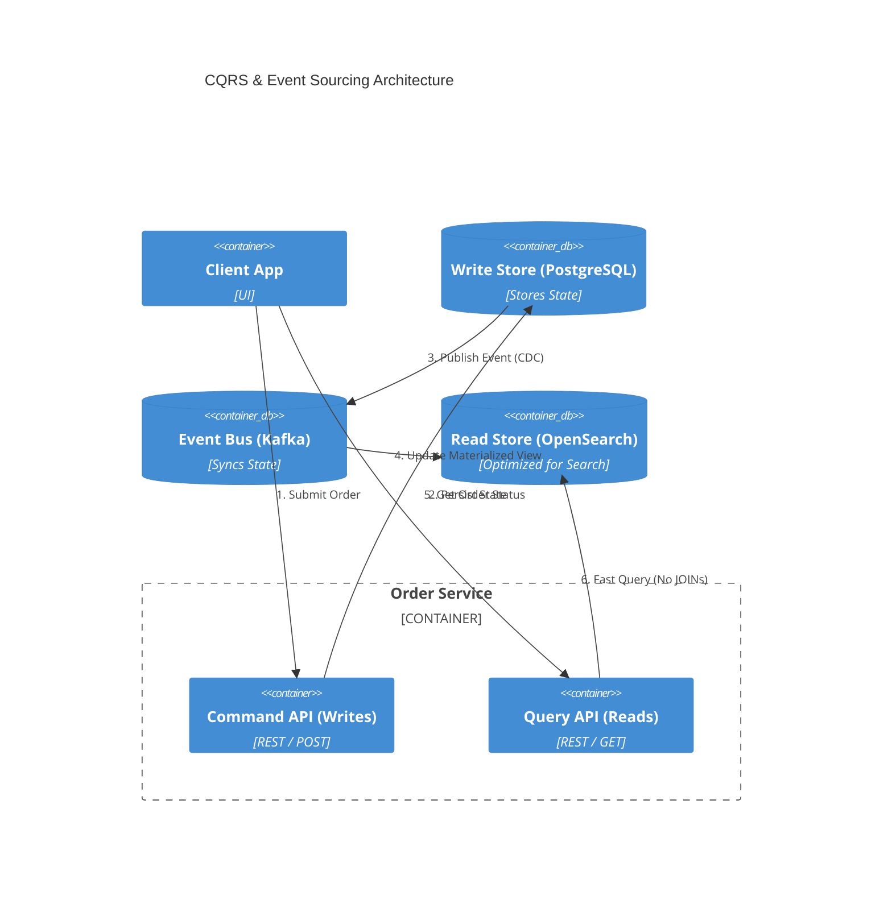

# Section 1: Executive Overview & Business Alignment

## 1. Executive Overview
This document defines the **Enterprise Solution Pattern Catalog**. It acts as the definitive index of pre-approved, battle-tested architectural patterns for building secure, scalable, and resilient distributed systems across the enterprise. By standardizing these patterns, we eliminate reinventing the wheel and ensure that all engineering teams solve common distributed computing problems (e.g., distributed transactions, network latency, legacy modernization) using identical, mathematically sound approaches.

## 2. Business Purpose
Developers frequently encounter the same architectural challenges: "How do I update a database and publish an event to Kafka simultaneously without a race condition?" If every team invents their own solution, the bank incurs massive technical debt and operational fragility. This catalog provides the mandated answers (e.g., The Transactional Outbox Pattern), accelerating developer velocity and ensuring Tier-1 reliability.

---

# Section 2: Distributed Data Patterns

## 3. The Database-per-Service Pattern
*   **Problem:** Multiple microservices read and write directly to a massive monolithic Oracle database. A schema change by Team A breaks Team B's application in production.
*   **Pattern:** Every microservice must have its own isolated database schema (or physical database). 
*   **Rule:** Microservice A is strictly forbidden from querying Microservice B's database directly. It must request data via Microservice B's API or consume its events from Kafka.

## 4. CQRS (Command Query Responsibility Segregation)
*   **Problem:** A monolithic database struggles to handle both high-volume transactional writes (INSERT/UPDATE) and complex analytical reads (JOINs/GROUP BYs) simultaneously.
*   **Pattern:** Split the architecture. The **Command Model** handles writes (often to a relational DB). The **Query Model** handles reads (often a NoSQL or Elasticsearch index tailored for fast querying). The models are synchronized asynchronously via Kafka.

## 5. The Transactional Outbox Pattern
*   **Problem:** A service must update its database AND publish an event to Kafka. If the database commits but Kafka is down, the systems are permanently out of sync (Dual Write Problem).
*   **Pattern:** The service writes the business data AND the event data to an `outbox` table in the *same* local database transaction. A separate process (Debezium CDC) tails the database transaction log and publishes the `outbox` row to Kafka, guaranteeing At-Least-Once delivery.

---

# Section 3: Distributed Transaction Patterns

## 6. The Saga Pattern (Choreography vs. Orchestration)
*   **Problem:** Executing a transaction that spans multiple microservices (e.g., Book Flight, Book Hotel). Distributed Two-Phase Commit (2PC) locks databases and causes deadlocks.
*   **Pattern (Orchestration - Doc 67):** A central workflow engine (Temporal) commands the Flight service and Hotel service. If the Hotel fails, Temporal automatically executes a **Compensating Transaction** to cancel the Flight.
*   **Pattern (Choreography - Doc 66):** Services publish events to Kafka. The Flight service publishes `FlightBooked`. The Hotel service listens and attempts booking. If the Hotel fails, it publishes `HotelFailed`, and the Flight service listens to this event to execute its own cancellation.

---

# Section 4: Resilience & Fault Tolerance Patterns

## 7. The Circuit Breaker Pattern
*   **Problem:** Service A calls Service B. Service B is overloaded and taking 30 seconds to respond. Service A runs out of threads waiting, and Service A crashes (Cascading Failure).
*   **Pattern:** Implement a Circuit Breaker (e.g., Resilience4j, Istio). If Service B fails 50% of the time over 10 seconds, the Circuit Breaker trips to `OPEN`. Service A immediately returns an error (or a cached fallback) without even attempting to call Service B, allowing B time to recover.

## 8. The Bulkhead Pattern
*   **Problem:** A single misbehaving API endpoint consumes 100% of the CPU/Thread pool, causing all other healthy endpoints on the same microservice to fail.
*   **Pattern:** Isolate resources. Allocate a strict maximum of 10 threads to API Endpoint 1, and 10 threads to API Endpoint 2. If Endpoint 1 is DDOSed, Endpoint 2 continues to operate perfectly.

## 9. Exponential Backoff & Jitter (Retry Pattern)
*   **Problem:** A downstream database goes offline. 5,000 microservices immediately start retrying the connection 10 times a second. When the DB comes back online, the synchronized retry storm instantly crashes it again (The Thundering Herd).
*   **Pattern:** Retries must exponentially increase delays (1s, 2s, 4s, 8s). Critically, a random `Jitter` (+/- 500ms) must be added to the delay so the retries are staggered and do not hit the recovering database simultaneously.

---

# Section 5: Legacy Modernization Patterns

## 10. The Strangler Fig Pattern
*   **Problem:** Rewriting a 10-million-line Mainframe monolith in one "Big Bang" deployment carries a 90% chance of catastrophic failure.
*   **Pattern:** Place an API Gateway (Kong/Istio) in front of the Monolith. Incrementally build new features as independent Microservices. The Gateway routes traffic for the new feature to the Microservice, and routes all legacy traffic to the Monolith. Over 3 years, the Monolith is entirely "strangled" and decommissioned safely.

## 11. Anti-Corruption Layer (ACL)
*   **Problem:** A new, clean Cloud-Native microservice must integrate with a legacy 1990s billing system that uses incomprehensible 3-letter database columns and XML RPC.
*   **Pattern:** Do not pollute the clean microservice with legacy logic. Build a dedicated ACL (an Adapter microservice). The new service communicates with the ACL using clean JSON/REST. The ACL handles the messy, corrupting translation to XML RPC and protects the modern domain model.

---

# Section 6: Kubernetes & Cloud-Native Patterns

## 12. The Sidecar Pattern
*   **Problem:** Every microservice needs mTLS encryption, logging, and metrics. Writing this boilerplate code into 5,000 Java, Python, and Node applications is impossible to maintain.
*   **Pattern:** Deploy a secondary "Sidecar" container (e.g., Envoy Proxy, OTel Collector) inside the same Kubernetes Pod as the application. The App only speaks standard HTTP to `localhost`. The Sidecar intercepts it, encrypts it with mTLS, attaches tracing headers, and forwards it over the network.

## 13. Advanced Deployment Patterns
*   **Blue-Green Deployment:** Spin up `v2.0` (Green) of an application alongside `v1.0` (Blue). Run tests on Green. Flip the API Gateway router to send 100% of traffic to Green instantly. If it fails, flip back to Blue instantly. Zero downtime.
*   **Canary Release:** Route 95% of traffic to `v1.0` and 5% to `v2.0`. Monitor error rates on `v2.0` for 1 hour. If stable, incrementally ramp `v2.0` to 25%, 50%, 100%.

---

# Section 7: AI & Security Patterns

## 14. Retrieval-Augmented Generation (RAG)
*   **Problem:** A Large Language Model (LLM) hallucinates or lacks knowledge of the bank's internal, proprietary documents.
*   **Pattern:** Before querying the LLM, intercept the user prompt. Query an internal Vector Database (Milvus/OpenSearch) for internal documents matching the prompt. Inject these documents directly into the LLM context window as "ground truth" to generate an accurate, hallucination-free response (Doc 55).

## 15. Zero Trust Architecture (mTLS & SPIFFE)
*   **Problem:** Trusting any traffic simply because it is inside the corporate firewall. Once an attacker breaches the perimeter, they have free rein over the network.
*   **Pattern:** Assume the network is hostile. Every microservice must authenticate itself cryptographically to every other microservice using short-lived mTLS certificates (SPIFFE/SPIRE). No IP-based trust is permitted (Doc 63).

---

# Section 8: Governance Checklists & ADRs

## 16. Reference ADRs
| ID | Decision | Rationale |
| :--- | :--- | :--- |
| `PAT-01` | Outbox Pattern for Dual Writes | Writing to a DB and publishing to Kafka in code without 2PC guarantees data loss during network partitions. Debezium CDC via the Outbox pattern guarantees mathematically safe event sourcing. |
| `PAT-02` | Sidecar (Service Mesh) vs Library | Forcing developers to update 5,000 Java libraries to patch an mTLS vulnerability takes months. Updating the Envoy Sidecar version via GitOps patches the entire fleet instantly without changing application code. |
| `PAT-03` | Jitter on all Retries | Exponential backoff without Jitter still results in Thundering Herd crashes. Jitter is a mandatory non-functional requirement for all HTTP clients. |

## 17. Architectural Anti-Patterns Avoided
*   **The Distributed Monolith:** Building 50 microservices that all synchronously call each other via REST to process a single transaction. It combines the worst parts of microservices (network latency) with the worst parts of monoliths (tight coupling).
*   **Big Bang Rewrite:** Attempting to rewrite a legacy system from scratch and deploy it all at once over a weekend. Always use the Strangler Fig pattern for incremental modernization.
*   **Shared Database Integration:** Two independent microservices communicating by reading and writing to the exact same database table. This creates massive schema coupling. Integration must occur via APIs or Kafka Events.

## 18. Production Readiness Checklist
- [ ] Database-per-service enforced; cross-service DB queries blocked by IAM.
- [ ] Transactional Outbox pattern implemented for all critical State/Event publishes.
- [ ] Circuit Breakers (Istio/Resilience4j) enabled on all synchronous REST/gRPC calls.
- [ ] Retries configured with Exponential Backoff + Jitter.
- [ ] Istio Sidecars injected into all Pods for mTLS Zero Trust enforcement.
- [ ] Sagas (Temporal or Kafka) utilized in place of distributed 2PC locks.

---
*Blueprint Certification Level: 5 (Production-Ready)*
*Owner: Chief Enterprise Architect & Principal Cloud Architect*
