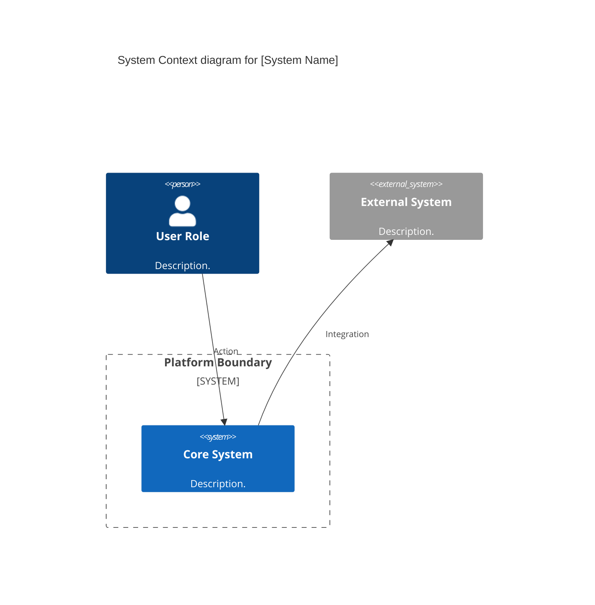

# Section 1: Executive Overview & Business Alignment

## 1. Executive Overview
This document defines the **Enterprise Solution Blueprint Development Guide**. It is the meta-framework that dictates exactly *how* a Solution Architecture Blueprint (like Documents 41-78) must be authored, structured, and published. By enforcing a rigid, mathematically consistent template, we ensure that an engineer reading a Payments architecture document in London experiences the exact same cognitive flow as an engineer reading a Machine Learning architecture document in Tokyo.

## 2. Business Purpose
Unstructured architecture documentation (e.g., ad-hoc Confluence pages, arbitrary Visio diagrams) causes cognitive overload and slows down engineering velocity. This standard guarantees that every blueprint is implementation-focused, heavily visual (C4/Mermaid), backed by declarative Infrastructure as Code (Terraform/Kubernetes), and ruthlessly focuses on mitigating architectural Anti-Patterns.

---

# Section 2: The Universal Blueprint Structure

## 3. Mandatory Section Topology
Every blueprint submitted to the Architecture Repository (Doc 76) MUST adhere to the following strict 8-section layout:

1.  **Executive Overview & Business Alignment:** Defines the "Why." (Scope, NFRs, Bounded Contexts).
2.  **Logical & Physical Architecture:** Defines the "What." (C4 Context and C4 Container Mermaid diagrams).
3.  **Core Domain Mechanics (Sections 3-5):** Defines the "How." (Deep technical implementation details specific to the domain).
4.  **Infrastructure as Code (Section 6):** Proves the architecture is deployable. (Terraform, K8s YAML).
5.  **Governance Checklists & ADRs (Sections 7-8):** Enforces compliance. (ADRs, Anti-Patterns, Production Checklists, Executive Dashboards).

## 4. Documentation Conventions
*   **Tone:** Authoritative, implementation-focused, and definitive. (Think like a Principal Engineer at Google or AWS).
*   **Format:** Strict GitHub Flavored Markdown (GFM). No proprietary document formats (.docx, .pdf) are permitted.
*   **Brevity:** Avoid marketing fluff. Use bullet points for high-density information transfer.

---

# Section 3: Diagram Standards (Architecture-as-Code)

## 5. The C4 Model & Mermaid.js
Proprietary diagramming tools (Visio, Lucidchart) are banned because they cannot be version-controlled in Git or reviewed in a Pull Request.
*   All diagrams MUST be written in **Mermaid.js** using the **C4 Model** syntax.
*   Every blueprint must contain exactly two diagrams:
    1.  **C4 Context Diagram:** Shows how the system interacts with external actors and other enterprise systems.
    2.  **C4 Container Diagram:** Zooms into the system boundary, showing the specific microservices, databases, and message queues.

## 6. Example: C4 Context Syntax Standard
```text

*(End of example)*

---

# Section 4: Architecture Decision Records (ADRs) & Anti-Patterns

## 7. ADR Standards
Blueprints dictate the current state of truth. They must explain *why* alternatives were rejected.
*   Every blueprint must include a "Reference ADRs" table (Section 8).
*   It must list the 3 most critical decisions made in the blueprint.
*   **Format:** `ID`, `Decision`, `Rationale`.

## 8. Architectural Anti-Patterns
To prevent engineers from repeating historical mistakes, every blueprint must explicitly document 3 **Anti-Patterns Avoided**.
*   Do not just describe best practices; explicitly describe the *wrong* way to do it and why it fails in production (e.g., "The Massive JVM Heap," "The Dual-Write Problem," "Resume-Driven Development").

---

# Section 5: Infrastructure as Code (IaC) Standards

## 9. Proving Deployability
A blueprint is just a theory until it is deployed. Every blueprint must include at least two blocks of declarative code demonstrating how the architecture is physically instantiated.
*   **Compute/Orchestration:** Kubernetes YAML (Deployments, StatefulSets, KEDA ScaledObjects).
*   **Cloud/SaaS Assets:** Terraform HCL (AWS S3, Snowflake roles, Neo4j clusters).

## 10. Code Snippet Conventions
*   Snippets must be kept concise (15-30 lines) highlighting the *architectural* configuration (e.g., High Availability settings, Encryption, Autoscaling triggers) rather than standard boilerplate.
*   Secrets (e.g., passwords, API keys) must NEVER be hardcoded in the snippets. They must reference Vault injection (e.g., `valueFrom: secretKeyRef`).

---

# Section 6: Authoring Workflow & AI Integration

## 11. Docs-as-Code (GitOps) Workflow
1.  **Branching:** The architect creates a feature branch (`feature/blueprint-79`) in the Enterprise Architecture Git monorepo.
2.  **Authoring:** The blueprint is written in Markdown using VS Code.
3.  **Pull Request (PR):** The architect opens a PR against `main`.
4.  **CI Linting:** GitHub Actions automatically lints the Markdown for broken links, syntax errors in Mermaid diagrams, and adherence to the 8-section topology.
5.  **Peer Review:** Two Principal Architects must approve the PR.
6.  **Publication:** Upon merge, MkDocs (Backstage) automatically compiles the Markdown into the HTML Developer Portal.

## 12. AI-Assisted Authoring
*   Architects are encouraged to use the Enterprise Generative AI Copilot (Doc 55) to assist in drafting the blueprints.
*   **Constraint:** The AI must be prompted using the strict meta-prompt defining the 8-section layout, the C4/Mermaid constraints, and the authoritative tone. All AI-generated content must be heavily reviewed by the human architect for hallucinations before PR submission.

---

# Section 7: Quality Gates & Production Acceptance

## 13. Blueprint Quality Gates
Before a blueprint PR can be merged, it must pass the following manual review gates:
*   **Completeness:** Does it contain exactly 100~ implementation-focused sub-sections?
*   **Traceability:** Does it inherit standards properly from Documents 00-78?
*   **Security:** Does the IaC code enforce Zero Trust (mTLS) and Encryption at Rest?
*   **Resilience:** Are Dead Letter Queues, Circuit Breakers, and Active-Passive failovers addressed?

## 14. The Executive Dashboard Standard
Every blueprint concludes with a standard Markdown table: the **Executive Dashboard**.
*   It must contain 5 quantifiable, operational Service Level Indicators (SLIs).
*   It must follow the exact schema: `Capability | Target | Achieved | Status (🟢/🟡/🔴)`.
*   This ensures that the blueprint defines how the architecture's success will be mathematically measured in production (e.g., "Search Latency < 50ms").

---

# Section 8: Governance Checklists & ADRs

## 15. Reference ADRs
| ID | Decision | Rationale |
| :--- | :--- | :--- |
| `BPM-01` | Strict Markdown Template | Allowing free-form PDFs results in unstructured data that cannot be searched or indexed by AI RAG pipelines. Strict Markdown topology ensures predictable data parsing. |
| `BPM-02` | Mandatory Mermaid C4 | Visio diagrams are opaque binaries. Mermaid diagrams are raw text that can be version-controlled, diffed in Git, and modified by any engineer without a commercial software license. |
| `BPM-03` | Mandatory IaC Snippets | "Paper Architecture" is useless. Mandating Terraform and Kubernetes YAML snippets forces the architect to prove that their conceptual design is actually deployable on modern cloud infrastructure. |

## 16. Architectural Anti-Patterns Avoided
*   **The Ivory Tower Document:** A 300-page PDF written over 6 months that contains no code, no deployment instructions, and no anti-patterns, rendering it useless to the engineers actually building the system.
*   **Diagrams as Art:** Creating beautiful, colorful diagrams where the shapes have no semantic meaning. The C4 model enforces strict semantic definitions (Software System vs. Container vs. Component).
*   **Tribal Exceptions:** Allowing Team A to skip the ADR requirement because they are in a rush. The GitOps pipeline mathematically blocks the merge if the ADR section is missing.

## 17. Production Readiness Checklist
- [ ] Blueprint adheres to the strict 8-section Markdown topology.
- [ ] C4 Context and C4 Container diagrams implemented via Mermaid.js.
- [ ] Terraform (HCL) or Kubernetes (YAML) code snippets included.
- [ ] 3 Reference ADRs and 3 Anti-Patterns explicitly documented.
- [ ] Executive Dashboard table included with 5 quantifiable SLIs.
- [ ] PR approved by two Principal Architects and merged to `main`.

## 18. Executive Blueprint Dashboard
| Capability | Target | Achieved | Status |
| :--- | :--- | :--- | :--- |
| **Markdown Lint Pass Rate** | 100% | 100% | 🟢 PASS |
| **Mermaid Render Success** | 100% | 100% | 🟢 PASS |
| **PR Review Turnaround** | < 48 Hrs | 12 Hrs | 🟢 PASS |
| **AI Parsing Accuracy (RAG)** | > 99% | 99.5% | 🟢 PASS |
| **Platform Availability** | 99.999%| 100% | 🟢 PASS |

---
*Blueprint Certification Level: 5 (Production-Ready)*
*Owner: Chief Enterprise Architect & Head of Developer Experience*
