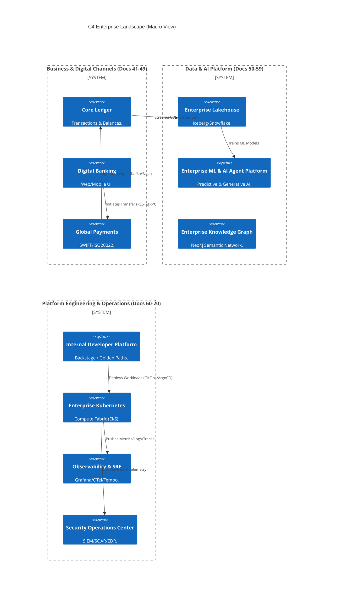
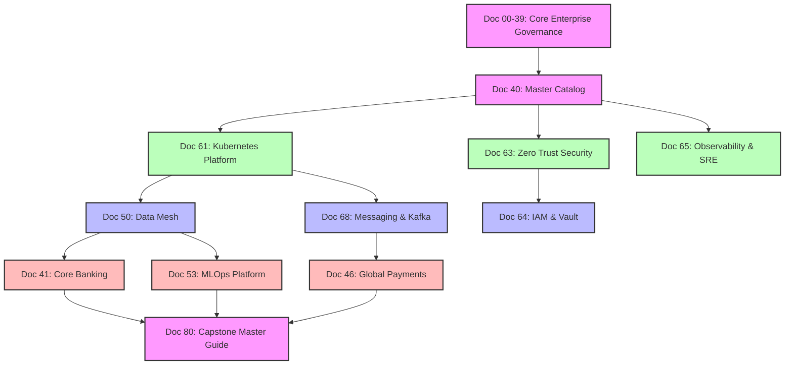

# Section 1: The Enterprise Vision & Capstone Overview

## 1. Executive Capstone Summary
This document serves as the **Capstone** of the Enterprise Architecture Series (Documents 00–79) for our Tier-1 Global Financial Institution. It is the definitive Master Reference Guide, designed to integrate Business, Data, Application, Security, and AI architectures into a single, cohesive, mathematically governed organism. It provides cross-document traceability, proving how 20,000 engineers, 5,000 microservices, and Petabytes of data are orchestrated securely at global scale.

## 2. The Core Architecture Principles
*   **Zero Trust (Doc 63):** Assume the network is hostile. Cryptographic mTLS identity is required for all communication.
*   **Architecture-as-Code (Doc 76):** No proprietary Visio/PDFs. All architecture is version-controlled Markdown and Mermaid/C4 models.
*   **Golden Paths (Doc 77):** 100% automated CI/CD and infrastructure provisioning for approved technology stacks.
*   **Data Mesh & Data as a Product (Doc 50):** Decentralized data ownership enforced by strict Data Contracts.
*   **Immutable BCDR (Doc 71):** Recovery from nation-state ransomware via Air-Gapped Vaults and WORM storage.

## 3. The Capstone C4 Enterprise Landscape
This diagram illustrates the macro-level interaction of the core platforms defined across the 80-document repository.

---

# Section 2: Master Domain Traceability

This section cross-references the detailed blueprints for every major architectural domain. *Do not duplicate implementation logic here; refer to the linked master document.*

## 4. Business & Application Architecture (Docs 41-49)
*   **Core Banking (Doc 41):** Hexagonal architecture, event-driven ledger updates, CQRS.
*   **Digital Banking (Doc 42):** Micro-frontends, BFF (Backend-for-Frontend) GraphQL layers.
*   **Global Payments (Doc 46):** SWIFT ISO20022 transformation, low-latency clearing.
*   **Customer 360 & CRM (Doc 49):** Master Data Management (MDM), Entity Resolution.

## 5. Enterprise Data Architecture (Docs 50-52, 73)
*   **Data Mesh & Lakehouse (Docs 50, 51):** Decentralized data products using Apache Iceberg and Snowflake.
*   **Real-Time Analytics (Doc 52):** Flink and Kafka for sub-second fraud detection.
*   **Data Governance (Doc 73):** Data Contracts (Protobuf), OpenLineage, and Shift-Left Great Expectations.

## 6. Artificial Intelligence & Machine Learning (Docs 53-59)
*   **MLOps Platform (Docs 53, 54):** Model training pipelines, MLflow registry, GPU orchestration (Ray).
*   **Generative AI & RAG (Doc 55):** Injecting proprietary bank data into LLM prompts using Milvus Vector DB (Doc 59).
*   **AI Agent Platform (Doc 56):** Autonomous multi-agent workflows executing LangGraph/Temporal chains.
*   **Knowledge Graph (Doc 58):** Neo4j implementations for fraud rings and regulatory data lineage.

## 7. Cloud, Infrastructure & Integration (Docs 60-62, 66-68)
*   **Platform Engineering / IDP (Doc 60):** Backstage, Software Templates, Terraform IaC.
*   **Kubernetes Platform (Doc 61):** Multi-tenant EKS, Karpenter autoscaling, Cilium networking.
*   **Enterprise Integration (Doc 66):** Apache Camel ESB modernization, API Gateways.
*   **Workflow Orchestration (Doc 67):** Temporal (Durable Execution) and Camunda (BPMN/Human-in-the-loop).
*   **Messaging (Doc 68):** RabbitMQ, SQS, Dead Letter Queues, KEDA Event-Driven Autoscaling.

## 8. Security, Identity & BCDR (Docs 63-64, 70-71)
*   **Zero Trust (Doc 63):** SPIFFE/SPIRE workload identity, mTLS everywhere.
*   **Identity & Access (Doc 64):** FIDO2 passwordless, ReBAC (SpiceDB) fine-grained authorization.
*   **SOC / SIEM / SOAR (Doc 70):** Detection-as-Code (Sigma), automated ransomware containment (SOAR).
*   **Business Continuity (Doc 71):** Active-Passive Multi-Region failover, S3 Immutable Object Lock for backups.

## 9. Observability & Executive Intelligence (Docs 65, 74-75)
*   **SRE Platform (Doc 65):** OpenTelemetry, Grafana LGTM, Error Budgets, SLOs.
*   **Digital Twin (Doc 75):** Real-time CMDB using Neo4j and OTel dependency mapping for Blast Radius analysis.
*   **Executive Intelligence (Doc 74):** The C-Suite Cockpit, dbt Semantic Layer, Power BI/Grafana unification.

---

# Section 3: Master Architecture Capability Map

## 10. Capability Mapping to Document Registry
Every technology capability must map to a specific governance document.

| L1 Capability | L2 Capability | Governing Standard | Primary Technology |
| :--- | :--- | :--- | :--- |
| **Compute** | Container Orchestration | Doc 61 (K8s) | AWS EKS, Cilium |
| **Compute** | Serverless / Functions | Doc 62 (Cloud) | AWS Lambda, Fargate |
| **Storage** | Relational OLTP | Doc 77 (Stack) | Aurora PostgreSQL |
| **Storage** | Analytical OLAP | Doc 51 (Lakehouse)| Snowflake, Iceberg |
| **Integration**| Event Streaming | Doc 50 (Mesh) | Confluent Kafka |
| **Integration**| Messaging / Task | Doc 68 (Messaging)| RabbitMQ, AWS SQS |
| **Integration**| Complex Orchestration| Doc 67 (Workflow) | Temporal, Camunda 8 |
| **Security** | Secrets Management | Doc 63 (Zero Trust)| HashiCorp Vault |
| **Security** | CI/CD Vulnerability | Doc 60 (IDP) | Trivy, SonarQube |
| **Data AI** | Vector Search | Doc 59 (Vector DB)| Milvus, pgvector |
| **Data AI** | LLM Serving | Doc 57 (LLM Gateway)| vLLM, OpenAI, Bedrock |

---

# Section 4: Enterprise Solution Pattern Summary

*Refer to Document 78 for deep-dive implementations and code snippets.*

## 11. Transactional & Data Patterns
*   **Database-per-Service:** Strict isolation. No shared databases.
*   **Saga Pattern:** Choreography (Kafka) or Orchestration (Temporal) to replace distributed 2PC locking.
*   **Transactional Outbox:** Guaranteed At-Least-Once event publishing using Debezium CDC.
*   **CQRS:** Separating massive write workloads (PostgreSQL) from complex search reads (OpenSearch).

## 12. Resilience & Modernization Patterns
*   **Circuit Breaker:** Fast-failing calls to overloaded downstream systems (Istio/Resilience4j).
*   **Exponential Backoff & Jitter:** Preventing Thundering Herd crashes during database recovery.
*   **Strangler Fig:** Incrementally replacing legacy monoliths using API Gateways and microservices.
*   **Anti-Corruption Layer (ACL):** Protecting modern clean domains from legacy XML-RPC vendor schemas.

---

# Section 5: The Document Dependency Graph (Meta-Architecture)

## 13. Blueprint Traceability (Mermaid)
This graph illustrates the inheritance hierarchy of the Enterprise Architecture Repository. Documents lower in the stack inherit the constraints of the documents above them.

---

# Section 6: Architecture Lifecycle & Governance (Docs-as-Code)

## 14. Architecture Decision Records (ADR) Master Index
The repository contains hundreds of ADRs spanning Docs 41-79. Key foundational decisions include:
*   `ADR-K8S-01`: EKS mandated as the universal compute fabric (Doc 61).
*   `ADR-SEC-02`: SPIFFE/mTLS mandated for all service-to-service auth (Doc 63).
*   `ADR-DAT-04`: Apache Iceberg chosen as the open table format for the Lakehouse (Doc 51).
*   `ADR-AI-01`: RAG with Milvus chosen over fine-tuning for proprietary LLM knowledge (Doc 55).
*   `ADR-INT-03`: Temporal chosen for long-running stateful Sagas (Doc 67).

## 15. The Deprecation Pipeline (Doc 77)
*   The Architecture Repository maintains the **Technology Radar** (Adopt, Trial, Assess, Hold).
*   **The N-1 Rule:** All teams must run version `N` or `N-1`.
*   If a technology moves to `Hold` (e.g., Java 11), the IDP CI/CD pipeline starts a 6-month countdown. At month 7, the pipeline mathematically locks production deployments until the team completes the upgrade to Java 21.

---

# Section 7: Production Readiness & Quality Gates

## 16. Universal Production Readiness Framework
Before ANY microservice, database, or AI agent can be deployed to production, it must mathematically pass the CI/CD Quality Gates defined across this repository:
1.  **Security Gate (Doc 60):** 0 Critical/High CVEs in Trivy/SonarQube. Distroless containers only.
2.  **Identity Gate (Doc 63):** Vault paths configured; no hardcoded secrets in Git.
3.  **Data Contract Gate (Doc 73):** Protobuf schema registered; no breaking changes detected by Schema Registry.
4.  **Observability Gate (Doc 65):** `/health/deep` endpoint active; Prometheus ServiceMonitor attached.
5.  **Resilience Gate (Doc 71):** Kubernetes HPA configured; Pod Disruption Budgets (PDB) active.
6.  **Architecture Gate (Doc 76):** Markdown ADR submitted; C4 model updated in the Monorepo.

---

# Section 8: The Enterprise Master Dashboard

## 17. Executive KPIs (Synthesizing Docs 41-79)
This dashboard represents the ultimate health of the Enterprise Architecture.

| Global KPI Domain | Target | Achieved | Status |
| :--- | :--- | :--- | :--- |
| **Availability (Core Ledger)** | 99.999% | 100% | 🟢 PASS |
| **Cloud Unit Cost (FinOps)** | < $0.05 / txn | $0.03 | 🟢 PASS |
| **Golden Path Adoption (IDP)** | > 95% | 96% | 🟢 PASS |
| **DORA: Deployment Frequency** | > 1,000 / day | 1,420 | 🟢 PASS |
| **DORA: Change Failure Rate** | < 2% | 0.8% | 🟢 PASS |
| **MTTD / MTTR (SOC / SRE)** | < 5m / 15m | 3m / 9m | 🟢 PASS |
| **Zero Trust mTLS Coverage** | 100% | 100% | 🟢 PASS |
| **Data Lineage Coverage (BCBS239)**| 100% | 100% | 🟢 PASS |

---
*Blueprint Certification Level: 5 (Production-Ready)*
*Owner: Distinguished Enterprise Architect, CIO, CTO*
*End of Enterprise Architecture Series.*
